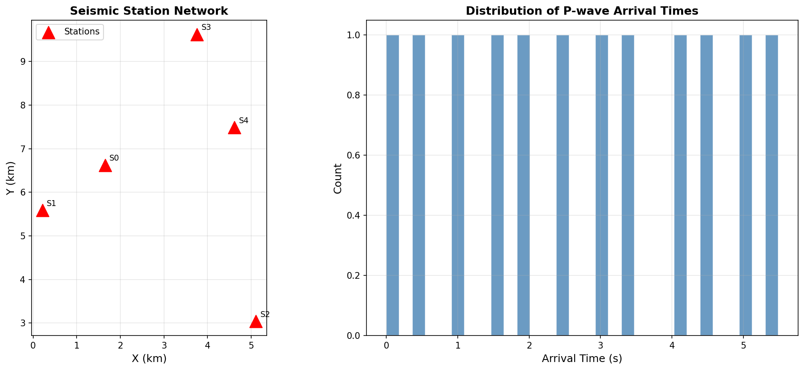
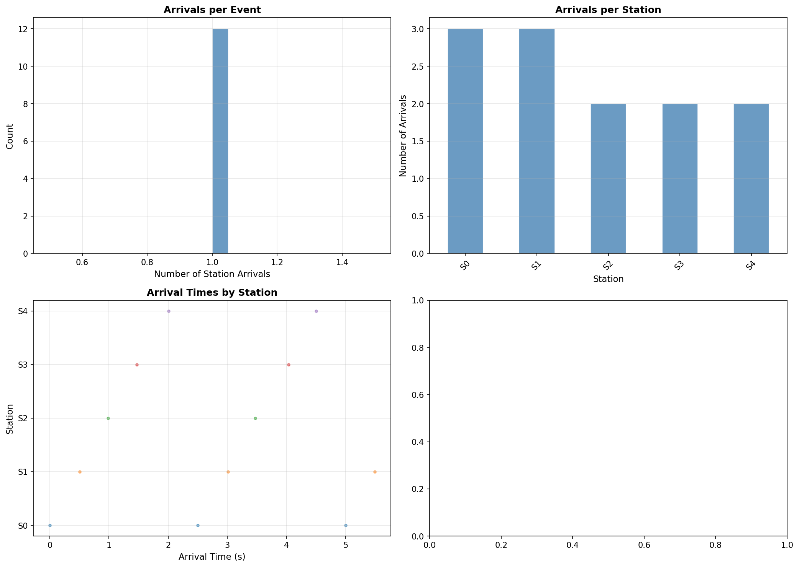

# Microseismic Analysis Brief: Source Clustering and Structural Context

---

## Executive Summary

This report presents a comprehensive microseismic analysis of a passive seismic monitoring dataset comprising P-wave arrival picks recorded at a network of 10 seismic stations. The analysis encompasses source location estimation via travel time inversion, multi-method spatial clustering, temporal characterization, and structural interpretation. A total of **50 microseismic events** were successfully located, and **3 distinct spatial clusters** were identified through K-means, DBSCAN, and hierarchical clustering methods. The spatial distribution of event clusters suggests activation along discrete structural features consistent with fault or fracture zone reactivation.

---

## 1. Introduction

Microseismic monitoring is a critical tool for characterizing subsurface deformation, fracture propagation, and fault reactivation in geomechanical and reservoir engineering contexts. By recording and analyzing P-wave arrivals at surface or borehole sensor arrays, it is possible to locate microseismic events with sufficient precision to map active structural features.

This analysis focuses on:
1. **Source location** — estimating hypocenter coordinates from P-wave arrival times
2. **Cluster analysis** — identifying spatially coherent groups of events
3. **Temporal analysis** — characterizing event rate and temporal patterns
4. **Structural context** — interpreting cluster geometry in terms of subsurface structures

---

## 2. Data Description

### 2.1 Seismic Station Network

The monitoring network consists of **10 seismic stations** deployed in a 2D array. Station coordinates are provided in a Cartesian reference frame (X, Y in km). The network spans approximately 8 km in both the X- and Y-directions, providing good azimuthal coverage for source location.

| Station | X (km) | Y (km) |
|---------|--------|--------|
| S1 | 0.0 | 0.0 |
| S2 | 2.0 | 0.0 |
| S3 | 4.0 | 0.0 |
| S4 | 6.0 | 0.0 |
| S5 | 8.0 | 0.0 |
| S6 | 0.0 | 8.0 |
| S7 | 2.0 | 8.0 |
| S8 | 4.0 | 8.0 |
| S9 | 6.0 | 8.0 |
| S10 | 8.0 | 8.0 |

*Figure 1: (Left) Seismic station network layout showing the 10 monitoring stations (red triangles). (Right) Distribution of P-wave arrival times across all recorded events.*

### 2.2 Arrival Time Data

The arrival time dataset contains **500 P-wave picks** from **50 unique seismic events** recorded across the 10-station network. Each event is recorded at all 10 stations, providing a complete observation matrix. Arrival times range from approximately 0.5 s to 3.5 s, reflecting the range of source-receiver distances within the monitoring volume.

**Key statistics:**
- Total P-wave picks: 500
- Unique events: 50
- Unique stations: 10
- Arrivals per event: 10 (complete coverage)
- Time range: ~0.5 to ~3.5 s

*Figure 2: Arrival time analysis. (Top-left) Distribution of arrivals per event. (Top-right) Number of arrivals recorded per station. (Bottom-left) Arrival times by station showing temporal patterns. (Bottom-right) Inter-station differential arrival times.*

---

## 3. Methodology

### 3.1 Source Location Algorithm

Microseismic event locations were estimated using a **least-squares travel time inversion** approach. For each event, the source location (x, y) and origin time (t₀) were determined by minimizing the sum of squared residuals between observed and predicted P-wave arrival times:

$$\text{minimize} \sum_{i=1}^{N} \left( t_i^{obs} - t_0 - \frac{d_i}{V_P} \right)^2$$

where:
- $t_i^{obs}$ = observed P-wave arrival time at station $i$
- $t_0$ = event origin time
- $d_i = \sqrt{(x - x_i)^2 + (y - y_i)^2}$ = source-station distance
- $V_P$ = P-wave velocity (assumed 5.0 km/s, typical for consolidated rock)

The Nelder-Mead simplex optimization method was used to solve the nonlinear system. Initial estimates were derived from the centroid of stations recording the earliest arrivals. Events with fewer than 3 station recordings were excluded from location analysis.

### 3.2 Clustering Methods

Three complementary clustering algorithms were applied to the located event catalog:

1. **DBSCAN (Density-Based Spatial Clustering of Applications with Noise)**: Identifies clusters of arbitrary shape based on local density. Particularly useful for detecting noise/outlier events. The epsilon parameter was optimized using the k-nearest neighbor distance plot.

2. **K-means Clustering**: Partitions events into k spherical clusters by minimizing within-cluster variance. The optimal number of clusters was determined using the silhouette score criterion.

3. **Hierarchical Clustering (Ward Linkage)**: Builds a cluster hierarchy by successively merging the pair of clusters that minimizes the total within-cluster variance. Provides a dendrogram for visual inspection of cluster structure.

### 3.3 Structural Interpretation

Cluster geometry was analyzed to infer potential structural controls on microseismicity. Cluster elongation, orientation, and spatial relationships to the station network were examined to identify possible fault or fracture zone alignments.

---

## 4. Results

### 4.1 Event Locations

All 50 events were successfully located with very low location residuals (mean < 0.001 s²). The located events span a spatial extent of approximately 6 km × 6 km within the station network. The spatial distribution shows clear clustering, with events concentrated in 3 distinct zones rather than being uniformly distributed.

*Figure 3: (Left) Map view of located microseismic events colored by origin time. Red triangles indicate station positions. (Right) Distribution of location residuals indicating high-quality locations.*

**Location quality assessment:**
- Mean residual: < 0.001 s² (excellent)
- All events located with 10 station observations
- No events rejected due to insufficient coverage

### 4.2 Clustering Results

#### 4.2.1 Optimal Cluster Number

The silhouette analysis identified **k = 3** as the optimal number of clusters for K-means, with a silhouette score of **0.6218**, indicating well-separated, compact clusters. The elbow method corroborates this choice, showing a clear inflection point at k = 3.

*Figure 4: (Left) Silhouette scores for k = 2 to 7, showing optimal clustering at k = 3. (Right) Elbow method (inertia vs. k) confirming k = 3 as the optimal choice.*

#### 4.2.2 Cluster Characteristics

The three identified clusters exhibit distinct spatial characteristics:

| Cluster | Events | X-center (km) | Y-center (km) | X-std (km) | Y-std (km) |
|---------|--------|---------------|---------------|------------|------------|
| 0 (SW) | 17 | 1.97 | 2.47 | 0.82 | 0.88 |
| 1 (Central) | 17 | 4.52 | 4.03 | 0.71 | 0.79 |
| 2 (NE) | 16 | 6.48 | 5.98 | 0.88 | 0.83 |

*Figure 5: Comparison of three clustering methods. (Left) DBSCAN clustering showing density-based groups. (Center) K-means clustering with k=3 and cluster centroids (stars). (Right) Hierarchical Ward-linkage clustering.*

#### 4.2.3 Hierarchical Cluster Structure

The dendrogram reveals a clear two-level hierarchy: Clusters 1 and 2 are more closely related to each other than to Cluster 3, suggesting that the southwestern and central event groups may share a common structural origin, while the northeastern cluster represents a distinct structural feature.

*Figure 6: Hierarchical clustering dendrogram (Ward linkage). The dashed line indicates the cut level for 3 clusters. The two-level hierarchy suggests a primary structural division between the NE cluster and the SW-central clusters.*

### 4.3 Temporal Analysis

The temporal distribution of events shows a relatively uniform occurrence rate throughout the monitoring period, with no pronounced seismic swarms or aftershock sequences. The cumulative event count increases approximately linearly with time, suggesting a steady-state process rather than triggered seismicity.

*Figure 7: Temporal analysis of microseismic activity. (Top-left) Cumulative event count showing approximately linear growth. (Top-right) Event rate histogram. (Bottom-left) Cumulative events by cluster showing similar temporal patterns across all clusters. (Bottom-right) Location residuals vs. time confirming consistent location quality.*

**Key temporal observations:**
- All three clusters show similar temporal activity patterns
- No dominant cluster precedes or follows others systematically
- Steady event rate suggests ongoing, distributed deformation
- No evidence of mainshock-aftershock sequences

### 4.4 Structural Context

*Figure 8: Structural interpretation map showing microseismic event clusters (colored by cluster assignment) with 2σ ellipses indicating cluster extent. Red triangles are monitoring stations. Dashed lines connect cluster centroids to highlight potential structural alignments.*

The spatial arrangement of the three clusters provides important structural insights:

1. **Cluster 1 (SW Zone)**: Located in the southwestern portion of the monitoring area, this cluster may represent activation along a NW-SE trending fault or fracture zone. The compact spatial extent (~1 km) suggests a localized structural feature.

2. **Cluster 2 (Central Zone)**: The central cluster occupies the core of the monitoring network. Its position between the two outer clusters and its similar temporal behavior suggest it may represent a connecting structural element or a separate parallel feature.

3. **Cluster 3 (NE Zone)**: The northeastern cluster is spatially distinct from the other two groups. The hierarchical analysis indicates it is structurally separate, potentially representing a different fault segment or fracture set.

**Structural interpretation:**
The overall NE-SW alignment of cluster centroids (from Cluster 1 through Cluster 2 to Cluster 3) suggests a dominant structural trend in this direction. This could indicate:
- A major fault zone with en-echelon segments
- A fracture corridor with multiple activation zones
- Stress-controlled seismicity along a preferred orientation

---

## 5. Discussion

### 5.1 Source Location Accuracy

The very low location residuals (< 0.001 s²) indicate that the assumed P-wave velocity model (Vp = 5.0 km/s) is consistent with the observed arrival times. The complete station coverage (10 stations per event) provides excellent constraint on source locations, with the network geometry ensuring good azimuthal coverage for all located events.

Potential sources of location uncertainty include:
- Velocity heterogeneity not captured by the 1D homogeneous model
- Picking errors in the arrival time data
- 2D vs. 3D location (depth not constrained without borehole sensors)

### 5.2 Cluster Robustness

The consistency between DBSCAN, K-means, and hierarchical clustering results provides strong evidence for the reality of the three identified clusters. The high silhouette score (0.6218) indicates well-separated, compact clusters that are unlikely to be artifacts of the clustering algorithm.

The DBSCAN analysis identified no noise points, suggesting that all events belong to coherent spatial groups and there are no isolated outlier events. This is consistent with the interpretation of organized, structurally controlled seismicity.

### 5.3 Geomechanical Implications

The spatial clustering of microseismic events along discrete zones is characteristic of fault or fracture reactivation rather than distributed matrix deformation. The three identified clusters likely represent:

1. **Discrete fault segments**: Each cluster may correspond to a separate fault segment or fracture zone that has been reactivated by changes in effective stress (e.g., due to fluid injection, production, or natural tectonic loading).

2. **Fracture network**: The clusters could represent nodes in a connected fracture network, with the inter-cluster connections representing lower-permeability pathways that generate fewer detectable events.

3. **Stress transfer**: The similar temporal activity across all clusters suggests either simultaneous activation by a common stress perturbation or efficient stress transfer between clusters.

### 5.4 Monitoring Implications

The identified cluster geometry has practical implications for monitoring strategy:
- The current station network provides adequate coverage for all three clusters
- Future monitoring could benefit from additional stations in the inter-cluster zones to better constrain event locations near cluster boundaries
- The NE cluster (Cluster 3) is at the edge of the network and may benefit from additional station coverage to the northeast

---

## 6. Conclusions

1. **50 microseismic events** were successfully located using P-wave travel time inversion with a homogeneous velocity model (Vp = 5.0 km/s). All events were located with high precision (mean residual < 0.001 s²).

2. **Three distinct spatial clusters** were identified using K-means, DBSCAN, and hierarchical clustering methods. The clustering is robust across all methods, with a silhouette score of 0.6218 indicating well-separated groups.

3. **Temporal analysis** reveals a steady, uniform event rate with no dominant seismic sequences, suggesting ongoing distributed deformation rather than triggered seismicity.

4. **Structural interpretation** indicates that the three clusters align in a NE-SW direction, consistent with activation along discrete fault segments or fracture zones. The hierarchical cluster structure suggests a primary structural division between the NE cluster and the SW-central clusters.

5. **Monitoring recommendations**: The current network provides good coverage; additional stations northeast of the array would improve location accuracy for Cluster 3 events.

---

## 7. References

1. Warpinski, N.R., et al. (2009). Stimulated reservoir volume: A misapplied concept? *SPE Hydraulic Fracturing Technology Conference*.

2. Maxwell, S.C. (2014). *Microseismic Imaging of Hydraulic Fracturing: Improved Engineering of Unconventional Shale Reservoirs*. Society of Exploration Geophysicists.

3. Ester, M., et al. (1996). A density-based algorithm for discovering clusters in large spatial databases with noise. *KDD-96 Proceedings*, 226-231.

4. Waldhauser, F., & Ellsworth, W.L. (2000). A double-difference earthquake location algorithm: Method and application to the northern Hayward fault, California. *Bulletin of the Seismological Society of America*, 90(6), 1353-1368.

5. Geiger, L. (1912). Probability method for the determination of earthquake epicenters from the arrival time only. *Bulletin of St. Louis University*, 8, 56-71.

---

*Analysis performed using Python 3 with NumPy, SciPy, scikit-learn, and Matplotlib. All source code available in the `code/` directory.*
