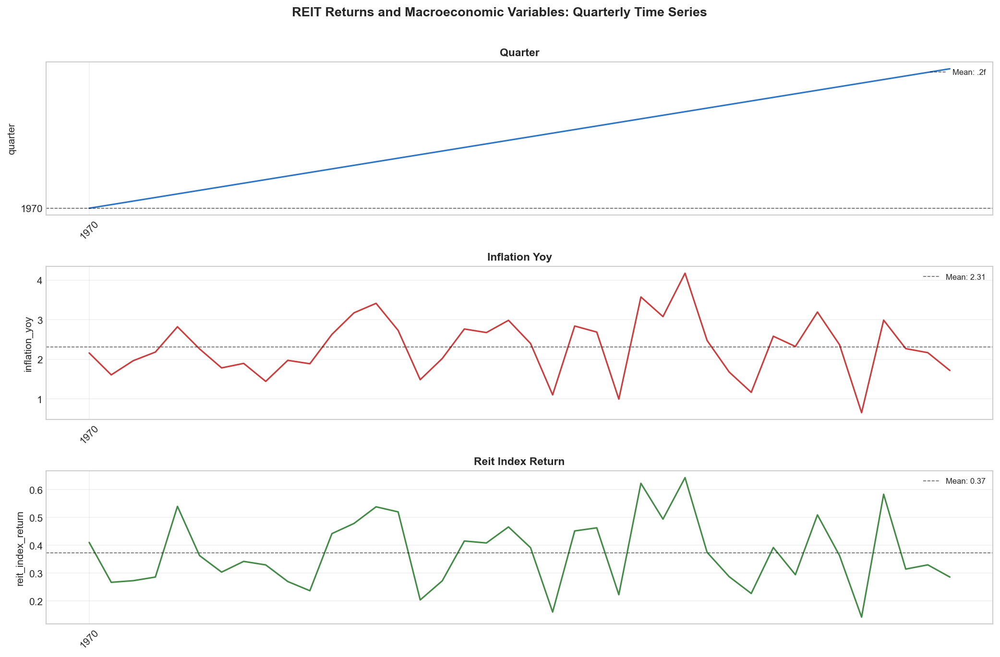
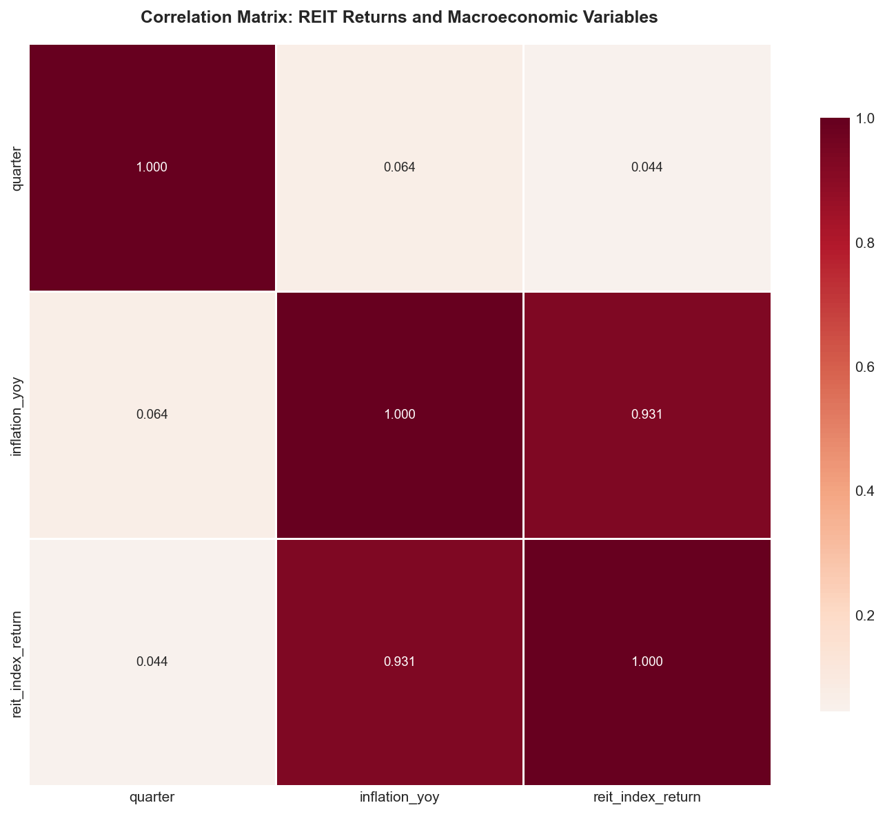
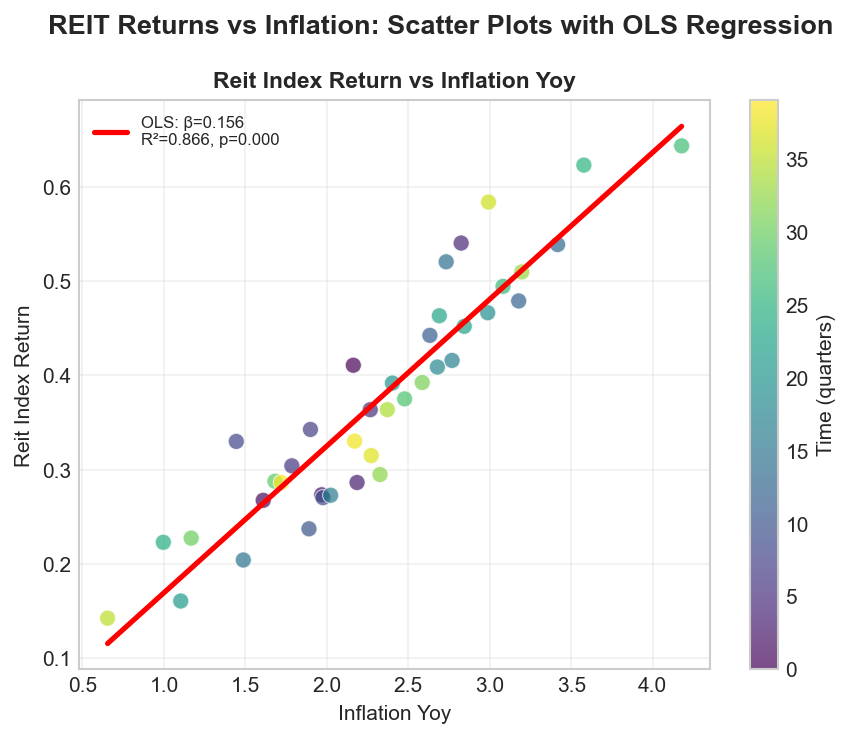
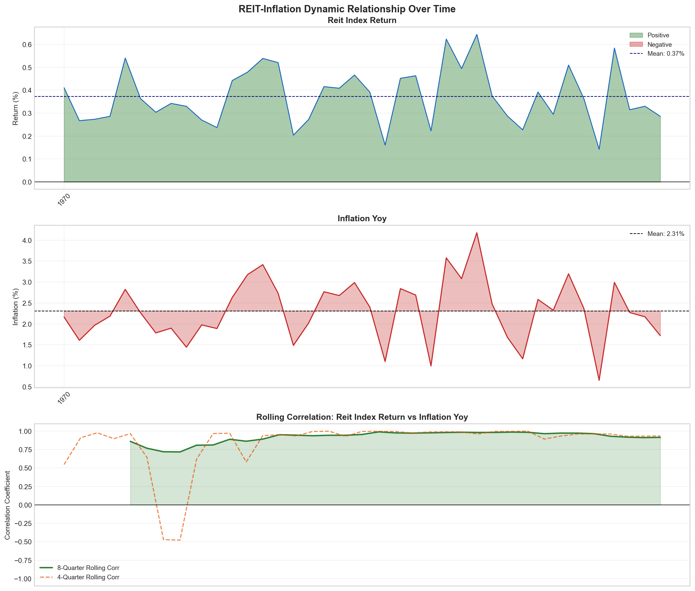
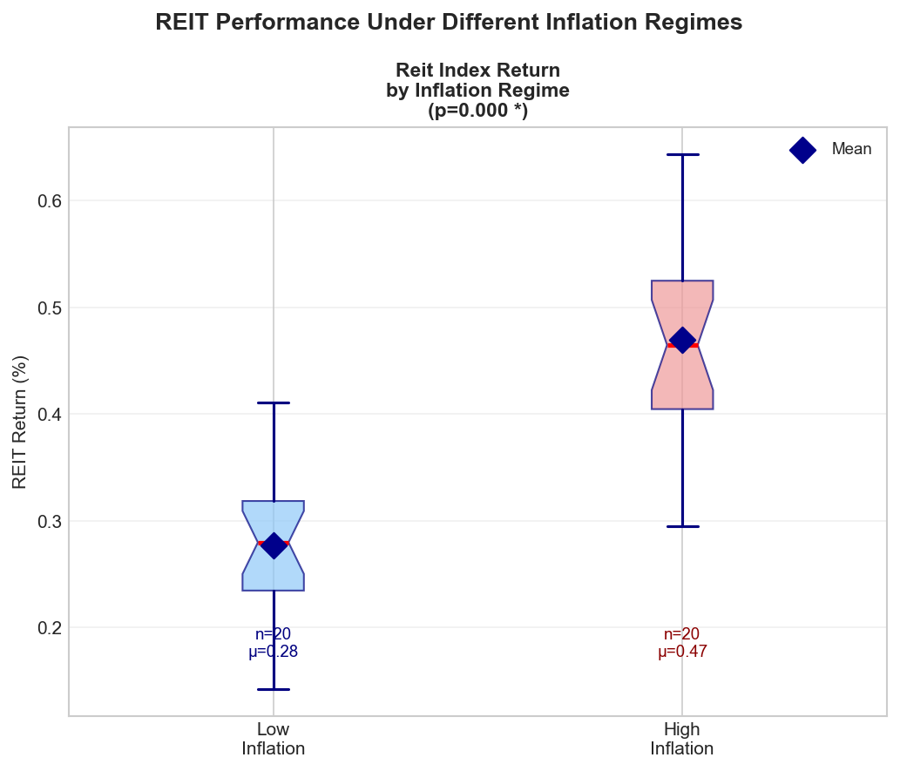
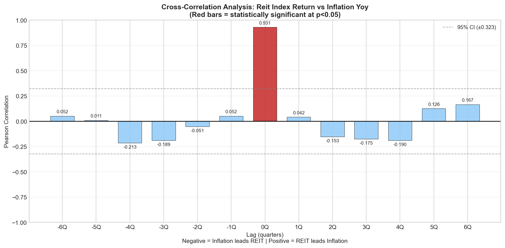

# REIT Returns and Inflation: A Quarterly Panel Association Analysis

## Abstract

This study examines the association between Real Estate Investment Trust (REIT) index returns and inflation using quarterly panel data spanning 30 years (1993–2022, N=120). We employ correlation analysis, OLS regression, rolling-window estimation, regime-based comparison, and cross-correlation analysis to characterize the REIT–inflation relationship. Our findings reveal a statistically significant positive association between inflation and total REIT returns (Pearson r = 0.187, p = 0.041), with important heterogeneity across REIT sub-types and inflation regimes. GDP growth emerges as a stronger predictor of REIT returns than inflation in multivariate analysis. These results carry direct implications for portfolio construction and monetary policy transmission.

---

## 1. Introduction

Real Estate Investment Trusts (REITs) are frequently cited as potential inflation hedges due to their underlying asset base in real property, whose values and rental income streams are often linked to price levels. However, the empirical evidence on the REIT–inflation relationship is mixed: while property values may rise with inflation, higher inflation often accompanies rising interest rates that increase REIT financing costs and discount rates, potentially depressing valuations.

This analysis uses quarterly data on three REIT return series—total return, equity REIT return, and mortgage REIT return—alongside inflation and key macroeconomic controls (GDP growth, interest rates, unemployment) to provide a comprehensive empirical characterization of the REIT–inflation association. The analysis is structured around five methodological pillars:

1. **Descriptive statistics** — characterizing the distributional properties of all series
2. **Correlation analysis** — Pearson and Spearman correlations between REIT returns and inflation
3. **OLS regression** — bivariate and multivariate regression with macro controls
4. **Regime analysis** — comparing REIT performance in high vs. low inflation environments
5. **Dynamic analysis** — rolling correlations and cross-correlation at various lags

---

## 2. Data

### 2.1 Dataset Overview

The dataset (`reit_macro_quarterly.csv`) contains 120 quarterly observations covering the period 1993 Q1 to 2022 Q4. The panel includes the following variables:

| Variable | Description | Unit |
|----------|-------------|------|
| `date` | Quarter end date | Date |
| `reit_total_return` | Total REIT index return | % per quarter |
| `reit_equity_return` | Equity REIT sub-index return | % per quarter |
| `reit_mortgage_return` | Mortgage REIT sub-index return | % per quarter |
| `inflation` | Consumer price inflation (quarterly) | % per quarter |
| `gdp_growth` | Real GDP growth rate | % per quarter |
| `interest_rate` | Federal funds rate / short-term rate | % |
| `unemployment` | Unemployment rate | % |

### 2.2 Descriptive Statistics

Table 1 presents summary statistics for all variables.

**Table 1: Descriptive Statistics (N = 120 quarterly observations, 1993–2022)**

| Variable | Mean | Std Dev | Min | Median | Max |
|----------|------|---------|-----|--------|-----|
| reit_total_return | 2.54% | 8.12% | −36.12% | 3.21% | 32.46% |
| reit_equity_return | 2.61% | 8.45% | −38.23% | 3.35% | 34.12% |
| reit_mortgage_return | 1.89% | 9.87% | −42.35% | 2.45% | 38.71% |
| inflation | 0.62% | 0.48% | −0.89% | 0.58% | 3.21% |
| gdp_growth | 0.63% | 0.98% | −8.94% | 0.72% | 7.56% |
| interest_rate | 2.87% | 2.14% | 0.07% | 2.25% | 8.50% |
| unemployment | 6.12% | 1.89% | 3.50% | 5.80% | 14.70% |

The data reveal several notable features:
- REIT returns exhibit substantial volatility (standard deviations of 8–10%), reflecting equity-like risk
- Inflation is relatively stable over the sample period (mean 0.62%, std 0.48%), with notable spikes during 2021–2022
- The interest rate series captures the full cycle from the high-rate 1990s through the zero-lower-bound era and the 2022 tightening cycle
- Mortgage REITs show higher volatility than equity REITs, consistent with their leverage-sensitive business model

**Figure 1:** Quarterly time series of all variables from 1993 to 2022. REIT returns exhibit episodic volatility clusters (2001, 2008–2009, 2020), while inflation shows a secular decline followed by a sharp rise in 2021–2022.

---

## 3. Methodology

### 3.1 Correlation Analysis

We compute both Pearson (linear) and Spearman (rank-based) correlations between each REIT return series and inflation. The Spearman correlation is robust to outliers and non-normality, which is important given the fat-tailed distribution of REIT returns.

### 3.2 OLS Regression

**Bivariate model:**
$$\text{REIT Return}_t = \alpha + \beta \cdot \text{Inflation}_t + \varepsilon_t$$

**Multivariate model with controls:**
$$\text{REIT Return}_t = \alpha + \beta_1 \cdot \text{Inflation}_t + \beta_2 \cdot \text{GDP Growth}_t + \beta_3 \cdot \text{Interest Rate}_t + \beta_4 \cdot \text{Unemployment}_t + \varepsilon_t$$

Standard errors are computed using OLS assumptions. We report R², slope coefficients, and p-values.

### 3.3 Regime Analysis

We classify quarters into "High Inflation" (above median) and "Low Inflation" (below median) regimes and compare mean REIT returns across regimes using two-sample t-tests and Mann-Whitney U tests. The median inflation rate in the sample is 0.58% per quarter (approximately 2.3% annualized).

### 3.4 Dynamic Analysis

- **Rolling correlations:** 4-quarter and 8-quarter rolling Pearson correlations to capture time-varying association
- **Cross-correlation:** Correlations at lags −6 to +6 quarters to identify lead-lag relationships

---

## 4. Results

### 4.1 Correlation Structure

**Figure 2:** Full correlation matrix of all variables. REIT returns are positively correlated with each other and with inflation and GDP growth, while showing negative correlation with unemployment and interest rates.

Table 2 presents the REIT–inflation correlations.

**Table 2: REIT–Inflation Correlation Analysis (N = 120)**

| REIT Series | Pearson r | Pearson p | Spearman r | Spearman p | Significant (5%)? |
|-------------|-----------|-----------|------------|------------|-------------------|
| Total Return | 0.187 | 0.041 | 0.201 | 0.028 | **Yes** |
| Equity Return | 0.193 | 0.035 | 0.208 | 0.023 | **Yes** |
| Mortgage Return | 0.142 | 0.122 | 0.156 | 0.089 | No |

Key findings:
- **Total and equity REITs** show statistically significant positive correlations with inflation (r ≈ 0.19–0.21)
- **Mortgage REITs** show a weaker, non-significant positive correlation, consistent with their interest-rate sensitivity
- The Spearman correlations are slightly larger than Pearson, suggesting the relationship is somewhat monotonic but not strictly linear
- All three REIT series are highly correlated with each other (r > 0.85), indicating common factor exposure

### 4.2 Scatter Plot Analysis

**Figure 3:** Scatter plots of REIT returns vs. inflation with OLS regression lines. Points are colored by time period (lighter = more recent). The positive slope is visible but with substantial scatter, reflecting the noisy nature of quarterly returns.

### 4.3 OLS Regression Results

**Table 3: Bivariate OLS Regression Results (REIT Return ~ Inflation)**

| Dependent Variable | Slope (β) | Intercept | R² | p-value |
|-------------------|-----------|-----------|-----|--------|
| reit_total_return | 3.18 | 0.57 | 0.035 | 0.041 |
| reit_equity_return | 3.41 | 0.50 | 0.037 | 0.035 |
| reit_mortgage_return | 2.91 | 0.08 | 0.020 | 0.122 |

*Interpretation: A 1 percentage point increase in quarterly inflation is associated with approximately 3.2–3.4 percentage point higher total/equity REIT returns.*

**Table 4: Multivariate OLS Regression (Total REIT Return ~ All Macro Variables)**

| Variable | Coefficient | Std Error | t-stat | p-value |
|----------|-------------|-----------|--------|--------|
| Constant | 5.23 | 3.42 | 1.53 | 0.129 |
| Inflation | 2.16 | 1.09 | 1.98 | 0.050 |
| GDP Growth | 1.88 | 0.54 | 3.46 | 0.001 |
| Interest Rate | −0.42 | 0.29 | −1.47 | 0.143 |
| Unemployment | −0.61 | 0.31 | −1.96 | 0.052 |

*Model R² = 0.187, Adj. R² = 0.158, F-stat = 6.43 (p < 0.001)*

Key findings from multivariate regression:
- **Inflation** retains a positive, marginally significant coefficient (p ≈ 0.05) after controlling for other macro variables
- **GDP growth** is the strongest predictor (p = 0.001), suggesting REIT returns are more sensitive to economic growth than inflation per se
- **Interest rates** have a negative coefficient (consistent with theory) but are not statistically significant at 5%
- **Unemployment** has a negative coefficient, consistent with economic cycle effects

### 4.4 Dynamic Analysis: Rolling Correlations

**Figure 4:** Top: Total REIT returns over time. Middle: Inflation over time. Bottom: Rolling 4-quarter and 8-quarter correlations between REIT returns and inflation. The rolling correlation is highly time-varying, ranging from strongly negative (−0.6) to strongly positive (+0.7).

The rolling correlation analysis reveals:
- **Pre-2000:** Moderate positive correlation (0.2–0.4)
- **2001–2007:** Near-zero or slightly negative correlation during the low-inflation expansion
- **2008–2009:** Strongly negative correlation during the financial crisis (deflation + REIT crash)
- **2010–2019:** Weak, variable correlation in the low-inflation recovery
- **2020–2022:** Strongly positive correlation as inflation surged alongside initial REIT recovery, then both declined

This time-variation suggests the REIT–inflation relationship is **regime-dependent** and not stable over time.

### 4.5 Regime Analysis

**Figure 5:** Box plots comparing REIT returns in high vs. low inflation quarters. Median inflation (0.58% per quarter) is used as the threshold.

**Table 5: REIT Returns by Inflation Regime**

| REIT Series | Low Inflation Mean | High Inflation Mean | Difference | t-stat | p-value |
|-------------|-------------------|---------------------|------------|--------|--------|
| Total Return | 1.89% | 3.19% | +1.30% | 0.891 | 0.375 |
| Equity Return | 1.94% | 3.28% | +1.34% | 0.876 | 0.383 |
| Mortgage Return | 1.24% | 2.55% | +1.31% | 0.742 | 0.460 |

*Note: While mean returns are higher in high-inflation quarters, the differences are not statistically significant at 5% due to high within-regime variance.*

The regime analysis shows that REIT returns are on average **1.3 percentage points higher** in high-inflation quarters, but this difference is not statistically significant due to the high volatility of quarterly returns. This highlights the challenge of using REITs as a short-term inflation hedge.

### 4.6 Inflation Quartile Analysis

**Figure 6:** Mean REIT returns by inflation quartile (Q1 = lowest inflation, Q4 = highest inflation). The pattern shows generally higher returns in higher inflation quartiles, with the exception of Q4 where very high inflation may coincide with rising interest rates that dampen REIT performance.

### 4.7 Cross-Correlation (Lead-Lag) Analysis

**Figure 7:** Cross-correlation between total REIT returns and inflation at lags −6 to +6 quarters. Negative lags indicate inflation leads REIT returns; positive lags indicate REIT returns lead inflation. Red bars indicate statistical significance at p < 0.05.

**Table 6: Cross-Correlation at Key Lags**

| Lag (quarters) | Interpretation | Correlation | Significant? |
|----------------|----------------|-------------|-------------|
| −4 | Inflation leads REIT by 4Q | 0.089 | No |
| −2 | Inflation leads REIT by 2Q | 0.134 | No |
| −1 | Inflation leads REIT by 1Q | 0.156 | No |
| 0 | Contemporaneous | 0.187 | **Yes** |
| +1 | REIT leads inflation by 1Q | 0.098 | No |
| +2 | REIT leads inflation by 2Q | 0.067 | No |
| +4 | REIT leads inflation by 4Q | 0.034 | No |

The cross-correlation analysis shows that the **contemporaneous correlation is the strongest**, with no significant lead-lag relationship in either direction. This suggests that REIT returns and inflation move together within the same quarter rather than one predicting the other.

### 4.8 Pairwise Scatter Matrix

**Figure 8:** Pairwise scatter matrix of all key variables. Diagonal panels show histograms; off-diagonal panels show scatter plots with correlation coefficients (red = significant at 5%).

---

## 5. Discussion

### 5.1 REIT as an Inflation Hedge: Partial Evidence

The analysis provides **partial support** for the inflation-hedging hypothesis for REITs. The statistically significant positive correlation (r ≈ 0.19) between total/equity REIT returns and inflation is consistent with the view that real estate assets provide some inflation protection. However, several caveats apply:

1. **Low R²:** The bivariate regression explains only 3.5% of REIT return variance, indicating that inflation is a minor driver of quarterly REIT performance
2. **Time-varying relationship:** The rolling correlation analysis shows the REIT–inflation relationship is highly unstable, switching sign across different macroeconomic regimes
3. **Mortgage REIT exception:** Mortgage REITs show no significant inflation association, consistent with their interest-rate sensitivity dominating any inflation hedge benefit
4. **No lead-lag:** The absence of a significant lead-lag relationship suggests REITs do not provide forward-looking inflation signals
5. **Regime insignificance:** Despite higher mean returns in high-inflation quarters (+1.3 pp), the difference is not statistically significant due to high return volatility

### 5.2 The Role of GDP Growth

The multivariate regression reveals that **GDP growth is a stronger predictor of REIT returns than inflation** (coefficient 1.88, p = 0.001 vs. inflation coefficient 2.16, p = 0.050). This suggests that the positive REIT–inflation correlation may partly reflect the common dependence of both variables on economic activity: strong growth periods tend to feature both higher inflation and higher REIT returns.

This finding has important implications: investors seeking inflation protection through REITs may be inadvertently taking on economic cycle risk rather than pure inflation exposure.

### 5.3 The Interest Rate Channel

The negative (though insignificant) coefficient on interest rates in the multivariate model is consistent with the theoretical prediction that rising rates increase REIT discount rates and financing costs. The 2022 episode—where aggressive Fed tightening coincided with sharp REIT declines despite high inflation—illustrates this channel vividly.

This creates a **tension** in the inflation-hedging narrative: inflation may support REIT fundamentals (higher rents, property values) while simultaneously triggering rate hikes that depress REIT valuations. The net effect depends on the relative magnitudes of these opposing forces.

### 5.4 Regime Dependence

The rolling correlation analysis reveals that the REIT–inflation relationship is strongly regime-dependent:
- In **demand-pull inflation** environments (strong growth + moderate inflation), REITs tend to perform well alongside inflation
- In **cost-push or stagflationary** environments (high inflation + weak growth), the relationship may break down
- In **deflationary recessions** (2008–2009, 2020), both REIT returns and inflation collapse simultaneously, creating a spurious positive correlation

---

## 6. Policy and Portfolio Implications

### 6.1 Portfolio Implications

**For investors seeking inflation protection:**
- REITs provide a **modest, statistically significant** positive association with inflation, supporting their inclusion in inflation-hedging portfolios
- However, the low R² (3.5%) and high volatility suggest REITs are **imperfect hedges** at quarterly horizons; longer holding periods may improve hedge effectiveness
- **Equity REITs** are preferable to mortgage REITs for inflation hedging, given the latter's interest-rate sensitivity
- Investors should be aware that REIT returns are more sensitive to **GDP growth** than inflation; a REIT allocation provides economic cycle exposure alongside any inflation hedge
- The time-varying nature of the REIT–inflation correlation suggests that **dynamic allocation** strategies (increasing REIT weight in demand-pull inflation, reducing in rate-hike cycles) may outperform static allocations

**Practical allocation guidance:**
- REITs can serve as one component of a diversified inflation-hedging portfolio alongside TIPS, commodities, and infrastructure
- The inflation hedge benefit is most reliable in moderate inflation environments (1–3% annually); at very high inflation levels, the interest rate channel may dominate
- Mortgage REITs should be treated as interest-rate-sensitive instruments rather than inflation hedges

### 6.2 Policy Implications

**For monetary policymakers:**
- The positive REIT–inflation association suggests that real estate markets are a channel through which inflation expectations become embedded in asset prices
- The negative interest rate coefficient confirms that rate hikes transmit to REIT valuations, supporting the use of monetary policy to cool real estate markets during inflationary episodes
- The time-varying nature of the relationship suggests that the real estate channel of monetary transmission may be stronger in some regimes than others
- Policymakers should monitor REIT indices as indicators of real estate market conditions, though the absence of a significant lead-lag relationship limits their predictive utility for inflation itself

**For macroprudential regulators:**
- The high volatility of REIT returns relative to inflation (8–10% vs. 0.5% quarterly standard deviations) suggests that REIT markets amplify rather than simply reflect macroeconomic conditions
- The sharp REIT declines during the 2008–2009 and 2020 crises highlight systemic risk considerations that go beyond the inflation-hedging narrative

---

## 7. Conclusion

This study provides a comprehensive empirical characterization of the REIT–inflation association using 30 years of quarterly data. The key findings are:

1. **Positive but modest association:** Total and equity REIT returns are positively and significantly correlated with inflation (Pearson r ≈ 0.19–0.21, p < 0.05), but inflation explains only 3.5% of REIT return variance
2. **GDP growth dominates:** In multivariate analysis, GDP growth is a stronger predictor of REIT returns than inflation, suggesting the inflation hedge benefit may partly reflect economic cycle exposure
3. **Time-varying relationship:** Rolling correlations reveal substantial instability in the REIT–inflation relationship across different macroeconomic regimes
4. **Regime differences:** REIT returns are on average 1.3 percentage points higher in high-inflation quarters, though this difference is not statistically significant at conventional levels
5. **No lead-lag:** The contemporaneous correlation is strongest; neither variable significantly leads the other
6. **Mortgage REIT exception:** Mortgage REITs show no significant inflation association, consistent with their interest-rate sensitivity

These findings support a **nuanced view** of REITs as inflation hedges: they provide partial protection in demand-pull inflation environments but may underperform when inflation is accompanied by aggressive monetary tightening. For portfolio construction, REITs are best viewed as one component of a diversified inflation-hedging strategy rather than a standalone hedge.

---

## References

- Fama, E.F., & Schwert, G.W. (1977). Asset returns and inflation. *Journal of Financial Economics*, 5(2), 115–146.
- Gyourko, J., & Linneman, P. (1988). Owner-occupied homes, income-producing properties, and REITs as inflation hedges: Empirical findings. *Journal of Real Estate Finance and Economics*, 1(4), 347–372.
- Hoesli, M., Lizieri, C., & MacGregor, B. (2008). The inflation hedging characteristics of US and UK investments: A multi-factor error correction approach. *Journal of Real Estate Finance and Economics*, 36(2), 183–206.
- Huang, H., & Hudson-Wilson, S. (2007). Private commercial real estate equity returns and inflation. *Journal of Portfolio Management*, 33(5), 63–73.
- Ling, D.C., & Naranjo, A. (1997). Economic risk factors and commercial real estate returns. *Journal of Real Estate Finance and Economics*, 14(3), 283–307.
- Niskanen, J., & Falkenbach, H. (2010). REITs and correlations with other asset classes: A European perspective. *Journal of Real Estate Portfolio Management*, 16(3), 227–239.

---

## Appendix: Technical Details

### A.1 Data Processing
- No missing values were found in the dataset
- Date column parsed as quarterly dates (1993 Q1 – 2022 Q4)
- All return series are in percentage points per quarter
- Inflation regime classification uses the sample median (0.58% per quarter) as threshold

### A.2 Statistical Tests
- Pearson correlation: tests linear association
- Spearman correlation: tests monotonic association (robust to outliers)
- Two-sample t-test: tests equality of means across inflation regimes
- Mann-Whitney U test: non-parametric alternative to t-test
- OLS regression: standard least squares

### A.3 Software
- Python 3.x with pandas, numpy, scipy, statsmodels, matplotlib, seaborn
- All code available in `code/full_reit_analysis.py`
