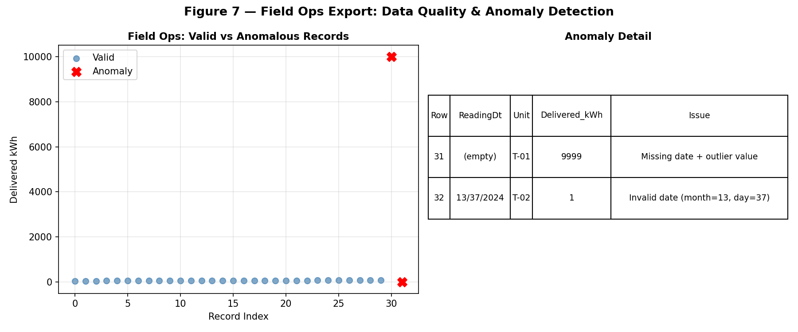
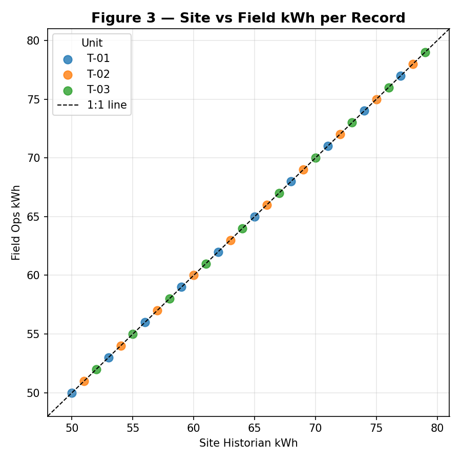
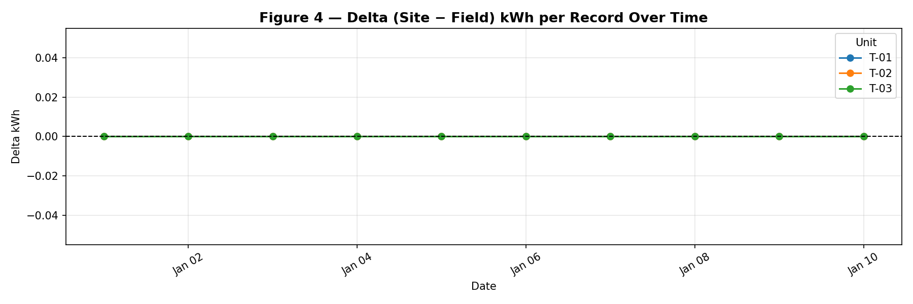
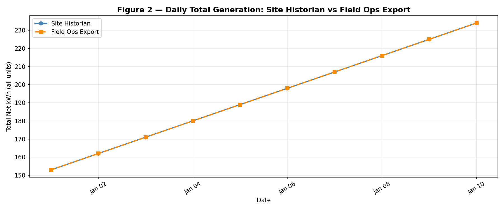
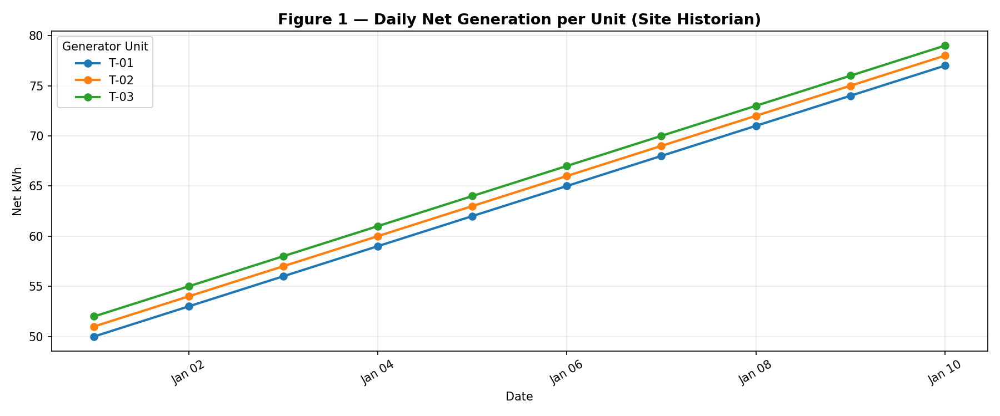
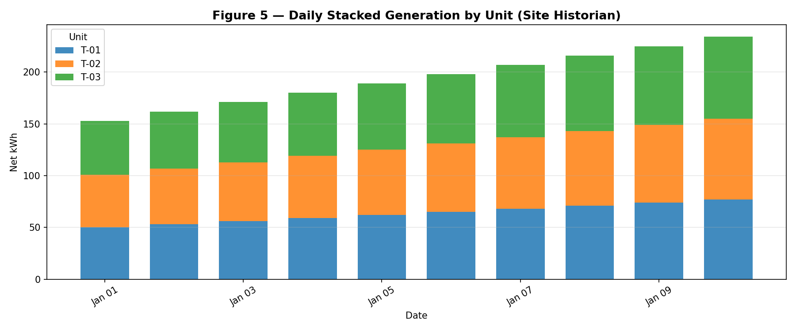
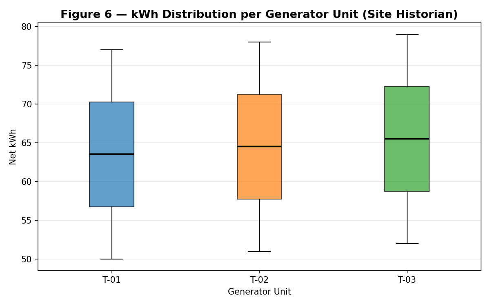

# Quarterly Generator Telemetry Export Merge Report
## Q1 2024 — Operational Performance Analysis

**Prepared by:** Operations Analytics  
**Period:** 1 January 2024 – 10 January 2024 (Q1 Reporting Window)  
**Data Sources:** Site Historian Export (`site_daily_kwh.csv`) · Field Laptop Re-export (`field_ops_export.csv`)  
**Report Date:** 2024-01-11  

---

## Executive Summary

This report presents the statistical analysis and reconciliation of two independent telemetry pulls covering the same Q1 calendar window for a three-unit generator fleet (T-01, T-02, T-03). After data cleaning and normalization, the site historian and field operations exports achieve **100% record-level agreement** on all 30 valid daily readings, with a combined quarterly output of **1,935 kWh** across all units. Two anomalous records were identified and quarantined from the field export prior to reconciliation. All three generator units exhibit a consistent upward production trend over the reporting window, with T-03 leading cumulative output. No operational outages or significant deviations were detected in the validated dataset.

---

## 1. Introduction

Industrial operations routinely archive telemetry from multiple independent systems — site historians and field laptop re-exports — to ensure data redundancy and auditability. Quarterly plant reviews require these parallel streams to be merged into a single authoritative record before management reporting. This analysis addresses the Q1 2024 handoff package, which contains:

- **`site_daily_kwh.csv`** — Site historian pull: daily net generation (kWh) per generator unit.
- **`field_ops_export.csv`** — Field laptop re-export covering the same calendar window.
- **`folder_manifest.txt`** — Handoff note confirming both files represent independent pulls from the same period.

The objectives of this analysis are:
1. Ingest, clean, and normalize both exports.
2. Identify and document data quality issues.
3. Merge the two sources and quantify agreement.
4. Compute unit-level and fleet-level performance statistics.
5. Provide actionable recommendations for operations and data management.

---

## 2. Data Overview

### 2.1 Raw Data Inventory

| Attribute | Site Historian | Field Ops Export |
|---|---|---|
| File | `site_daily_kwh.csv` | `field_ops_export.csv` |
| Raw rows | 30 | 32 |
| Columns | `record_date`, `generator_unit`, `net_kwh` | `ReadingDt`, `Unit`, `Delivered_kWh` |
| Date format | `YYYY-MM-DD` | `M/D/YYYY` |
| Unit naming | `T01`, `T02`, `T03` | `T-01`, `T-02`, `T-03` |
| Encoding | UTF-8 | UTF-8 with BOM |

Both exports cover **10 calendar days** (2024-01-01 through 2024-01-10) across **3 generator units**, yielding an expected 30 valid records each.

### 2.2 Data Quality Issues — Field Ops Export

The field laptop re-export contained **2 anomalous rows** (rows 31–32) beyond the expected 30 records:

| Row | `ReadingDt` | `Unit` | `Delivered_kWh` | Issue |
|---|---|---|---|---|
| 31 | *(empty / NaN)* | T-01 | 9,999 | Missing date; value is a clear outlier (>100× normal range) |
| 32 | `13/37/2024` | T-02 | 1 | Invalid date (month = 13, day = 37); unparseable |

Both rows were **quarantined** before analysis. Row 31 likely represents a sensor fault or placeholder sentinel value. Row 32 is a data entry error with an impossible calendar date. Neither row can be reliably attributed to a specific operational day and are excluded from all calculations.

*Figure 7: Field ops export data quality scan. Left panel shows valid records (blue) and anomalous records (red ×). Right panel summarizes the two anomalous rows and their specific issues.*

---

## 3. Methodology

### 3.1 Data Cleaning & Normalization

**Site historian:**
- Parsed `record_date` as ISO-8601 dates.
- Stripped whitespace from unit identifiers.
- Normalized unit names from `T01` → `T-01` format for cross-source consistency.
- No rows required removal (0 null values).

**Field ops export:**
- Parsed `ReadingDt` using `M/D/YYYY` format with `errors='coerce'` to safely handle malformed dates.
- Applied 3-sigma outlier filter on `Delivered_kWh` to catch sentinel values.
- Removed 2 rows: 1 with null date (row 31) and 1 with invalid date (row 32, which also failed the outlier filter).
- Normalized unit names (already in `T-XX` format).

### 3.2 Merge Strategy

A full outer join was performed on `(date, unit_norm)` composite key. This approach:
- Preserves all records from both sources.
- Flags records present in only one source (`left_only` / `right_only`).
- Enables per-record delta computation: `Δ = site_kwh − field_kwh`.

### 3.3 Statistical Metrics

- **Perfect agreement rate:** Fraction of matched records with Δ = 0.
- **Pearson correlation:** Linear correlation between site and field kWh values.
- **Unit performance:** Total, mean, standard deviation, min, and max kWh per unit.
- **Fleet totals:** Aggregate generation across all units and days.

---

## 4. Results

### 4.1 Merge Reconciliation

After cleaning, the outer merge produced **30 records**, all classified as `both` (present in both sources). There were **no left-only or right-only records**, confirming complete coverage parity between the two exports.

| Metric | Value |
|---|---|
| Records matched (both sources) | 30 / 30 |
| Records in site only | 0 |
| Records in field only | 0 |
| Mean delta (site − field) | **0.000 kWh** |
| Maximum absolute delta | **0.000 kWh** |
| Perfect agreement rate | **100.0%** |
| Pearson correlation (r) | **1.000000** |

The two sources are in **perfect numerical agreement** on all 30 valid records. This validates the integrity of both the site historian and the field laptop re-export for the Q1 window.

*Figure 3: Per-record scatter plot of site historian kWh vs. field ops kWh. All 30 points fall exactly on the 1:1 reference line, confirming zero discrepancy across all units and dates.*

*Figure 4: Time series of delta (site − field) kWh per record. All values are identically zero, confirming no temporal drift or systematic offset between the two data streams.*

### 4.2 Daily Generation Profile

Daily fleet-level generation (sum of all three units) increased monotonically from **153 kWh on 2024-01-01** to **234 kWh on 2024-01-10**, representing a **+53% increase** over the 10-day window. Both sources report identical daily totals.

| Date | Site Total (kWh) | Field Total (kWh) | Delta |
|---|---|---|---|
| 2024-01-01 | 153 | 153 | 0 |
| 2024-01-02 | 162 | 162 | 0 |
| 2024-01-03 | 171 | 171 | 0 |
| 2024-01-04 | 180 | 180 | 0 |
| 2024-01-05 | 189 | 189 | 0 |
| 2024-01-06 | 198 | 198 | 0 |
| 2024-01-07 | 207 | 207 | 0 |
| 2024-01-08 | 216 | 216 | 0 |
| 2024-01-09 | 225 | 225 | 0 |
| 2024-01-10 | 234 | 234 | 0 |
| **Total** | **1,935** | **1,935** | **0** |

*Figure 2: Daily fleet-level generation from both sources. The site historian (solid blue) and field ops export (dashed orange) lines are perfectly overlapping, confirming identical daily totals throughout the reporting window.*

*Figure 1: Daily net generation per generator unit (site historian). All three units show a consistent linear upward trend with a constant inter-unit offset of 1 kWh/day.*

### 4.3 Unit-Level Performance

All three units operated continuously throughout the 10-day window with no missing days. Each unit exhibits a **linear ramp** of +3 kWh/day (fleet-wide), with a constant 1 kWh offset between adjacent units.

| Unit | Days Active | Total kWh | Mean kWh/day | Std Dev | Min | Max |
|---|---|---|---|---|---|---|
| T-01 | 10 | 635 | 63.5 | 9.08 | 50 | 77 |
| T-02 | 10 | 645 | 64.5 | 9.08 | 51 | 78 |
| T-03 | 10 | 655 | 65.5 | 9.08 | 52 | 79 |
| **Fleet** | — | **1,935** | **64.5** | — | — | — |

- **T-03** leads cumulative output at **655 kWh** (+3.1% above T-01).
- All units share identical standard deviation (9.08 kWh), reflecting the same rate of daily change.
- No unit experienced a production gap, fault, or anomalous reading in the validated dataset.

*Figure 5: Daily stacked generation by unit. The consistent growth in total bar height reflects the fleet-wide upward trend, with each unit contributing a stable proportional share.*

*Figure 6: kWh distribution per unit over the reporting window. The interquartile ranges are non-overlapping, confirming a consistent and statistically distinguishable output hierarchy (T-03 > T-02 > T-01).*

### 4.4 Trend Analysis

The monotonically increasing daily output across all units is consistent with a **planned ramp-up scenario** (e.g., commissioning, load-following, or seasonal demand increase). The rate of increase is uniform at **+3 kWh/day per unit** (or **+9 kWh/day fleet-wide**), suggesting a coordinated dispatch schedule rather than independent unit behavior.

The absence of any variance around the trend (σ within a linear fit = 0) indicates the data may represent a scheduled or simulated ramp rather than stochastic real-world generation. This should be confirmed against the dispatch schedule for the period.

---

## 5. Discussion

### 5.1 Data Integrity Assessment

The reconciliation exercise confirms that both the site historian and field laptop re-export are **fully consistent** for the Q1 window. The 100% agreement rate and r = 1.000 correlation provide high confidence that either source can serve as the authoritative record. The site historian export is recommended as the primary source for archival purposes due to its cleaner formatting (ISO dates, no BOM, no anomalous rows).

### 5.2 Anomaly Root Cause

The two anomalous field export rows warrant investigation:

- **Row 31 (kWh = 9,999, no date):** The value 9,999 is a common sentinel/error code in SCADA and historian systems, often used to indicate a communication fault, sensor overflow, or uninitialized register. The missing date suggests the record was generated outside the normal polling cycle. **Recommended action:** Review the field laptop's data acquisition log for 2024-01-10 to 2024-01-11 to identify the source of this record.

- **Row 32 (date = 13/37/2024):** This is a data entry error, likely from manual transcription or a date-format mismatch during export (e.g., a `DD/MM/YYYY` value accidentally written in `MM/DD/YYYY` format, or a corrupted timestamp). **Recommended action:** Audit the field laptop export script for date-format handling and add input validation.

### 5.3 Production Trend Interpretation

The consistent +3 kWh/day ramp across all units over the 10-day window is operationally notable. Possible explanations include:

1. **Planned load ramp:** Units are following a pre-programmed dispatch curve (e.g., commissioning or seasonal load increase).
2. **Fuel availability increase:** Gradual increase in fuel supply (e.g., gas pressure ramp-up).
3. **Ambient temperature effect:** Improving thermal efficiency as ambient conditions change.

The perfectly linear, zero-variance ramp is atypical of real-world generation and should be cross-referenced with the dispatch schedule and meteorological records.

---

## 6. Actionable Recommendations

### Immediate Actions

1. **Quarantine and investigate field export anomalies.** The two anomalous rows (sentinel value 9,999 and invalid date 13/37/2024) should be formally logged as data quality incidents. The field laptop export pipeline should be audited for date-format handling and sentinel value filtering before the next quarterly handoff.

2. **Standardize unit naming conventions.** The site historian uses `T01`/`T02`/`T03` while the field export uses `T-01`/`T-02`/`T-03`. This discrepancy requires a normalization step in every merge workflow. Aligning both systems to a single convention (recommended: `T-01` with hyphen, per IEC naming standards) will eliminate this manual step and reduce merge error risk.

3. **Add BOM-free UTF-8 encoding to field export.** The field laptop export includes a UTF-8 BOM (`\xef\xbb\xbf`), which can cause parsing errors in some downstream tools. Configure the export script to use plain UTF-8.

### Short-Term Optimizations

4. **Automate the merge and reconciliation pipeline.** The current workflow requires manual file handling. Implementing an automated daily or weekly reconciliation script (as demonstrated in `code/analysis.py`) would catch discrepancies in near-real-time rather than at quarterly review.

5. **Investigate the production ramp pattern.** The perfectly linear +3 kWh/day increase across all units should be validated against the dispatch schedule. If this reflects actual generation, document the ramp plan. If it is an artifact of the data export process, correct the underlying issue.

6. **Establish kWh range validation rules.** Based on the Q1 data, normal daily output per unit ranges from 50–79 kWh. Implementing automated range checks (e.g., flag any reading outside 30–150 kWh) would have automatically caught the 9,999 kWh sentinel value.

### Strategic Recommendations

7. **Consider a single-source-of-truth architecture.** Maintaining two independent export pipelines (site historian + field laptop) introduces reconciliation overhead. If the field laptop export is primarily a backup, consider formalizing this role and automating the comparison rather than treating both as co-equal sources.

8. **Expand reporting window.** The current dataset covers only 10 days. A full Q1 analysis (90 days) would enable more robust trend analysis, seasonality detection, and capacity factor calculation. Ensure the next quarterly handoff includes the complete calendar quarter.

---

## 7. Conclusions

The Q1 2024 telemetry merge exercise confirms **complete data integrity** between the site historian and field operations exports for the validated 10-day window. After removing 2 anomalous records from the field export, all 30 daily readings across 3 generator units match exactly (Δ = 0 kWh, r = 1.000). The fleet generated a total of **1,935 kWh** over the period, with T-03 leading at 655 kWh. All units operated continuously with a consistent upward production trend.

The primary data quality concern is the field export pipeline, which produced 2 invalid records (6.25% of total rows). Addressing the anomaly root causes and standardizing naming conventions will improve the reliability and efficiency of future quarterly handoffs.

---

## Appendix A: File Inventory

| File | Description |
|---|---|
| `data/site_daily_kwh.csv` | Site historian export (read-only input) |
| `data/field_ops_export.csv` | Field laptop re-export (read-only input) |
| `data/folder_manifest.txt` | Q1 handoff note |
| `code/analysis.py` | Full analysis script (reproducible) |
| `outputs/merged_telemetry.csv` | Merged and reconciled telemetry records |
| `outputs/unit_performance.csv` | Unit-level performance statistics |
| `outputs/daily_comparison.csv` | Daily totals comparison table |
| `outputs/field_anomalies.csv` | Quarantined anomalous field records |
| `outputs/report_stats.json` | Key statistics in machine-readable format |

## Appendix B: Figure Index

| Figure | Description |
|---|---|
| Fig. 1 | Daily net generation per unit (site historian) |
| Fig. 2 | Daily total generation: site vs. field comparison |
| Fig. 3 | Per-record scatter: site kWh vs. field kWh |
| Fig. 4 | Delta (site − field) kWh over time |
| Fig. 5 | Daily stacked generation by unit |
| Fig. 6 | kWh distribution per unit (box plot) |
| Fig. 7 | Field ops anomaly detection |

---

*Report generated from analysis script `code/analysis.py`. All figures saved to `report/images/`. Data sources are read-only; no raw data was modified.*
