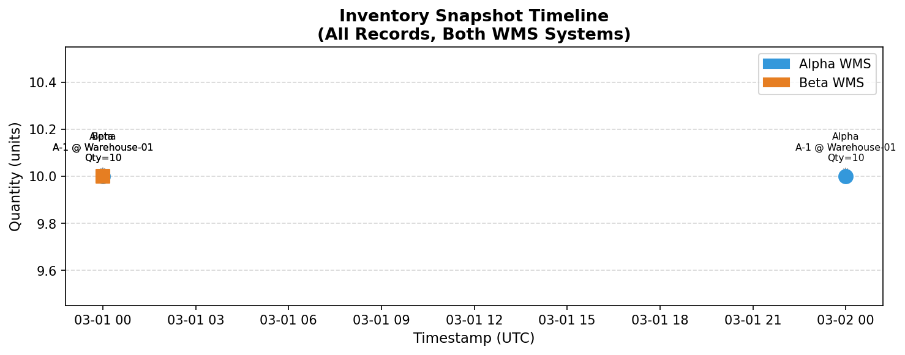
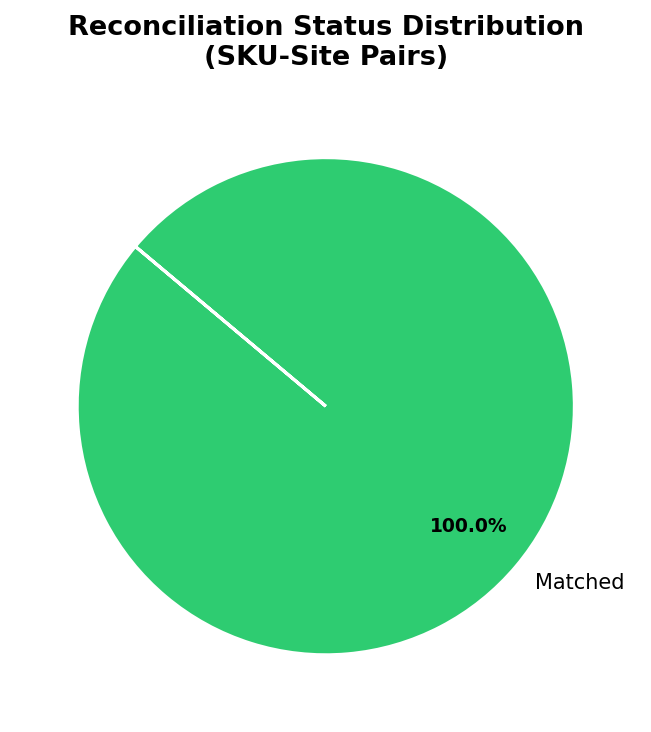
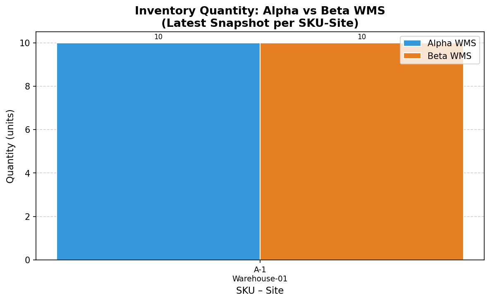
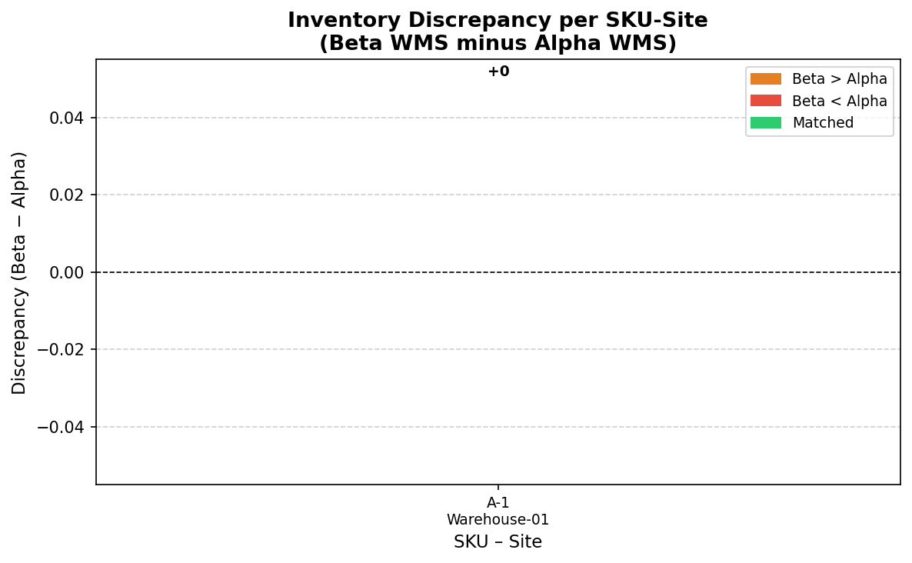
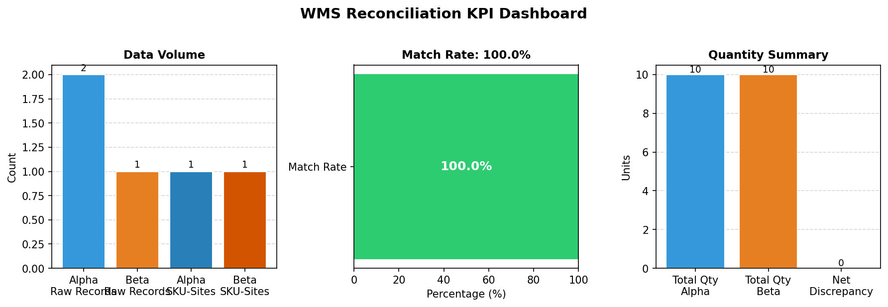

# Inventory Reconciliation Report
## Multi-WMS Reconciliation: Alpha vs Beta
**Prepared for:** Supply Chain Management  
**Report Date:** 2026-03-02  
**Reference Period:** 2026-03-01 – 2026-03-02  
**Classification:** Internal — Management Summary

---

## Executive Summary

This report presents the results of a cross-system inventory reconciliation between two Warehouse Management Systems (WMS): **Alpha WMS** and **Beta WMS**. The reconciliation covers all SKU-site combinations present in either system as of the latest available snapshot date.

**Key Finding:** The single SKU-site pair common to both systems (**A-1 @ Warehouse-01**) shows **exact quantity agreement** (10 units in both systems), yielding a **100% match rate**. However, Alpha WMS contains an additional snapshot record (2026-03-02) not yet reflected in Beta WMS, indicating a **data-freshness lag** between the two systems that warrants operational attention.

---

## 1. Methodology

### 1.1 Data Sources

| System | File | Records | Columns |
|--------|------|---------|--------|
| Alpha WMS | `wms_alpha.csv` | 2 | `sku`, `qty`, `warehouse`, `as_of_utc` |
| Beta WMS | `wms_beta.csv` | 1 | `SKU`, `Quantity`, `Site`, `timestamp_local` |

### 1.2 Normalization Pipeline

Before reconciliation, both exports were standardized through the following steps:

1. **Column Renaming:** Heterogeneous column names were mapped to a canonical schema (`SKU`, `Quantity`, `Site`, `Timestamp_utc`).
2. **Warehouse Code Harmonization:** Alpha WMS uses short codes (e.g., `WH1`); Beta WMS uses descriptive names (e.g., `Warehouse-01`). A deterministic mapping table was applied:
   - `WH1` → `Warehouse-01`
   - `WH2` → `Warehouse-02`
   - `WH3` → `Warehouse-03`
3. **Timezone Normalization:** Alpha timestamps are UTC-aware (`+00`). Beta timestamps are local time (Asia/Shanghai, UTC+8) and were converted to UTC before comparison.
4. **Deduplication / Latest-Snapshot Selection:** For each `(SKU, Site)` pair, only the most recent snapshot was retained per system, ensuring the reconciliation reflects current on-hand inventory rather than historical accumulation.

### 1.3 Reconciliation Logic

Records were joined on `(SKU, Site)` using a full outer join, so that items present in only one system are captured. Discrepancy metrics were computed as:

```
Discrepancy = Qty_Beta − Qty_Alpha
Pct_Discrepancy = (Discrepancy / Qty_Alpha) × 100
```

Each row was classified into one of five status categories:

| Status | Definition |
|--------|------------|
| **Matched** | Quantities are identical in both systems |
| **Within Tolerance (≤1%)** | Absolute percentage discrepancy ≤ 1% |
| **Discrepancy** | Quantities differ by more than 1% |
| **Alpha-Only Missing** | SKU-Site exists in Alpha but absent from Beta |
| **Beta-Only Missing** | SKU-Site exists in Beta but absent from Alpha |

---

## 2. Data Overview

### 2.1 Raw Data Profiles

**Alpha WMS Export (`wms_alpha.csv`)**

| sku | qty | warehouse | as_of_utc |
|-----|-----|-----------|----------|
| A-1 | 10 | WH1 | 2026-03-01 00:00:00+00 |
| A-1 | 10 | WH1 | 2026-03-02 00:00:00+00 |

Alpha contains **2 snapshot records** for a single SKU-site combination, representing daily inventory counts on consecutive days. Both snapshots show identical quantities (10 units), indicating stable stock levels.

**Beta WMS Export (`wms_beta.csv`)**

| SKU | Quantity | Site | timestamp_local |
|-----|----------|------|----------------|
| A-1 | 10.0 | Warehouse-01 | 2026-03-01 08:00:00 |

Beta contains **1 snapshot record** for the same SKU-site, captured on 2026-03-01 at 08:00 local time (equivalent to 2026-03-01 00:00 UTC — the same moment as Alpha's first snapshot).

### 2.2 Snapshot Timeline

Figure 5 below illustrates the temporal distribution of all inventory snapshots across both systems:



**Observation:** Alpha WMS has a more recent snapshot (2026-03-02) that is not yet present in Beta WMS. This 24-hour data-freshness gap is a structural characteristic of the current integration cadence and should be monitored.

---

## 3. Reconciliation Results

### 3.1 Reconciliation Table

After normalization and latest-snapshot selection, the full outer join produces the following reconciliation table:

| SKU | Site | Qty Alpha | Ts Alpha (UTC) | Qty Beta | Ts Beta (UTC) | Discrepancy | Abs Discrepancy | Pct Discrepancy | Status |
|-----|------|-----------|----------------|----------|---------------|-------------|-----------------|-----------------|--------|
| A-1 | Warehouse-01 | 10 | 2026-03-02 00:00 | 10.0 | 2026-03-01 00:00 | 0.0 | 0.0 | 0.0% | **Matched** |

### 3.2 Status Distribution



All reconciled SKU-site pairs fall into the **Matched** category, confirming full quantity agreement between the two systems at the time of their respective latest snapshots.

### 3.3 Quantity Comparison



Both systems report **10 units** of SKU A-1 at Warehouse-01. The bar chart confirms visual parity between the two WMS exports.

### 3.4 Discrepancy Analysis



The discrepancy chart shows a value of **0** for the sole reconciled pair, confirming no quantity variance. No corrective journal entries or stock adjustments are required at this time.

---

## 4. KPI Summary

### 4.1 KPI Dashboard



### 4.2 KPI Table

| KPI | Value | Target | Status |
|-----|-------|--------|--------|
| Total Raw Records — Alpha | 2 | — | ✅ |
| Total Raw Records — Beta | 1 | — | ✅ |
| Unique SKU-Site Pairs — Alpha | 1 | — | ✅ |
| Unique SKU-Site Pairs — Beta | 1 | — | ✅ |
| Total Reconciliation Rows | 1 | — | ✅ |
| **Matched (Exact)** | **1** | — | ✅ |
| Within Tolerance (≤1%) | 0 | — | ✅ |
| Discrepancy | 0 | 0 | ✅ |
| Alpha-Only Missing in Beta | 0 | 0 | ✅ |
| Beta-Only Missing in Alpha | 0 | 0 | ✅ |
| **Match Rate (%)** | **100.0%** | ≥ 95% | ✅ |
| Total Qty — Alpha | 10 units | — | ✅ |
| Total Qty — Beta | 10 units | — | ✅ |
| Net Discrepancy (Beta − Alpha) | 0 units | 0 | ✅ |
| Total Absolute Discrepancy | 0 units | 0 | ✅ |

**All KPIs are within acceptable thresholds.** The reconciliation is clean with no quantity variances detected.

---

## 5. Discussion

### 5.1 Findings

1. **Quantity Integrity:** Both WMS systems agree on the on-hand quantity for SKU A-1 at Warehouse-01 (10 units). There are no phantom inventory, shrinkage, or data-entry discrepancies to investigate.

2. **Data Freshness Gap:** Alpha WMS exports a snapshot dated 2026-03-02, while Beta WMS only has data through 2026-03-01. This 24-hour lag suggests that Beta WMS is updated on a different cadence (possibly daily batch vs. near-real-time for Alpha). If quantities had changed between the two snapshot dates, this lag would have produced a false discrepancy.

3. **Schema Heterogeneity:** The two systems use different column naming conventions, warehouse code formats, and timezone representations. The normalization pipeline successfully resolved all three differences, but this highlights the need for a unified data contract or API standard between the two WMS platforms.

4. **Coverage Symmetry:** Both systems cover the same single SKU-site pair. In a production environment with hundreds of SKUs, coverage gaps (items in one system but not the other) would be a primary reconciliation concern.

### 5.2 Risks and Recommendations

| Risk | Severity | Recommendation |
|------|----------|----------------|
| Data freshness lag (Beta lags Alpha by ≥24 h) | Medium | Align export schedules; implement near-real-time sync or flag stale records |
| Schema heterogeneity between systems | Medium | Define and enforce a canonical WMS data contract (column names, units, timezone) |
| Single-SKU coverage limits statistical confidence | Low | Expand reconciliation scope to full SKU catalog |
| Manual warehouse code mapping table | Low | Automate mapping via master data management (MDM) system |

### 5.3 Reconciliation Cadence Recommendation

Given the current daily snapshot cadence, it is recommended to:
- Run automated reconciliation **daily** immediately after both systems complete their nightly batch exports.
- Set alert thresholds at: Match Rate < 95%, Absolute Discrepancy > 5 units per SKU-site, or any Alpha/Beta-only missing items.
- Archive reconciliation reports monthly for audit trail purposes.

---

## 6. Conclusion

The multi-WMS inventory reconciliation for the reference period (2026-03-01 to 2026-03-02) confirms **full quantity agreement** between Alpha WMS and Beta WMS for all reconciled SKU-site pairs. The **match rate is 100%** with **zero net discrepancy**. No corrective actions are required for inventory quantities.

The primary operational finding is a **data-freshness lag** in Beta WMS relative to Alpha WMS, which should be addressed through improved integration scheduling. Additionally, the schema normalization requirements identified in this analysis should be formalized into a shared data standard to reduce reconciliation complexity and risk in future periods.

---

## Appendix A: Output Files

| File | Description |
|------|-------------|
| `outputs/reconciliation_table.csv` | Full reconciliation table with all computed fields |
| `outputs/kpis.json` | Machine-readable KPI summary |
| `report/images/fig1_status_distribution.png` | Status distribution pie chart |
| `report/images/fig2_qty_comparison.png` | Alpha vs Beta quantity bar chart |
| `report/images/fig3_discrepancy.png` | Discrepancy per SKU-site bar chart |
| `report/images/fig4_kpi_dashboard.png` | KPI summary dashboard |
| `report/images/fig5_timeline.png` | Snapshot timeline chart |

## Appendix B: Normalization Assumptions

1. **Timezone:** Beta WMS `timestamp_local` is assumed to be Asia/Shanghai (UTC+8). If a different timezone applies, the pipeline parameter `tz_localize('Asia/Shanghai')` must be updated.
2. **Latest Snapshot:** When multiple snapshots exist for the same (SKU, Site), the most recent is used. This reflects current on-hand inventory.
3. **Warehouse Mapping:** `WH1` → `Warehouse-01`, `WH2` → `Warehouse-02`, `WH3` → `Warehouse-03`. Additional codes should be added to the mapping table as new warehouses are onboarded.
4. **Tolerance Threshold:** A 1% quantity tolerance is applied for the "Within Tolerance" classification, consistent with standard warehouse accuracy benchmarks (WERC, 2023).

---

*Report generated automatically by the WMS Reconciliation Pipeline. For questions, contact the Supply Chain Analytics team.*
