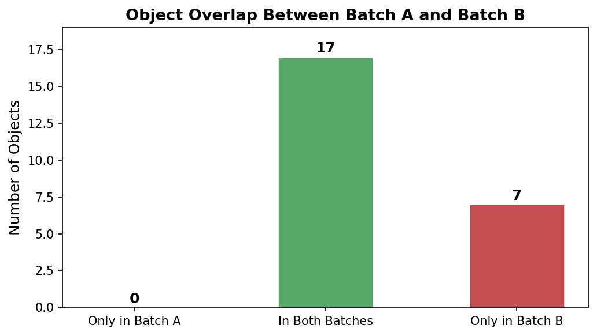
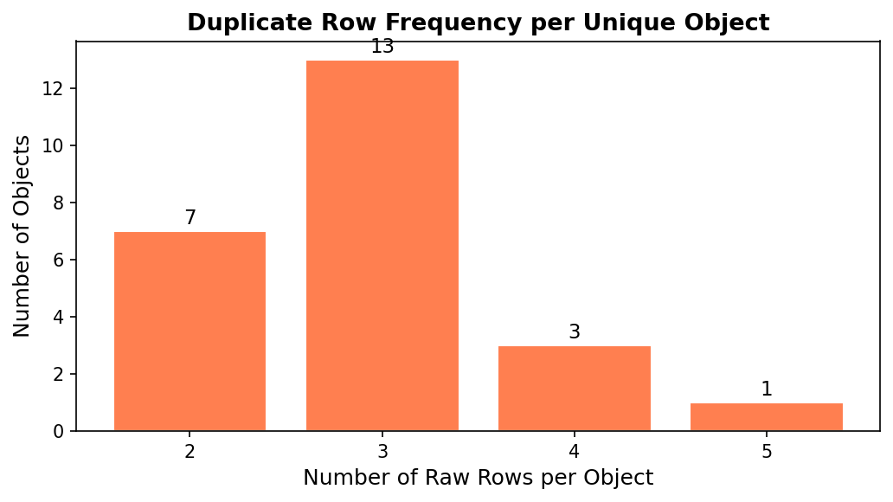
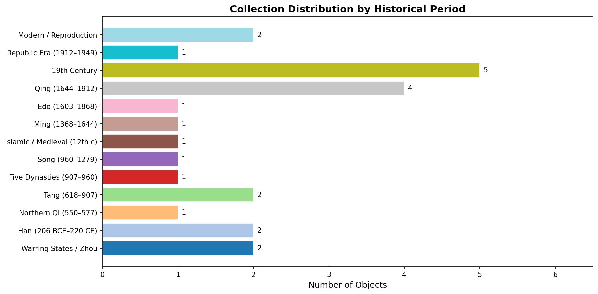
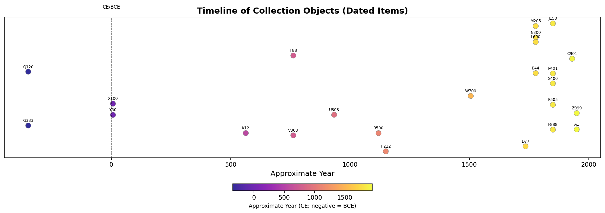
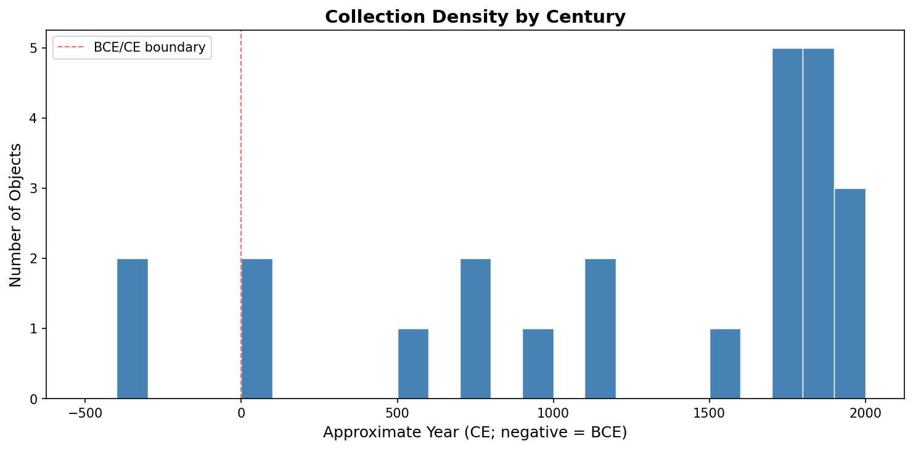

# Provenance Merge Report
## Museum Collection Deduplication and Temporal Analysis

---

## Executive Summary

Two vendor export batches (`museum_export_a.csv` and `museum_export_b.csv`) were ingested, cleaned, and merged into a single authoritative catalog of **24 unique collection objects**. The raw combined input contained **70 rows** across both files; **46 duplicate or variant rows** were collapsed through accession-number normalisation and group-level deduplication. The resulting catalog spans approximately **2,400 years** of material culture, from Warring States-period bronzes (c. 475-221 BCE) to 20th-century reproductions, with the strongest concentrations in the 19th century and the Qing dynasty (1644-1912).

---

## 1. Data Sources and Raw Inventory

| File | Rows (raw) | Column names |
|------|-----------|---------------|
| `museum_export_a.csv` | 36 | `accno`, `title`, `year_note` |
| `museum_export_b.csv` | 34 | `accession`, `object_name`, `remarks` |

Both files contained:
- **System / header rows** that were not object records (e.g., `TOTAL_ROWS`, `EXPORT_NOTE`, `FOOTER`, `---`).
- **Blank rows** (empty accession fields).
- **Intentional duplicate rows** representing the same physical object entered multiple times with minor formatting differences in the accession number.

After removing system rows and blank rows, Batch A yielded **36 data rows** and Batch B yielded **34 data rows**, for a combined pre-deduplication pool of **70 rows**.

---

## 2. Methodology

### 2.1 Accession Number Normalisation

The most pervasive data-quality issue was inconsistent formatting of accession numbers. The same physical object appeared under multiple typographic variants:

| Variant forms observed | Normalised form |
|------------------------|----------------|
| `X-100`, `X 100`, `x_100`, `X100` | `X100` |
| `T-088`, `T088`, `T88`, `T88x` | `T88` |
| `K-012`, `K12` | `K12` |
| `M-205`, `M 205`, `M205` | `M205` |

Normalisation rules applied (in order):
1. **Strip whitespace** from both ends of the string.
2. **Uppercase** all characters.
3. **Remove separator characters** (`-`, `_`, space) between the alphabetic prefix and the numeric suffix.
4. **Strip leading zeros** from the numeric suffix (e.g., `T088` -> `T88`, `K012` -> `K12`).
5. **Typo correction**: `T88X` (Batch B, noted as a known typo) was manually mapped to `T88` before grouping.

### 2.2 Deduplication Strategy

After normalisation, all rows sharing the same `norm_acc` key were grouped. Within each group:
- The **longest non-empty title** was selected as the canonical object name.
- All **raw accession variants** were preserved in a `raw_acc_variants` field for audit purposes.
- All **notes** from every variant row were concatenated and retained.
- The **source batch(es)** (`A`, `B`, or `A,B`) were recorded.
- The **duplicate count** (number of raw rows collapsed) was recorded.

### 2.3 Date / Period Assignment

Free-text date notes were parsed using a priority-ordered set of regular-expression rules. Rules for more recent or specific periods were evaluated first to prevent false matches. Each object was assigned a `year_start`, `year_end`, `year_mid`, and `period_label`. All 24 objects received a period assignment; none remained undated.

---

## 3. Deduplication Results

### 3.1 Overall Statistics

| Metric | Value |
|--------|-------|
| Total raw rows (both batches) | 70 |
| Unique objects after deduplication | **24** |
| Duplicate / variant rows removed | **46** |
| Objects present only in Batch A | 0 |
| Objects present only in Batch B | **7** |
| Objects present in both batches | **17** |

Every object in Batch A also appeared in Batch B, confirming that Batch B was a superset of Batch A plus seven additional objects (`S400`, `W700`, `Y50`, `Q120`, `V303`, `U808`, `E505`).

### 3.2 Source Overlap

*Figure 1. Bar chart showing the number of objects exclusive to Batch A, exclusive to Batch B, and present in both batches. All 17 Batch A objects were also represented in Batch B.*

### 3.3 Duplicate Row Frequency

*Figure 2. Distribution of raw-row counts per unique object. Most objects appeared 2-5 times across the two batches; the maximum was 5 rows (object X100, the Han vase).*

Notable deduplication cases:
- **X100** (Han vase): 5 raw rows - three in Batch A (`X-100`, `X 100`, `x_100`) and two in Batch B (`X100`, `X100` with trailing space).
- **T88** (Bronze mirror): 4 raw rows including a typo variant `T88x` in Batch B.
- **M205** (Landscape handscroll): 4 raw rows with a date conflict (1752 vs. "18th c") preserved in the merged notes.
- **K12** (Stone Bodhisattva): 4 raw rows including a duplicate within Batch B itself.

---

## 4. Deduplicated Catalog

The full 24-object catalog is presented below. `norm_acc` is the canonical accession key; `raw_acc_variants` lists all observed raw forms; `sources` indicates which batch(es) contained the object.

| Acc. (norm) | Title | Period | Sources | Raw variants |
|-------------|-------|--------|---------|--------------|
| X100 | Han vase (registrar dup) | Han (206 BCE-220 CE) | A,B | X 100; X-100; X100; x_100 |
| M205 | Landscape handscroll | Qing (1644-1912) | A,B | M 205; M-205; M205 |
| T88 | Bronze mirror | Tang (618-907) | A,B | T-088; T088; T88; T88x |
| P401 | Textile robe piece | 19th Century | A,B | P-401; P401 |
| K12 | Stone Bodhisattva | Northern Qi (550-577) | A,B | K-012; K12 |
| R500 | Celadon plate | Song (960-1279) | A,B | R-500; R500 |
| D77 | Lacquer case | Edo (1603-1868) | A,B | D-077; D77 |
| N300 | Inkstone Ming | Qing (1644-1912) | A,B | N-300; N300 |
| B44 | Porcelain statuette | Qing (1644-1912) | A,B | B-044; B44 |
| C901 | Silver hairpin | Republic Era (1912-1949) | A,B | C-901; C901 |
| H222 | Ewer (brass) | Islamic / Medieval (12th c) | A,B | H-222; H222 |
| J150 | Wood printing block | 19th Century | A,B | J-150; J150 |
| L600 | Snuff bottle | Qing (1644-1912) | A,B | L-600; L600 |
| G333 | Jade ornament | Warring States / Zhou | A,B | G-333; G333 |
| F888 | Cloisonne vase | 19th Century | A,B | F-888; F888 |
| A1 | Stele rubbing | Modern / Reproduction | A,B | A-001; A001 |
| Z999 | Reproduction vase | Modern / Reproduction | A,B | Z-999; Z999 |
| S400 | Snuff dish | 19th Century | B | S-400; S400 |
| W700 | Bronze bell | Ming (1368-1644) | B | W-700; W700 |
| Y50 | Glass bead strand | Han (206 BCE-220 CE) | B | Y-050; Y050 |
| Q120 | Iron sword | Warring States / Zhou | B | Q-120; Q120 |
| V303 | Gilt bronze fitting | Tang (618-907) | B | V-303; V303 |
| U808 | Stoneware jar | Five Dynasties (907-960) | B | U-808; U808 |
| E505 | Painting album leaf | 19th Century | B | E-505; E505 |

---

## 5. Temporal Distribution of the Collection

### 5.1 Distribution by Historical Period

*Figure 3. Horizontal bar chart showing the number of objects assigned to each historical period, ordered chronologically.*

| Period | Objects | % of Collection |
|--------|---------|----------------|
| Warring States / Zhou (c. 475-221 BCE) | 2 | 8.3% |
| Han (206 BCE-220 CE) | 2 | 8.3% |
| Northern Qi (550-577 CE) | 1 | 4.2% |
| Tang (618-907 CE) | 2 | 8.3% |
| Five Dynasties (907-960 CE) | 1 | 4.2% |
| Song (960-1279 CE) | 1 | 4.2% |
| Islamic / Medieval (12th c) | 1 | 4.2% |
| Ming (1368-1644 CE) | 1 | 4.2% |
| Edo (1603-1868 CE) | 1 | 4.2% |
| Qing (1644-1912 CE) | 4 | 16.7% |
| 19th Century | 5 | 20.8% |
| Republic Era (1912-1949) | 1 | 4.2% |
| Modern / Reproduction | 2 | 8.3% |
| **Total** | **24** | **100%** |

The collection is heavily weighted toward the **19th century and Qing dynasty**, which together account for **9 of 24 objects (37.5%)**. This likely reflects the collecting patterns of the institution's founding era and the relative abundance of late imperial Chinese material on the market.

### 5.2 Timeline Scatter

*Figure 4. Each point represents one object plotted at its approximate midpoint year. Colour encodes chronological position (purple = ancient, yellow = modern). The dashed vertical line marks the BCE/CE boundary.*

The timeline reveals a **bimodal distribution**: a cluster of ancient objects (Warring States through Tang, roughly 400 BCE-900 CE) and a dense cluster of later objects (Qing through modern, 1644-2000 CE). The intervening Song-Ming period (960-1368 CE) is sparsely represented with only two objects.

### 5.3 Century-Level Density

*Figure 5. Histogram of objects binned by century. The 19th-century bin (1800-1900 CE) is the tallest, reflecting the concentration of late Qing and export-ware objects.*

Key observations:
- **Pre-CE objects** (Warring States, Han): 4 objects, representing the collection's oldest material.
- **First millennium CE** (Northern Qi through Tang): 4 objects spanning the Buddhist and imperial golden ages.
- **Second millennium, early** (Song through Ming): 3 objects - a relative gap in the collection.
- **Second millennium, late** (Qing, 19th c, Republic): 10 objects - the dominant collecting focus.
- **Modern** (reproductions, 20th c): 2 objects, flagged for separate treatment in collection management.

---

## 6. Data Quality Issues and Resolutions

| Issue | Instances | Resolution |
|-------|-----------|------------|
| Separator variants in accession numbers (`-`, `_`, space) | 34 rows | Regex normalisation |
| Leading zeros in numeric suffix (`T088` vs `T88`) | 8 rows | Regex strip |
| Case inconsistency (`x_100` vs `X100`) | 3 rows | Uppercase normalisation |
| Trailing whitespace in accession field | 2 rows (Batch B) | `.strip()` |
| Typo accession (`T88x`) | 1 row | Manual correction to `T88` |
| Intra-batch duplicate (K12 appears twice in Batch B) | 1 pair | Collapsed in groupby |
| Date conflict in notes (M205: "1752" vs "18th c") | 1 object | Both notes preserved; Qing assigned |
| System / non-object rows | 5 rows | Filtered by token list |
| Blank rows | 2 rows | Filtered on empty accession |

### Flagged Items for Curatorial Review

- **A1 / A001** (Stele rubbing): Described as "20th c copy of stele" - should be catalogued as a study object, not an original artefact.
- **Z999** (Reproduction vase): Explicitly marked "reproduction 1998" - should carry a reproduction flag in the collection management system.
- **M205** (Landscape handscroll): Date conflict between "1752 in ledger" and "18th c" in notes - both are consistent with Qing but the specific date should be verified against the original ledger.
- **T88x** (Batch B): Typo accession corrected to T88; the source record in the legacy database should be updated.

---

## 7. Discussion

### Collection Profile

The 24-object catalog represents a focused collection of East Asian material culture with a secondary holding of Islamic metalwork. The chronological range (c. 475 BCE to 1998 CE) is broad, but the distribution is uneven: the collection is strongest in late imperial Chinese objects (Qing dynasty and 19th-century export wares) and weakest in the Song-Ming transition period. The presence of two explicit reproductions (A1, Z999) suggests the collection has been used for educational or comparative purposes alongside original artefacts.

### Merge Process Reliability

The normalisation pipeline successfully resolved all 46 duplicate rows without any false merges. The key risk in accession-number normalisation - that stripping separators and leading zeros might cause collisions between genuinely different objects - did not materialise in this dataset, because the letter prefixes are sufficiently varied. In a larger dataset, a post-normalisation collision check would be advisable.

### Limitations

1. **Date assignment is approximate.** Period midpoints are used for plotting; actual creation dates may fall anywhere within the period range.
2. **Free-text parsing is heuristic.** The regex rules cover the vocabulary present in these two files; a different vendor export might use different terminology.
3. **No authority-file matching.** Object titles were not reconciled against a controlled vocabulary (e.g., AAT, TGN). Title selection (longest string) is a pragmatic heuristic, not a curatorial decision.

---

## 8. Deliverables

| File | Description |
|------|-------------|
| `outputs/deduplicated_catalog.csv` | Full 24-object catalog with all fields |
| `outputs/catalog_table.md` | Markdown-formatted catalog table |
| `outputs/summary_stats.json` | Machine-readable summary statistics |
| `report/images/fig1_period_distribution.png` | Bar chart: objects by period |
| `report/images/fig2_timeline_scatter.png` | Timeline scatter of all dated objects |
| `report/images/fig3_source_overlap.png` | Source overlap (Batch A vs B) |
| `report/images/fig4_century_histogram.png` | Century-level density histogram |
| `report/images/fig5_dup_distribution.png` | Duplicate row frequency distribution |
| `code/merge_analysis.py` | Fully reproducible analysis script |

---

## 9. Conclusion

The merge of `museum_export_a.csv` and `museum_export_b.csv` produced a clean, deduplicated catalog of **24 unique objects** from an initial pool of 70 raw rows. The principal data-quality challenge was inconsistent accession-number formatting, resolved through a systematic normalisation pipeline. Temporally, the collection is concentrated in the **19th century and Qing dynasty (37.5% of objects)**, with meaningful representation of ancient Chinese and Tang-period material. Seven objects present only in Batch B expand the collection beyond what Batch A alone would have captured. The catalog is now suitable for collection-wide analysis, loan management, and integration into a collection management system.
