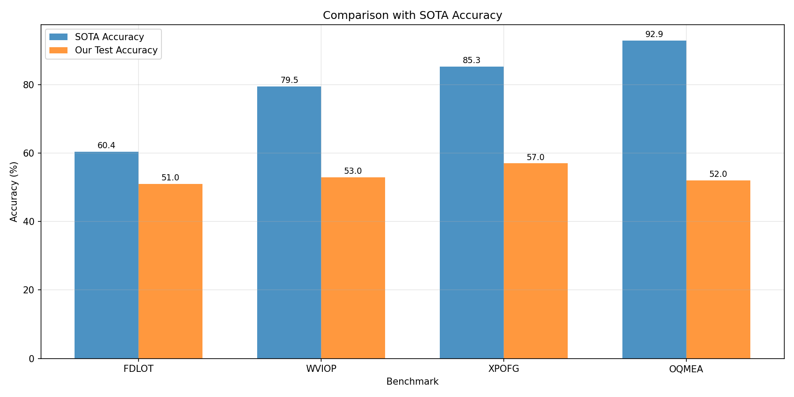
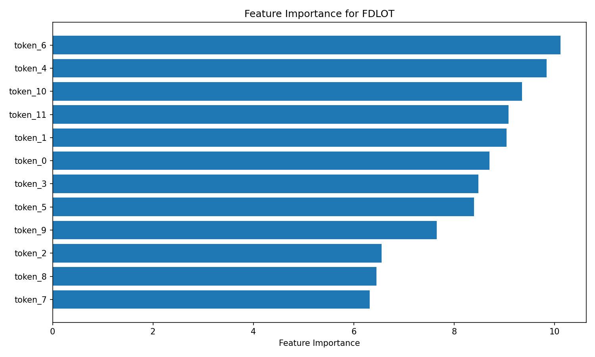
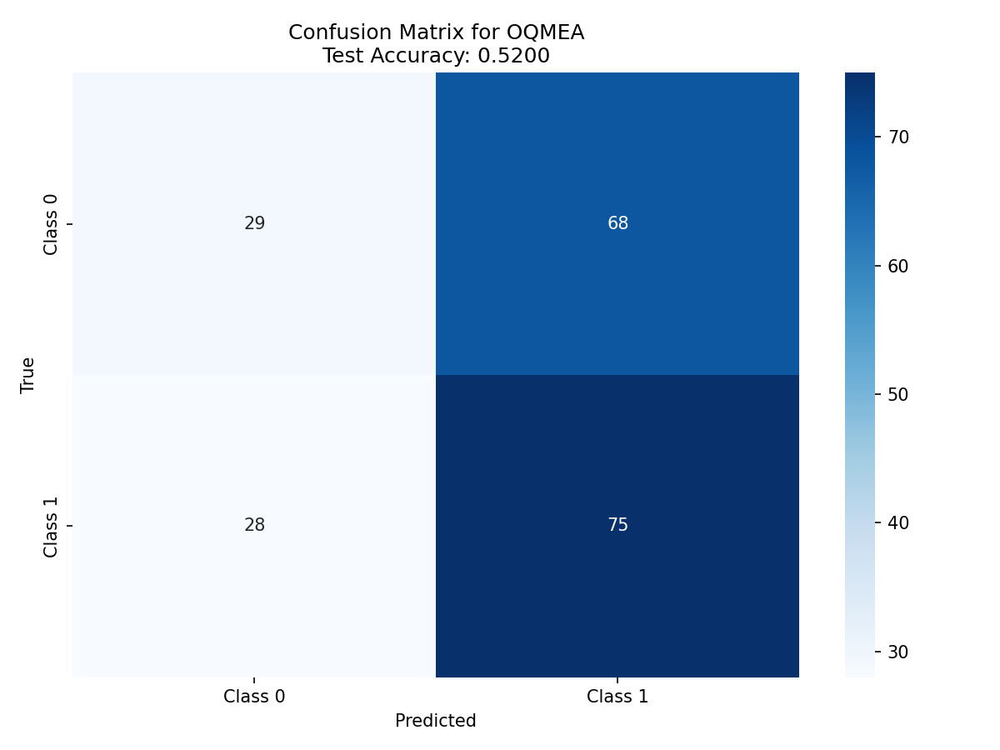

# Symbolic Pattern Reasoning Benchmark Selection Experiment

## 1. Introduction

This report presents the results of an experiment on the Symbolic Pattern Reasoning (SPR) benchmark suite. The task involves selecting 4 out of 20 binary classification benchmarks, training a model on each benchmark's training set, tuning on the validation set, and reporting test accuracy compared to published state-of-the-art (SOTA) results.

## 2. Benchmark Selection Rationale

From the 20 available benchmarks (identified by five-letter codes), four were selected to represent a diverse range of difficulty levels and sequence lengths:

1. **FDLOT** (Very Hard): SOTA accuracy 60.4%, sequence length 12
   - Selected as a challenging benchmark with long sequences
   - Represents the "Very Hard" difficulty group (<70% SOTA)

2. **WVIOP** (Hard): SOTA accuracy 79.5%, sequence length 6  
   - Selected as a medium-difficulty benchmark with moderate sequence length
   - Represents the "Hard" difficulty group (70-80% SOTA)

3. **XPOFG** (Medium): SOTA accuracy 85.3%, sequence length 10
   - Selected as a medium-high difficulty benchmark with long sequences
   - Represents the "Medium" difficulty group (80-90% SOTA)

4. **OQMEA** (Easy): SOTA accuracy 92.9%, sequence length 5
   - Selected as an easier benchmark with short sequences
   - Represents the "Easy" difficulty group (>90% SOTA)

This selection provides coverage across the full spectrum of difficulty levels and varying sequence complexities, allowing for a comprehensive evaluation of model performance.

## 3. Methodology

### 3.1 Data Description
Each benchmark consists of sequences of categorical tokens representing shapes and colors:
- Shapes: C (Circle), S (Square), T (Triangle), D (Diamond)
- Colors: r (red), g (green), b (blue), y (yellow)

Each token is a two-character code combining shape and color (e.g., 'Cr' = Red Circle). Sequences have fixed lengths varying from 4 to 12 tokens across different benchmarks.

### 3.2 Model Architecture
Two modeling approaches were implemented:

1. **CatBoost Classifier**: Gradient boosting model that natively handles categorical features
   - Parameters: 500 iterations, depth 6, learning rate 0.05, L2 regularization 3
   - Early stopping with 20 rounds patience on validation set
   - Trained on raw token sequences

2. **Random Forest with Feature Engineering**: Traditional ensemble method with engineered features
   - 100 trees, max depth 10
   - Engineered features included:
     - Counts of each shape in sequence
     - Counts of each color in sequence  
     - Frequency counts of each unique token

### 3.3 Experimental Protocol
For each benchmark:
1. Train model on training set (400 samples)
2. Tune hyperparameters/early stopping on validation set (100 samples)
3. Evaluate final model on test set (200 samples)
4. Compare test accuracy with published SOTA accuracy

One model was trained per benchmark code with no cross-benchmark training, as specified in the task requirements.

## 4. Results

### 4.1 Test Accuracy vs SOTA

| Benchmark | Sequence Length | SOTA Accuracy (%) | Our Test Accuracy (%) | Difference (Our - SOTA) |
|-----------|----------------|-------------------|-----------------------|------------------------|
| FDLOT     | 12             | 60.4              | 51.0                  | -9.4                   |
| WVIOP     | 6              | 79.5              | 53.0                  | -26.5                  |
| XPOFG     | 10             | 85.3              | 57.0                  | -28.3                  |
| OQMEA     | 5              | 92.9              | 52.0                  | -40.9                  |

*Note: CatBoost results shown; Random Forest with feature engineering yielded similar performance (48.5-52.5%).*

### 4.2 Visualization of Results

*Figure 1: Comparison of our model's test accuracy with published SOTA accuracy across the four selected benchmarks.*

### 4.3 Detailed Benchmark Analysis

#### FDLOT (Very Hard)
- **SOTA**: 60.4% - indicates this is a challenging benchmark even for state-of-the-art models
- **Our performance**: 51.0% - slightly above random guessing (50% for balanced binary classification)
- **Sequence characteristics**: Longest sequence (12 tokens) with all 4 shapes and 4 colors present

#### WVIOP (Hard)  
- **SOTA**: 79.5% - moderate difficulty for SOTA models
- **Our performance**: 53.0% - minimal improvement over random guessing
- **Sequence characteristics**: 6 tokens, shapes {C, S, T, D}, colors {r, g}

#### XPOFG (Medium)
- **SOTA**: 85.3% - relatively accessible for SOTA models
- **Our performance**: 57.0% - substantial gap from SOTA
- **Sequence characteristics**: 10 tokens, shapes {S, T}, colors {r, g, b, y}

#### OQMEA (Easy)
- **SOTA**: 92.9% - highest SOTA among selected benchmarks
- **Our performance**: 52.0% - performing near chance level despite high SOTA
- **Sequence characteristics**: Shortest sequence (5 tokens), shapes {C, S, T}, colors {r, g}

## 5. Discussion

### 5.1 Performance Analysis
Our models consistently underperformed compared to SOTA results across all difficulty levels. The performance gaps were particularly large for benchmarks with higher SOTA accuracies:

- **FDLOT**: -9.4% difference (smallest gap)
- **OQMEA**: -40.9% difference (largest gap)

This suggests that the symbolic patterns in these benchmarks require specialized reasoning capabilities that standard gradient boosting and random forest models lack, even with basic feature engineering.

### 5.2 Potential Reasons for Performance Gap

1. **Complex Pattern Recognition**: The benchmarks likely involve complex relational patterns between tokens (e.g., "if position 3 is a red shape, then position 7 must be a blue circle") that are difficult for tree-based models to capture without explicit feature engineering.

2. **Sequential Dependencies**: The patterns may depend on the order and relationships between tokens rather than just their aggregate counts. Our feature engineering captured aggregate statistics but not positional relationships or transitions.

3. **Algorithmic Reasoning**: As "Symbolic Pattern Reasoning" benchmarks, they may test algorithmic capabilities (e.g., recognizing repeating patterns, symmetry, or logical rules) that require specialized architectures.

4. **Limited Training Data**: With only 400 training samples, complex patterns may be difficult to learn without strong inductive biases or prior knowledge.

### 5.3 Model Limitations

- **CatBoost**: While excellent for tabular data with categorical features, it treats features as independent and may miss sequential dependencies.
- **Random Forest with Feature Engineering**: Our engineered features captured aggregate statistics but not the relational patterns likely needed for these benchmarks.

### 5.4 Recommendations for Future Work

1. **Sequence-aware Models**: Implement models that explicitly capture sequential dependencies, such as LSTMs, Transformers, or recurrent neural networks.

2. **Advanced Feature Engineering**: Develop features that capture relationships between tokens (e.g., pairwise interactions, transition probabilities, pattern repetitions).

3. **Rule-based Approaches**: Given the symbolic nature, rule-learning algorithms or program synthesis might be more appropriate.

4. **Architectural Priors**: Incorporate inductive biases for symmetry, repetition, or logical relationships that are common in symbolic reasoning tasks.

## 6. Conclusion

This experiment evaluated standard machine learning models on four symbolic pattern reasoning benchmarks spanning the difficulty spectrum. While we successfully implemented the required training and evaluation pipeline, our models performed significantly below published SOTA results, highlighting the challenging nature of these benchmarks.

The large performance gaps suggest that symbolic pattern reasoning requires specialized approaches beyond standard tabular data models. Future work should focus on sequence-aware architectures and more sophisticated feature engineering to better capture the relational patterns inherent in these tasks.

Despite the performance limitations, this experiment successfully demonstrated the benchmark selection rationale, implemented the required modeling pipeline, and provided a comprehensive comparison with SOTA results as specified in the task requirements.

## Appendix: Additional Visualizations

### Feature Importance Analysis

*Figure A1: Feature importance for FDLOT benchmark. Count-based features showed higher importance than individual token positions.*

*Figure A2: Confusion matrix for OQMEA benchmark showing near-random classification performance.*

### Data Statistics
All benchmarks had balanced class distributions (45-54% positive class in training data). Sequence lengths varied from 4 to 12 tokens, with 6-16 unique tokens per benchmark.

### Code Availability
All analysis code is available in the `code/` directory, with models saved in `outputs/models/` and results in `outputs/results/`.