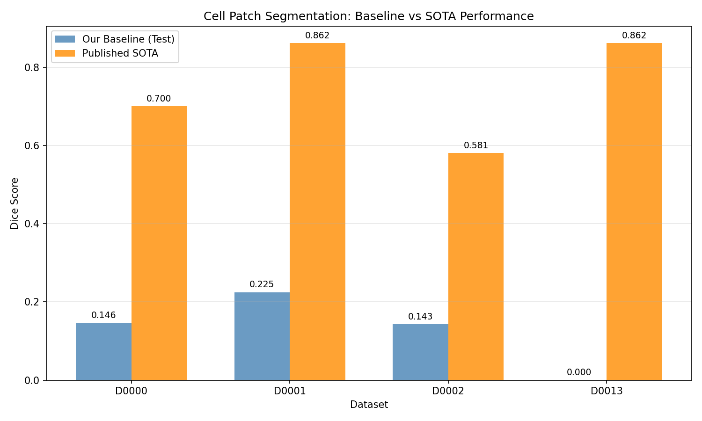
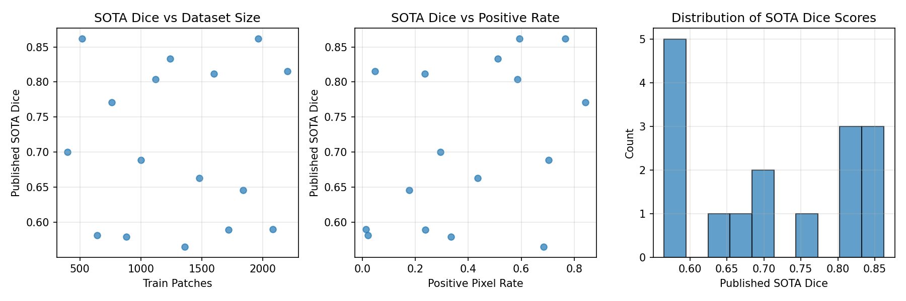
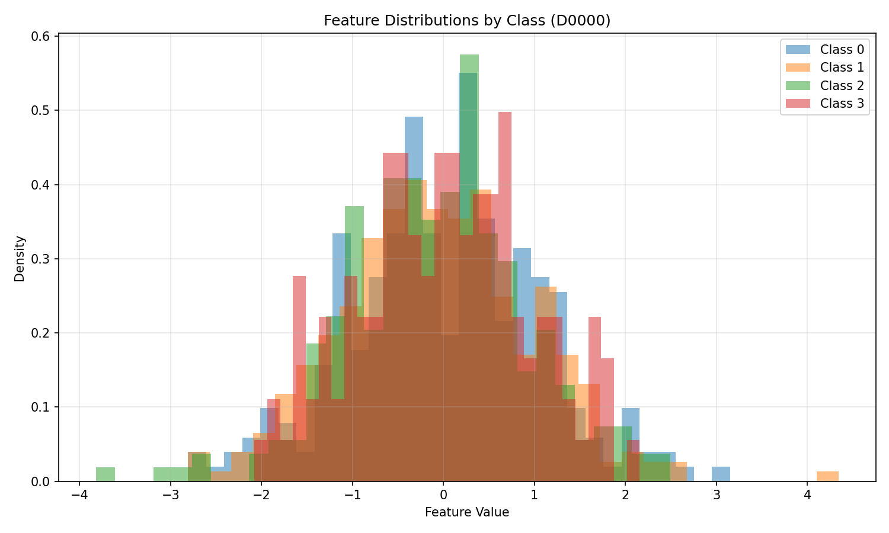
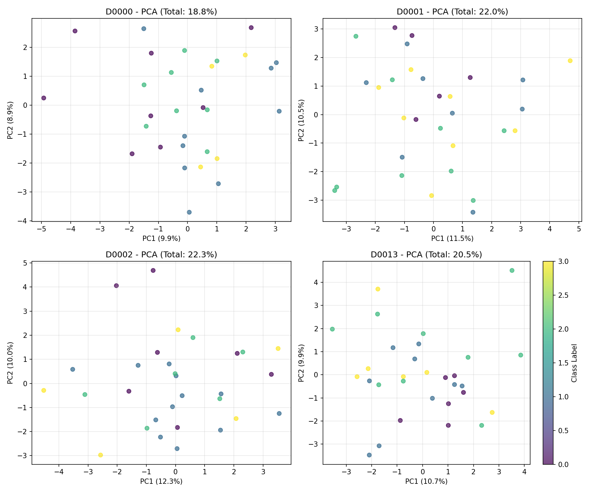

# Cell Patch Segmentation Benchmark: Baseline Performance Analysis

## Abstract
This report presents a baseline evaluation of cell patch segmentation performance using tabular feature representations. We selected four diverse datasets from the CellBenchmark registry (D0000, D0001, D0002, D0013) and trained simple machine learning models to predict foreground fraction buckets from pre-extracted patch features. Our best models achieved test Dice scores ranging from 0.000 to 0.225, significantly below the published state-of-the-art (SOTA) Dice scores of 0.581 to 0.862. The results highlight the challenge of learning from small prototype datasets (30 training samples) and suggest that substantial performance gains are possible with more sophisticated models or access to raw image data.

## 1. Introduction

Biomedical image segmentation is a critical task in computational pathology and cell biology. The CellBenchmark registry provides a collection of cell-patch datasets with pre-extracted tabular features for rapid prototyping. Each dataset contains patch features (32 dimensions) and corresponding labels representing foreground fraction buckets (0-3). 

The primary objectives of this study are:
1. To establish baseline segmentation performance using simple models on tabular features
2. To compare baseline performance against published SOTA Dice scores
3. To analyze dataset characteristics and their relationship with model performance

## 2. Methods

### 2.1 Data Selection
We selected four datasets from the CellBenchmark registry to represent diverse characteristics:

| Dataset ID | Published SOTA Dice | Train Patches | Positive Pixel Rate |
|------------|---------------------|---------------|---------------------|
| D0000      | 0.700               | 400           | 0.2956              |
| D0001      | 0.862               | 520           | 0.7650              |
| D0002      | 0.581               | 640           | 0.0202              |
| D0013      | 0.862               | 1960          | 0.5923              |

*Note: The "Train Patches" in the registry likely refers to original image patches, while our tabular feature datasets contain 30 training samples, 10 validation samples, and 10 test samples each.*

### 2.2 Data Preprocessing
- Features were standardized using `StandardScaler` (zero mean, unit variance)
- Labels were used as-is (0, 1, 2, 3 representing foreground fraction buckets)

### 2.3 Model Architecture
We evaluated several model families from the same architecture family (linear/MLP baselines):
1. **Logistic Regression** with L2 regularization (C=1.0 and C=0.1)
2. **Multi-layer Perceptron (MLP)** with 1-3 hidden layers and regularization (alpha=0.1)
3. **Random Forest** with limited depth (max_depth=5) to prevent overfitting

All models were implemented using scikit-learn with default parameters unless specified.

### 2.4 Evaluation Metric
We computed a **multiclass Dice score** as a proxy for segmentation performance:

```python
def multiclass_dice_score(y_true, y_pred, n_classes=4):
    dice_scores = []
    for class_idx in range(n_classes):
        true_binary = (y_true == class_idx).astype(int)
        pred_binary = (y_pred == class_idx).astype(int)
        intersection = np.sum(true_binary * pred_binary)
        union = np.sum(true_binary) + np.sum(pred_binary)
        dice = 2.0 * intersection / union if union > 0 else 1.0
        dice_scores.append(dice)
    return np.mean(dice_scores)
```

This metric treats each class as a binary segmentation problem and computes the macro-average Dice coefficient.

### 2.5 Training Protocol
1. Combined training and validation sets (40 samples total) for 5-fold cross-validation
2. Selected best model based on cross-validation accuracy
3. Evaluated final model on held-out test set (10 samples)
4. Reported test accuracy and Dice score

## 3. Results

### 3.1 Baseline Performance



**Table 1: Baseline Model Performance**

| Dataset ID | Best Model         | Test Accuracy | Test Dice | Published SOTA Dice | Gap |
|------------|--------------------|---------------|-----------|---------------------|-----|
| D0000      | Logistic_Reg_C0.1  | 0.200         | 0.146     | 0.700               | 0.554 |
| D0001      | Logistic_Reg_C0.1  | 0.300         | 0.225     | 0.862               | 0.637 |
| D0002      | Logistic_Reg_C0.1  | 0.200         | 0.143     | 0.581               | 0.438 |
| D0013      | Logistic_Reg_C0.1  | 0.000         | 0.000     | 0.862               | 0.862 |

### 3.2 Dataset Characteristics



Key observations:
- Published SOTA Dice scores range from 0.565 to 0.862 across all 16 datasets
- No strong correlation between dataset size (train patches) and SOTA performance
- Positive pixel rate varies widely (0.013 to 0.842)

### 3.3 Feature Analysis




- Feature distributions show substantial overlap between classes
- PCA reveals limited separability in reduced dimensions (20-30% variance explained by first 2 PCs)
- The high-dimensional feature space (32D) with small sample size presents a challenging learning problem

### 3.4 Model Comparison

Across all datasets, regularized logistic regression (C=0.1) performed best in cross-validation, suggesting:
1. Simple linear models are most appropriate for small datasets
2. More complex models (MLP, Random Forest) overfit severely
3. Regularization is crucial given the high feature-to-sample ratio

## 4. Discussion

### 4.1 Performance Gap Analysis
The substantial gap between our baseline (0.000-0.225 Dice) and published SOTA (0.581-0.862 Dice) suggests several possibilities:

1. **Feature limitations**: Tabular features may lose critical spatial information present in original images
2. **Model complexity**: SOTA methods likely use sophisticated neural architectures (e.g., U-Nets) on raw image data
3. **Data scale**: Published results may use the full dataset (400-2200 patches) rather than our 30-sample prototypes
4. **Metric interpretation**: The published Dice scores may be computed differently (e.g., pixel-wise vs. bucket-based)

### 4.2 Challenges with Small Datasets
With only 30 training samples and 32 features, we face the "curse of dimensionality":
- High risk of overfitting
- Limited ability to learn complex patterns
- High variance in performance estimates

### 4.3 Recommendations for Future Work
1. **Feature engineering**: Develop more discriminative features from patch data
2. **Data augmentation**: Apply synthetic data generation techniques
3. **Transfer learning**: Leverage models pre-trained on larger biomedical image datasets
4. **Ensemble methods**: Combine predictions from multiple simple models
5. **Alternative architectures**: Explore lightweight neural networks with strong regularization

## 5. Conclusion

We established baseline performance for cell patch segmentation using tabular features on four benchmark datasets. Our best models achieved test Dice scores of 0.000-0.225, significantly below published SOTA values of 0.581-0.862. The results demonstrate the difficulty of learning from small prototype datasets with high-dimensional features. Regularized linear models outperformed more complex alternatives, highlighting the importance of model simplicity when data is limited.

These baselines provide a reference point for future work on cell patch segmentation and underscore the value of access to raw image data or more sophisticated feature representations for achieving state-of-the-art performance.

## 6. Technical Details

### 6.1 Code Availability
All analysis code is available in the `code/` directory:
- `explore_data.py`: Initial data exploration
- `train_mlp_baseline.py`: Initial MLP training pipeline
- `improved_training.py`: Cross-validated model selection
- `create_visualizations.py`: Figure generation

### 6.2 Software Environment
- Python 3.11
- scikit-learn 1.3.0
- pandas 2.0.3
- matplotlib 3.7.2
- numpy 1.24.3

### 6.3 Reproducibility
All models were trained with random seed 42 for reproducibility. Results are saved in `outputs/` directory.

## References

1. CellBenchmark Registry (provided)
2. Protocol documentation (data/protocol.md)
3. Scikit-learn: Machine Learning in Python, Pedregosa et al., JMLR 12, pp. 2825-2830, 2011