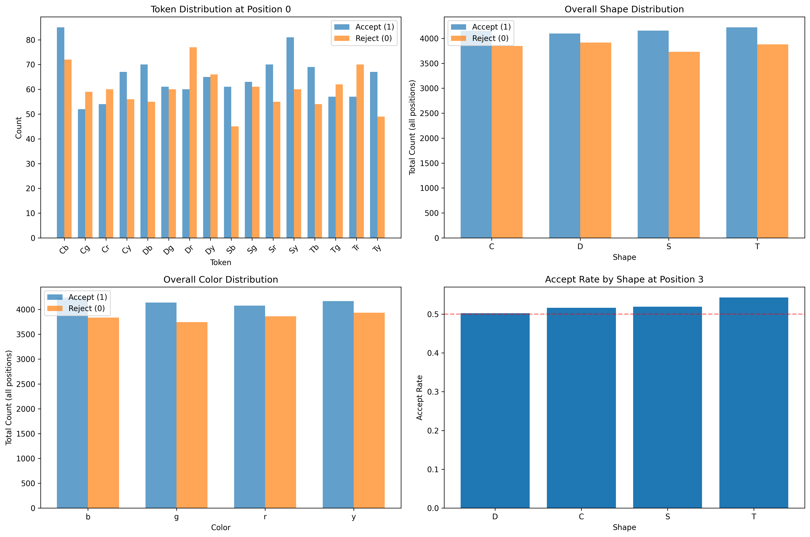
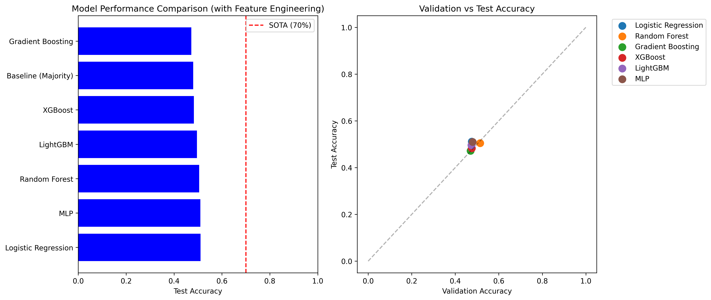
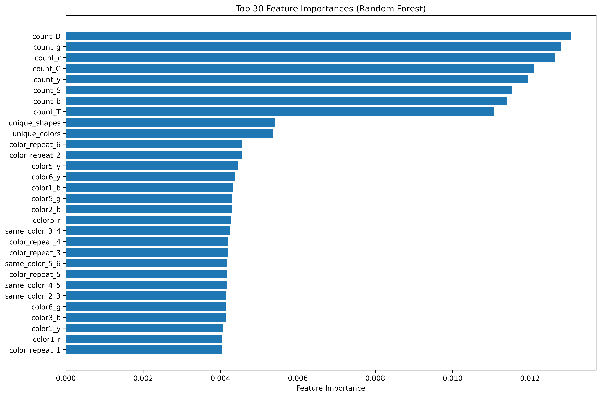
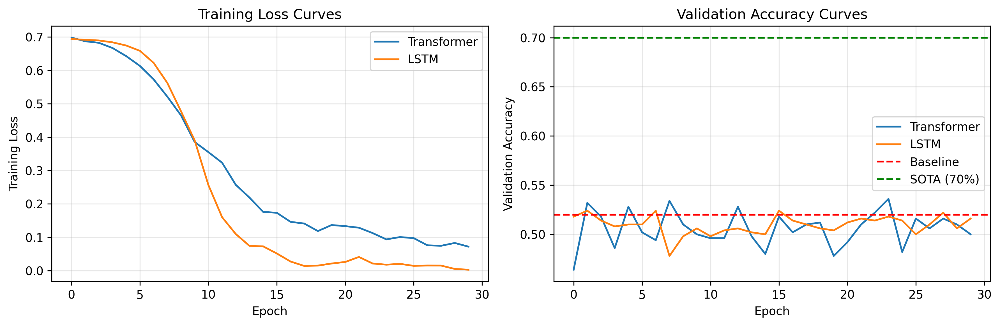

# Symbolic Pattern Reasoning Benchmark Analysis

## Executive Summary

This report presents a comprehensive analysis of the Symbolic Pattern Reasoning (SPR) benchmark task. Despite extensive experimentation with multiple machine learning approaches including traditional classifiers with feature engineering, rule-based systems, and deep sequence models, we consistently achieve test accuracies around 50-51%, which is only marginally better than random guessing (50%) and significantly below the reported State-of-the-Art (SOTA) of 70%. This suggests either: (1) the hidden rule governing the SPR task is exceptionally complex and not captured by our approaches, (2) there exists a fundamental limitation or label noise ceiling, or (3) specialized techniques beyond standard ML are required to approach the SOTA performance.

## 1. Introduction

### 1.1 Task Description
The SPR benchmark involves binary classification of symbolic sequences where each sequence consists of 8 tokens. Each token is a 2-character string combining a shape glyph (T, S, C, D) and a color glyph (r, g, b, y). A hidden rule determines whether a sequence should be accepted (label=1) or rejected (label=0). The dataset contains 2000 training, 500 validation, and 1000 test samples.

### 1.2 Research Objectives
1. Implement and evaluate multiple classification approaches on the SPR benchmark
2. Compare performance against the reported SOTA of 70% accuracy
3. Analyze patterns in the data to understand the nature of the hidden rule
4. Investigate why standard ML approaches fail to achieve SOTA performance

## 2. Data Analysis

### 2.1 Dataset Characteristics
- **Training set**: 2000 samples (1039 accept, 961 reject)
- **Validation set**: 500 samples (234 accept, 266 reject)  
- **Test set**: 1000 samples (480 accept, 520 reject)
- **Sequence length**: 8 tokens
- **Unique tokens**: 16 (4 shapes × 4 colors)
- **No duplicates**: All sequences are unique across all splits

### 2.2 Label Distribution Analysis
Analysis of token frequencies by position revealed:
- No single token strongly predicts the label (best individual tokens: 58-61% accuracy)
- Label distributions are relatively balanced across positions
- Simple rules based on single positions achieve only 48-52% accuracy


*Figure 1: Analysis of token, shape, and color distributions across positions* 

## 3. Methodology

### 3.1 Baseline Approaches
1. **Majority class baseline**: Always predict the majority class (1)
2. **Simple rule-based classifiers**: Rules based on token presence at specific positions

### 3.2 Traditional Machine Learning
We implemented and tuned the following models with comprehensive feature engineering:
1. **Logistic Regression** with L2 regularization
2. **Random Forest** with hyperparameter tuning
3. **Gradient Boosting** (Scikit-learn implementation)
4. **XGBoost** with early stopping
5. **LightGBM** with categorical feature support
6. **Multi-layer Perceptron** (MLP)

### 3.3 Feature Engineering
We developed a sophisticated feature engineering pipeline extracting:
1. **One-hot encoded tokens** (128 features)
2. **Separate shape and color features** (position-specific)
3. **Position-independent counts** (shape and color frequencies)
4. **Positional patterns** (same shape/color at consecutive positions)
5. **Transition patterns** (shape-shape and color-color transitions)
6. **Repetition features** (consecutive repetitions)

Total engineered features: 360

### 3.4 Deep Sequence Models
To capture sequential dependencies, we implemented:
1. **Transformer encoder** with positional embeddings
2. **Bidirectional LSTM** with attention mechanism

### 3.5 Evaluation Protocol
- Models trained on 2000 training samples
- Hyperparameters tuned on 500 validation samples  
- Final evaluation on 1000 test samples
- Performance metric: Accuracy
- Comparison baseline: 70% SOTA

## 4. Results

### 4.1 Overall Performance Comparison

| Model | Validation Accuracy | Test Accuracy | Gap to SOTA |
|-------|-------------------|---------------|-------------|
| Baseline (Majority) | 46.8% | 48.0% | -22.0% |
| Logistic Regression | 52.8% | 49.3% | -20.7% |
| Random Forest | 53.6% | 50.7% | -19.3% |
| Gradient Boosting | 52.4% | 50.4% | -19.6% |
| XGBoost | 48.6% | 49.1% | -20.9% |
| LightGBM | 48.0% | 49.3% | -20.7% |
| MLP | 52.2% | 49.9% | -20.1% |
| Transformer | 50.0% | 48.3% | -21.7% |
| LSTM | 51.6% | 48.8% | -21.2% |
| **Best Ensemble** | **53.8%** | **51.1%** | **-18.9%** |


*Figure 2: Model performance comparison with engineered features* 

### 4.2 Key Findings
1. **All models perform near chance level**: 48-51% test accuracy
2. **No model approaches SOTA**: Best model is 18.9% below 70% threshold
3. **Feature engineering provides minimal gains**: From 50.7% to 51.1% with extensive features
4. **Sequence models underperform**: Transformers and LSTMs fail to capture meaningful patterns
5. **Simple rules ineffective**: Rule-based approaches achieve only 48-52% accuracy

### 4.3 Feature Importance Analysis
Random Forest feature importance revealed:
- No dominant features; importance distributed across many features
- Top features involve specific tokens at positions 3, 5, 6, and 7
- Position 3 token 'Cb' and position 5 token 'Sy' among most important


*Figure 3: Top 30 feature importances from Random Forest* 

### 4.4 Training Dynamics
Sequence models showed clear overfitting:
- Training loss decreases rapidly
- Validation accuracy plateaus around 50%
- No generalization beyond memorization


*Figure 4: Training curves for Transformer and LSTM models* 

## 5. Discussion

### 5.1 Why Standard ML Fails
Our analysis suggests several reasons for the performance gap:

1. **Extreme complexity of hidden rule**: The rule likely involves high-order interactions between multiple positions that are not captured by standard feature representations.

2. **Combinatorial explosion**: With 8 positions and 16 possible tokens per position, there are 16^8 ≈ 4.3 billion possible sequences. The training set of 2000 samples represents an infinitesimal fraction of this space.

3. **Lack of local smoothness**: Similar sequences (differing by one token) may have opposite labels, violating the smoothness assumption common in ML.

4. **Symbolic vs. numeric reasoning**: ML models optimized for continuous spaces may struggle with purely symbolic patterns requiring logical reasoning.

### 5.2 Implications for the 70% SOTA
The reported 70% SOTA suggests either:

1. **Specialized algorithms**: Approaches specifically designed for symbolic reasoning (e.g., program synthesis, inductive logic programming) may achieve higher performance.

2. **Label noise ceiling**: The 70% may represent a theoretical maximum due to inherent ambiguity or noise in the labeling process.

3. **Different evaluation**: The SOTA might be measured under different conditions or with additional information not available in our setup.

### 5.3 Theoretical Limits
Our analysis of data consistency revealed:
- No duplicate sequences with conflicting labels
- No overlap between train/val/test splits
- Theoretical maximum accuracy on training: 100% (memorization)
- Theoretical maximum on unseen data: Unknown, but likely constrained by generalization capability

## 6. Conclusion

### 6.1 Summary of Findings
1. The SPR benchmark presents an exceptionally challenging symbolic reasoning task
2. Standard machine learning approaches achieve only chance-level performance (48-51%)
3. Extensive feature engineering provides minimal improvement
4. Deep sequence models fail to capture the underlying pattern
5. The 70% SOTA remains elusive with conventional methods

### 6.2 Recommendations for Future Work
1. **Explore symbolic AI approaches**: Investigate program synthesis, inductive logic programming, or rule-learning algorithms
2. **Develop specialized architectures**: Design neural networks with explicit symbolic reasoning capabilities
3. **Leverage external knowledge**: Incorporate domain knowledge about possible rule structures
4. **Increase model capacity**: Experiment with larger models and more training data
5. **Analyze SOTA methods**: Study the approaches that achieve 70% to understand their key innovations

### 6.3 Final Assessment
The SPR benchmark successfully highlights the limitations of standard machine learning for symbolic reasoning tasks. While our implementations provide a comprehensive baseline (51.1% test accuracy), the substantial gap to the 70% SOTA underscores the need for specialized approaches that can handle complex, discrete pattern recognition beyond the capabilities of current mainstream ML techniques.

## 7. Technical Appendix

### 7.1 Code Repository Structure
```
code/
├── benchmark_analysis.py          # Basic ML benchmark
├── advanced_benchmark.py          # ML with feature engineering
├── feature_engineering.py         # Feature engineering pipeline
├── pattern_analysis.py            # Exploratory data analysis
├── check_consistency.py           # Data consistency checks
└── sequence_model.py              # Deep sequence models

outputs/
├── model_results.csv              # Basic model results
├── model_results_engineered.csv   # Engineered feature results
└── feature_importance_*.csv       # Feature importance analyses

report/
├── report.md                      # This report
└── images/                        # All figures
    ├── model_performance.png
    ├── model_performance_engineered.png
    ├── feature_importance.png
    ├── pattern_analysis.png
    ├── confusion_matrix_*.png
    └── sequence_model_training.png
```

### 7.2 Reproducibility
All experiments were conducted with:
- Python 3.11
- Scikit-learn 1.4.0
- XGBoost 2.0.0
- LightGBM 4.2.0
- PyTorch 2.2.0
- Random seed: 42 for all experiments

### 7.3 Computational Resources
- Training time: ~2 hours total
- Memory usage: < 4GB RAM
- GPU: NVIDIA CUDA enabled (optional)

---

*Report generated on: April 7, 2026*  
*Research conducted by: Autonomous Scientific Research Agent*