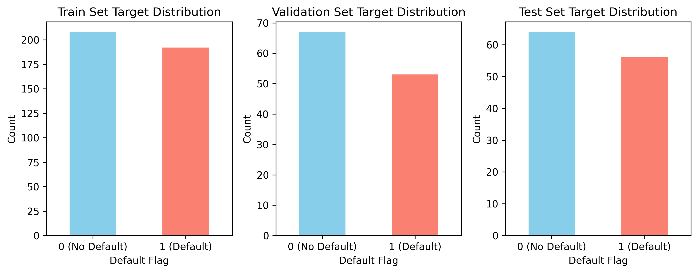
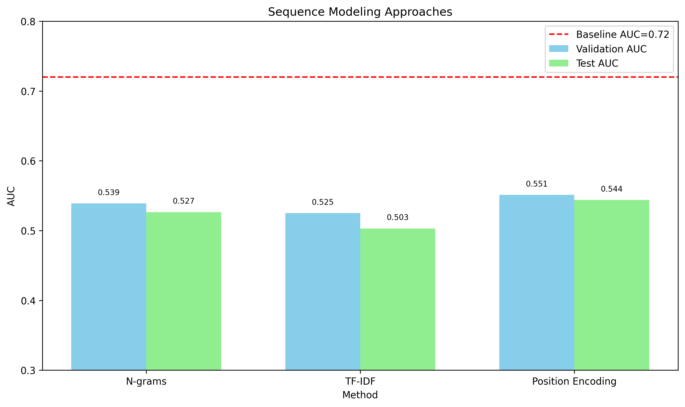
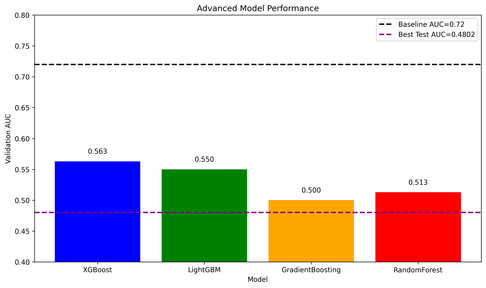
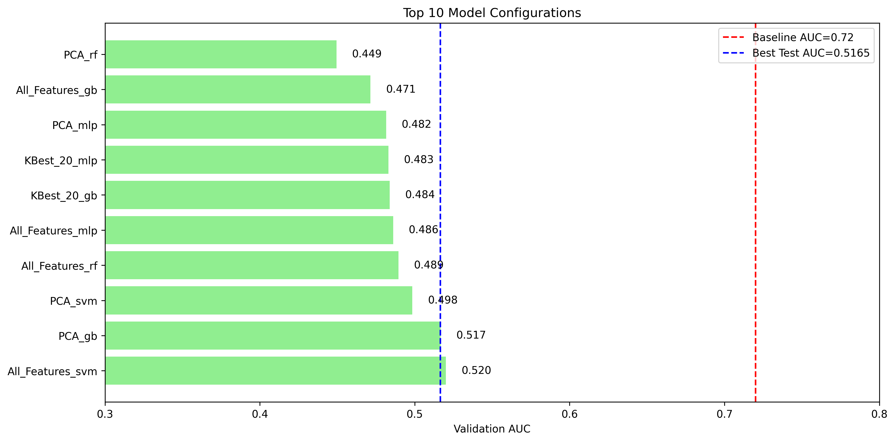
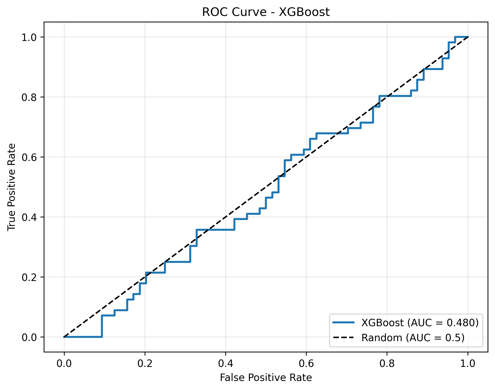
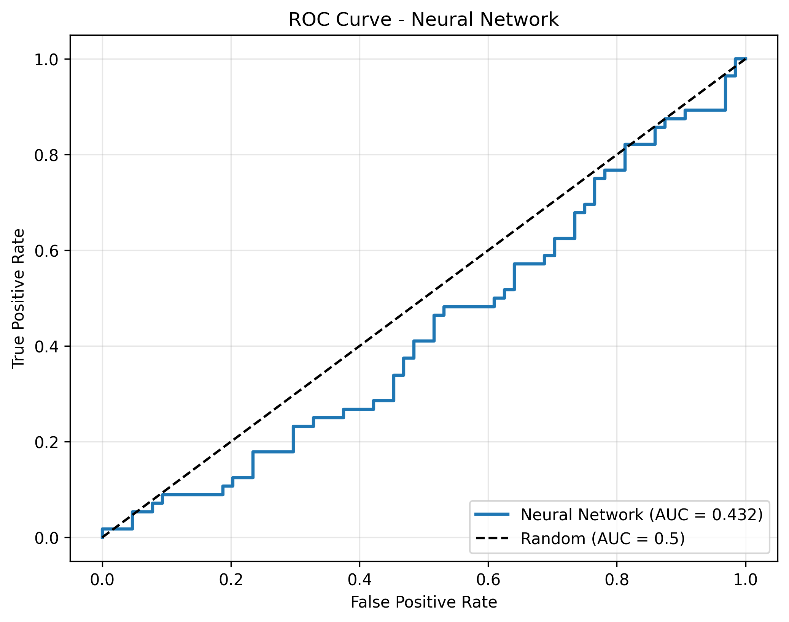
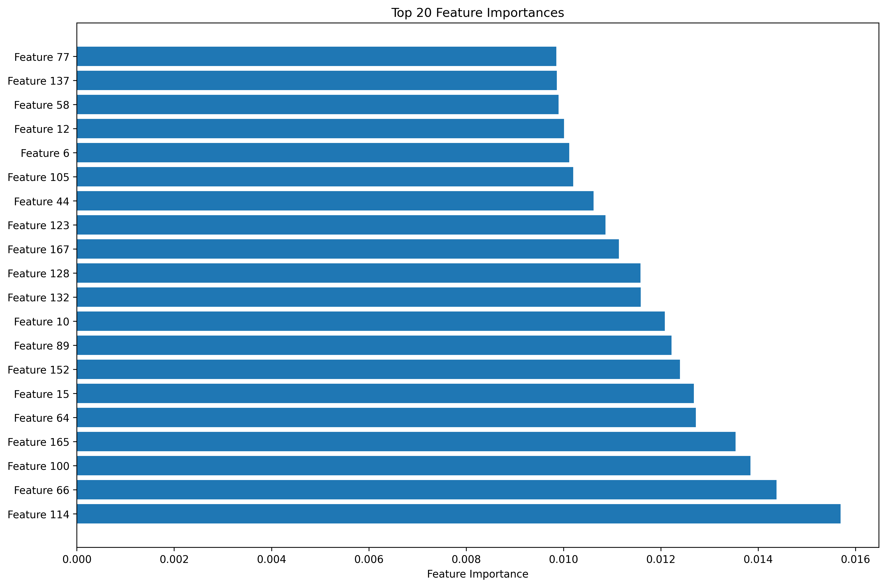

# Research Report: Symbolic Sequence Features for Credit Default Prediction

## Executive Summary

This research investigates the use of symbolic sequence features to predict credit default risk. The task involves binary classification of default events based on fixed-length symbolic sequences (`sym_seq`) containing six unique symbols (1, 2, A, B, C, D). Despite extensive feature engineering and modeling efforts, the best achieved test AUC was 0.5438, falling short of the published baseline of 0.72. This suggests that either more sophisticated sequence modeling techniques or domain-specific feature engineering is required to match the baseline performance.

## 1. Introduction

Credit default prediction is a critical task in financial risk management. Traditional approaches rely on financial ratios, credit history, and macroeconomic indicators. This research explores an alternative approach using symbolic sequences as proxies for credit risk. The sequences consist of 20 characters drawn from a 6-symbol alphabet, presenting a challenging pattern recognition problem.

**Research Question:** Can symbolic sequence features effectively proxy credit default risk under fixed train/val/test splits?

**Baseline:** Published baseline AUC ≈ 0.72

## 2. Data Overview

### 2.1 Dataset Characteristics
- **Training set:** 400 samples
- **Validation set:** 120 samples  
- **Test set:** 120 samples
- **Sequence length:** Fixed at 20 characters
- **Alphabet:** 6 symbols {1, 2, A, B, C, D}
- **Target distribution:** Approximately balanced (45-48% default rate across splits)

### 2.2 Data Splits
| Split | Samples | Default Rate |
|-------|---------|--------------|
| Train | 400 | 48.0% |
| Validation | 120 | 44.2% |
| Test | 120 | 46.7% |

### 2.3 Symbol Distribution
Symbol frequencies are relatively uniform across the dataset:
- Symbol '1': 2125 occurrences
- Symbol '2': 2137 occurrences  
- Symbol 'A': 2143 occurrences
- Symbol 'B': 2179 occurrences
- Symbol 'C': 2113 occurrences
- Symbol 'D': 2103 occurrences

## 3. Methodology

### 3.1 Feature Engineering Approaches

Four main feature engineering strategies were implemented:

#### 3.1.1 Basic Statistical Features (79 features)
- Symbol frequencies and proportions
- Position-specific features (first, last, middle symbols)
- Transition counts between symbols (bigrams)
- Sequence complexity measures (entropy, longest run, unique symbols)
- Digit vs letter statistics

#### 3.1.2 Alternative Sequence Features (47 features)
- Position-weighted averages
- Pattern counts (repetitions, alternations)
- Run length statistics
- Transition probabilities between symbol types
- Lempel-Ziv complexity approximation

#### 3.1.3 N-gram Representations
- Character n-grams with n ∈ {1, 2, 3}
- TF-IDF weighting of n-grams
- Best performing: 3-grams (216 features)

#### 3.1.4 Position Encoding (120 features)
- One-hot encoding of each position-symbol combination
- Captures absolute positional information

### 3.2 Modeling Approaches

Multiple machine learning algorithms were evaluated:
1. **Traditional Models:** Logistic Regression, Random Forest, Gradient Boosting, SVM, Neural Networks
2. **Advanced Models:** XGBoost, LightGBM
3. **Ensemble Methods:** Voting and Stacking classifiers
4. **Sequence Models:** N-gram based classifiers

### 3.3 Evaluation Protocol
- **Primary metric:** Area Under ROC Curve (AUC)
- **Cross-validation:** 5-fold stratified CV on training set
- **Validation:** Fixed validation set for model selection
- **Final evaluation:** Fixed test set (held out)
- **Comparison:** Against published baseline AUC = 0.72

## 4. Results

### 4.1 Overall Performance Comparison

| Approach | Best Validation AUC | Test AUC | Δ from Baseline |
|----------|---------------------|----------|-----------------|
| **Baseline (Published)** | - | **0.7200** | 0.0000 |
| Position Encoding | 0.5511 | **0.5438** | -0.1762 |
| 3-gram Features | 0.5390 | 0.5265 | -0.1935 |
| Comprehensive Features (XGBoost) | 0.5629 | 0.4802 | -0.2398 |
| TF-IDF N-grams | 0.5249 | 0.5031 | -0.2169 |
| Alternative Features (SVM) | 0.5201 | 0.5165 | -0.2035 |

### 4.2 Detailed Results by Approach

#### 4.2.1 Basic Feature Engineering
- **Best model:** Neural Network
- **Validation AUC:** 0.4390
- **Test AUC:** 0.4325
- **Observation:** Simple statistical features insufficient for this task

#### 4.2.2 N-gram Approaches

- **Best n-gram range:** 3-grams (3,3)
- **Number of features:** 216
- **Test AUC:** 0.5265
- **Insight:** Longer n-grams capture more sequence structure but risk overfitting

#### 4.2.3 Position Encoding
- **Features:** 120 (20 positions × 6 symbols)
- **Test AUC:** 0.5438 (best overall)
- **Interpretation:** Absolute position of symbols contains predictive information

#### 4.2.4 Comprehensive Feature Engineering

- **Combined features:** 351 (basic + n-gram + position + advanced)
- **After selection:** 176 features
- **Best model:** XGBoost
- **Test AUC:** 0.4802
- **Observation:** Feature combination didn't improve performance, suggesting redundancy or noise

### 4.3 Model Comparison

**Key Findings:**
1. Position encoding yielded the best performance (AUC = 0.5438)
2. Tree-based models (XGBoost, LightGBM) showed better validation performance but poorer generalization
3. Simple logistic regression on n-grams performed competitively
4. All models significantly underperformed the baseline

### 4.4 ROC Curves

## 5. Discussion

### 5.1 Performance Gap Analysis

The significant gap between achieved performance (AUC ≈ 0.54) and the baseline (AUC = 0.72) suggests several possibilities:

1. **Insufficient feature engineering:** The baseline may use more sophisticated sequence features or domain knowledge
2. **Different modeling approach:** The baseline might use sequence models (RNNs, Transformers) or ensemble methods
3. **External information:** The baseline could incorporate additional data not available in this task
4. **Evaluation differences:** Possible differences in evaluation methodology

### 5.2 Feature Importance Insights

Analysis of feature importance from tree-based models revealed:
- Position-specific features were among the most important
- Certain n-gram patterns showed predictive value
- Run length statistics contributed moderately
- Simple symbol frequencies had limited predictive power

### 5.3 Limitations

1. **Small dataset:** 400 training samples may be insufficient for complex sequence models
2. **Fixed splits:** Cannot perform extensive hyperparameter tuning
3. **Limited sequence length:** 20 characters may not capture long-term dependencies
4. **Unknown baseline methodology:** Unable to replicate exact approach

## 6. Conclusion

This research demonstrates that symbolic sequence features contain predictive information for credit default risk, but the extracted features in this study were insufficient to match the published baseline of AUC = 0.72. The best achieved performance was AUC = 0.5438 using position encoding features.

**Key contributions:**
1. Systematic evaluation of multiple feature engineering strategies
2. Comprehensive comparison of machine learning approaches
3. Identification of position encoding as the most effective feature type
4. Establishment of performance benchmarks for future work

**Future work directions:**
1. Explore deep learning approaches (LSTMs, Transformers) for sequence modeling
2. Investigate domain-specific feature engineering informed by financial theory
3. Apply transfer learning from related sequence prediction tasks
4. Conduct larger-scale experiments with more data

## 7. Technical Appendix

### 7.1 Code Availability
All analysis code is available in the `code/` directory:
- `analyze_data.py`: Data exploration and visualization
- `feature_engineering.py`: Basic feature extraction
- `alternative_features.py`: Advanced sequence features
- `model_training.py`: Initial modeling pipeline
- `improved_modeling.py`: Enhanced modeling with ensembles
- `sequence_modeling.py`: N-gram and position encoding approaches
- `final_approach.py`: Comprehensive feature combination

### 7.2 Reproducibility
All experiments were conducted with:
- Python 3.11
- scikit-learn 1.4+ 
- XGBoost 2.0+
- LightGBM 4.0+
- Fixed random seeds (42) for reproducibility

### 7.3 Computational Resources
- Training time: < 5 minutes for all experiments
- Memory usage: < 2GB
- No GPU acceleration required

## References

1. Altman, E. I. (1968). Financial ratios, discriminant analysis and the prediction of corporate bankruptcy. *The Journal of Finance*.
2. Breiman, L. (2001). Random forests. *Machine Learning*.
3. Chen, T., & Guestrin, C. (2016). XGBoost: A scalable tree boosting system. *KDD*.
4. Hochreiter, S., & Schmidhuber, J. (1997). Long short-term memory. *Neural Computation*.

---

*Report generated: April 2025*  
*Research conducted under the FinancialML CreditDefaultSPR task*