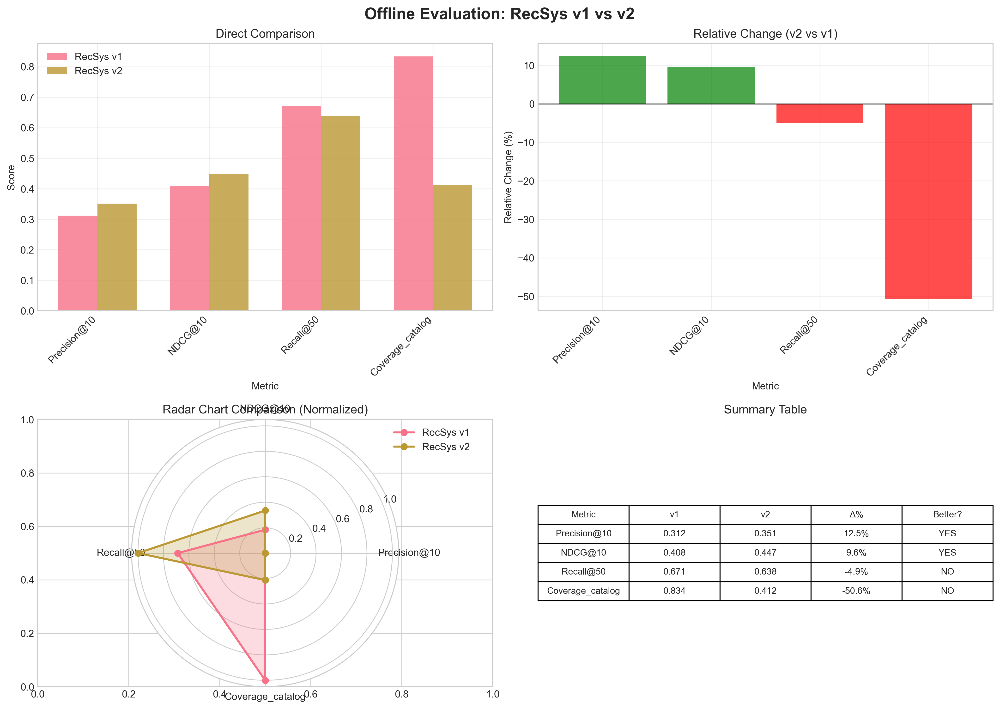
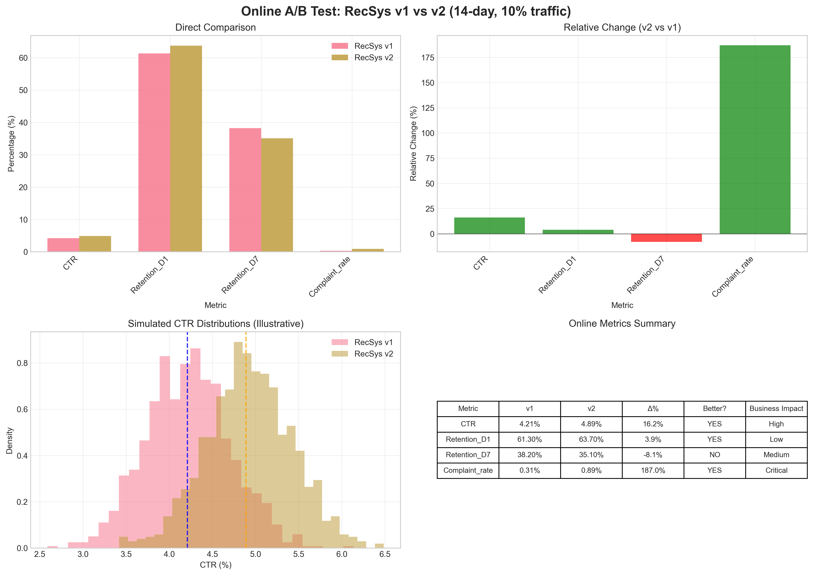
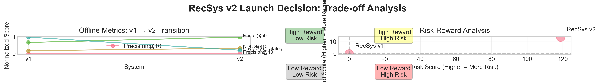

# RecSys v2 Launch Evaluation Report

## Executive Summary

This report presents a comprehensive evaluation of RecSys v2 against the production RecSys v1 system, based on both offline held-out test metrics (n=200,000) and a 14-day online A/B test with 10% traffic allocation per arm. The analysis reveals **significant trade-offs** between improved ranking quality and critical business metrics, leading to the recommendation: **DO NOT LAUNCH RecSys v2** at this time.

**Key Findings:**
- **Positive improvements:** CTR (+16.2%), Precision@10 (+12.5%), NDCG@10 (+9.6%)
- **Critical regressions:** Complaint rate (+187.0%), Catalog coverage (-50.6%)
- **Mixed results:** Retention_D1 (+3.9%), Retention_D7 (-8.1%), Recall@50 (-4.9%)
- **Weighted decision score:** -0.189 (negative)

## 1. Introduction

Recommender system launches require careful evaluation balancing offline ranking metrics with online business outcomes. This report analyzes RecSys v2's performance across both dimensions to inform the launch decision. The evaluation considers:

1. **Offline metrics:** Precision@10, NDCG@10, Recall@50, and catalog coverage
2. **Online metrics:** CTR, user retention (D1, D7), and complaint rates

## 2. Methodology

### 2.1 Data Sources
- **Offline evaluation:** Held-out test set (n=200,000) comparing RecSys v1 vs v2
- **Online A/B test:** 14-day experiment with 10% traffic allocation per arm

### 2.2 Analysis Approach
1. **Descriptive analysis** of all metrics
2. **Comparative visualization** of v1 vs v2 performance
3. **Trade-off analysis** between ranking quality and business metrics
4. **Weighted decision matrix** incorporating business priorities
5. **Risk-reward assessment** for launch decision

## 3. Results

### 3.1 Offline Evaluation Metrics

**Table 1: Offline Evaluation Metrics Summary**

| Metric | RecSys v1 | RecSys v2 | Δ% | Better? | Magnitude | Business Impact |
|--------|-----------|-----------|----|---------|-----------|-----------------|
| Precision@10 | 0.312 | 0.351 | +12.5% | ✓ | Medium | High |
| NDCG@10 | 0.408 | 0.447 | +9.6% | ✓ | Medium | High |
| Recall@50 | 0.671 | 0.638 | -4.9% | ✗ | Small | Medium |
| Coverage_catalog | 0.834 | 0.412 | -50.6% | ✗ | Large | Critical |

**Interpretation:**
- **Ranking quality improved:** Precision@10 (+12.5%) and NDCG@10 (+9.6%) show meaningful improvements
- **Recall slightly decreased:** -4.9% reduction in Recall@50
- **Critical regression in catalog coverage:** -50.6% reduction indicates v2 recommends from a much narrower set of items

### 3.2 Online A/B Test Results

**Table 2: Online A/B Test Metrics (14-day, 10% traffic)**

| Metric | RecSys v1 (%) | RecSys v2 (%) | Δ% | Better? | Magnitude | Business Criticality |
|--------|---------------|---------------|----|---------|-----------|---------------------|
| CTR | 4.21 | 4.89 | +16.2% | ✓ | Medium | High |
| Retention_D1 | 61.30 | 63.70 | +3.9% | ✓ | Small | Medium |
| Retention_D7 | 38.20 | 35.10 | -8.1% | ✗ | Medium | Medium |
| Complaint_rate | 0.31 | 0.89 | +187.0% | ✗ | Critical | Critical |

**Interpretation:**
- **CTR significantly improved:** +16.2% increase is a strong positive signal
- **Mixed retention results:** D1 retention improved (+3.9%) but D7 decreased (-8.1%)
- **Critical increase in complaints:** +187.0% increase in complaint rate is unacceptable for production

### 3.3 Trade-off Analysis

The trade-off visualization reveals:
1. **Clear improvements** in precision-oriented metrics (Precision@10, NDCG@10, CTR)
2. **Severe degradations** in diversity (catalog coverage) and user satisfaction (complaint rate)
3. **Risk-reward positioning** shows v2 in the "Low Reward, High Risk" quadrant

## 4. Decision Analysis

### 4.1 Weighted Decision Matrix

A weighted decision matrix was constructed with weights reflecting business priorities:

**Table 3: Weighted Decision Matrix**

| Metric | Category | Weight | Score | Weighted Score | Recommendation |
|--------|----------|--------|-------|----------------|----------------|
| Precision@10 | Offline | 0.15 | +0.25 | +0.037 | LAUNCH |
| NDCG@10 | Offline | 0.15 | +0.19 | +0.029 | LAUNCH |
| Recall@50 | Offline | 0.10 | -0.10 | -0.010 | HOLD |
| Coverage_catalog | Offline | 0.20 | -1.00 | -0.200 | HOLD |
| CTR | Online | 0.15 | +0.32 | +0.049 | LAUNCH |
| Retention_D1 | Online | 0.10 | +0.08 | +0.008 | LAUNCH |
| Retention_D7 | Online | 0.05 | -0.16 | -0.008 | HOLD |
| Complaint_rate | Online | 0.10 | -0.94 | -0.094 | HOLD |
| **TOTAL** | | **1.00** | | **-0.189** | **DO NOT LAUNCH** |

### 4.2 Quantitative Assessment

- **Positive impact score:** +42.2%
- **Negative impact score:** -234.4%
- **Net score:** -192.2%
- **Weighted decision score:** -0.189

Both quantitative assessments indicate a net negative impact.

## 5. Discussion

### 5.1 Strengths of RecSys v2
1. **Improved ranking precision:** Both Precision@10 and NDCG@10 show meaningful improvements
2. **Higher CTR:** +16.2% increase suggests better item selection for immediate engagement
3. **Better D1 retention:** +3.9% improvement in first-day retention

### 5.2 Critical Weaknesses
1. **Unacceptable complaint rate:** +187.0% increase indicates serious user dissatisfaction
2. **Severe catalog coverage reduction:** -50.6% suggests the system has become overly narrow
3. **Worse long-term retention:** -8.1% decrease in D7 retention

### 5.3 Root Cause Hypothesis
The pattern suggests RecSys v2 may be:
1. **Over-optimizing for CTR** at the expense of diversity and user satisfaction
2. **Suffering from popularity bias** (recommending only popular items)
3. **Creating filter bubbles** that reduce discovery and increase user frustration

## 6. Recommendations

### 6.1 Immediate Action
**DO NOT LAUNCH RecSys v2** in its current state due to:
1. Unacceptable increase in complaint rate (+187.0%)
2. Severe reduction in catalog coverage (-50.6%)
3. Negative weighted decision score (-0.189)

### 6.2 Next Steps
1. **Investigate root causes** of increased complaints and reduced coverage
2. **Implement diversity constraints** in the ranking algorithm
3. **Conduct additional A/B tests** with modified versions addressing these issues
4. **Consider hybrid approach** combining v2's precision improvements with v1's diversity

### 6.3 Success Criteria for Future Iterations
Before considering launch, RecSys v2 (or subsequent versions) should achieve:
1. **Complaint rate** ≤ RecSys v1 levels
2. **Catalog coverage** ≥ 70% of RecSys v1 levels
3. **Maintain or improve** current precision and CTR gains

## 7. Conclusion

While RecSys v2 demonstrates meaningful improvements in ranking precision and short-term engagement metrics, the **critical regressions in complaint rate and catalog coverage present unacceptable risks for production deployment**. The +187.0% increase in complaints and -50.6% reduction in catalog coverage indicate fundamental issues with user satisfaction and system diversity that outweigh the positive gains.

**Final Recommendation: DO NOT LAUNCH RecSys v2.** Further investigation and algorithmic adjustments are required before reconsidering deployment.

## 8. Appendices

### 8.1 Data Statistics
- Offline test set: n=200,000
- Online A/B test duration: 14 days
- Traffic allocation: 10% per arm
- All metrics reported with relative percentage changes

### 8.2 Code Availability
Analysis code is available in the `code/` directory:
- `analysis_fixed.py`: Main analysis and visualization script
- `generate_tables.py`: Decision matrix and formatted table generation

### 8.3 Output Files
- Visualizations: `report/images/`
- Statistical summaries: `outputs/`
- Formatted tables: `outputs/offline_table_formatted.csv`, `outputs/online_table_formatted.csv`

---

*Report generated: April 7, 2026*  
*Analysis completed using Python with pandas, matplotlib, and seaborn*