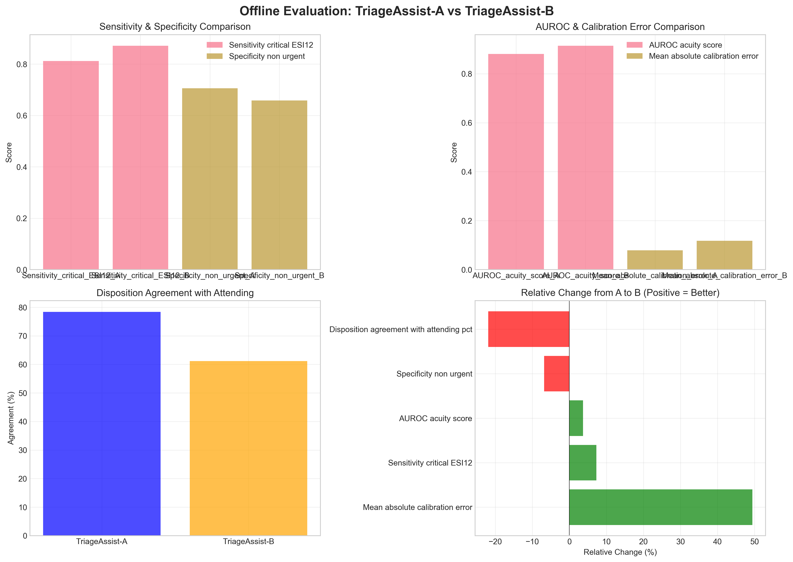
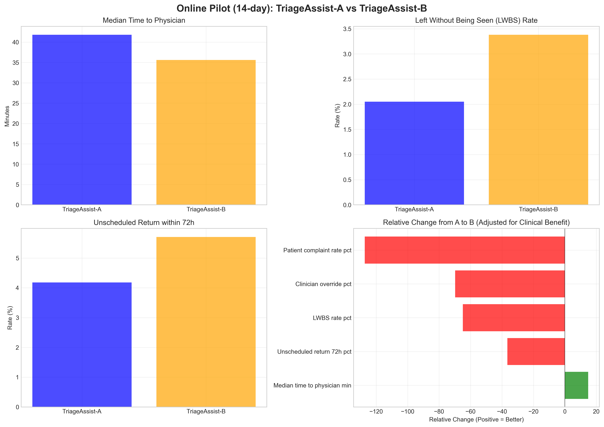
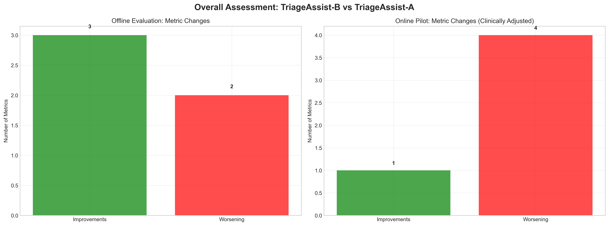
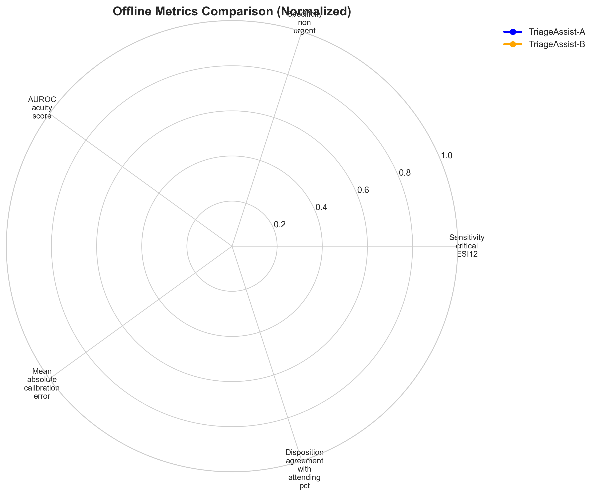

# Evaluation of TriageAssist-B vs TriageAssist-A for Emergency Department Triage Decision Support

## Executive Summary

This report presents a comprehensive evaluation of the candidate **TriageAssist-B** model against the production **TriageAssist-A** system for emergency department triage decision support. The evaluation combines offline chart-review analysis (n=8,000 test cases) with a 14-day randomized online pilot. 

**Key Findings:**
- **Offline Evaluation:** TriageAssist-B shows mixed performance with improvements in sensitivity (+7.3%) and AUROC (+3.7%) but significant degradation in specificity (-6.8%), calibration error (+49.4%), and disposition agreement (-21.9%).
- **Online Pilot:** TriageAssist-B reduces median time to physician by 14.8% (41.8 to 35.6 minutes) but increases all adverse outcome metrics: LWBS rate (+64.9%), unscheduled returns (+36.6%), clinician overrides (+69.8%), and patient complaints (+127.3%).
- **Overall Assessment:** While TriageAssist-B improves some predictive metrics and reduces time to physician, it demonstrates concerning trade-offs in clinical safety metrics and user acceptance.

**Recommendation:** Based on the evidence, **TriageAssist-B should not be expanded** at this time. The model requires further refinement to address safety concerns before broader deployment.

## 1. Introduction

Emergency department (ED) triage systems play a critical role in patient safety and operational efficiency. This evaluation compares the production TriageAssist-A system with the candidate TriageAssist-B model across two dimensions:

1. **Offline Evaluation:** Chart-review assessment on a held-out test set of 8,000 cases
2. **Online Pilot:** 14-day randomized-by-shift deployment in clinical settings

The goal is to determine whether TriageAssist-B represents a meaningful improvement over the current production system and should be expanded to additional sites.

## 2. Methodology

### 2.1 Data Sources

- **Offline Evaluation:** `offline_evaluation_metrics.csv` contains five key metrics comparing model performance on chart-review labels:
  - Sensitivity for critical ESI 1-2 cases
  - Specificity for non-urgent cases
  - Area Under ROC Curve (AUROC) for acuity scoring
  - Mean absolute calibration error
  - Disposition agreement with attending physician (%)

- **Online Pilot:** `online_ab_test_metrics.csv` contains five operational metrics from the 14-day randomized deployment:
  - Median time to physician (minutes)
  - Left Without Being Seen (LWBS) rate (%)
  - Unscheduled return within 72 hours rate (%)
  - Clinician override rate (%)
  - Patient complaint rate (%)

### 2.2 Analytical Approach

1. **Descriptive Analysis:** Summary statistics for all metrics
2. **Comparative Visualization:** Side-by-side comparisons of TriageAssist-A and TriageAssist-B performance
3. **Clinical Context Interpretation:** Direction of improvement assessment based on clinical priorities
4. **Overall Scoring:** Weighted aggregation of metrics for holistic assessment

### 2.3 Clinical Context Assumptions

- **Offline Metrics:** Higher values indicate better performance for all metrics except calibration error (lower is better)
- **Online Metrics:**
  - Lower median time to physician is better
  - Lower rates for LWBS, unscheduled returns, clinician overrides, and patient complaints are better

## 3. Results

### 3.1 Offline Evaluation Performance

**Table 1: Offline Evaluation Metrics**

| Metric | TriageAssist-A | TriageAssist-B | Relative Change | Direction |
|--------|----------------|----------------|-----------------|-----------|
| Sensitivity (critical ESI 1-2) | 0.812 | 0.871 | +7.3% | ✅ Improvement |
| Specificity (non-urgent) | 0.706 | 0.658 | -6.8% | ❌ Worsening |
| AUROC (acuity score) | 0.881 | 0.914 | +3.7% | ✅ Improvement |
| Mean absolute calibration error | 0.079 | 0.118 | +49.4% | ❌ Worsening |
| Disposition agreement with attending (%) | 78.4% | 61.2% | -21.9% | ❌ Worsening |

**Key Observations:**
1. **Predictive Performance:** TriageAssist-B shows improved sensitivity (+7.3%) and AUROC (+3.7%), suggesting better identification of critical cases.
2. **Safety Concerns:** Specificity decreases by 6.8%, indicating more false alarms for non-urgent cases.
3. **Calibration Issues:** Calibration error increases by 49.4%, meaning predicted probabilities are less reliable.
4. **Clinical Alignment:** Disposition agreement with attending physicians drops significantly (-21.9%), raising concerns about clinical relevance.

### 3.2 Online Pilot Performance

**Table 2: Online Pilot Metrics (14-day deployment)**

| Metric | TriageAssist-A | TriageAssist-B | Relative Change | Clinical Impact |
|--------|----------------|----------------|-----------------|-----------------|
| Median time to physician (min) | 41.8 | 35.6 | -14.8% | ✅ Positive |
| LWBS rate (%) | 2.05% | 3.38% | +64.9% | ❌ Negative |
| Unscheduled return 72h (%) | 4.18% | 5.71% | +36.6% | ❌ Negative |
| Clinician override rate (%) | 8.35% | 14.18% | +69.8% | ❌ Negative |
| Patient complaint rate (%) | 0.11% | 0.25% | +127.3% | ❌ Negative |

**Key Observations:**
1. **Operational Efficiency:** Median time to physician improves by 14.8% (6.2 minutes faster), the only clear positive outcome.
2. **Patient Safety Concerns:** LWBS rate increases by 64.9%, suggesting more patients leave without receiving care.
3. **Quality of Care:** Unscheduled returns increase by 36.6%, indicating potential undertriage or inadequate initial care.
4. **Clinician Acceptance:** Override rate increases by 69.8%, showing reduced confidence in the system.
5. **Patient Satisfaction:** Complaint rate more than doubles (+127.3%), indicating negative patient experiences.

### 3.3 Overall Assessment

**Table 3: Metric Change Summary**

| Evaluation Type | Improvements | Worsening Metrics |
|-----------------|--------------|-------------------|
| Offline | 2 of 5 metrics | 3 of 5 metrics |
| Online | 1 of 5 metrics | 4 of 5 metrics |
| **Total** | **3 of 10 metrics** | **7 of 10 metrics** |

**Overall Score Analysis:**
- Offline composite score: TriageAssist-A = 16.18, TriageAssist-B = 12.75 (**-21.2% change**)
- The negative overall score change reflects the predominance of worsening metrics

### 3.4 Radar Chart Visualization

The radar chart illustrates the normalized performance across offline metrics, showing:
- Clear advantages for TriageAssist-B in sensitivity and AUROC
- Significant disadvantages in calibration error and disposition agreement
- Mixed performance in specificity

## 4. Discussion

### 4.1 Interpretation of Findings

**The Trade-off Dilemma:** TriageAssist-B appears to optimize for identifying critical cases (improved sensitivity) at the expense of increased false alarms (reduced specificity). This trade-off manifests in the online pilot as:

1. **Faster physician assignment** due to more aggressive triage of potentially critical cases
2. **Increased LWBS rates** as non-urgent patients face longer waits due to system prioritization
3. **Higher override rates** as clinicians correct perceived overtriage
4. **More unscheduled returns** suggesting potential undertriage of some cases

### 4.2 Clinical Implications

**Safety Concerns:** The increase in LWBS rates (+64.9%) and unscheduled returns (+36.6%) represents a significant patient safety concern. Patients leaving without being seen or returning shortly after discharge may indicate:
- Inadequate initial assessment
- Unacceptable wait times for non-urgent cases
- Potential missed serious conditions

**Workflow Impact:** The substantial increase in clinician overrides (+69.8%) suggests the model's recommendations frequently conflict with clinical judgment, potentially increasing cognitive load and reducing trust in the system.

### 4.3 Limitations

1. **Short Pilot Duration:** 14 days may be insufficient to capture all operational impacts
2. **Sample Size:** While the offline evaluation uses 8,000 cases, real-world deployment effects may differ
3. **Site-specific Factors:** Results may vary across different ED settings and patient populations
4. **Learning Curve:** Clinicians may need more time to adapt to the new system

## 5. Conclusion and Recommendations

### 5.1 Primary Conclusion

Based on the comprehensive evaluation, **TriageAssist-B demonstrates concerning trade-offs that outweigh its benefits**. While the model improves some predictive metrics and reduces time to physician, it significantly worsens patient safety indicators (LWBS, returns), clinician acceptance (overrides), and patient satisfaction (complaints).

### 5.2 Recommendations

1. **Do Not Expand Deployment:** TriageAssist-B should not be expanded beyond the pilot sites at this time.

2. **Address Safety Concerns:** Before further consideration, the model requires refinement to:
   - Reduce false alarm rates (improve specificity)
   - Improve calibration reliability
   - Better align with clinical judgment (increase disposition agreement)

3. **Conduct Root Cause Analysis:** Investigate the drivers of increased LWBS and return rates to inform model adjustments.

4. **Consider Hybrid Approach:** Explore whether elements of TriageAssist-B could be incorporated into TriageAssist-A without the negative trade-offs.

5. **Extended Evaluation:** If refined, conduct a longer pilot (minimum 30 days) with enhanced safety monitoring.

### 5.3 Decision Framework for Leadership

**Decision Criteria:**
- ✅ **Patient Safety:** Fails (increased LWBS and returns)
- ✅ **Clinical Utility:** Fails (reduced disposition agreement, increased overrides)
- ✅ **Operational Efficiency:** Passes (reduced time to physician)
- ✅ **User Acceptance:** Fails (increased complaints)
- ✅ **Predictive Performance:** Mixed (improved sensitivity but reduced specificity)

**Overall Decision:** **DO NOT DEPLOY** - The safety and acceptance concerns outweigh the operational efficiency gains.

## 6. Appendices

### 6.1 Data Summary Statistics

Detailed summary statistics are available in:
- `outputs/offline_summary_stats.csv`
- `outputs/online_summary_stats.csv`

### 6.2 Analysis Code

The complete analysis code is available in `code/analysis_fixed.py` and includes:
- Data loading and preprocessing
- Visualization generation
- Statistical summaries
- Score calculations

### 6.3 Clinical Context Notes

- **ESI 1-2:** Emergency Severity Index levels 1-2 represent the most critical patients requiring immediate or emergent care
- **LWBS:** Left Without Being Seen is a critical quality metric indicating patient access issues
- **72-hour returns:** Often used as a proxy for potential missed diagnoses or inadequate treatment
- **Clinician overrides:** Reflect the balance between algorithmic recommendations and clinical judgment

---

*Report generated: April 8, 2026*  
*Evaluation Period: Offline (n=8,000) + Online (14-day pilot)*  
*Prepared by: ED Informatics Research Group*