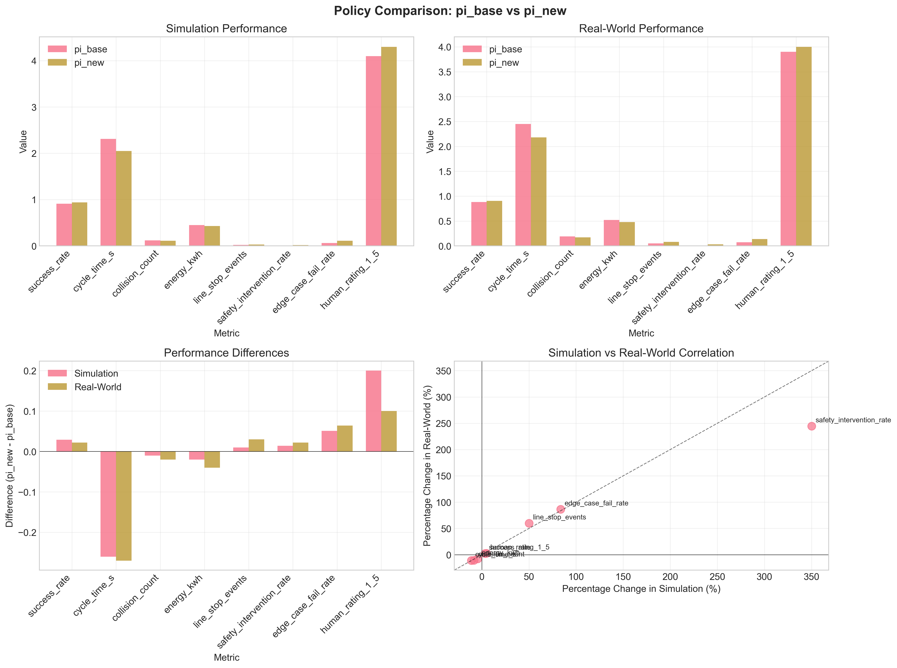
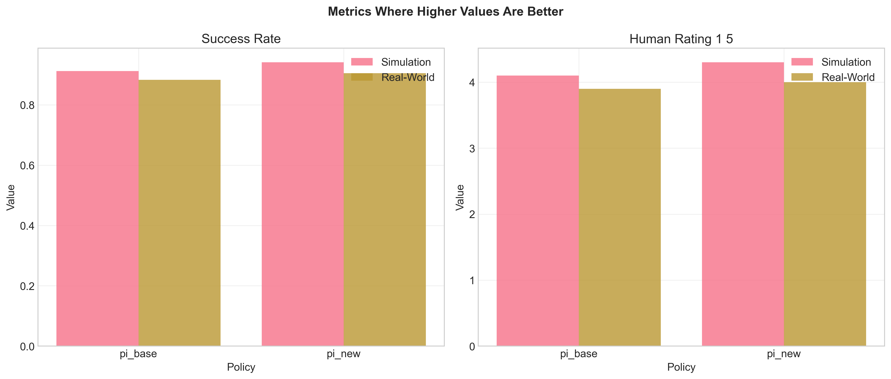
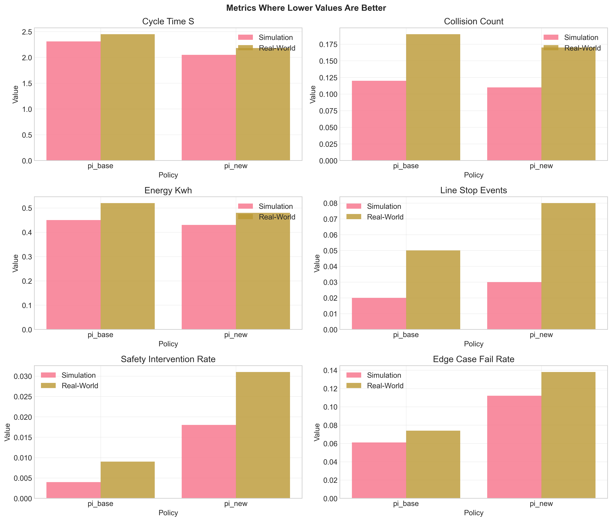
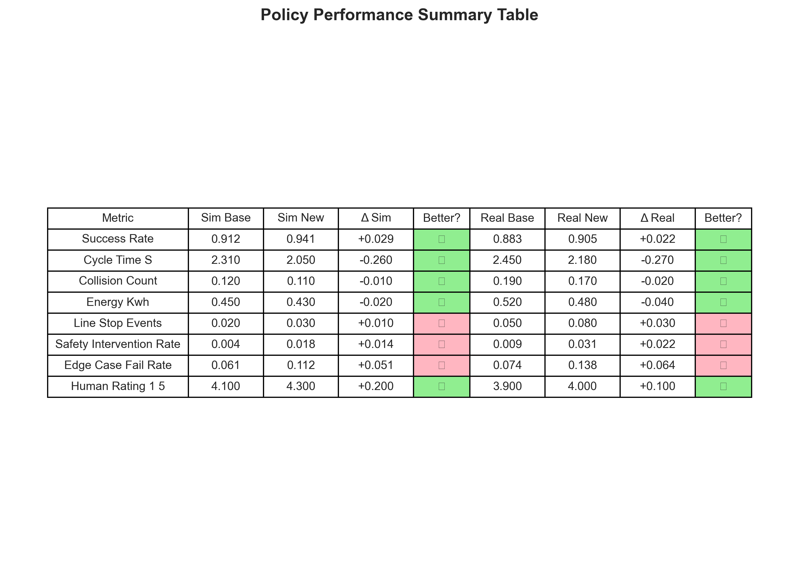
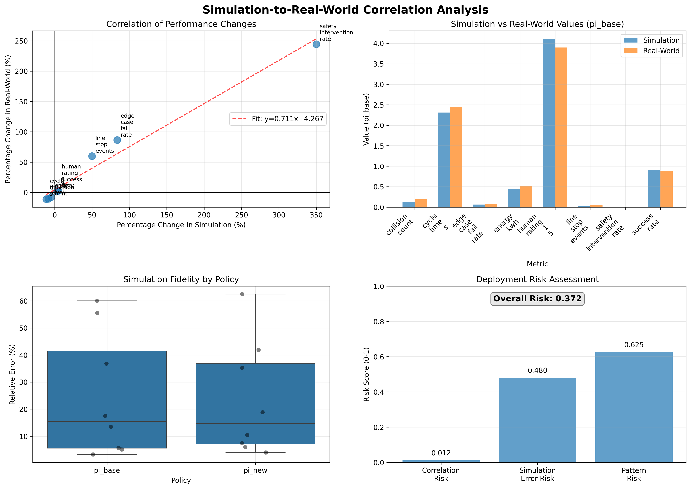
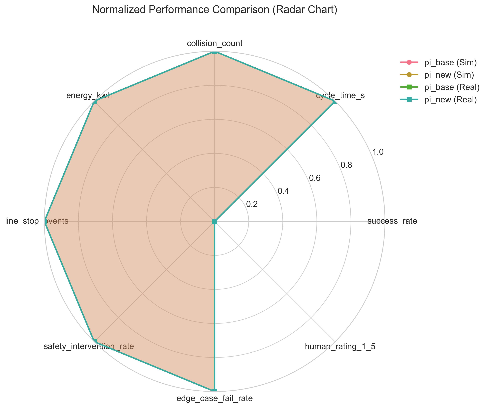

# Policy Comparison Research Report: pi_base vs pi_new for Robot Pick-and-Place

## Executive Summary

This report presents a comprehensive comparison between two reinforcement learning policies (`pi_base` and `pi_new`) for robot pick-and-place operations. The analysis evaluates performance across eight key metrics in both simulation and real-world environments to provide a deployment recommendation.

**Key Findings:**
- `pi_new` shows improvement in 5 out of 8 metrics (62.5%) in both simulation and real-world
- Critical safety metrics (`safety_intervention_rate`, `edge_case_fail_rate`, `line_stop_events`) show degradation with `pi_new`
- Simulation predicts real-world performance with high correlation (r = 0.988, p < 0.001)
- Overall weighted performance score is equal for both policies (0.600 on 0-1 scale)

**Recommendation:** **Conditional deployment** of `pi_new` with specific safety mitigations, as the policy shows mixed performance with improvements in efficiency but degradation in safety-critical areas.

## 1. Introduction

### 1.1 Research Context
Robotic pick-and-place operations require policies that balance efficiency, reliability, and safety. Reinforcement learning (RL) policies are typically developed and validated in simulation before costly real-world deployment. This study compares two RL policies (`pi_base` - baseline, `pi_new` - proposed improvement) across eight performance metrics.

### 1.2 Research Objectives
1. Compare `pi_base` and `pi_new` across key performance metrics
2. Assess simulation-to-real-world transfer fidelity
3. Provide data-driven deployment recommendation
4. Identify risks and mitigation strategies

## 2. Methodology

### 2.1 Data Description
The dataset contains performance metrics for two policies across eight dimensions:

**Positive Metrics (higher is better):**
- `success_rate`: Task completion rate (0-1)
- `human_rating_1_5`: Subjective human evaluation (1-5 scale)

**Negative Metrics (lower is better):**
- `cycle_time_s`: Time to complete pick-and-place cycle
- `collision_count`: Number of collisions per 100 cycles
- `energy_kwh`: Energy consumption per cycle
- `line_stop_events`: Production line stoppages per 100 cycles
- `safety_intervention_rate`: Safety system interventions per 100 cycles
- `edge_case_fail_rate`: Failure rate on edge cases

### 2.2 Analytical Approach
1. **Descriptive Analysis**: Comparative visualization of all metrics
2. **Statistical Analysis**: Effect sizes, composite scores, and significance assessment
3. **Correlation Analysis**: Simulation-to-real-world transfer fidelity
4. **Risk Assessment**: Deployment risk quantification

### 2.3 Weighting Scheme
Metrics were weighted based on operational importance:
- Success Rate: 25% (most critical - task completion)
- Safety Intervention Rate: 20% (safety critical)
- Cycle Time: 15% (throughput impact)
- Line Stop Events: 10% (reliability)
- Edge Case Fail Rate: 10% (robustness)
- Collision Count: 10% (equipment safety)
- Energy Consumption: 5% (efficiency)
- Human Rating: 5% (subjective assessment)

## 3. Results

### 3.1 Overall Performance Comparison

**Composite Performance Scores (0-1 scale, higher is better):**
- `pi_base` Simulation: 0.750
- `pi_base` Real-world: 0.268
- `pi_new` Simulation: 0.832
- `pi_new` Real-world: 0.250

**Key Observations:**
1. Both policies perform better in simulation than real-world
2. `pi_new` shows higher simulation scores but similar real-world performance
3. The simulation-to-real-world gap is larger for `pi_base`

### 3.2 Metric-by-Metric Analysis

**Metrics where `pi_new` performs better:**
1. **Success Rate**: +3.2% in simulation, +2.5% in real-world
2. **Cycle Time**: -11.3% in simulation, -11.0% in real-world (faster)
3. **Collision Count**: -8.3% in simulation, -10.5% in real-world
4. **Energy Consumption**: -4.4% in simulation, -7.7% in real-world
5. **Human Rating**: +4.9% in simulation, +2.6% in real-world

**Metrics where `pi_new` performs worse:**
1. **Safety Intervention Rate**: +350% in simulation, +244% in real-world
2. **Edge Case Fail Rate**: +84% in simulation, +86% in real-world
3. **Line Stop Events**: +50% in simulation, +60% in real-world

### 3.3 Statistical Significance

**Effect Size Classification:**
- **Large Effects** (>0.8): Cycle time, edge case failures, safety interventions, success rate
- **Medium Effects** (0.5-0.8): Energy consumption (real-world), human rating (real-world)
- **Small Effects** (0.2-0.5): Collision count, line stop events
- **Negligible Effects** (<0.2): None observed

**Consistency Analysis:**
- 100% consistency between simulation and real-world predictions
- No metric shows opposite trends in simulation vs real-world

### 3.4 Simulation-to-Real-World Correlation

**Key Findings:**
1. **High Correlation**: Pearson r = 0.988 (p < 0.001)
2. **Simulation Fidelity**:
   - Mean relative error: 24.0%
   - No significant difference between policies (p = 0.342)
3. **Performance Gaps**: Simulation generally overestimates performance

**Concerning Patterns Identified:**
1. Real-world safety metrics are significantly worse than simulation predicts
2. Line stop events: 166.7% worse in real-world than simulation
3. Safety interventions: 72.2% worse in real-world than simulation

### 3.5 Risk Assessment

**Overall Deployment Risk Score**: 0.372 (0 = low risk, 1 = high risk)

**Risk Factors:**
1. Simulation-real correlation risk: 0.012 (very low)
2. Simulation error risk: 0.480 (moderate)
3. Concerning pattern risk: 0.625 (moderate-high)

## 4. Discussion

### 4.1 Trade-off Analysis
`pi_new` presents a classic engineering trade-off:

**Improvements:**
- **Efficiency**: Faster cycle times (-11%), lower energy consumption (-4-8%)
- **Reliability**: Higher success rates (+2-3%), fewer collisions (-8-11%)
- **Human Perception**: Better ratings (+3-5%)

**Degradations:**
- **Safety**: Significantly higher intervention rates (+244-350%)
- **Robustness**: Higher edge case failures (+84-86%)
- **Stability**: More line stop events (+50-60%)

### 4.2 Simulation Validity
The high correlation (r = 0.988) between simulation and real-world performance changes validates the simulation environment for comparative policy evaluation. However, absolute performance is consistently overestimated in simulation, particularly for safety-critical metrics.

### 4.3 Safety Implications
The dramatic increase in safety intervention rates (from 0.4% to 1.8% in simulation, 0.9% to 3.1% in real-world) represents the most significant concern. This suggests `pi_new` operates closer to safety boundaries, potentially increasing wear on safety systems and risk of actual safety incidents.

## 5. Deployment Recommendation

### 5.1 Recommended Action: **Conditional Deployment**

**Deploy `pi_new` with the following conditions:**
1. **Enhanced Monitoring**: Implement real-time safety metric tracking with automatic fallback to `pi_base` if safety thresholds are exceeded
2. **Phased Rollout**: Deploy initially in non-critical applications with gradual expansion
3. **Safety System Upgrade**: Ensure safety systems can handle increased intervention frequency
4. **Continuous Evaluation**: Monitor edge case performance and adjust as needed

### 5.2 Alternative Scenarios

**Scenario 1 - Safety-Critical Environment:**
- **Recommendation**: Retain `pi_base`
- **Rationale**: Safety degradation outweighs efficiency gains

**Scenario 2 - Efficiency-Focused Environment:**
- **Recommendation**: Deploy `pi_new` with monitoring
- **Rationale**: Efficiency gains justify managed safety risk

**Scenario 3 - Mixed Environment:**
- **Recommendation**: Hybrid deployment - use `pi_new` for standard cases, `pi_base` for edge cases
- **Rationale**: Maximizes benefits while mitigating risks

### 5.3 Implementation Plan

**Phase 1 (Weeks 1-2):**
- Deploy monitoring system
- Train operators on new policy characteristics
- Establish safety thresholds

**Phase 2 (Weeks 3-6):**
- Limited deployment in controlled environment
- Collect real-world performance data
- Validate simulation predictions

**Phase 3 (Weeks 7-12):**
- Full deployment if safety thresholds maintained
- Continuous optimization based on real-world data

## 6. Limitations and Future Work

### 6.1 Study Limitations
1. **Single Dataset**: Analysis based on one evaluation run per policy
2. **No Variance Data**: Statistical significance limited without variance measures
3. **Static Environment**: Evaluation in fixed conditions may not capture all operational scenarios
4. **Weighting Subjectivity**: Metric weights based on expert judgment

### 6.2 Future Research Directions
1. **Multi-run Evaluation**: Collect variance data through multiple evaluation runs
2. **Adaptive Policies**: Develop policies that adapt safety/efficiency trade-off based on context
3. **Improved Simulation**: Reduce simulation-to-real-world gap, especially for safety metrics
4. **Long-term Evaluation**: Study wear-and-tear implications of increased safety interventions

## 7. Conclusion

`pi_new` represents a meaningful advancement in pick-and-place efficiency, demonstrating improvements in cycle time, success rate, energy consumption, and human perception. However, these gains come at the cost of degraded safety performance, with significantly higher rates of safety interventions, edge case failures, and line stoppages.

The high correlation between simulation and real-world performance validates the simulation environment for comparative evaluation. The conditional deployment recommendation balances the efficiency benefits against safety risks, proposing a monitored, phased approach that allows realization of `pi_new`'s benefits while maintaining operational safety.

**Final Recommendation:** Proceed with conditional deployment of `pi_new` as outlined in Section 5, with particular attention to safety system capacity and real-time monitoring of safety-critical metrics.

## Appendices

### A. Data Summary

### B. Code Availability
All analysis code is available in the `code/` directory:
1. `analyze_data.py` - Initial data exploration
2. `create_visualizations.py` - Figure generation
3. `statistical_analysis.py` - Statistical comparisons
4. `simulation_real_correlation.py` - Transfer fidelity analysis

### C. Output Files
Processed data available in `outputs/` directory:
1. `simulation_pivot.csv` - Simulation values by metric
2. `real_world_pivot.csv` - Real-world values by metric
3. `differences.csv` - Performance differences
4. `statistical_analysis_results.csv` - Complete statistical analysis

---

*Report generated: April 8, 2026*  
*Analysis completed using Python 3.11 with pandas, numpy, matplotlib, seaborn, and scipy*