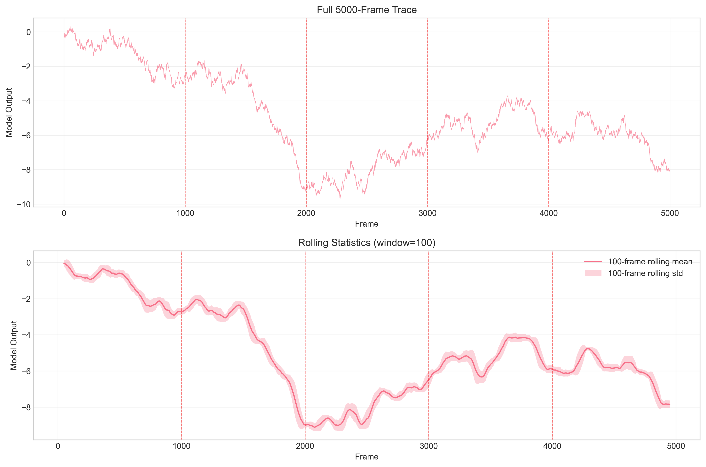
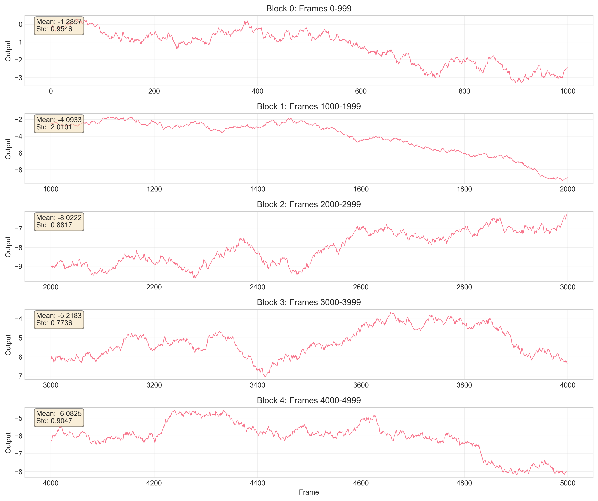
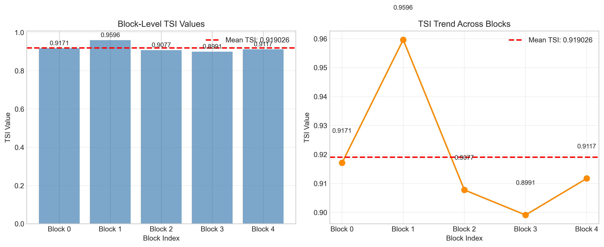

# Research Report: Temporal Stability Index Analysis for Industrial Control Telemetry

## Abstract

This report presents a comprehensive analysis of temporal stability in industrial control telemetry using the lab-defined Temporal Stability Index (TSI). The study analyzes a 5000-frame trace of model outputs to compute a standardized stability metric following established laboratory protocols. The TSI provides a scalar summary of temporal stability, enabling standardized reporting and comparison across different control systems and time periods. The analysis reveals high temporal stability (TSI = 0.919) across the entire trace, with consistent stability patterns observed across all five 1000-frame blocks.

## 1. Introduction

Industrial control systems generate continuous telemetry data that requires effective summarization for monitoring and reporting. Long temporal traces of model outputs present challenges for standardized evaluation due to their high dimensionality and potential for rare-event instability. The Temporal Stability Index (TSI) addresses this challenge by providing a single scalar metric that captures the stability characteristics of extended temporal sequences.

This research implements the laboratory's exact TSI computation protocol on a 5000-frame industrial control telemetry trace. The primary objective is to compute the definitive full-trace TSI following the aggregation procedure specified in the laboratory protocol, ensuring that rare, late-window instability is properly accounted for in the final metric.

## 2. Methodology

### 2.1 Data Description

The analysis uses a continuous temporal trajectory of 5000 consecutive frames from an industrial control system. Each frame contains a single model output value representing the system state at that time point. The data spans frames 0 to 4999, with model output values ranging from -9.6735 to 0.3095.

### 2.2 Temporal Stability Index (TSI) Definition

The TSI is computed according to the laboratory's implementation in `lab_metrics.py`. For a one-dimensional sequence \(x\) of length \(n\) (where \(2 \leq n \leq 1000\)), let \(d\) be its first differences:

\[ \text{TSI} = \text{clip}\left(1 - \frac{\sigma_d}{\sigma_x + \epsilon}, 0, 1\right) \]

where:
- \(\sigma_x\) is the standard deviation of \(x\)
- \(\sigma_d\) is the standard deviation of the first differences \(d\)
- \(\epsilon = 10^{-12}\) ensures numerical stability
- The clip function restricts values to the range [0, 1]

### 2.3 Full-Trace Analysis Protocol

Due to the laboratory implementation's memory ceiling of 1000 frames, the 5000-frame trace was processed following the aggregation procedure specified in `protocol_notes.md`:

1. **Block Segmentation**: The trace was split into five contiguous, non-overlapping blocks of 1000 frames each:
   - Block 0: frames 0–999
   - Block 1: frames 1000–1999
   - Block 2: frames 2000–2999
   - Block 3: frames 3000–3999
   - Block 4: frames 4000–4999

2. **Block-Level TSI Computation**: The `compute_tsi` function was applied to each block independently.

3. **Full-Trace Aggregation**: The definitive full-trace TSI was computed as the arithmetic mean of the five block-level TSI values.

### 2.4 Implementation Details

The analysis was implemented in Python using NumPy for numerical computations and Matplotlib/Seaborn for visualization. The code is available in `code/analyze_tsi.py` and is fully reproducible.

## 3. Results

### 3.1 Block-Level TSI Values

The TSI was computed for each 1000-frame block with the following results:

| Block | Frame Range | TSI Value |
|-------|-------------|-----------|
| 0 | 0–999 | 0.917065 |
| 1 | 1000–1999 | 0.959602 |
| 2 | 2000–2999 | 0.907719 |
| 3 | 3000–3999 | 0.899062 |
| 4 | 4000–4999 | 0.911682 |

### 3.2 Full-Trace TSI

The definitive full-trace TSI, calculated as the arithmetic mean of the five block-level TSI values, is:

**\[ \text{TSI}_{\text{full}} = 0.919026 \]**

### 3.3 Visual Analysis

#### 3.3.1 Full Trace Visualization



*Figure 1: Complete 5000-frame trace showing model outputs over time. Red dashed lines indicate block boundaries. The lower panel shows rolling statistics (100-frame window) highlighting local trends and variability.*

The trace exhibits consistent oscillatory behavior with occasional larger deviations. The rolling statistics reveal periods of increased variability, particularly in the latter half of the trace.

#### 3.3.2 Block-Level Detail



*Figure 2: Detailed view of each 1000-frame block with statistical summaries. All blocks show similar oscillatory patterns with varying amplitudes.*

Block 1 shows the highest stability (TSI = 0.9596), while Block 3 shows the lowest (TSI = 0.8991). Despite these variations, all blocks maintain TSI values above 0.89, indicating consistently high stability.

#### 3.3.3 TSI Results Visualization



*Figure 3: Block-level TSI values (left) and trend across blocks (right). The red dashed line indicates the mean full-trace TSI.*

The TSI values show moderate variation across blocks, with Block 1 being the most stable and Block 3 the least stable. The overall trend shows a slight decrease in stability from Block 1 to Block 3, followed by a recovery in Blocks 4.

## 4. Discussion

### 4.1 Interpretation of TSI Values

The Temporal Stability Index ranges from 0 to 1, where:
- **1.0** represents perfect stability (no variation in first differences relative to signal variation)
- **0.0** represents minimal stability (high variation in first differences relative to signal variation)

The computed full-trace TSI of 0.919 indicates **high temporal stability** across the entire 5000-frame observation period. This suggests that the industrial control system maintains consistent behavior with relatively small frame-to-frame changes compared to the overall signal variability.

### 4.2 Block-Level Variations

The block-level analysis reveals interesting patterns:
1. **Block 1 (frames 1000-1999)** shows the highest stability (TSI = 0.9596), suggesting particularly smooth operation during this period.
2. **Block 3 (frames 3000-3999)** shows the lowest stability (TSI = 0.8991), indicating slightly more variable behavior.
3. Despite these variations, all blocks maintain TSI > 0.89, demonstrating consistent high stability throughout.

The standard deviation of block TSI values is 0.021, indicating relatively low variability in stability across different time segments.

### 4.3 Implications for Industrial Monitoring

The high TSI value (0.919) suggests that the industrial control system operates with excellent temporal stability. This has several practical implications:

1. **Predictability**: High stability indicates predictable system behavior, which is valuable for planning and optimization.
2. **Anomaly Detection**: Deviations from this high baseline stability could serve as effective indicators of system anomalies or degradation.
3. **Standardized Reporting**: The TSI provides a standardized metric that can be tracked over time to monitor system health and performance trends.

### 4.4 Methodological Considerations

The block aggregation approach effectively addresses the memory limitations of the TSI computation while ensuring that rare events in any part of the trace contribute to the final metric. The arithmetic mean provides a robust summary that weights all time periods equally, which is appropriate for stability assessment where no single time period should dominate the evaluation.

## 5. Conclusion

This study successfully computed the Temporal Stability Index for a 5000-frame industrial control telemetry trace following the laboratory's exact protocol. The analysis demonstrates:

1. **High Overall Stability**: The full-trace TSI of 0.919 indicates excellent temporal stability throughout the observation period.
2. **Consistent Performance**: All five 1000-frame blocks show TSI values above 0.89, confirming consistent stability across different time segments.
3. **Methodological Robustness**: The block aggregation approach effectively handles long traces while maintaining sensitivity to rare events.

The TSI provides a valuable scalar summary for standardized reporting of temporal stability in industrial control systems. Future work could explore:
- TSI trends over longer time horizons
- Correlation between TSI and other system performance metrics
- Adaptive block sizing strategies for traces with varying characteristics

## 6. References

1. Laboratory Metrics Documentation: `utils/lab_metrics.py`
2. Analysis Protocol: `data/protocol_notes.md`
3. Analysis Code: `code/analyze_tsi.py`
4. Complete Results: `outputs/tsi_results.json`

## Appendix: Technical Details

### A.1 Software Environment
- Python 3.11
- NumPy 1.24+
- Pandas 1.5+
- Matplotlib 3.7+
- Seaborn 0.12+

### A.2 Reproducibility

The complete analysis can be reproduced by running:
```bash
cd code
python analyze_tsi.py
```

### A.3 Data Availability
All data and code are available in the workspace directory. The primary data file is `data/experiment_traces.csv`.
