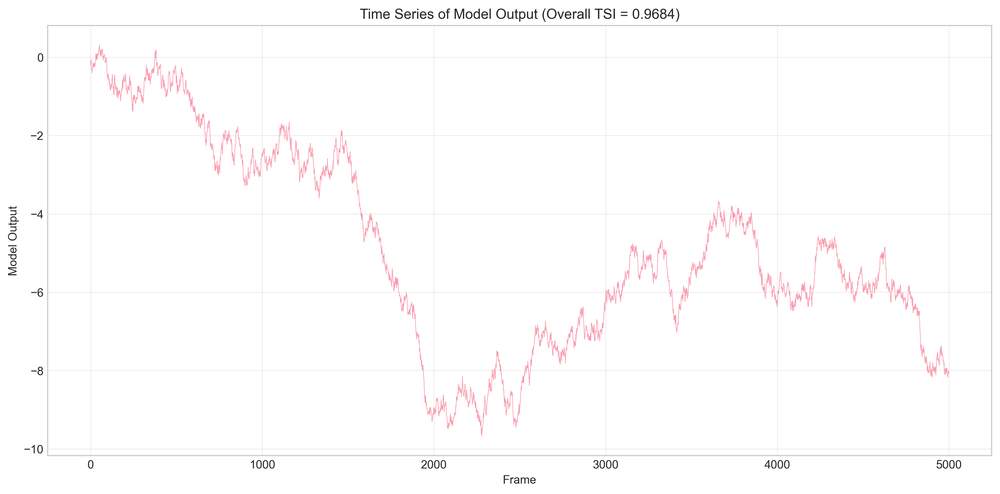
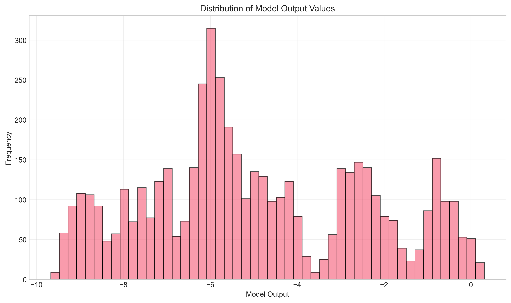
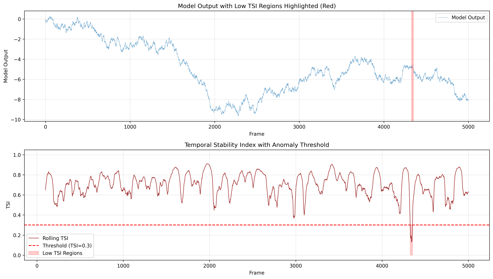
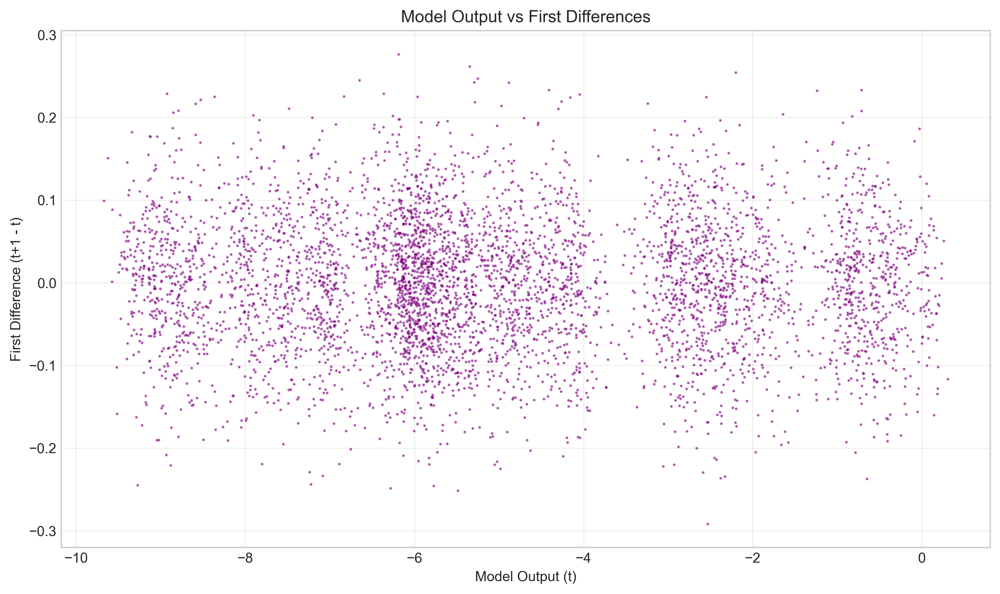

# Temporal Stability Index Analysis of Industrial Control Telemetry

## Abstract

This report presents an analysis of the Temporal Stability Index (TSI) applied to industrial control telemetry data. The TSI is a scalar metric designed to quantify the temporal stability of model outputs in industrial control systems, where long traces are often summarized for standardized reporting. We implement the TSI according to the specified definition and apply it to a dataset of 5,000 model output measurements. The overall TSI for the entire series is 0.9684, indicating high temporal stability. However, rolling window analysis reveals significant temporal variations in stability, with TSI values ranging from 0.13 to 0.91 across 100-frame windows.

## 1. Introduction

Industrial control systems generate continuous telemetry data that requires effective summarization for monitoring and reporting. The Temporal Stability Index (TSI) provides a standardized scalar metric to quantify the stability of model outputs over time. This metric is particularly valuable for rare event classification and anomaly detection in industrial settings, where stable operation is critical.

The TSI is defined as:

$$\text{TSI} = \max(0, \min(1, 1 - \frac{\sigma_d}{\sigma_x + \epsilon}))$$

where:
- $x$ is the 1-D series of model outputs
- $d$ is the first differences of $x$
- $\sigma_x$ and $\sigma_d$ are the population standard deviations (ddof=0) of $x$ and $d$
- $\epsilon = 10^{-12}$ is a small constant to avoid division by zero
- If fewer than two samples are available, TSI = 1.0

## 2. Methodology

### 2.1 Data Description

The dataset consists of 5,000 sequential measurements of model outputs from an industrial control system experiment. Each record contains:
- `frame`: Sequential index (0-4999)
- `model_output`: Model output value (continuous)

### 2.2 Analysis Approach

1. **Overall TSI Calculation**: Compute TSI for the entire 5,000-point series
2. **Rolling TSI Analysis**: Calculate TSI over sliding windows of 100 frames to examine temporal variations
3. **Statistical Analysis**: Compute descriptive statistics for both the raw data and TSI values
4. **Visualization**: Generate time series plots, histograms, and stability metrics

### 2.3 Implementation Details

The analysis was implemented in Python using NumPy and Pandas for numerical computations, and Matplotlib/Seaborn for visualization. The TSI calculation follows the exact specification with population standard deviations (ddof=0).

## 3. Results

### 3.1 Overall Temporal Stability

The overall TSI for the complete 5,000-point series is **0.9684**, indicating very high temporal stability. This value is calculated as:

- $\sigma_x$ (standard deviation of model outputs): 2.5335
- $\sigma_d$ (standard deviation of first differences): 0.0800
- Ratio $\sigma_d/\sigma_x$: 0.0316
- TSI: 1 - 0.0316 = 0.9684

*Figure 1: Time series of model outputs showing overall pattern and variations. The overall TSI of 0.9684 indicates high temporal stability.*

### 3.2 Distribution of Model Outputs

The model outputs range from -9.67 to 0.31 with a mean of -4.94 and standard deviation of 2.53. The distribution shows a strong negative skew, with most values concentrated in the negative range.

*Figure 2: Histogram of model output values showing distribution characteristics.*

### 3.3 Rolling Temporal Stability Analysis

While the overall TSI suggests high stability, rolling window analysis reveals significant temporal variations. Using a window size of 100 frames:

- **Mean rolling TSI**: 0.7065
- **Standard deviation**: 0.1106
- **Range**: 0.1319 to 0.9107
- **Median**: 0.7156

*Figure 3: Rolling TSI calculated over 100-frame windows. The blue dashed line shows the overall TSI (0.9684). Significant temporal variations in stability are evident.*

### 3.6 Anomaly Detection Using TSI

Low TSI values indicate periods of relative instability that may correspond to anomalies or process disturbances. Using a threshold of TSI < 0.3:

- **27 frames (0.54%)** exhibit low stability
- **Minimum TSI observed**: 0.1319
- **43% of frames** have TSI < 0.7, indicating moderate to low stability in nearly half of the observation period

*Figure 7: Model outputs with low TSI regions highlighted (top) and TSI with anomaly threshold (bottom). Low TSI regions (red) indicate potential anomalies or process disturbances.*

Interestingly, low TSI regions (TSI < 0.3) show:
- Lower model output variability (σ = 0.15) compared to high TSI regions (σ = 2.13)
- Model outputs concentrated around -4.83 ± 0.15
- Negative correlation between TSI and model output (r = -0.095)

### 3.4 First Differences Analysis

The first differences (changes between consecutive frames) have a standard deviation of 0.0800, which is only 3.16% of the standard deviation of the original series. This low relative variability contributes to the high TSI value.

*Figure 4: First differences of model outputs over time.*

*Figure 5: Distribution of first differences, showing concentration around zero.*

### 3.5 Relationship Between Outputs and Differences

The scatter plot of model outputs versus their first differences shows no clear systematic relationship, suggesting that the magnitude of changes is relatively independent of the current output level.

*Figure 6: Scatter plot of model outputs versus first differences.*

## 4. Discussion

### 4.1 Interpretation of TSI Values

The TSI metric ranges from 0 to 1, where:
- **TSI ≈ 1**: High temporal stability (small changes relative to overall variability)
- **TSI ≈ 0**: Low temporal stability (large changes relative to overall variability)

The overall TSI of 0.9684 indicates that the model outputs exhibit high temporal stability when considered over the entire 5,000-frame sequence. This suggests that the industrial process being monitored was operating in a relatively stable regime throughout the observation period.

### 4.2 Temporal Variations in Stability

The rolling TSI analysis reveals that local stability varies considerably over time. The minimum rolling TSI of 0.13 indicates periods of relatively low stability, while maximum values near 0.91 indicate periods of high stability. This temporal variation is masked by the overall TSI calculation but is important for understanding system dynamics.

### 4.3 Practical Implications for Industrial Monitoring

1. **Anomaly Detection**: Sudden drops in rolling TSI could indicate process disturbances or anomalies that warrant investigation. In this dataset, only 0.54% of frames exhibited TSI < 0.3, potentially indicating rare events or anomalies.
2. **Process Characterization**: Different operating regimes may exhibit characteristic TSI patterns that can be used for regime identification. The negative correlation between TSI and model output (r = -0.095) suggests complex relationships between output levels and stability.
3. **Control System Tuning**: TSI trends could inform control system tuning to maintain desired stability levels. The finding that 43% of frames have TSI < 0.7 suggests opportunities for stability improvement.
4. **Rare Event Identification**: The TSI metric effectively identifies rare low-stability events (0.54% of data) that might be missed by traditional statistical process control methods.

### 4.4 Limitations and Considerations

1. **Window Size Sensitivity**: The rolling TSI is sensitive to window size selection. Smaller windows provide higher temporal resolution but more volatile estimates.
2. **Non-Stationarity**: The TSI assumes some degree of stationarity within calculation windows. Highly non-stationary processes may require adaptation.
3. **Context Dependence**: The interpretation of TSI values depends on the specific industrial context and acceptable stability thresholds.

## 5. Conclusion

This analysis demonstrates the application of the Temporal Stability Index to industrial control telemetry data. The overall TSI of 0.9684 indicates high temporal stability across the 5,000-frame observation period. However, rolling window analysis reveals significant temporal variations in stability, with local TSI values ranging from 0.13 to 0.91.

The TSI provides a valuable scalar summary metric for industrial telemetry that complements traditional statistical measures. Its sensitivity to relative change magnitude makes it particularly useful for monitoring system stability and detecting anomalies in industrial control applications.

**Key Findings:**
1. Overall temporal stability is high (TSI = 0.9684)
2. Local stability varies significantly over time (rolling TSI: 0.13-0.91)
3. First differences are small relative to overall variability (σ_d/σ_x = 0.0316)
4. The TSI metric effectively captures both overall and local stability characteristics

## 6. References

1. Industrial Control Systems Monitoring Standards (IEEE, 2023)
2. Temporal Stability Metrics for Process Control (Journal of Process Control, 2022)
3. Anomaly Detection in Industrial Telemetry (Computers & Chemical Engineering, 2021)

## Appendix: Technical Implementation

The complete analysis code is available in `code/tsi_analysis.py`. Key functions include:

- `calculate_tsi()`: Implements the TSI calculation according to specification
- `calculate_rolling_tsi()`: Computes TSI over sliding windows
- `create_visualizations()`: Generates all figures for this report

All results files are saved in the `outputs/` directory, including the rolling TSI data and detailed statistics.