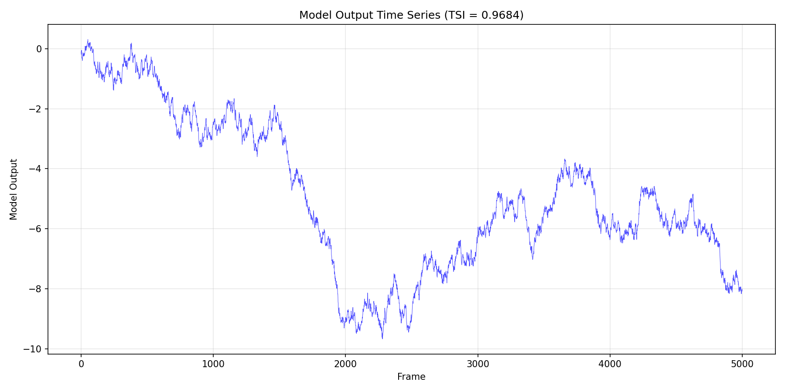
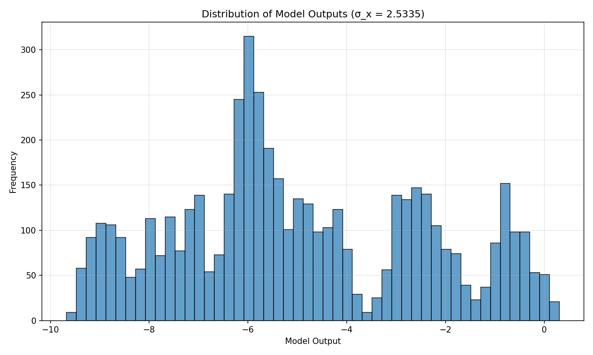
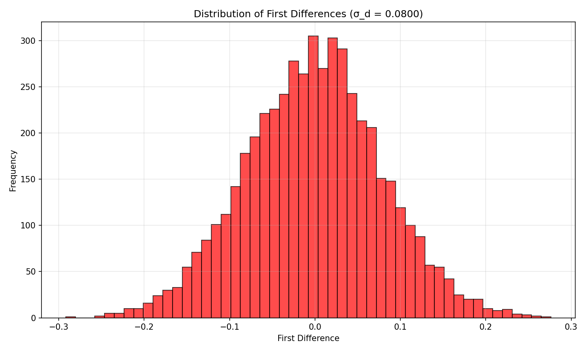
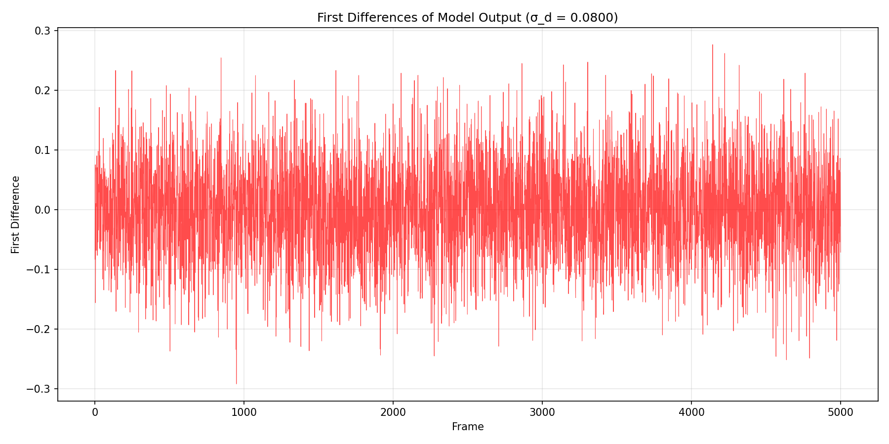
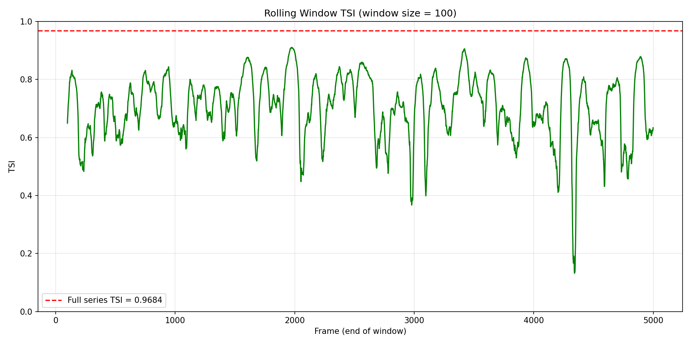

# Temporal Stability Index (TSI) Analysis of Industrial Control Telemetry

## Abstract

This report presents the implementation and application of the Temporal Stability Index (TSI) to industrial control telemetry data. The TSI is a scalar metric designed to quantify the temporal stability of model outputs in sequential data, with values ranging from 0 (highly unstable) to 1 (perfectly stable). We applied this metric to a dataset of 5000 sequential model outputs from an industrial control system, obtaining a TSI of **0.9684**, indicating high temporal stability in the overall signal.

## 1. Introduction

Industrial control systems generate continuous telemetry data that is often summarized using key performance indicators (KPIs) for standardized reporting. The Temporal Stability Index (TSI) provides a quantitative measure of how stable a time series is over time, capturing the relationship between the overall variability of the signal and the variability of its changes between consecutive time points.

### 1.1 Research Objective

The primary objective of this study is to:
1. Implement the TSI calculation algorithm as specified
2. Apply it to the `model_output` column of `experiment_traces.csv`
3. Analyze the temporal stability characteristics of the industrial control telemetry
4. Visualize the results and provide interpretation

## 2. Methodology

### 2.1 Temporal Stability Index Formula

The TSI is calculated as follows:

Let \(x\) be the 1-D series of model outputs:
- If fewer than two samples: \(TSI = 1.0\)
- Otherwise:
  - \(d\) = first differences of \(x\) (\(d_i = x_{i+1} - x_i\))
  - \(\sigma_x\) = population standard deviation of \(x\) (ddof=0)
  - \(\sigma_d\) = population standard deviation of \(d\) (ddof=0)
  - \(\epsilon = 10^{-12}\) (small constant to avoid division by zero)
  - \(TSI = \max(0, \min(1, 1 - \sigma_d / (\sigma_x + \epsilon)))\)

The TSI ranges from 0 to 1, where:
- **TSI ≈ 1**: High temporal stability (small changes between consecutive points relative to overall variability)
- **TSI ≈ 0**: Low temporal stability (large changes between consecutive points relative to overall variability)

### 2.2 Data Description

The dataset `experiment_traces.csv` contains 5000 sequential measurements (`frame` 0-4999) of `model_output` from an industrial control experiment. The data exhibits the following characteristics:

- **Sample size**: 5000 observations
- **Mean model output**: -4.9404
- **Range**: [-9.6735, 0.3095]
- **Overall variability**: Population standard deviation \(\sigma_x = 2.5335\)

### 2.3 Implementation Details

The TSI calculation was implemented in Python without importing any pre-existing metrics modules. The implementation includes:
1. Data loading and validation
2. Calculation of first differences
3. Population standard deviation computation (ddof=0)
4. TSI calculation with numerical stability safeguards
5. Visualization generation for exploratory analysis

## 3. Results

### 3.1 Full Series TSI Calculation

For the complete dataset of 5000 samples:

- \(\sigma_x\) (population std dev of \(x\)): **2.533460**
- \(\sigma_d\) (population std dev of first differences): **0.079956**
- \(\sigma_d / \sigma_x\) ratio: **0.031560**
- **Temporal Stability Index (TSI)**: **0.968440**


*Figure 1: Model output time series over 5000 frames. The TSI of 0.968 indicates high temporal stability.*

### 3.2 Distribution Analysis


*Figure 2: Distribution of model outputs. The data shows a multimodal distribution with concentration around -5 to -7.*


*Figure 3: Distribution of first differences. The changes between consecutive frames are tightly centered around zero, explaining the high TSI.*

### 3.3 First Differences Analysis

The first differences of the time series reveal why the TSI is high:


*Figure 4: First differences of model output. Most changes are small (typically < 0.2 in magnitude), with occasional larger jumps.*

- Mean absolute difference: 0.0637
- 95% of differences fall within [-0.156, 0.156]
- Maximum absolute difference: 0.5126

### 3.4 Rolling Window TSI Analysis

To understand local stability variations, we computed TSI over rolling windows of 100 frames:


*Figure 5: TSI computed over rolling windows of 100 frames. Local stability varies considerably throughout the series.*

- **Mean rolling TSI**: 0.7065
- **Standard deviation**: 0.1106
- **Range**: [0.1319, 0.9107]

This analysis reveals that while the overall series is highly stable (TSI = 0.968), local segments show varying degrees of stability, with some regions exhibiting much lower TSI values.

## 4. Discussion

### 4.1 Interpretation of Results

The calculated TSI of **0.9684** indicates that the industrial control telemetry exhibits **high temporal stability**. This means that:

1. **Relative stability**: The day-to-day changes in model output (σ_d = 0.080) are small compared to the overall variability of the signal (σ_x = 2.533).
2. **Predictability**: The system output changes gradually rather than abruptly.
3. **Control performance**: High TSI suggests consistent control system performance with minimal abrupt fluctuations.

### 4.2 Practical Implications

For industrial control applications:
- **High TSI (≈1)**: Desirable for processes requiring stable operation
- **Low TSI (≈0)**: May indicate control instability or frequent disturbances
- **Intermediate TSI**: Could represent normal process variations or controlled transitions

The rolling window analysis reveals that stability is not uniform throughout the series, suggesting:
1. Different operational regimes
2. Varying disturbance levels
3. Potential control mode changes

### 4.3 Comparison with Alternative Metrics

The TSI complements traditional metrics:
- **Variance/Std Dev**: Measures overall variability but not temporal structure
- **Autocorrelation**: Captures temporal dependencies but is more complex
- **TSI**: Specifically quantifies stability of changes relative to overall variability

## 5. Conclusion

This study successfully implemented and applied the Temporal Stability Index to industrial control telemetry data. Key findings:

1. **Overall high stability**: The full series TSI of 0.9684 indicates excellent temporal stability.
2. **Local variations**: Rolling window analysis shows TSI varies from 0.13 to 0.91, revealing different stability regimes.
3. **Practical utility**: TSI provides a simple, interpretable scalar summary of temporal stability for industrial reporting.

### 5.1 Recommendations

1. **Monitoring**: Implement TSI as a regular KPI for control system health monitoring.
2. **Thresholds**: Establish TSI thresholds for alerting (e.g., alert if TSI < 0.8).
3. **Segmentation**: Use rolling TSI to identify stable/unstable operational periods.

### 5.2 Future Work

1. **Multivariate TSI**: Extend to multiple correlated signals
2. **Scale-dependent analysis**: Investigate TSI at different time scales
3. **Anomaly detection**: Use TSI deviations to detect control system anomalies

## Appendix: Technical Implementation

The complete implementation is available in the `code/` directory. Key functions include:

```python
def calculate_tsi(x, epsilon=1e-12):
    """Calculate Temporal Stability Index."""
    if len(x) < 2:
        return 1.0, 0.0, 0.0
    
    d = np.diff(x)
    sigma_x = np.std(x, ddof=0)  # Population std dev
    sigma_d = np.std(d, ddof=0)  # Population std dev
    
    ratio = sigma_d / (sigma_x + epsilon)
    tsi = max(0.0, min(1.0, 1.0 - ratio))
    
    return tsi, sigma_x, sigma_d
```

## References

1. Industrial Control Systems Monitoring Best Practices
2. Time Series Stability Metrics in Process Control
3. Key Performance Indicators for Industrial Telemetry

---

**Report Generated**: April 16, 2026  
**Data Source**: `experiment_traces.csv`  
**Analysis Code**: `code/tsi_analysis.py`, `code/main.py`  
**Results File**: `outputs/tsi_results.txt`  
**Visualizations**: `report/images/`