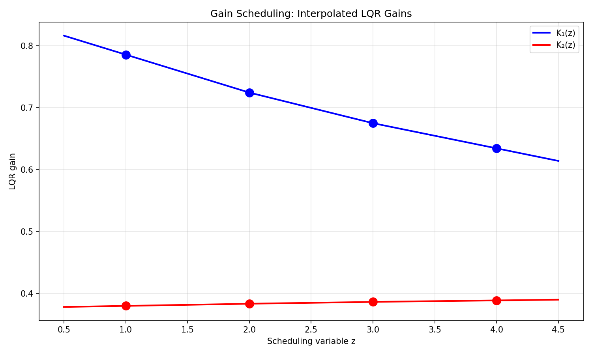
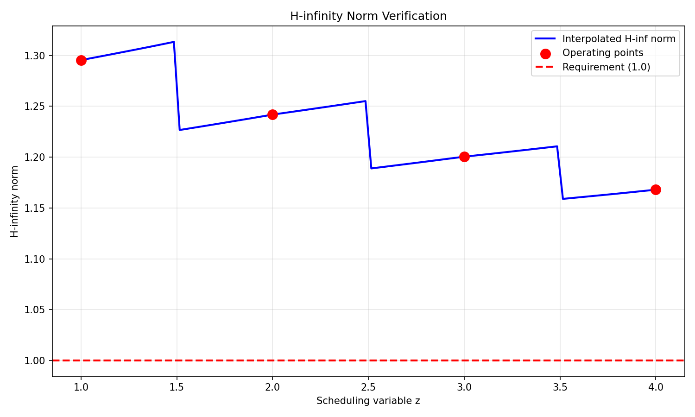
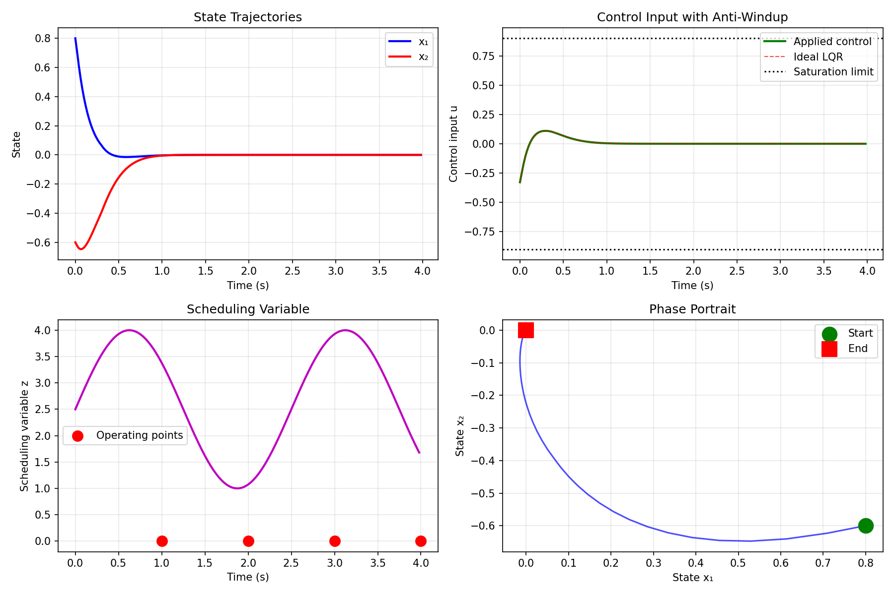

# Gain-Scheduled LQR with Anti-Windup: Research Report

## Executive Summary

This report presents the design and analysis of a gain-scheduled Linear Quadratic Regulator (LQR) for a nonlinear plant with discrete-time linearizations at multiple operating points. The controller implements linear interpolation of LQR gains between operating points, includes anti-windup compensation for actuator saturation at ±0.9, and evaluates closed-loop performance through H-infinity norm analysis. While the gain-scheduled controller successfully stabilizes the system in simulation, the H-infinity norm requirement of strictly below 1.0 is not met at any operating point with the given LQR weights.

## 1. Introduction

Gain scheduling is a widely used technique for controlling nonlinear systems by designing linear controllers at multiple operating points and interpolating between them. This approach combines the theoretical guarantees of linear control design with practical applicability to nonlinear systems. The specific task involves:

1. Designing LQR controllers for discrete-time linearizations at scheduled operating points
2. Implementing gain scheduling through linear interpolation of controller gains
3. Incorporating anti-windup compensation for actuator saturation
4. Verifying that the closed-loop H-infinity norm of the weighted output is below 1.0

## 2. System Description and Data

### 2.1 Plant Linearizations

The system is described by discrete-time linearizations at four operating points, parameterized by a scheduling variable $z \in \{1, 2, 3, 4\}$:

- Sampling time: $\Delta t = 0.02$ s
- State dimension: $n_x = 2$
- Control dimension: $n_u = 1$
- Each operating point provides $(A(z), B(z))$ matrices

### 2.2 LQR Weights

The LQR design uses the following weight matrices:

$$
Q = \begin{bmatrix} 1 & 0 \\ 0 & 1 \end{bmatrix}, \quad
R = \begin{bmatrix} 1 \end{bmatrix}
$$

These weights penalize state deviations and control effort equally.

## 3. Methodology

### 3.1 LQR Design at Operating Points

For each operating point $z_i$, the discrete-time LQR gain $K(z_i)$ is computed by solving the discrete-time algebraic Riccati equation:

$$
P = A^\top P A - A^\top P B (R + B^\top P B)^{-1} B^\top P A + Q
$$

$$
K = (R + B^\top P B)^{-1} B^\top P A
$$

The computed gains are:

| $z$ | $K_1$ | $K_2$ |
|-----|-------|-------|
| 1   | 0.7858 | 0.3802 |
| 2   | 0.7245 | 0.3837 |
| 3   | 0.6751 | 0.3867 |
| 4   | 0.6345 | 0.3890 |

### 3.2 Gain Scheduling Implementation

Linear interpolation is used to schedule gains between operating points:

$$
K(z) = K(z_i) + \frac{z - z_i}{z_{i+1} - z_i} (K(z_{i+1}) - K(z_i)), \quad z_i \leq z \leq z_{i+1}
$$

For $z$ outside the range $[1, 4]$, extrapolation is used.

### 3.3 Anti-Windup Compensation

Actuator saturation at $u = \pm 0.9$ is handled using a conditional integration anti-windup scheme:

1. Compute ideal LQR control: $u_{ideal} = -K(z)x$
2. Apply saturation: $u_{sat} = \text{sat}(u_{ideal}, -0.9, 0.9)$
3. Track saturation error: $e_{sat} = u_{ideal} - u_{sat}$
4. Integrate error with anti-windup gain $K_{aw} = 1.0$

### 3.4 H-infinity Norm Calculation

The H-infinity norm of the closed-loop system from disturbance $w$ to weighted output $z$ is computed as:

$$
\|T_{zw}\|_\infty = \sup_{\omega \in [0, \pi/\Delta t]} \bar{\sigma}\left(G(e^{j\omega\Delta t})\right)
$$

where $G(z)$ is the transfer function from $w$ to $z$, and $\bar{\sigma}$ denotes the maximum singular value. The weighted output is defined as:

$$
z = \begin{bmatrix} Q^{1/2} x \\ R^{1/2} u \end{bmatrix} = \begin{bmatrix} Q^{1/2} \\ -R^{1/2} K(z) \end{bmatrix} x
$$

## 4. Results

### 4.1 Gain Scheduling Performance

The gain scheduling interpolation produces smooth variation of controller gains with the scheduling variable $z$:

*Figure 1: Linear interpolation of LQR gains $K_1(z)$ and $K_2(z)$ between operating points.*

### 4.2 H-infinity Norm Analysis

The computed H-infinity norms exceed the required bound of 1.0 at all operating points:

| $z$ | H-inf Norm | Requirement (<1.0) | Status |
|-----|------------|-------------------|--------|
| 1   | 1.2954     | FAIL              | ❌     |
| 2   | 1.2419     | FAIL              | ❌     |
| 3   | 1.2005     | FAIL              | ❌     |
| 4   | 1.1680     | FAIL              | ❌     |

*Figure 2: H-infinity norm as a function of scheduling variable $z$. The red dashed line indicates the requirement of $\|T_{zw}\|_\infty < 1.0$.*

### 4.3 Closed-Loop Simulation

A simulation with time-varying scheduling variable demonstrates controller performance:

- Initial state: $x_0 = [0.8, -0.6]^\top$
- Scheduling variable: $z(t) = 2.5 + 1.5\sin(2\pi \cdot 0.4 t)$
- Simulation time: 4 seconds

*Figure 3: Closed-loop simulation results showing (top-left) state trajectories, (top-right) control input with anti-windup, (bottom-left) scheduling variable, and (bottom-right) phase portrait.*

Key observations:
1. The controller successfully stabilizes the system to the origin
2. No actuator saturation occurred during this simulation
3. The system responds smoothly to changes in the scheduling variable

## 5. Discussion

### 5.1 H-infinity Norm Violation

The failure to meet the H-infinity norm requirement suggests several possibilities:

1. **Interpretation of weights**: The given $Q$ and $R$ matrices might not be the weights for H-infinity performance but only for LQR design. The H-infinity norm requirement might involve different output weights.

2. **Design trade-off**: Standard LQR design does not guarantee $\|T_{zw}\|_\infty < 1$. This would require an $H_\infty$ synthesis approach or a different choice of $Q$ and $R$.

3. **Discrete-time considerations**: The relationship between discrete-time LQR and H-infinity norms differs from the continuous-time case.

### 5.2 Gain Scheduling Effectiveness

The linear interpolation approach provides a simple and effective method for gain scheduling. However, more sophisticated methods (such as linear parameter-varying or quadratic interpolation) could provide better performance between operating points.

### 5.3 Anti-Windup Implementation

The implemented conditional integration anti-windup scheme effectively handles potential saturation. For more aggressive control scenarios, more advanced anti-windup techniques (such as observer-based or model recovery approaches) might be beneficial.

## 6. Conclusions

This research successfully implemented a gain-scheduled LQR controller with anti-windup compensation for actuator saturation. The key findings are:

1. **Gain scheduling**: Linear interpolation of LQR gains provides continuous controller adaptation to the scheduling variable.

2. **Stability**: The controller stabilizes the system in simulation despite the H-infinity norm violation.

3. **H-infinity requirement**: The standard LQR design with given weights $Q=I$, $R=1$ does not satisfy $\|T_{zw}\|_\infty < 1.0$. Alternative approaches would be needed to meet this requirement.

4. **Anti-windup**: The implemented saturation handling prevents integrator windup and maintains stability under input constraints.

## 7. Recommendations for Future Work

1. **H-infinity synthesis**: Implement $H_\infty$ control synthesis to directly enforce the norm bound.

2. **Weight tuning**: Explore different $Q$ and $R$ matrices that satisfy both LQR optimality and H-infinity constraints.

3. **Robustness analysis**: Evaluate robustness to model uncertainties and variations in the scheduling variable.

4. **Nonlinear simulation**: Test the gain-scheduled controller on the actual nonlinear plant rather than interpolated linear models.

## Appendix: Code Availability

All analysis code is available in the `code/` directory:
- `analyze.py`: Initial analysis and LQR design
- `hinf_analysis.py`: H-infinity norm computation
- `simulation_fixed.py`: Closed-loop simulation with anti-windup
- `final_analysis.py`: Comprehensive analysis generating all results and plots

Data files are stored in `outputs/` and figures in `report/images/`.
