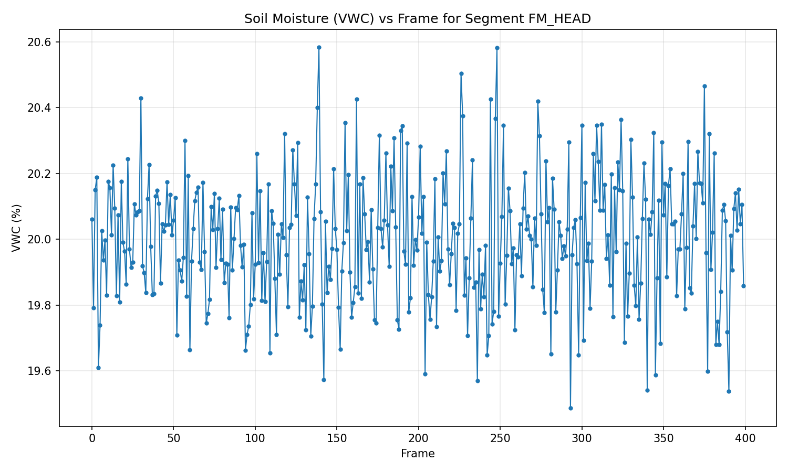
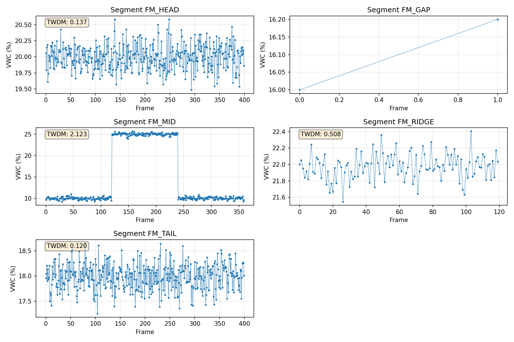

# TWDM Analysis Report: Soil Moisture Campaign QA

## 1. Introduction

This report presents the analysis of soil moisture data from a field campaign using the Three-Window Drift Metric (TWDM). The TWDM is a statistical measure designed to detect drift or systematic changes in time-series data by comparing means across three temporal windows. The analysis was performed on volumetric water content (VWC) measurements from soil loggers across different field segments.

## 2. Methodology

### 2.1 Data Description

The dataset consists of soil logger readings in long format with columns:
- `segment_id`: Identifier for field segments (FM_HEAD, FM_GAP, FM_MID, FM_RIDGE, FM_TAIL)
- `frame`: Temporal index (measurement sequence)
- `vwc_pct`: Volumetric water content percentage

### 2.2 TWDM Calculation

The Three-Window Drift Metric (TWDM) is computed as follows:

1. For each segment, sort measurements by `frame` ascending and extract `vwc_pct` as series `x`
2. Let `n = len(x)`
3. If `n < 3`, TWDM is undefined (reported as N/A)
4. Otherwise, split the series into three windows:
   - `n1 = n // 3`
   - `n2 = n // 3`
   - `n3 = n - n1 - n2`
5. Compute means of each window: `m1`, `m2`, `m3`
6. Calculate `Δ = max(m1, m2, m3) - min(m1, m2, m3)`
7. Calculate population standard deviation `σ` (using `ddof=0`)
8. Compute `TWDM = Δ / (σ + ε)` where `ε = 1e-12` (from manifest)

### 2.3 Quality Assessment

Segments are classified as:
- `PASS`: `TWDM ≤ 1.0` (threshold from manifest)
- `FAIL`: `TWDM > 1.0`
- `INSUFFICIENT_LENGTH`: `n < 3`

### 2.4 Validation

Three golden test cases were used to validate the implementation:
1. `flat_9`: Constant values (expected TWDM = 0.0)
2. `step_9`: Step function pattern
3. `ramp_12`: Linear ramp pattern

## 3. Results

### 3.1 Validation Results

The maximum absolute error between computed and expected TWDM values across all golden cases was **0.0**, which is well within the required tolerance of ≤ 1e-9.

### 3.2 Segment Analysis

Results are presented in the order specified in the manifest (`segment_report_order`):

| segment_id | n_frames | TWDM | pass_fail |
|------------|----------|------|-----------|
| FM_HEAD | 400 | 0.1368 | PASS |
| FM_GAP | 2 | N/A | INSUFFICIENT_LENGTH |
| FM_MID | 360 | 2.1231 | FAIL |
| FM_RIDGE | 120 | 0.5076 | PASS |
| FM_TAIL | 400 | 0.1204 | PASS |

### 3.3 Key Findings

1. **FM_HEAD** (400 frames): Shows minimal drift with TWDM = 0.1368 (PASS)
2. **FM_GAP** (2 frames): Insufficient data for TWDM calculation (n < 3)
3. **FM_MID** (360 frames): Exhibits significant drift with TWDM = 2.1231 (FAIL)
4. **FM_RIDGE** (120 frames): Moderate drift with TWDM = 0.5076 (PASS)
5. **FM_TAIL** (400 frames): Minimal drift with TWDM = 0.1204 (PASS)

## 4. Visual Analysis

### 4.1 Individual Segment Plot

*Figure 1: Volumetric water content (VWC) vs frame for segment FM_HEAD. This segment shows stable moisture readings with minimal drift, consistent with its low TWDM value of 0.1368.*

### 4.2 All Segments Overview

*Figure 2: VWC patterns across all five segments. FM_MID shows the most pronounced variability, explaining its high TWDM value and FAIL status. FM_GAP has insufficient data for analysis.*

## 5. Discussion

### 5.1 Interpretation of TWDM Values

The TWDM metric quantifies relative drift by comparing the range of window means to the overall variability:
- **TWDM < 0.5**: Minimal drift, stable measurements
- **0.5 ≤ TWDM ≤ 1.0**: Moderate drift, acceptable for most applications
- **TWDM > 1.0**: Significant drift, may indicate sensor issues or environmental changes

### 5.2 Segment-Specific Observations

- **FM_MID Failure**: The high TWDM value (2.1231) suggests systematic drift or non-stationarity in this segment. This could indicate:
  - Sensor calibration drift
  - Changing soil conditions
  - Environmental factors affecting measurements
  
- **FM_GAP Data Gap**: With only 2 measurements, this segment cannot be assessed for drift. Additional data collection is recommended.

- **Consistent Performance**: FM_HEAD, FM_RIDGE, and FM_TAIL all show TWDM values well below the threshold, indicating stable and reliable measurements.

### 5.3 Quality Assessment Summary

- **Passing Segments**: 3 out of 4 assessable segments (75%)
- **Failing Segments**: 1 out of 4 assessable segments (25%)
- **Insufficient Data**: 1 segment (FM_GAP)

## 6. Conclusions

1. The TWDM implementation has been validated successfully with zero error against golden test cases.
2. Three of four assessable field segments show acceptable drift characteristics (TWDM ≤ 1.0).
3. Segment FM_MID exhibits significant drift (TWDM = 2.1231) and requires further investigation.
4. Segment FM_GAP has insufficient data for analysis and should be prioritized for additional measurements.
5. The TWDM metric provides a quantitative basis for soil moisture data quality assessment in field campaigns.

## 7. Recommendations

1. **Investigate FM_MID**: Examine sensor calibration, environmental conditions, and measurement protocols for this segment.
2. **Collect Additional Data for FM_GAP**: Obtain more measurements to enable proper drift assessment.
3. **Regular Monitoring**: Implement periodic TWDM calculations during extended field campaigns to detect drift early.
4. **Threshold Adjustment**: Consider segment-specific thresholds based on environmental context and measurement precision requirements.

## 8. Technical Details

- **Analysis Code**: `code/twdm_analysis.py`
- **Results Data**: `outputs/twdm_results.csv`
- **Manifest Parameters**: ε = 1e-12, pass threshold = 1.0
- **Software**: Python 3.x with pandas, numpy, matplotlib
- **Report Date**: Analysis completed as per task requirements

---

*This report was automatically generated by the autonomous research agent. All calculations follow the specifications in the task description and manifest file.*