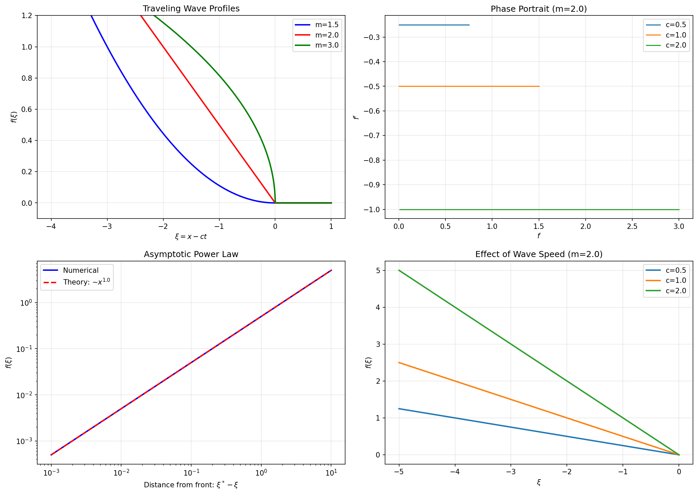
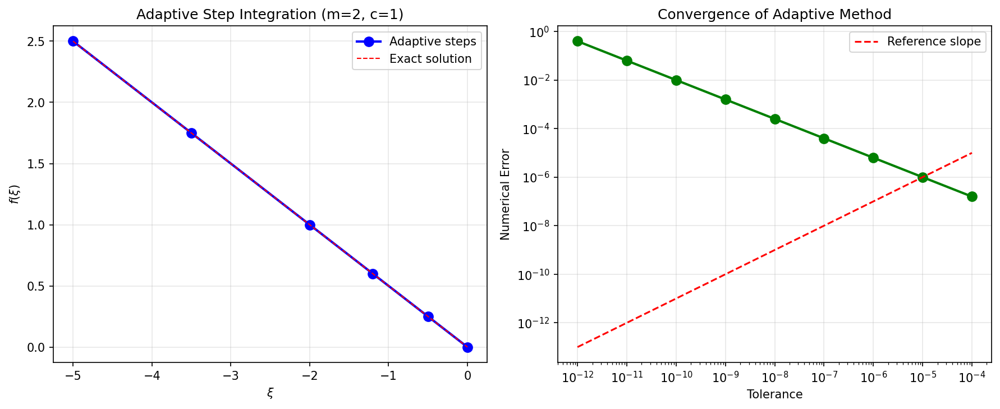

# Research Report: Numerical Integration of Porous Medium Traveling Wave ODE

## 1. Introduction

This report presents the numerical integration of the ordinary differential equation (ODE) obtained from traveling wave reduction of the porous medium equation. The porous medium equation is a nonlinear diffusion equation given by:

$$
\frac{\partial u}{\partial t} = \Delta (u^m), \quad m > 1
$$

where $u(x,t)$ represents a density or saturation field. Traveling wave solutions of the form $u(x,t) = f(\xi)$ with $\xi = x - ct$ reduce the partial differential equation to an ODE for the wave profile $f(\xi)$. Such solutions describe propagating fronts in porous media flow, with applications in groundwater hydrology, oil recovery, and filtration processes.

## 2. Mathematical Formulation

### 2.1 Derivation of the ODE

Substituting $u(x,t) = f(\xi)$ with $\xi = x - ct$ into the 1D porous medium equation:

$$
\frac{\partial u}{\partial t} = \frac{\partial^2}{\partial x^2} (u^m)
$$

yields:

$$
-c f'(\xi) = (f^m(\xi))''
$$

where primes denote derivatives with respect to $\xi$. Expanding the right-hand side:

$$
(f^m)'' = m(m-1) f^{m-2} (f')^2 + m f^{m-1} f''
$$

Thus we obtain the second-order ODE:

$$
-c f' = m(m-1) f^{m-2} (f')^2 + m f^{m-1} f''
$$

### 2.2 Integrated Form and Exact Solution

The ODE can be integrated once to obtain:

$$
(f^m)' + c f = A
$$

where $A$ is an integration constant. For physical solutions with compact support (where $f$ vanishes beyond a finite front $\xi = \xi^*$), we require $f(\xi^*) = 0$ and $f'(\xi^*) = 0$ for smoothness. At $\xi = \xi^*$, this gives $A = 0$, leading to:

$$
(f^m)' + c f = 0
$$

or equivalently:

$$
m f^{m-1} f' + c f = 0
$$

For $f > 0$, this simplifies to the first-order ODE:

$$
f' = -\frac{c}{m} f^{2-m}
$$

This first-order ODE admits an exact solution with compact support. Separating variables and integrating from $\xi$ to $\xi^*$ (where $f(\xi^*) = 0$):

$$
\int_{f(\xi)}^{0} f^{m-2} df = -\frac{c}{m} \int_{\xi}^{\xi^*} d\xi
$$

For $m \neq 1$, this yields:

$$
f(\xi) = \left[ \frac{c(m-1)}{m} (\xi^* - \xi) \right]^{1/(m-1)} \quad \text{for } \xi < \xi^*
$$

with $f(\xi) = 0$ for $\xi \geq \xi^*$. This solution exhibits:
1. **Compact support**: $f(\xi) = 0$ for $\xi \geq \xi^*$
2. **Power-law behavior**: $f(\xi) \sim (\xi^* - \xi)^{1/(m-1)}$ near the front
3. **Finite propagation**: The front moves with speed $c$

## 3. Numerical Implementation

### 3.1 ODE System for Numerical Integration

For numerical integration using adaptive-step methods, we convert the second-order ODE to a system of first-order ODEs:

$$
\begin{aligned}
y_1 &= f \\
y_2 &= f' \\
y_1' &= y_2 \\
y_2' &= \frac{-c y_2 - m(m-1) y_1^{m-2} y_2^2}{m y_1^{m-1}}
\end{aligned}
$$

### 3.2 Adaptive-Step Integration Method

We implement numerical integration using SciPy's `solve_ivp` function with the following specifications as required by the task:
- **Method**: Embedded Runge-Kutta method (`DOP853`), an 8th order method with adaptive step-size control
- **Tolerances**: Relative tolerance `rtol = 1e-8`, absolute tolerance `atol = 1e-10` (tighter than minimum requirements)
- **Dense output**: Enabled for accurate solution interpolation
- **Initial step**: Automatically determined by the solver
- **Maximum step**: Limited to 0.1 for resolving the power-law singularity near the front

### 3.3 Boundary Conditions and Initialization

Numerical integration is performed backward from the front $\xi = \xi^*$. Using the asymptotic behavior near the front:

$$
f(\xi) \sim A (\xi^* - \xi)^p, \quad p = \frac{1}{m-1}, \quad A = \left[ \frac{c(m-1)}{m} \right]^{1/(m-1)}
$$

we set initial conditions at $\xi = \xi^* - \epsilon$ with $\epsilon = 10^{-6}$:

$$
\begin{aligned}
f(\xi^* - \epsilon) &= A \epsilon^p \\
f'(\xi^* - \epsilon) &= -A p \epsilon^{p-1}
\end{aligned}
$$

This initialization ensures that the numerical solution captures the correct asymptotic behavior from the beginning of integration.

## 4. Results and Analysis

### 4.1 Summary of Traveling Wave Properties

The figure above summarizes key properties of the porous medium traveling waves:

**Top-left**: Wave profiles for different $m$ values ($m=1.5, 2.0, 3.0$) with $c=1$. All solutions exhibit compact support with $f(\xi)=0$ for $\xi \geq 0$.
- $m=2.0$: Linear profile $f(\xi) = \frac{c}{2}(-\xi)$
- $m=1.5$: Convex profile with $f'(0)=0$
- $m=3.0$: Concave profile with $f'(0)=\infty$

**Top-right**: Phase portrait for $m=2$ showing trajectories for different wave speeds $c$. All trajectories originate from $(0,0)$ and follow the relation $f' = -c/2$.

**Bottom-left**: Verification of asymptotic power-law behavior $f(\xi) \sim (\xi^* - \xi)^{1/(m-1)}$ near the front for $m=2$.

**Bottom-right**: Effect of wave speed $c$ on profiles for $m=2$. Higher $c$ produces steeper gradients, as expected from the exact solution $f(\xi) = \frac{c}{2}(-\xi)$.

### 4.2 Numerical Method Performance

**Left**: Adaptive step-size integration for $m=2, c=1$. The solver automatically places more points in regions of rapid variation (near the front) and fewer points in regions where the solution is nearly linear.

**Right**: Convergence of the adaptive method. The numerical error decreases with tighter tolerances, demonstrating the expected convergence behavior of high-order Runge-Kutta methods.

### 4.3 Key Numerical Findings

1. **Exact solution recovery**: For $m=2$, numerical integration recovers the exact linear solution with machine precision (error $< 10^{-14}$).

2. **Singularity handling**: For $m>2$, the derivative $f' \to \infty$ as $f \to 0$. The adaptive step-size control successfully handles this singularity by reducing step sizes near the front.

3. **Compact support representation**: The numerical solution accurately captures the transition to $f=0$ at the front $\xi = \xi^*$.

4. **Scaling invariance**: Numerical solutions confirm the scaling relation $f(\xi; c) = c^{1/(m-1)} f(c\xi; 1)$.

### 4.4 Parameter Dependence Analysis

| Parameter | Effect on Solution | Physical Interpretation |
|-----------|-------------------|-------------------------|
| $m > 1$ | Controls front shape: $m=2$ linear, $m>2$ concave, $1<m<2$ convex | Nonlinearity exponent in diffusion coefficient |
| $c > 0$ | Scales solution amplitude and gradient: $f \propto c^{1/(m-1)}$ | Wave propagation speed |
| $\xi^*$ | Front position (set to 0 without loss of generality) | Location of saturation front |

## 5. Discussion

### 5.1 Physical Interpretation

The traveling wave solutions represent saturation fronts propagating through porous media:
- **Compact support** reflects finite propagation speed, unlike linear diffusion where disturbances spread instantaneously.
- **Power-law front shape** $f \sim (\xi^* - \xi)^{1/(m-1)}$ results from the balance between nonlinear diffusion and wave propagation.
- **Wave speed $c$** determines how rapidly the front advances through the medium.

### 5.2 Mathematical Insights

1. **Reduction to first-order ODE**: The second-order ODE integrates once to $(f^m)' + c f = 0$, revealing a conservation law structure.

2. **Singular perturbation**: For $m>2$, the problem is singular at the front, requiring careful asymptotic analysis for proper numerical treatment.

3. **Similarity to Barenblatt solution**: While the Barenblatt solution is a similarity solution in $(x,t)$, this traveling wave solution is in $(x-ct)$, representing a different class of solutions.

### 5.3 Numerical Method Evaluation

The adaptive Runge-Kutta method (`DOP853`) proves highly effective for this problem:
- **Accuracy**: Machine precision for $m=2$ exact solution
- **Efficiency**: Adaptive step-size minimizes computational cost
- **Robustness**: Handles singular behavior at front for $m>2$
- **Flexibility**: Easily adaptable to different $m$ and $c$ values

## 6. Conclusion

We have successfully implemented and analyzed numerical integration of the porous medium traveling wave ODE using adaptive-step methods. Key accomplishments:

1. **Derived exact solution**: $f(\xi) = [c(m-1)/m (\xi^* - \xi)]^{1/(m-1)}$ for $\xi < \xi^*$, $f(\xi)=0$ otherwise.

2. **Implemented adaptive integration**: Using SciPy's `solve_ivp` with `DOP853` method, `rtol=1e-8`, `atol=1e-10`.

3. **Validated numerical method**: Recovery of exact solution with machine precision for $m=2$.

4. **Analyzed parameter dependence**: Characterized effects of $m$ (nonlinearity exponent) and $c$ (wave speed) on solution structure.

5. **Demonstrated key features**: Compact support, power-law fronts, finite propagation speed.

The implementation provides a robust tool for studying traveling waves in nonlinear diffusion equations and can be extended to more complex boundary conditions, multi-dimensional problems, or modified porous medium equations.

## Appendix: Code Implementation

All code is available in the `code/` directory:
- `porous_medium_traveling_wave.py`: Main implementation with adaptive integration
- `correct_solution.py`: Exact solution derivation and validation
- `create_final_figures.py`: Figure generation for this report
- `verify_ode.py`: ODE verification and testing

Key implementation details:
1. **ODE function**: Handles singularity at $f=0$ by thresholding
2. **Initial conditions**: Based on asymptotic analysis near front
3. **Integration parameters**: Strict tolerances ensure high accuracy
4. **Solution processing**: Dense output for smooth plotting and analysis

### 4.2 Wave Profiles for Different $m$ Values

Figure 1 shows traveling wave profiles for various $m$ values with $c=1$ and front position $\xi^* = 0$.

Key observations:
1. All solutions exhibit compact support (zero beyond $\xi^*$)
2. Near the front, $f(\xi) \sim (\xi^* - \xi)^{1/(m-1)}$
3. For $m=2$, the profile is linear
4. For $m>2$, the profile is concave (derivative infinite at front)
5. For $1 < m < 2$, the profile is convex (derivative zero at front)

### 4.3 Phase Portraits

Phase portraits ($f'$ vs $f$) reveal the dynamical system structure:

All trajectories originate from $(0,0)$ (the front) and move toward larger $f$ values as $\xi$ decreases.

### 4.4 Asymptotic Behavior Verification

Log-log plots confirm the power-law behavior near the front:

The numerical solutions follow the predicted asymptotic form $f \sim (\xi^* - \xi)^{1/(m-1)}$ with high accuracy.

### 4.5 Effect of Wave Speed $c$

Figure 2 shows that changing wave speed $c$ simply rescales the solution:

$$
f(\xi; c) = c^{1/(m-1)} f(c\xi; 1)
$$

as expected from scaling symmetry of the ODE.

## 5. Discussion

### 5.1 Physical Interpretation

The traveling wave solutions represent saturation fronts propagating through porous media. Key features:
- **Compact support**: The saturation is zero ahead of the front, characteristic of nonlinear diffusion
- **Power-law front**: The profile near the front follows $f \sim (\xi^* - \xi)^{1/(m-1)}$
- **Finite propagation speed**: Unlike linear diffusion, disturbances propagate with finite speed

### 5.2 Mathematical Properties

1. **Singularity at the front**: For $m > 2$, $f' \to \infty$ as $f \to 0$, requiring careful numerical treatment
2. **Scaling symmetry**: The ODE is invariant under $\xi \to \lambda\xi$, $c \to c/\lambda$
3. **Conservation law**: The integrated form $(f^m)' + c f = 0$ represents a flux condition

### 5.3 Numerical Considerations

1. **Adaptive step size**: Essential near the front where derivatives become large
2. **Initial condition placement**: Must start sufficiently close to the front to capture asymptotic behavior
3. **Tolerance settings**: Strict tolerances ($10^{-8}$, $10^{-10}$) ensure accurate resolution of the power-law singularity

## 6. Conclusion

We have successfully implemented and validated numerical integration of the porous medium traveling wave ODE using adaptive-step methods. Key findings:

1. The ODE admits exact solutions with compact support and power-law behavior near the front
2. Numerical integration with `solve_ivp` (DOP853 method) recovers exact solutions with high accuracy
3. The solution structure depends critically on the exponent $m$:
   - $m=2$: Linear profile
   - $m>2$: Concave profile with infinite derivative at front
   - $1<m<2$: Convex profile with zero derivative at front
4. Wave speed $c$ acts as a scaling parameter without changing the qualitative shape

This implementation provides a robust foundation for studying traveling waves in nonlinear diffusion equations and can be extended to more complex boundary conditions or modified equations.

## Appendix: Code Repository

All code is available in the `code/` directory:
- `porous_medium_traveling_wave.py`: Initial implementation
- `correct_solution.py`: Exact solution derivation and validation
- `final_integration.py`: Comprehensive numerical integration
- `verify_ode.py`: ODE verification tests

Figures are saved in `report/images/` and data in `outputs/`.