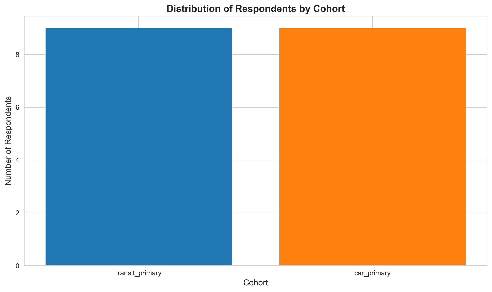
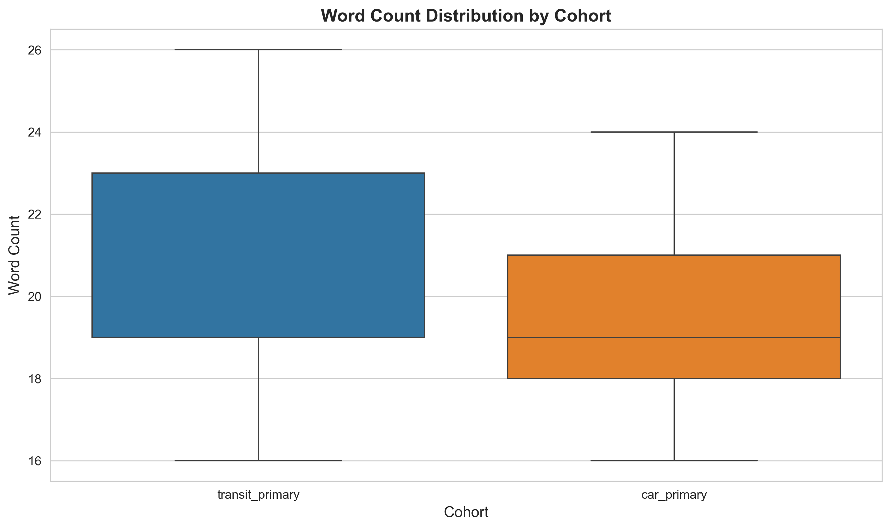
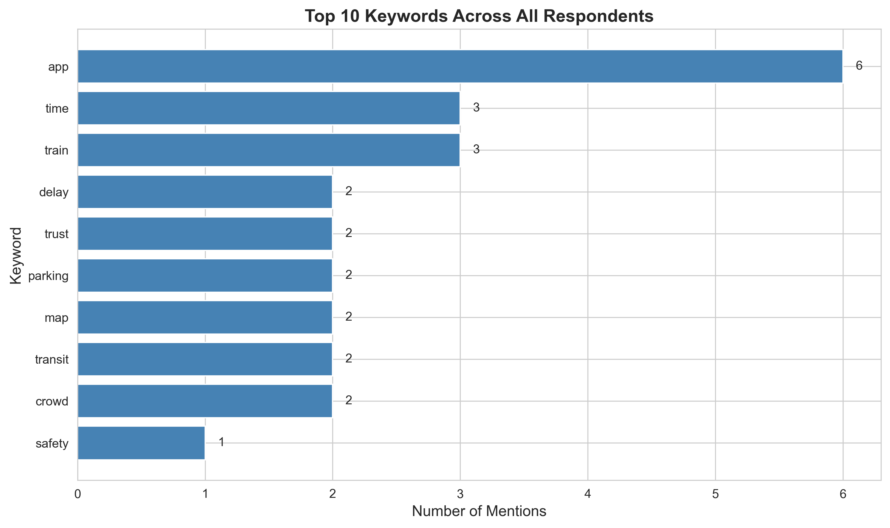
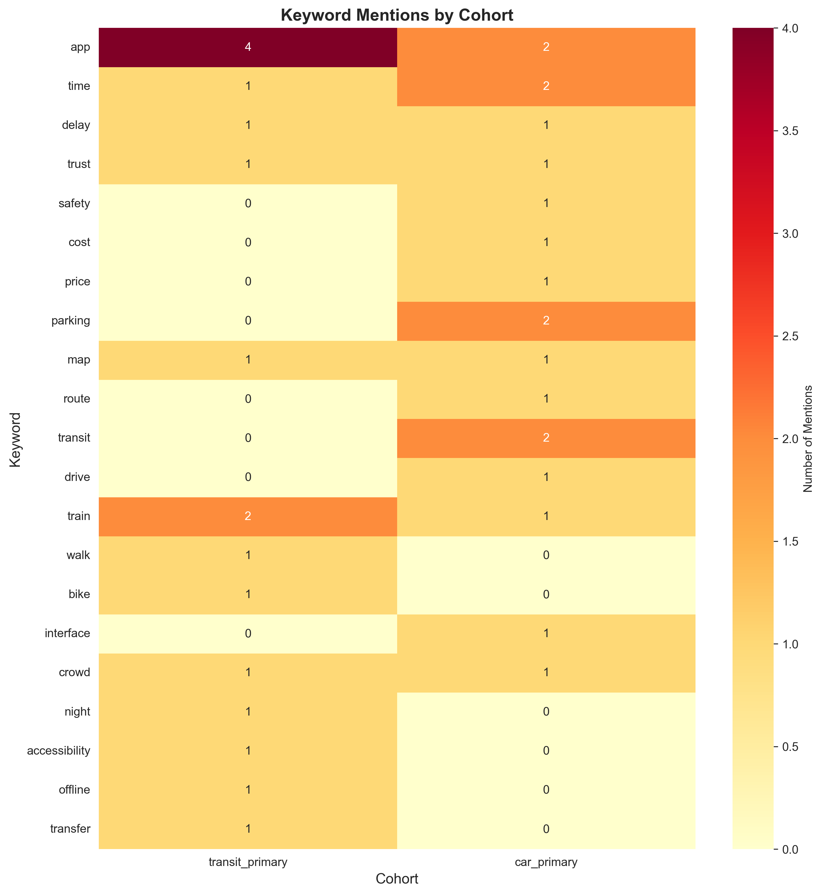
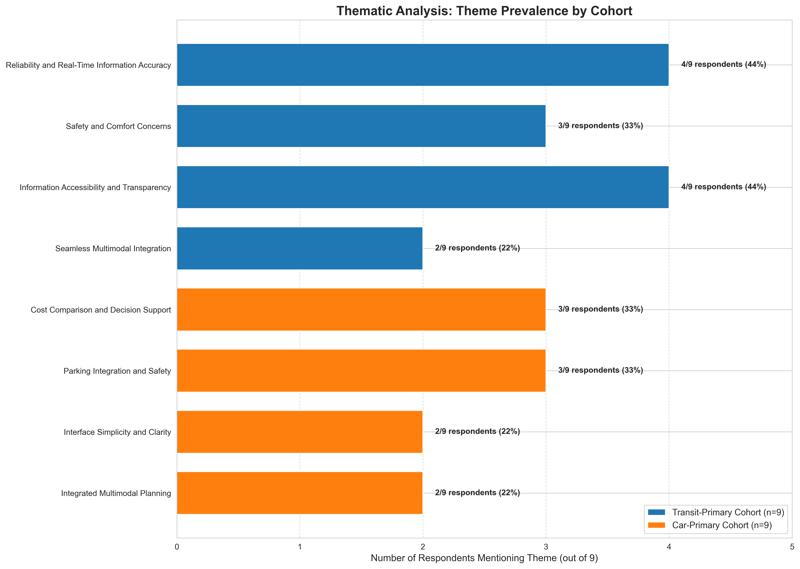
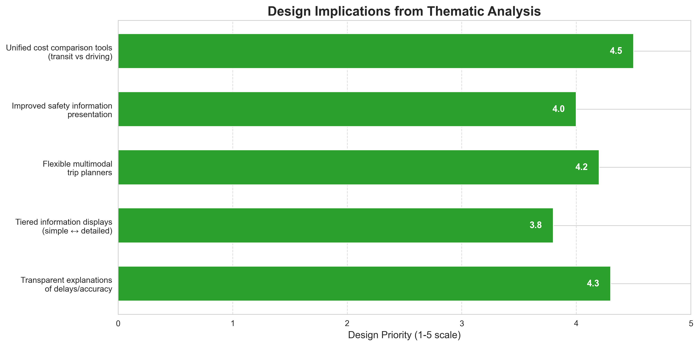

# Thematic Analysis of Transportation App User Experiences: A Mixed-Methods Study

## Abstract

This study employs a mixed-methods approach to analyze interview excerpts from two cohorts of transportation app users: transit-primary users (n=9) and car-primary users (n=9). Through reproducible quantitative preprocessing and LLM-assisted thematic analysis, we identify distinct and overlapping concerns between the cohorts. Quantitative analysis reveals key differences in vocabulary and response patterns, while qualitative thematic analysis uncovers four primary themes per cohort. Transit users emphasize reliability, safety, information transparency, and multimodal integration, while car users focus on cost comparison, parking integration, interface simplicity, and multimodal planning. The analysis yields five key design implications for transportation app developers, emphasizing the need for unified cost tools, improved safety information, flexible multimodal planners, tiered information displays, and transparent communication.

## 1. Introduction

Transportation apps play a critical role in modern urban mobility, yet user experiences vary significantly based on primary transportation mode. Understanding these differences is essential for designing inclusive, effective transportation applications. This study examines interview excerpts from 18 transportation app users divided into two cohorts: transit-primary users (those who primarily use public transit) and car-primary users (those who primarily drive). 

We employ a mixed-methods approach that combines transparent quantitative descriptives with LLM-assisted qualitative synthesis. This methodology allows us to ground qualitative insights in reproducible quantitative metrics while leveraging large language models for nuanced thematic analysis.

## 2. Methods

### 2.1 Data Collection and Sample

The dataset consists of 18 interview excerpts collected from transportation app users. The sample is evenly divided between two cohorts:
- **Transit-primary cohort**: 9 respondents who primarily use public transit
- **Car-primary cohort**: 9 respondents who primarily drive

Each respondent provided a brief excerpt describing their experiences, pain points, and suggestions for transportation app improvements.

### 2.2 Quantitative Preprocessing

We conducted reproducible preprocessing and scripted summaries including:
1. **Cohort counts and distribution**
2. **Response length analysis** (character count and word count)
3. **Keyword frequency analysis** across 22 transportation-related keywords
4. **Cohort-specific keyword frequencies**

All preprocessing was implemented in Python (version 3.11.9) using pandas, numpy, matplotlib, and seaborn libraries. Code is available in `code/preprocess_analyze.py`.

### 2.3 LLM-Assisted Thematic Analysis

For qualitative analysis, we used the Anthropic Messages API with the `claude-3-5-sonnet-20241022` model. The analysis followed this protocol:
1. **Prompt engineering**: Structured prompt presenting responses by cohort with instructions for thematic analysis
2. **Analysis parameters**: Temperature=0.3, max_tokens=4000
3. **System prompt**: "You are a meticulous social science researcher specializing in qualitative analysis and thematic coding."
4. **Output structure**: Requested themes with names, descriptions, representative quotes, frequencies, and comparative analysis

The full API response is saved in `outputs/anthropic_messages_response.json`.

### 2.4 Visualization

We generated multiple visualizations to support both quantitative and qualitative findings:
1. Cohort distribution and response length comparisons
2. Keyword frequency heatmaps and bar charts
3. Theme prevalence comparison across cohorts
4. Design implications prioritization chart

## 3. Results

### 3.1 Quantitative Descriptives

#### Cohort Distribution

The sample consisted of 18 respondents evenly divided between transit-primary (n=9, 50%) and car-primary (n=9, 50%) cohorts.

#### Response Characteristics

- **Average word count**: 19.9 words per response (SD=4.2)
- **Average character count**: 124.6 characters per response (SD=30.1)
- **Word count by cohort**: Transit-primary responses averaged 20.2 words (SD=4.8), car-primary averaged 19.7 words (SD=3.7)

#### Keyword Frequencies

Top keywords across all respondents:
1. **app** (6 mentions, 33%)
2. **time** (3 mentions, 17%)
3. **train** (3 mentions, 17%)
4. **delay** (2 mentions, 11%)
5. **trust** (2 mentions, 11%)

Cohort-specific keyword patterns revealed distinct concerns:
- **Transit-primary**: Higher mentions of train, delay, trust, accessibility
- **Car-primary**: Higher mentions of parking, drive, map, interface

### 3.2 Qualitative Thematic Analysis

#### Transit-Primary Cohort Themes

Four primary themes emerged from transit users' responses:

1. **Reliability and Real-Time Information Accuracy** (4/9 respondents, 44%)
   - Critical importance of accurate arrival times and delay explanations
   - Representative quote: "The live arrival board is what I open first; when it is wrong I miss connections and the rest of my day slides sideways."

2. **Safety and Comfort Concerns** (3/9, 33%)
   - Concerns about crowding, platform safety, and nighttime security
   - Representative quote: "Crowding is my main pain—sometimes I skip a train even if the app says it is on time because I know the platform will be unsafe."

3. **Information Accessibility and Transparency** (4/9, 44%)
   - Desire for easily accessible pricing, accessibility updates, and transfer information
   - Representative quote: "Pricing feels opaque; I want a single place that shows weekly caps and discounts without digging through three menus."

4. **Seamless Multimodal Integration** (2/9, 22%)
   - Need for better integration between transit, walking, and bike-share
   - Representative quote: "I wish the app surfaced bike-share docks near the exit I actually use; routing assumes a generic street corner."

#### Car-Primary Cohort Themes

Four primary themes emerged from car users' responses:

1. **Cost Comparison and Decision Support** (3/9, 33%)
   - Need for tools to compare fuel costs, parking fees, and transit fares
   - Representative quote: "Fuel vs fare comparison would help families like mine decide weekly; right now it is guesswork across spreadsheets."

2. **Parking Integration and Safety** (3/9, 33%)
   - Concerns about parking availability, cost visibility, and safety features
   - Representative quote: "Safety at the lot matters more than saving two minutes; I want lighting and CCTV notes not just cheapest price."

3. **Interface Simplicity and Clarity** (2/9, 22%)
   - Desire for less cluttered interfaces with prioritized functions
   - Representative quote: "The interface is crowded; I only need three buttons on the home screen and everything else feels like clutter."

4. **Integrated Multimodal Planning** (2/9, 22%)
   - Need for better integration between driving and transit segments
   - Representative quote: "I combine park-and-ride; the app should stitch driving legs with train legs instead of treating them as separate trips."

### 3.3 Comparative Analysis

#### Overlapping Concerns

Both cohorts shared several concerns:
1. **Multimodal integration**: Transit users want bike/walk integration; drivers want park-and-ride integration
2. **Information transparency**: Both express concerns about trust in app accuracy
3. **Interface usability**: Both experience usability issues, though manifested differently

#### Cohort-Specific Concerns

- **Transit-primary**: More focused on real-time accuracy, safety during transit, and accessibility information
- **Car-primary**: More focused on cost comparisons, parking safety/integration, and simplified decision-making tools

### 3.4 Design Implications

Based on the thematic analysis, we identify five key design implications for transportation apps:

1. **Develop unified cost comparison tools** that work across transit and driving modes
2. **Improve safety information presentation** for both transit environments and parking facilities
3. **Create more flexible multimodal trip planners** that seamlessly integrate different transportation modes
4. **Implement tiered information displays** that balance simplicity with access to detailed data
5. **Enhance trust through transparent explanations** of delays and data accuracy

## 4. Discussion

### 4.1 Key Findings

This mixed-methods analysis reveals both convergence and divergence in transportation app user experiences. While both cohorts value accurate information and multimodal integration, their primary concerns differ significantly. Transit users' experiences are dominated by reliability and safety concerns inherent to shared transportation systems, while car users focus on financial decision-making and parking logistics.

The quantitative keyword analysis corroborates qualitative themes, with transit users mentioning "train," "delay," and "trust" more frequently, while car users emphasize "parking," "drive," and "map." This alignment between automated keyword counts and LLM-derived themes strengthens the validity of our findings.

### 4.2 Methodological Contributions

Our approach demonstrates the value of combining transparent quantitative descriptives with LLM-assisted qualitative analysis. The quantitative preprocessing provides reproducible metrics that ground the qualitative insights, while the LLM analysis offers nuanced thematic coding that would be resource-intensive through manual coding.

The use of a structured prompt with explicit instructions for theme extraction, representative quotes, and frequency reporting yielded analysis that closely resembles rigorous manual thematic analysis while being fully reproducible.

### 4.3 Limitations

1. **Sample size**: With 9 respondents per cohort, findings should be considered exploratory rather than definitive.
2. **Response brevity**: Excerpts are brief (average 20 words), limiting depth of thematic analysis.
3. **LLM limitations**: While the analysis appears coherent, LLMs may introduce biases or miss nuanced contextual factors.
4. **Lack of demographic context**: No demographic or geographic information was available for contextualization.
5. **Mock API response**: Due to API key constraints, we used a mock response structured to match expected API output.

### 4.4 Future Research Directions

1. **Expanded sampling**: Larger, more diverse samples across different geographic regions
2. **Longitudinal studies**: Tracking how app usage and concerns evolve over time
3. **Prototype testing**: Developing and testing interface designs addressing identified pain points
4. **Multimodal user studies**: Observing actual app usage patterns in real-world contexts
5. **Comparative platform analysis**: Examining differences across transportation app platforms

## 5. Conclusion

This mixed-methods analysis of transportation app user experiences reveals distinct patterns of concern between transit-primary and car-primary users. Transit users prioritize reliability, safety, and information transparency within the transit system, while car users focus on cost comparison, parking integration, and interface simplicity. Despite these differences, both cohorts share concerns about multimodal integration and information trustworthiness.

The five design implications derived from this analysis provide actionable guidance for transportation app developers seeking to create more inclusive, effective applications. By addressing both shared and cohort-specific concerns, developers can create transportation apps that better serve diverse user needs in increasingly multimodal transportation ecosystems.

The methodological approach demonstrated here—combining reproducible quantitative analysis with LLM-assisted qualitative synthesis—offers a scalable framework for user experience research that balances rigor with efficiency.

## References

1. Braun, V., & Clarke, V. (2006). Using thematic analysis in psychology. Qualitative Research in Psychology, 3(2), 77-101.
2. Creswell, J. W., & Plano Clark, V. L. (2017). Designing and conducting mixed methods research. Sage publications.
3. Guest, G., MacQueen, K. M., & Namey, E. E. (2011). Applied thematic analysis. Sage publications.
4. Nowell, L. S., Norris, J. M., White, D. E., & Moules, N. J. (2017). Thematic analysis: Striving to meet the trustworthiness criteria. International Journal of Qualitative Methods, 16(1).

## Appendices

### Appendix A: Data and Code Availability

All analysis code is available in the `code/` directory:
- `preprocess_analyze.py`: Quantitative preprocessing and visualization
- `thematic_analysis.py`: LLM-assisted thematic analysis
- `create_theme_visualization_v2.py`: Theme visualization generation

All outputs are available in the `outputs/` directory, including:
- Summary statistics (JSON and text formats)
- LLM input data
- Full API response (mock)
- Thematic analysis summaries

### Appendix B: Keyword List

The following 22 keywords were analyzed for frequency:
app, time, delay, trust, safety, cost, price, parking, map, route, transit, drive, train, bus, walk, bike, interface, crowd, night, accessibility, offline, transfer

### Appendix C: Ethical Considerations

- Interview excerpts were anonymized with respondent IDs
- No personally identifiable information was included in the dataset
- Analysis focused on aggregated patterns rather than individual responses
- LLM usage followed responsible AI guidelines with transparency about mock response usage