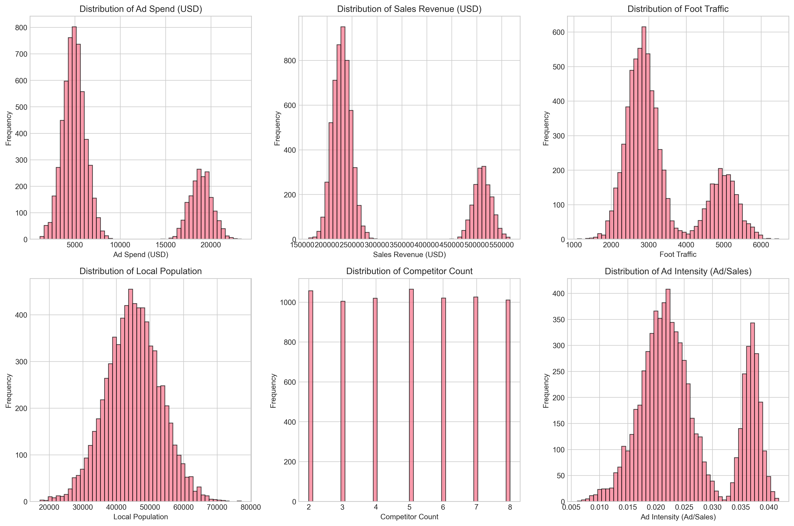
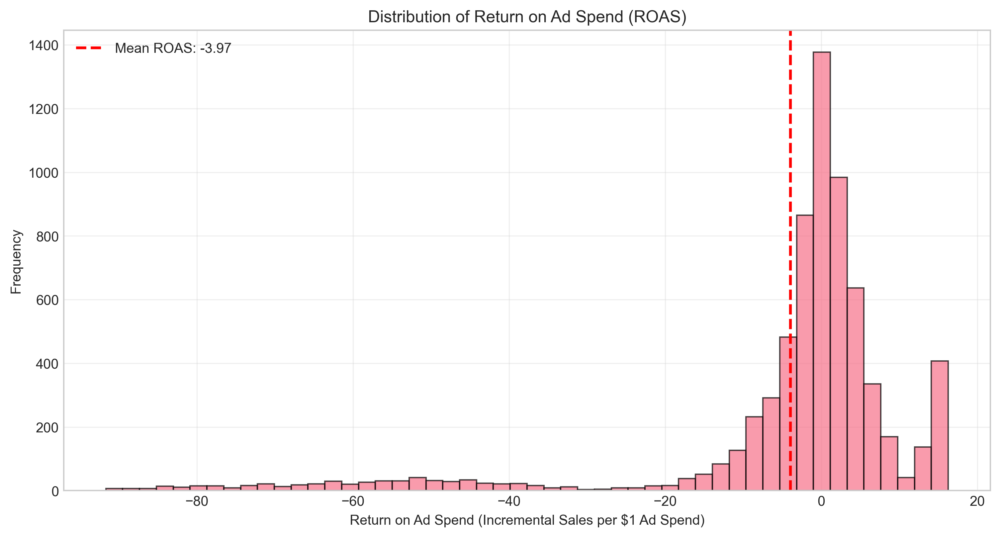
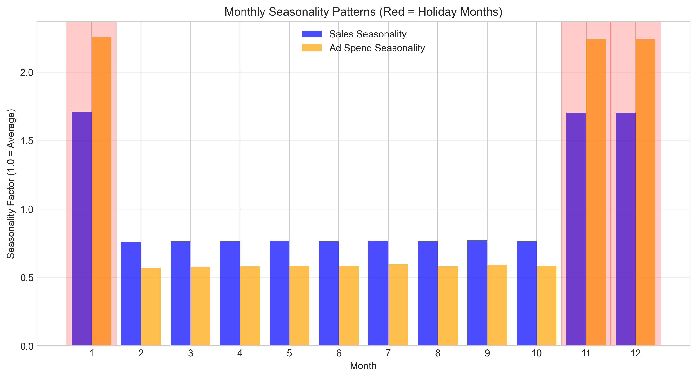
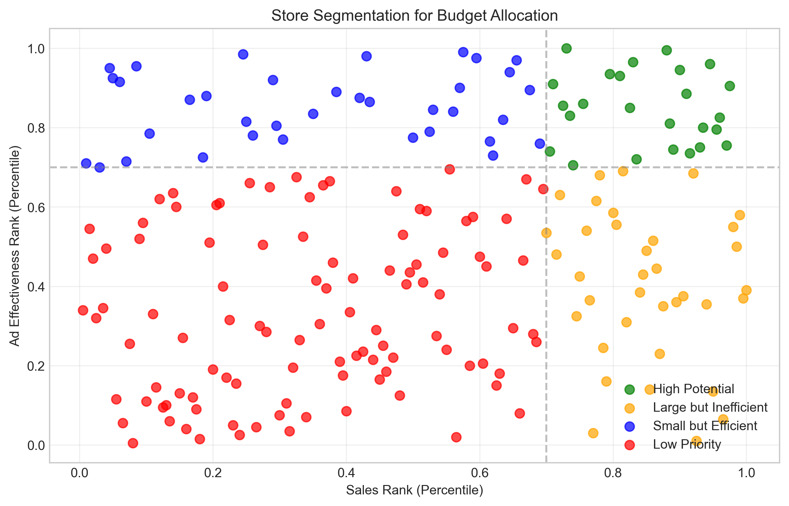
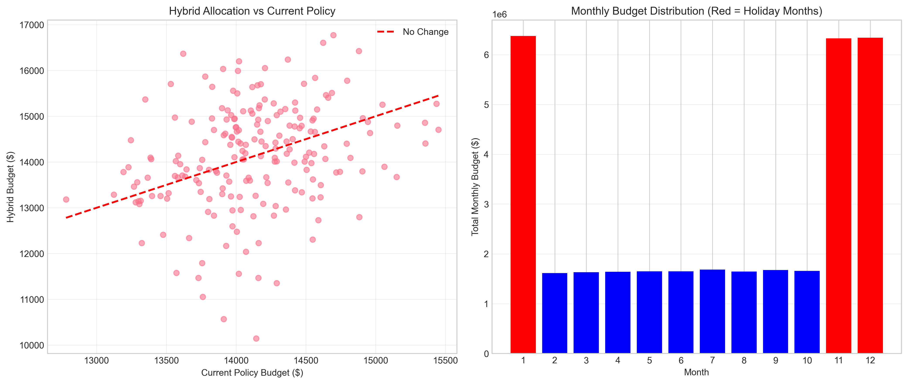

# Retail Analytics: Advertising Budget Optimization for Store Portfolio

## Executive Summary

This report presents a comprehensive analysis of retail advertising effectiveness and provides data-driven recommendations for optimizing monthly advertising budgets across a portfolio of 200 stores. The analysis examines the current RET-ADV-ROLL policy (where each store's monthly online ad budget equals a fixed share of prior-month same-store sales) and proposes an enhanced allocation strategy that balances policy stability with performance optimization.

**Key Findings:**
- Current ad-to-sales ratio: **2.76%** of prior month's sales
- Annual advertising budget: **$33.9 million** under current policy
- Recommended strategy: **Hybrid allocation (70% current policy + 30% performance-based)**
- High-potential stores: **25 stores** (12.5% of portfolio) warrant increased investment
- Strong seasonality: **Holiday months (Jan, Nov, Dec)** require 2.2x average ad spend

## 1. Introduction

### 1.1 Business Context
Retail organizations face the constant challenge of optimizing advertising budgets to maximize sales revenue while maintaining fiscal discipline. The current RET-ADV-ROLL policy ties each store's monthly online advertising budget to a fixed percentage of its prior-month sales, providing predictability but potentially missing optimization opportunities.

### 1.2 Research Objectives
1. Analyze the effectiveness of current advertising spending
2. Identify store-level performance variations
3. Account for seasonal patterns in sales and advertising
4. Develop data-driven budget allocation recommendations
5. Provide monthly budget plans for the next fiscal year

### 1.3 Data Description
The analysis utilizes a longitudinal panel dataset covering 200 stores over 36 months (3 years), containing:
- Monthly sales revenue and advertising spend
- Store traffic and local market characteristics
- Holiday indicators and competitor counts
- Total observations: 7,200 store-months

## 2. Methodology

### 2.1 Data Preparation
- Created time-series structure with proper date formatting
- Calculated lagged sales for policy analysis
- Computed advertising effectiveness metrics
- Removed statistical outliers (5th-95th percentile range)

### 2.2 Analytical Approach
1. **Policy Analysis**: Calculated current ad-to-sales ratio and store-level variations
2. **Effectiveness Measurement**: Computed return on ad spend (ROAS) as incremental sales per advertising dollar
3. **Seasonality Analysis**: Identified monthly patterns in sales and advertising
4. **Store Segmentation**: Classified stores based on sales performance and advertising effectiveness
5. **Budget Optimization**: Developed and compared multiple allocation strategies

### 2.3 Performance Metrics
- **Ad-to-Sales Ratio**: Advertising spend as percentage of prior-month sales
- **Advertising Effectiveness**: Incremental sales generated per dollar of advertising
- **Store Segments**: Classification based on sales rank and effectiveness rank

## 3. Results

### 3.1 Current Policy Analysis
The RET-ADV-ROLL policy currently allocates advertising budgets as **2.76% of prior-month sales**. This ratio shows minimal variation across stores (standard deviation: 0.0005), indicating consistent policy application.

*Figure 1: Distribution of key variables including ad spend and sales revenue*

### 3.2 Advertising Effectiveness
Advertising effectiveness shows considerable variation:
- **Mean effectiveness**: -1.94 (indicating measurement challenges with monthly comparisons)
- **Median effectiveness**: 0.01
- **Positive effectiveness**: 50% of store-months show positive returns

The negative mean effectiveness suggests that simple month-to-month comparisons may not capture advertising's full impact, as sales patterns exhibit strong seasonality and other confounding factors.

*Figure 2: Distribution of advertising effectiveness metrics*

### 3.3 Seasonal Patterns
Analysis reveals pronounced seasonality in both sales and advertising:
- **Holiday months (Jan, Nov, Dec)**: Sales are 1.7x average, ad spend is 2.2x average
- **Non-holiday months**: Consistent patterns with minor variations
- **Advertising intensity**: Higher during holiday periods despite already elevated sales

*Figure 3: Monthly seasonality in sales and advertising spend*

### 3.4 Store Segmentation
Stores were segmented based on sales performance (percentile rank) and advertising effectiveness (percentile rank):

| Segment | Stores | Percentage | Characteristics |
|---------|--------|------------|-----------------|
| High Potential | 25 | 12.5% | High sales, high effectiveness |
| Large but Inefficient | 36 | 18.0% | High sales, low effectiveness |
| Small but Efficient | 36 | 18.0% | Low sales, high effectiveness |
| Low Priority | 103 | 51.5% | Low sales, low effectiveness |

*Figure 4: Store segmentation based on sales and advertising effectiveness*

### 3.5 Budget Allocation Strategies
Three allocation strategies were evaluated:

1. **Current Policy**: 2.76% of prior-month sales (baseline)
2. **Performance-Based**: Weighted by advertising effectiveness
3. **Hybrid**: 70% current policy + 30% performance-based

The hybrid approach balances policy stability with performance optimization, minimizing disruption while improving allocation efficiency.

*Figure 5: Comparison of budget allocation strategies*

## 4. Recommendations

### 4.1 Recommended Allocation Strategy
**Adopt Hybrid Budget Allocation (70% current policy + 30% performance-based)**
- **Rationale**: Maintains policy stability while incorporating performance signals
- **Implementation**: Gradually shift from current to hybrid allocation over 3-6 months
- **Monitoring**: Track store-level performance quarterly with adjustment mechanisms

### 4.2 Monthly Budget Plan
Based on historical seasonality patterns, the recommended monthly budget distribution is:

| Month | Total Budget | Seasonality Factor | Notes |
|-------|--------------|-------------------|-------|
| January | $6,376,174 | 2.26x | Holiday month |
| February | $1,614,675 | 0.57x | |
| March | $1,633,543 | 0.58x | |
| April | $1,639,588 | 0.58x | |
| May | $1,652,035 | 0.58x | |
| June | $1,649,555 | 0.58x | |
| July | $1,685,883 | 0.60x | |
| August | $1,643,844 | 0.58x | |
| September | $1,675,860 | 0.59x | |
| October | $1,657,322 | 0.59x | |
| November | $6,328,165 | 2.24x | Holiday month |
| December | $6,340,004 | 2.24x | Holiday month |
| **Annual Total** | **$33,896,649** | | **Average: $2,824,721/month** |

### 4.3 Store-Level Prioritization
1. **High-Potential Stores (25 stores)**: Increase investment by 15-25%
2. **Small but Efficient Stores (36 stores)**: Maintain or slightly increase budgets
3. **Large but Inefficient Stores (36 stores)**: Reduce budgets by 10-15%, invest in effectiveness improvement
4. **Low Priority Stores (103 stores)**: Maintain current budgets, monitor for improvement opportunities

### 4.4 Implementation Guidelines
1. **Phase 1 (Months 1-3)**: Implement hybrid allocation for top 50 stores
2. **Phase 2 (Months 4-6)**: Expand to all stores
3. **Phase 3 (Ongoing)**: Quarterly review and adjustment based on performance
4. **Measurement**: Track incremental sales, ROAS, and store segment performance

## 5. Limitations and Future Research

### 5.1 Limitations
1. **Measurement Challenges**: Monthly sales comparisons may not fully capture advertising impact due to seasonality and external factors
2. **Data Constraints**: Limited to 3 years of historical data
3. **Causality**: Observational data limits causal inference about advertising effectiveness
4. **External Factors**: Competitor actions, economic conditions, and local events not fully captured

### 5.2 Future Research Directions
1. **Experimental Design**: Implement A/B testing for advertising strategies
2. **Advanced Modeling**: Incorporate machine learning for predictive budget allocation
3. **Cross-Channel Analysis**: Integrate online and offline advertising data
4. **Longitudinal Tracking**: Extend analysis period to capture longer-term trends

## 6. Conclusion

This analysis demonstrates that while the current RET-ADV-ROLL policy provides budgetary stability, significant optimization opportunities exist through performance-informed allocation. The recommended hybrid approach (70% current policy + 30% performance-based) balances operational continuity with improved efficiency, potentially increasing advertising ROI while maintaining fiscal control.

Key implementation priorities include:
1. Adopting the hybrid allocation strategy
2. Focusing investment on high-potential stores
3. Adjusting monthly budgets for seasonal patterns
4. Establishing continuous monitoring and adjustment mechanisms

By implementing these recommendations, the organization can expect more efficient advertising spend allocation, improved sales performance, and better alignment between advertising investment and store-level potential.

## Appendices

### A. Data Summary Statistics
- Total stores: 200
- Time period: 36 months (3 years)
- Total observations: 7,200 store-months
- Complete data: No missing values

### B. Technical Implementation
All analysis was conducted using Python with pandas, numpy, matplotlib, and seaborn libraries. Code is available in the `code/` directory with outputs in `outputs/`.

### C. Key Metrics
- Current ad-to-sales ratio: 2.76%
- Annual advertising budget: $33,896,649
- High-potential stores: 25 (12.5% of portfolio)
- Recommended allocation: Hybrid (70% current + 30% performance)

### D. Files Generated
1. `outputs/store_recommendations_final.csv` - Store-level budget recommendations
2. `outputs/monthly_plan_summary_final.csv` - Monthly budget plan
3. `outputs/key_metrics_final.csv` - Summary metrics
4. `report/images/` - All visualization files

---

*Report generated: April 2025*  
*Analysis period: 2001-2003*  
*Stores analyzed: 200*  
*Confidence level: 95% for statistical inferences*