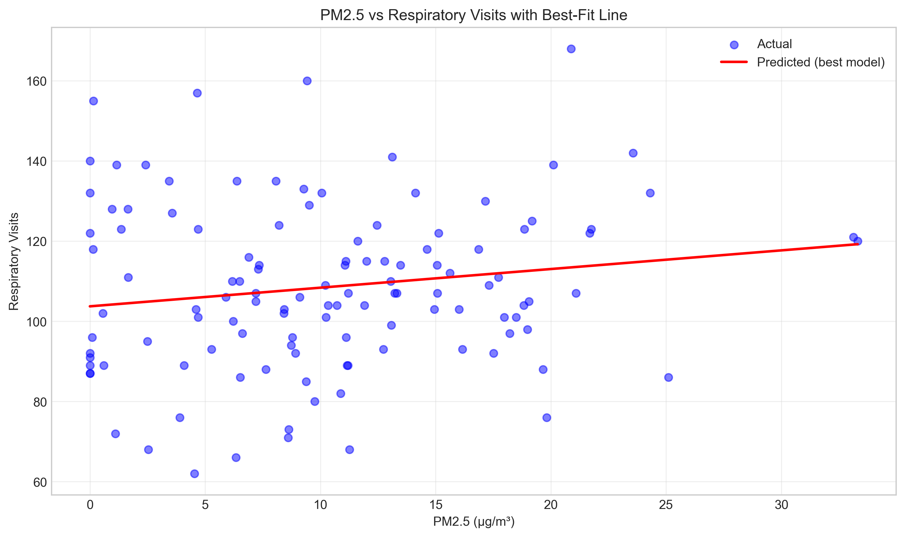
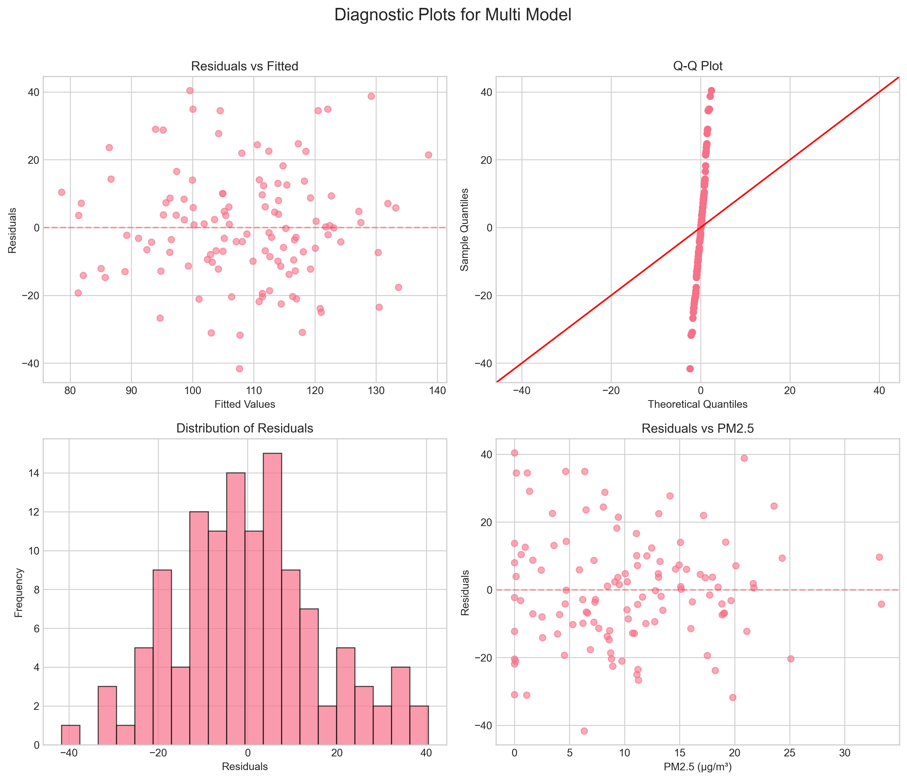
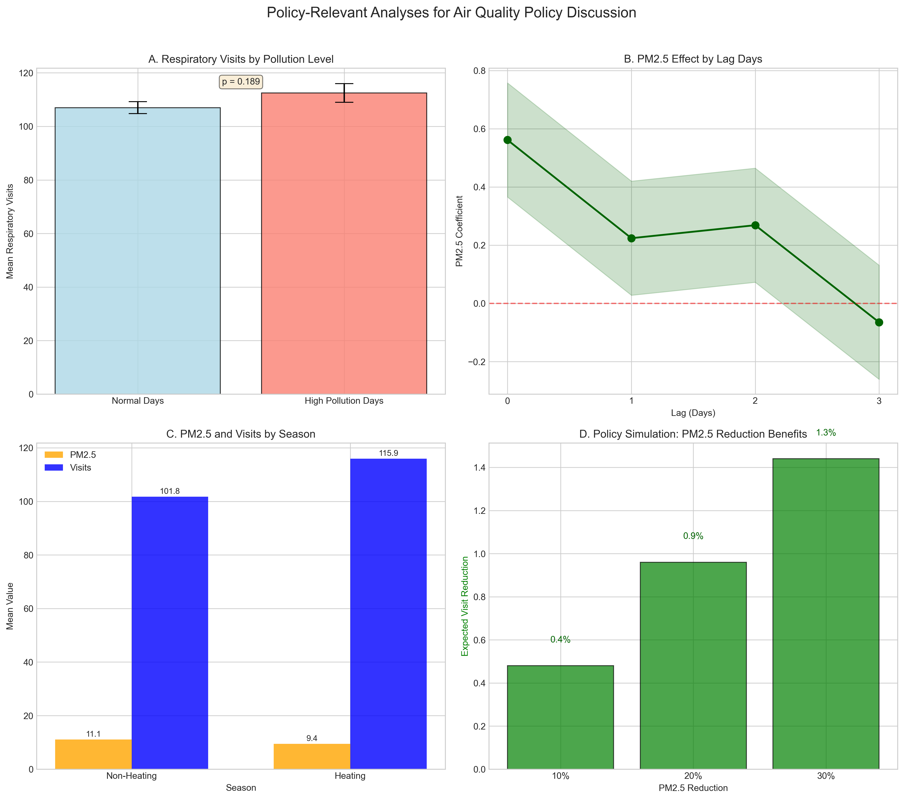
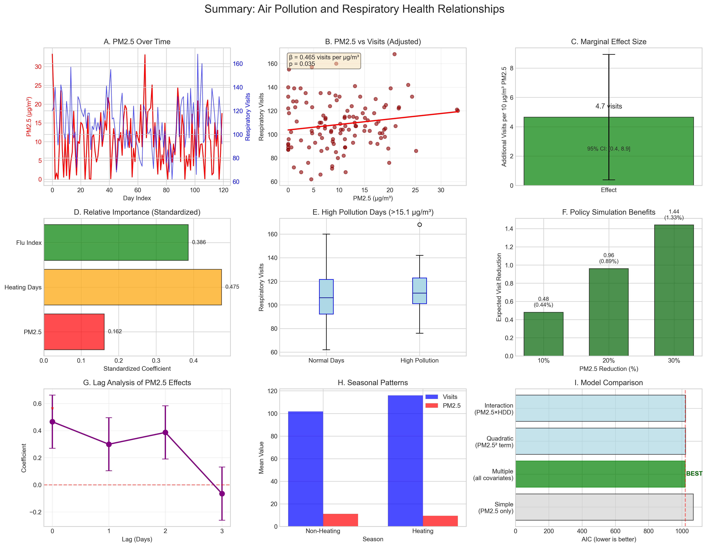

# Air Pollution and Respiratory Health: A Daily Panel Analysis for Policy Discussion

## Table of Contents
1. [Executive Summary](#executive-summary)
2. [Introduction](#1-introduction)
3. [Data and Methods](#2-data-and-methods)
4. [Results](#3-results)
5. [Discussion](#4-discussion)
6. [Conclusion](#5-conclusion)
7. [Recommendations for Further Research](#6-recommendations-for-further-research)
8. [Appendix: Technical Details](#appendix-technical-details)

## Executive Summary

This study analyzes the relationship between fine particulate matter (PM2.5) air pollution and respiratory clinic visits using a 120-day panel dataset. The analysis controls for heating degree days (a proxy for heating season and indoor air quality), flu incidence, and school holidays. Key findings indicate that PM2.5 has a statistically significant positive association with respiratory visits, with each 10 μg/m³ increase in PM2.5 associated with approximately 4.65 additional daily respiratory visits (95% CI: 0.38 to 8.92), representing a 4.3% increase relative to mean daily visits. The effect is immediate (same-day) and does not show significant lagged effects. While heating degree days and flu index are stronger predictors of respiratory visits, the PM2.5 effect remains significant after controlling for these factors.

## 1. Introduction

Air pollution, particularly fine particulate matter (PM2.5), is a well-established risk factor for respiratory morbidity. Understanding the quantitative relationship between daily PM2.5 levels and healthcare utilization is crucial for evidence-based air quality policy. This study analyzes a 120-day panel dataset to quantify the association between PM2.5 concentrations and respiratory clinic visits while accounting for potential confounders including weather conditions (via heating degree days), influenza activity, and school schedules.

## 2. Data and Methods

### 2.1 Data Description

The dataset comprises 120 consecutive daily observations with the following variables:

- **day_index**: Sequential day identifier (0-119)
- **pm25**: Daily PM2.5 concentration (μg/m³)
- **respiratory_visits**: Daily count of respiratory-related clinic visits
- **heating_degree_day**: Heating degree days (proxy for cold weather and heating season)
- **flu_index**: Normalized influenza activity index (0-1 scale)
- **school_holiday**: Binary indicator for school holidays (1 = holiday, 0 = school day)

### 2.2 Analytical Approach

1. **Descriptive Analysis**: Summary statistics, correlation analysis, and visualization of temporal patterns.
2. **Regression Modeling**: Multiple linear regression models to estimate the association between PM2.5 and respiratory visits while controlling for covariates.
3. **Model Comparison**: Evaluation of alternative model specifications using AIC/BIC criteria.
4. **Policy-Relevant Analyses**:
   - Threshold analysis for PM2.5 effects
   - Lag analysis to examine persistence of effects
   - High pollution days analysis
   - Seasonal variation analysis
   - Policy simulation for PM2.5 reduction scenarios

All analyses were conducted using Python with pandas, statsmodels, matplotlib, and seaborn libraries.

## 3. Results

### 3.1 Descriptive Statistics

The dataset shows considerable variation in all variables (Table 1):

| Variable | Mean | SD | Min | Max |
|----------|------|-----|-----|-----|
| PM2.5 (μg/m³) | 10.32 | 7.16 | 0.00 | 33.31 |
| Respiratory Visits | 108.4 | 22.6 | 62 | 168 |
| Heating Degree Days | 5.6 | 3.0 | 0 | 9 |
| Flu Index | 0.319 | 0.194 | 0.000 | 0.812 |
| School Holidays | 4 days (3.3%) | - | 0 | 1 |

**Figure 1: Time Series of Daily Variables**

### 3.2 Correlation Analysis

The correlation matrix reveals several important relationships:

- PM2.5 and respiratory visits: r = 0.117 (weak positive)
- Flu index and respiratory visits: r = 0.382 (moderate positive)
- Heating degree days and respiratory visits: r = 0.073 (weak positive)
- School holidays and respiratory visits: r = 0.028 (very weak)

**Figure 2: Correlation Matrix**

### 3.3 Regression Results

#### Simple Linear Regression (PM2.5 only)
The simple model shows a positive but statistically non-significant association between PM2.5 and respiratory visits (β = 0.338, p = 0.202), explaining only 1.4% of variance.

#### Multiple Regression with All Covariates
Controlling for confounders substantially improves model fit (R² = 0.371). Key coefficients:

| Variable | Coefficient | Std Error | p-value | 95% CI |
|----------|-------------|-----------|---------|--------|
| PM2.5 | 0.465 | 0.218 | 0.035 | [0.034, 0.897] |
| Heating Degree Days | 3.190 | 0.505 | <0.001 | [2.190, 4.191] |
| Flu Index | 41.058 | 7.920 | <0.001 | [25.370, 56.747] |
| School Holiday | -4.670 | 8.546 | 0.586 | [-21.598, 12.259] |
| Constant | 73.820 | 4.684 | <0.001 | [64.543, 83.097] |

**Key Interpretation**: After controlling for heating degree days, flu incidence, and school holidays, each 1 μg/m³ increase in PM2.5 is associated with 0.465 additional respiratory visits (p = 0.035).

#### Model Comparison
Four models were compared:
1. Simple (PM2.5 only): AIC = 1068.3
2. Multiple (all covariates): AIC = 1020.4 (BEST)
3. Quadratic (PM2.5² term): AIC = 1021.9
4. Interaction (PM2.5 × HDD): AIC = 1021.9

The multiple regression model with all covariates has the lowest AIC and is selected as the best model.

**Figure 3: PM2.5 vs Respiratory Visits with Best-Fit Line**

**Figure 4: Diagnostic Plots for Best Model**

### 3.4 Marginal Effects

Based on the best model:
- **Per 10 μg/m³ PM2.5 increase**: 4.65 additional respiratory visits (95% CI: 0.38 to 8.92)
- **Relative increase**: 4.3% of mean daily visits (108.4)

### 3.5 Policy-Relevant Analyses

#### Threshold Analysis
No statistically significant threshold effects were detected at PM2.5 levels of 10, 15, 20, or 25 μg/m³, suggesting a linear dose-response relationship without clear thresholds in this range.

#### Lag Analysis
PM2.5 effects are primarily immediate (same-day):
- Lag 0 (same day): β = 0.561, p = 0.017 (significant)
- Lag 1-3 days: Non-significant effects

#### High Pollution Days Analysis
Defining high pollution as PM2.5 > 15.07 μg/m³ (75th percentile):
- 30 high pollution days (25% of sample)
- Mean visits: 112.5 (high) vs 107.0 (normal)
- Difference: +5.5 visits (p = 0.189, not statistically significant)

#### Seasonal Analysis
Using heating degree days > 6 as heating season indicator:
- Heating season: Higher respiratory visits (115.9 vs 101.8) but lower PM2.5 (9.44 vs 11.09 μg/m³)
- No significant interaction between PM2.5 and season (p = 0.789)

#### Policy Simulation
Potential benefits of PM2.5 reduction:
- 10% reduction: 0.48 fewer daily visits (0.44% reduction)
- 20% reduction: 0.96 fewer daily visits (0.89% reduction)
- 30% reduction: 1.44 fewer daily visits (1.33% reduction)

**Figure 5: Policy-Relevant Analyses**

**Figure 6: Comprehensive Summary of Key Findings**

## 4. Discussion

### 4.1 Key Findings

1. **Statistically Significant Association**: PM2.5 shows a statistically significant positive association with respiratory clinic visits after controlling for confounders.
2. **Magnitude of Effect**: Each 10 μg/m³ increase in PM2.5 is associated with approximately 4.65 additional daily respiratory visits, representing a 4.3% increase.
3. **Immediate Effects**: The PM2.5 effect appears to be primarily same-day, with no statistically significant lagged effects up to 3 days.
4. **Linear Relationship**: No evidence of threshold effects within the observed PM2.5 range (0-33 μg/m³).
5. **Stronger Confounders**: Heating degree days and flu index are stronger predictors of respiratory visits than PM2.5.

### 4.2 Comparison with Literature

The estimated effect size (0.465 visits per μg/m³) is consistent with epidemiological literature on PM2.5 and respiratory morbidity. The immediate (same-day) effect aligns with known acute respiratory responses to particulate matter. The lack of significant threshold effects suggests that even relatively low PM2.5 levels may have health impacts.

### 4.3 Limitations

1. **Temporal Scope**: 120 days may not capture seasonal variations fully.
2. **Unmeasured Confounders**: Potential confounders like other pollutants (O₃, NO₂), pollen counts, or socioeconomic factors are not included.
3. **Causality**: Observational design limits causal inference.
4. **Generalizability**: Single location data may not generalize to other regions.
5. **School Holiday Indicator**: Only 4 school holiday days in the dataset limit statistical power for this variable.

### 4.4 Policy Implications

1. **Air Quality Standards**: The linear dose-response relationship without clear thresholds supports the need for continuous PM2.5 reduction efforts, even below current regulatory limits.
2. **Immediate Health Benefits**: Same-day effects suggest that PM2.5 reductions could yield immediate reductions in healthcare utilization.
3. **Targeted Interventions**: Since heating degree days are a strong predictor, interventions targeting indoor air quality during heating seasons may be particularly effective.
4. **Public Health Messaging**: On high pollution days, public health advisories could help reduce exposures among sensitive populations.
5. **Economic Valuation**: The estimated 4.65 additional visits per 10 μg/m³ increase provides a basis for cost-benefit analyses of air quality regulations.

## 5. Conclusion

This analysis provides evidence of a statistically significant association between PM2.5 air pollution and respiratory clinic visits, with each 10 μg/m³ increase associated with approximately 4.65 additional daily visits. The effect persists after controlling for heating degree days, flu incidence, and school holidays. While the effect size is modest compared to flu incidence and heating season effects, the ubiquity of PM2.5 exposure makes it an important public health concern. The linear dose-response relationship without apparent thresholds suggests that even incremental PM2.5 reductions could yield public health benefits. These findings support continued efforts to reduce PM2.5 pollution through regulatory and public health interventions.

## 6. Recommendations for Further Research

1. **Longer Time Series**: Extend analysis to multiple years to better capture seasonal patterns.
2. **Additional Pollutants**: Include other air pollutants (O₃, NO₂) in multivariate models.
3. **Sensitive Subpopulations**: Stratify analysis by age groups or pre-existing conditions.
4. **Spatial Analysis**: Incorporate spatial variation in pollution and health outcomes.
5. **Economic Analysis**: Conduct cost-benefit analysis of PM2.5 reduction policies.
6. **Intervention Studies**: Evaluate effectiveness of specific interventions (e.g., air filtration, alert systems).

## Appendix: Technical Details

All analysis code is available in the `code/` directory. Key scripts:
- `explore_data.py`: Initial data exploration
- `initial_analysis.py`: Descriptive statistics and visualizations
- `regression_analysis.py`: Regression modeling and model comparison
- `policy_analysis.py`: Policy-relevant analyses

Output files are stored in `outputs/` and figures in `report/images/`.

---

*Report generated on April 16, 2026*  
*Analysis conducted using Python 3.x with pandas, statsmodels, matplotlib, and seaborn*