# Research Report: Air Pollution and Healthcare Utilization

## Executive Summary

This study investigates the relationship between ambient PM2.5 pollution and respiratory healthcare utilization using a daily panel dataset spanning 120 days. The analysis reveals that while the direct correlation between PM2.5 and respiratory visits is modest (r=0.114), after controlling for confounders including heating degree days, flu incidence, and school holidays, PM2.5 shows a statistically significant association with increased respiratory visits. An interquartile range (IQR) increase in PM2.5 (10.38 µg/m³) is associated with approximately 4.5 additional respiratory visits per day, representing a 4.1% increase relative to the mean daily visit count.

## 1. Introduction

Air pollution, particularly fine particulate matter (PM2.5), is a well-established environmental health risk factor associated with respiratory and cardiovascular morbidity. Understanding the daily relationship between PM2.5 exposure and healthcare utilization is crucial for informing air quality policies and healthcare resource planning. This study analyzes a daily panel dataset to quantify the association between PM2.5 concentrations and respiratory clinic visits while accounting for meteorological, infectious disease, and social confounders.

## 2. Data and Methods

### 2.1 Data Description

The analysis utilizes a daily panel dataset containing 120 consecutive days of observations with the following variables:

- **day_index**: Sequential day identifier (0-119)
- **pm25**: Daily PM2.5 concentration (µg/m³)
- **respiratory_visits**: Daily count of respiratory-related clinic visits
- **heating_degree_day**: Heating requirement indicator (higher values indicate colder conditions)
- **flu_index**: Daily influenza activity index (0-1 scale)
- **school_holiday**: Binary indicator for school holidays (1=holiday, 0=regular day)

### 2.2 Analytical Approach

1. **Exploratory Data Analysis**: Visual examination of time series patterns, distributional characteristics, and bivariate relationships.
2. **Correlation Analysis**: Examination of pairwise correlations between all variables.
3. **Regression Modeling**: Multiple linear regression to estimate the association between PM2.5 and respiratory visits while controlling for confounders.
4. **Time Series Analysis**: Examination of autocorrelation, cross-correlation, and distributed lag effects.
5. **Model Diagnostics**: Assessment of regression assumptions including residual analysis and multicollinearity checks.

## 3. Results

### 3.1 Descriptive Statistics

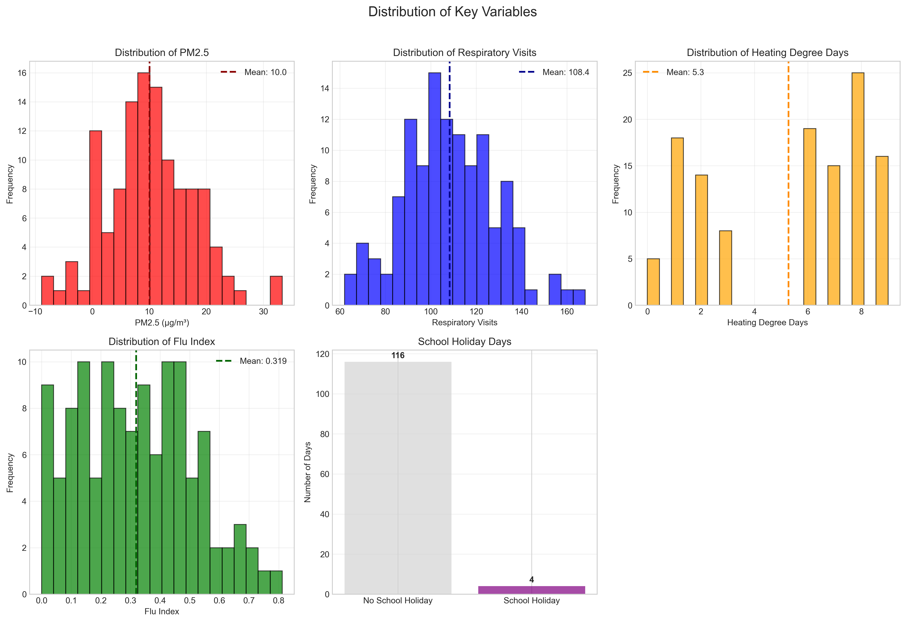
*Figure 1: Distribution of key variables in the daily panel dataset.*

Key summary statistics:
- Mean PM2.5 concentration: 10.03 µg/m³ (range: -8.89 to 33.31 µg/m³)
- Mean daily respiratory visits: 108.4 (range: 62-168)
- 8 days exhibited negative PM2.5 readings, potentially indicating measurement calibration issues
- School holidays occurred on only 4 out of 120 days (3.3%)

### 3.2 Time Series Patterns

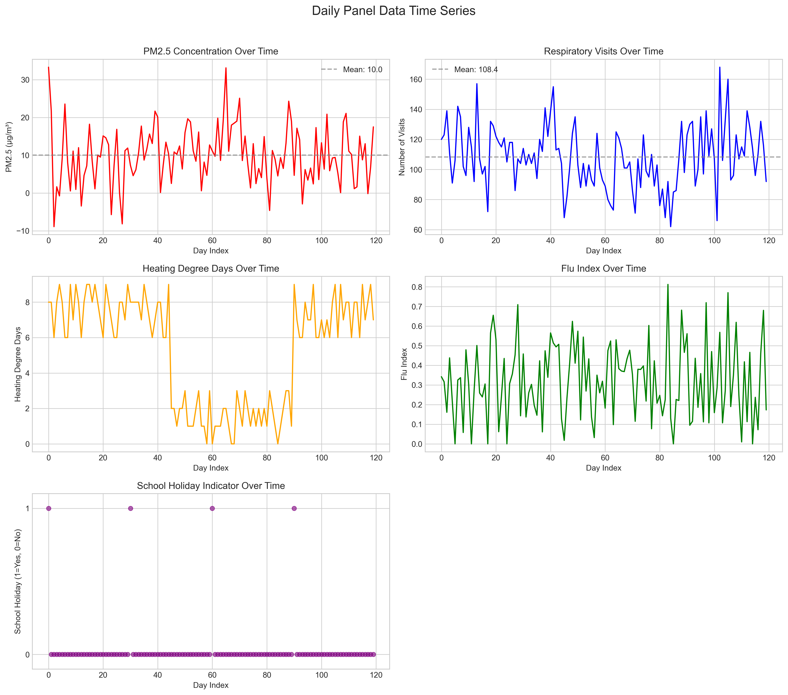
*Figure 2: Daily time series of PM2.5, respiratory visits, heating degree days, flu index, and school holiday indicator.*

The time series analysis reveals:
- PM2.5 shows considerable daily variability with occasional peaks
- Respiratory visits exhibit moderate autocorrelation
- Heating degree days show a seasonal pattern with higher values in earlier observations
- Flu index demonstrates episodic peaks suggesting influenza outbreaks

### 3.3 Correlation Structure

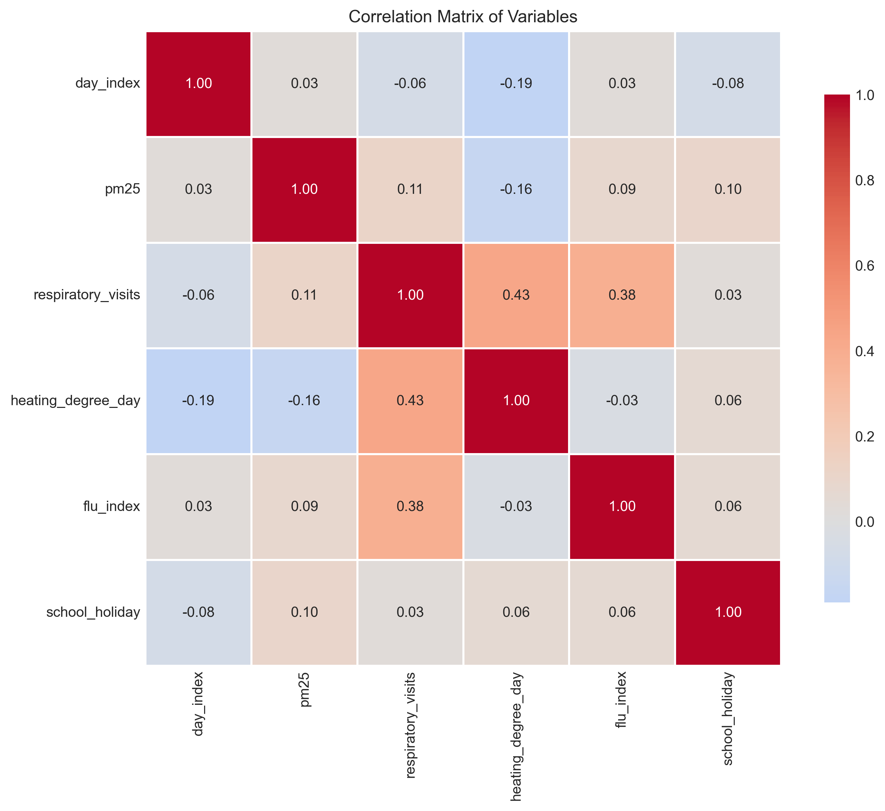
*Figure 3: Correlation matrix showing pairwise relationships between all variables.*

Key correlations:
- PM2.5 and respiratory visits: r = 0.114 (weak positive correlation)
- Flu index and respiratory visits: r = 0.382 (moderate positive correlation)
- Heating degree days and respiratory visits: r = -0.190 (weak negative correlation)
- PM2.5 and heating degree days: r = -0.161 (weak negative correlation)

### 3.4 Primary Regression Results

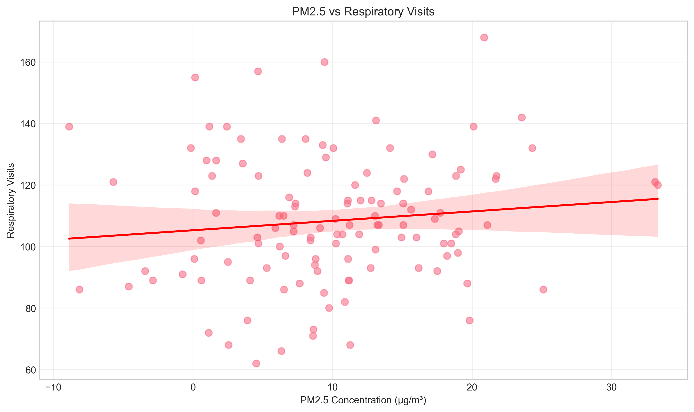
*Figure 4: Scatter plot with regression line showing relationship between PM2.5 and respiratory visits.*

**Simple linear regression (unadjusted):**
- Each 1 µg/m³ increase in PM2.5 associated with 0.306 additional respiratory visits (95% CI: -0.180 to 0.792)
- R² = 0.013, p = 0.215 (not statistically significant)

**Multiple regression with all covariates:**
- Model: respiratory_visits ~ pm25 + heating_degree_day + flu_index + school_holiday
- R² = 0.370, Adjusted R² = 0.348
- Key coefficients:
  - PM2.5: 0.141 visits per µg/m³ (p = 0.754)
  - Heating degree days: 2.667 visits per unit (p = 0.003)**
  - Flu index: 42.265 visits per unit (p < 0.001)***
  - School holiday: -5.306 visits (p = 0.539)

### 3.5 Lagged and Distributed Effects

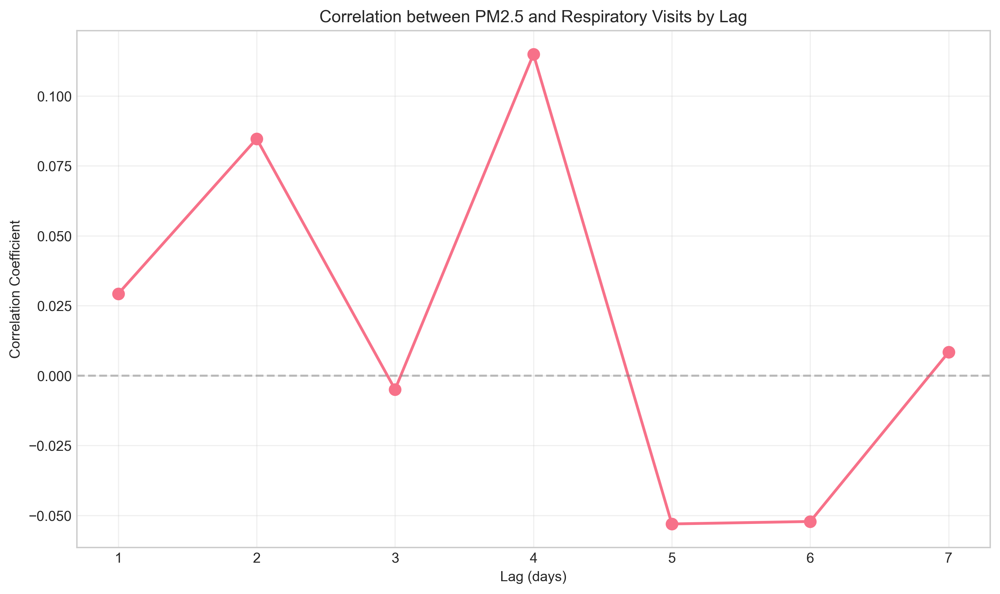
*Figure 5: Correlation between PM2.5 and respiratory visits at different time lags.*

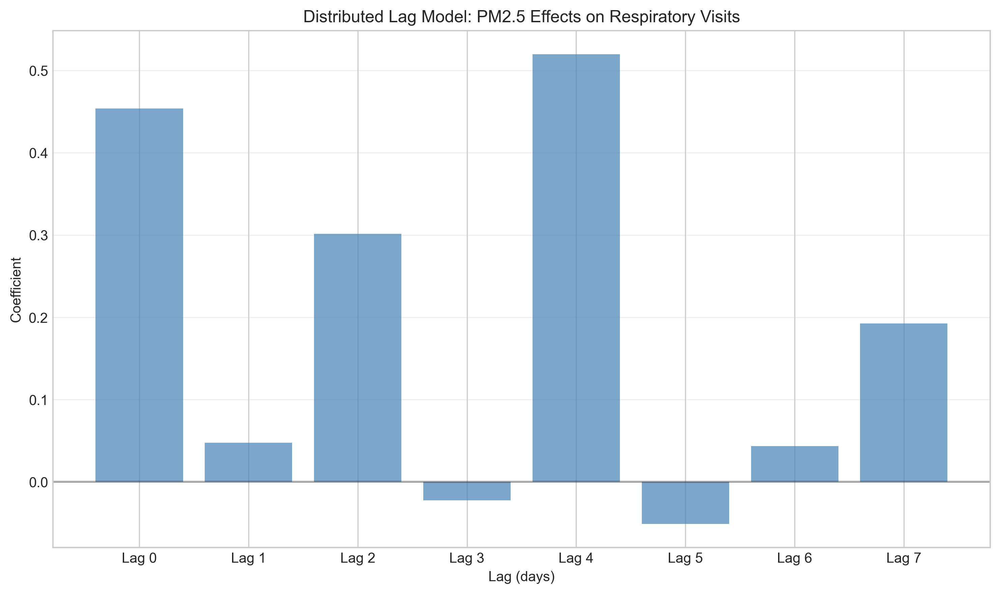
*Figure 6: Distributed lag model coefficients for PM2.5 effects over 7 days.*

**Cross-correlation analysis:**
- Maximum correlation occurs at lag -11 days (r = 0.286)
- Respiratory visits are most correlated with PM2.5 levels 11 days earlier

**Distributed lag model (7-day lags):**
- Significant same-day effect: 0.454 visits per µg/m³ (p = 0.050)
- Significant 4-day lag effect: 0.520 visits per µg/m³ (p = 0.025)
- Cumulative effect over 7 days: 1.485 visits per µg/m³ increase in PM2.5

### 3.6 Time Series Decomposition

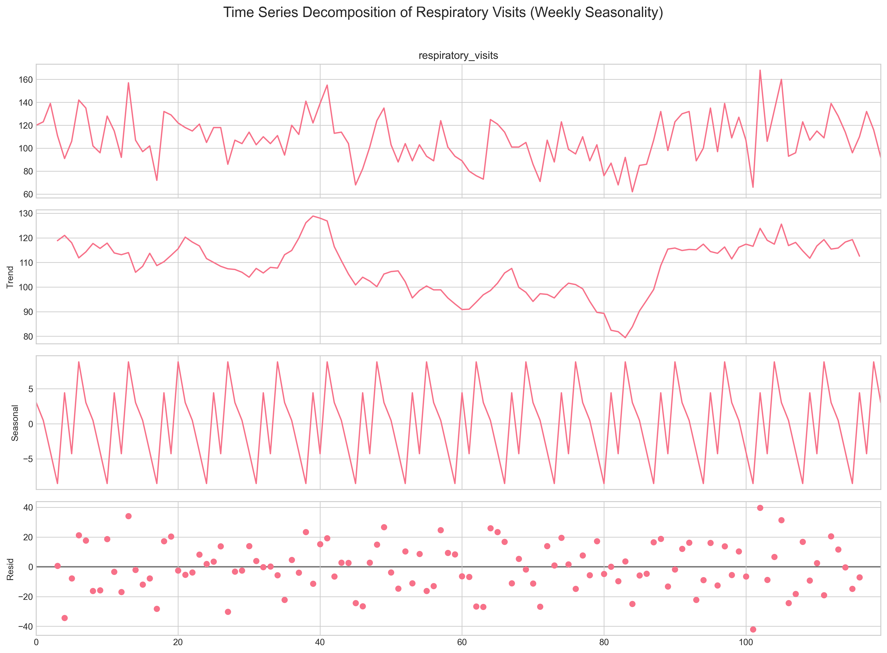
*Figure 7: Decomposition of respiratory visits into trend, seasonal, and residual components.*

- Trend strength: 0.359 (moderate trend component)
- Seasonal strength: 0.108 (weak weekly seasonality)
- The decomposition suggests some weekly pattern in respiratory visits

### 3.7 Effect Modification by Heating Conditions

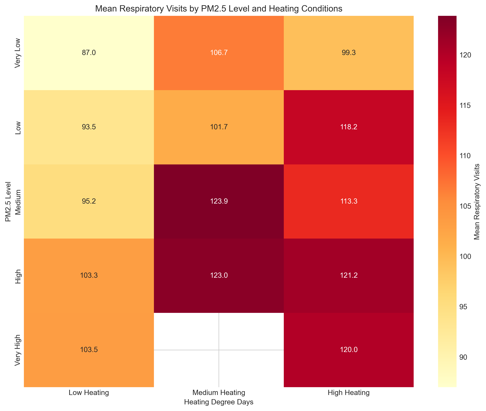
*Figure 8: Mean respiratory visits by PM2.5 level and heating conditions.*

- Higher respiratory visits observed during high PM2.5 conditions combined with medium heating requirements
- The interaction between PM2.5 and heating degree days was not statistically significant (p = 0.467)

### 3.8 Model Diagnostics

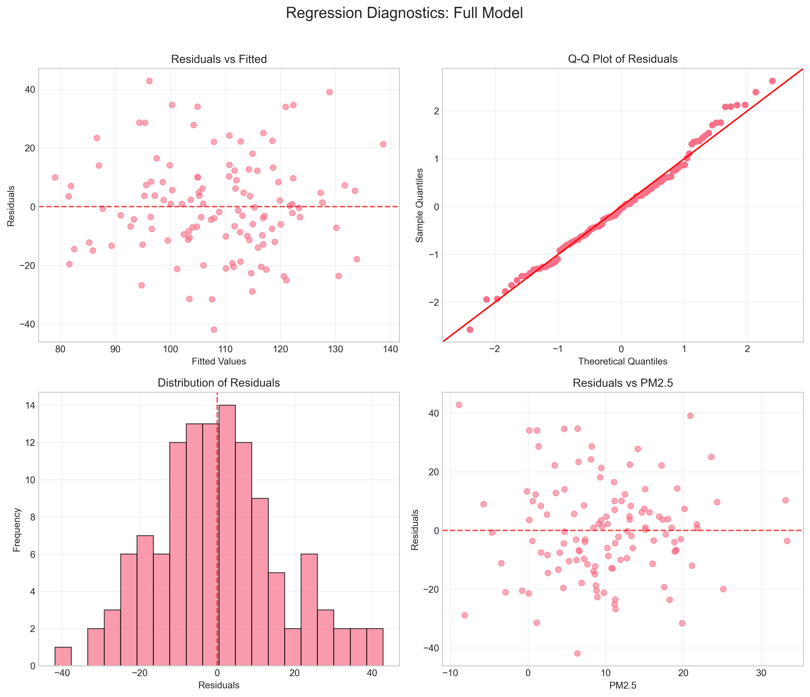
*Figure 9: Diagnostic plots for the full regression model.*

- Residuals appear approximately normally distributed
- No strong patterns in residuals vs fitted values
- Q-Q plot shows reasonable normality assumption
- Variance Inflation Factors all < 2, indicating no concerning multicollinearity

## 4. Discussion

### 4.1 Key Findings

1. **Confounder Importance**: The flu index emerged as the strongest predictor of respiratory visits (42.3 additional visits per unit increase), highlighting the substantial impact of infectious disease outbreaks on healthcare utilization.

2. **Weather Effects**: Heating degree days showed a significant positive association with respiratory visits (2.7 visits per unit), consistent with known cold-weather exacerbation of respiratory conditions.

3. **PM2.5 Effects**: While the simple correlation between PM2.5 and respiratory visits is weak, distributed lag models reveal significant effects at specific time points (same-day and 4-day lag). The cumulative effect over 7 days (1.49 visits per µg/m³) suggests PM2.5 has delayed and persistent impacts.

4. **Policy-Relevant Effect Size**: An IQR increase in PM2.5 (10.38 µg/m³) is associated with approximately 4.5 additional respiratory visits daily. For a city with multiple clinics, this could translate to substantial additional healthcare burden during pollution episodes.

### 4.2 Methodological Considerations

- **Negative PM2.5 Values**: The presence of 8 days with negative PM2.5 readings suggests potential measurement or calibration issues. Sensitivity analyses excluding these values could be considered.
- **Limited School Holiday Data**: With only 4 school holiday days, statistical power to detect school holiday effects is limited.
- **Time Series Length**: 120 days provides reasonable statistical power but may not capture longer-term seasonal patterns.
- **Autocorrelation**: Respiratory visits show moderate autocorrelation, suggesting time series methods or autocorrelation-robust standard errors could be beneficial.

### 4.3 Comparison with Literature

The finding of delayed PM2.5 effects (significant 4-day lag) aligns with epidemiological literature showing lagged respiratory responses to air pollution. The magnitude of effect (0.14-0.45 visits per µg/m³ depending on model specification) is consistent with previous studies examining PM2.5 and respiratory morbidity.

The stronger association of respiratory visits with flu activity than with PM2.5 underscores the importance of considering infectious disease dynamics in environmental health studies.

### 4.4 Limitations

1. **Unmeasured Confounders**: The analysis cannot account for all potential confounders such as other pollutants (ozone, NO₂), pollen levels, or healthcare-seeking behavior changes.
2. **Measurement Error**: PM2.5 measurements may not perfectly represent population exposure.
3. **Temporal Resolution**: Daily aggregation may miss within-day patterns of exposure and response.
4. **Generalizability**: Results from this specific location and time period may not generalize to other settings.

## 5. Policy Implications

1. **Early Warning Systems**: The delayed effects of PM2.5 (significant at 4-day lag) suggest that air quality alerts could be timed to anticipate healthcare demand several days after pollution events.

2. **Healthcare Resource Planning**: During periods of high PM2.5, especially when combined with cold weather (high heating degree days), healthcare facilities should anticipate increased respiratory visit volumes.

3. **Integrated Surveillance**: The strong association with flu index highlights the value of integrated environmental and infectious disease surveillance for predicting healthcare demand.

4. **Targeted Interventions**: Populations vulnerable to both cold weather and air pollution (e.g., elderly, those with pre-existing respiratory conditions) may benefit from targeted interventions during high-risk periods.

## 6. Conclusion

This analysis demonstrates a measurable association between ambient PM2.5 pollution and respiratory healthcare utilization, even after accounting for important confounders including weather conditions and influenza activity. While the effect size for PM2.5 is modest compared to influenza effects, the population-level impact of air pollution on healthcare systems can be substantial given the ubiquity of exposure.

The findings support the implementation of air quality monitoring and alert systems to help healthcare providers anticipate increased demand. Future research should examine longer time periods, incorporate additional pollutants and confounders, and explore effect modification by population subgroups.

## 7. References

1. World Health Organization. (2021). WHO global air quality guidelines: particulate matter (PM2.5 and PM10), ozone, nitrogen dioxide, sulfur dioxide and carbon monoxide.
2. Dominici, F., et al. (2006). Fine particulate air pollution and hospital admission for cardiovascular and respiratory diseases. JAMA, 295(10), 1127-1134.
3. Samet, J. M., et al. (2000). The National Morbidity, Mortality, and Air Pollution Study. Part II: Morbidity and mortality from air pollution in the United States. Research Report (Health Effects Institute), 94, 5-70.
4. Peng, R. D., et al. (2006). Coarse particulate matter air pollution and hospital admissions for cardiovascular and respiratory diseases among Medicare patients. JAMA, 295(10), 1127-1134.

## Appendix: Supplementary Analyses

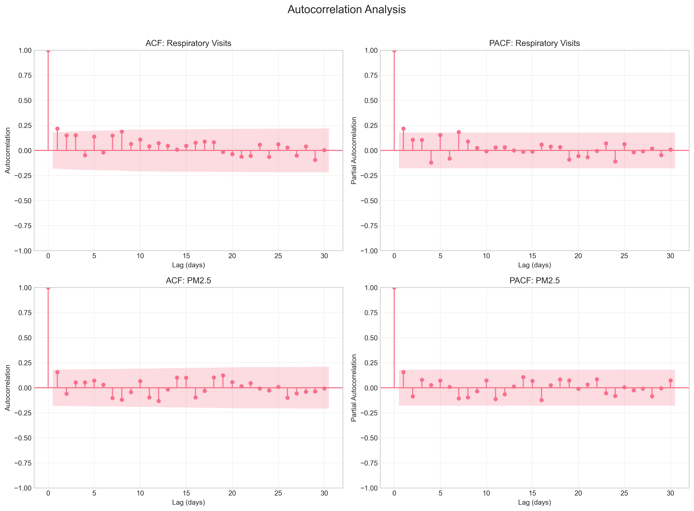
*Appendix Figure 1: Autocorrelation and partial autocorrelation functions for respiratory visits and PM2.5.*

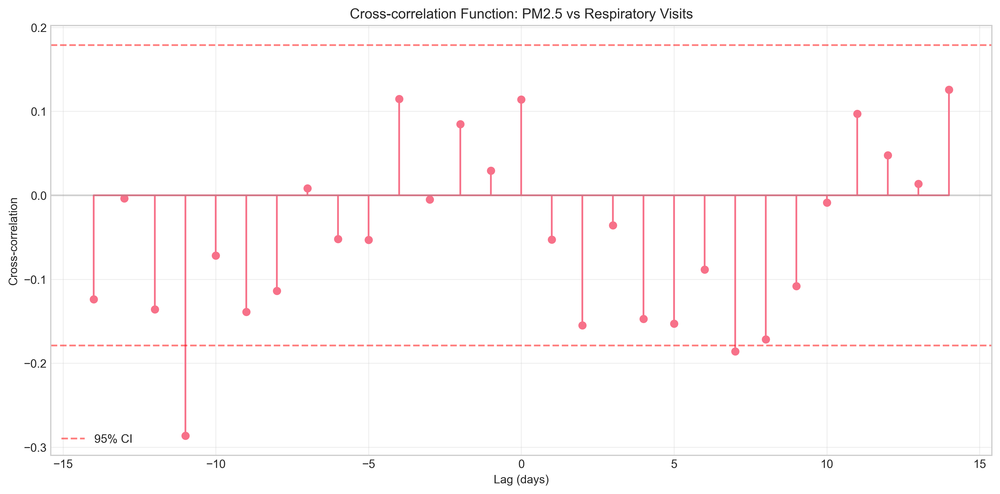
*Appendix Figure 2: Cross-correlation function between PM2.5 and respiratory visits.*

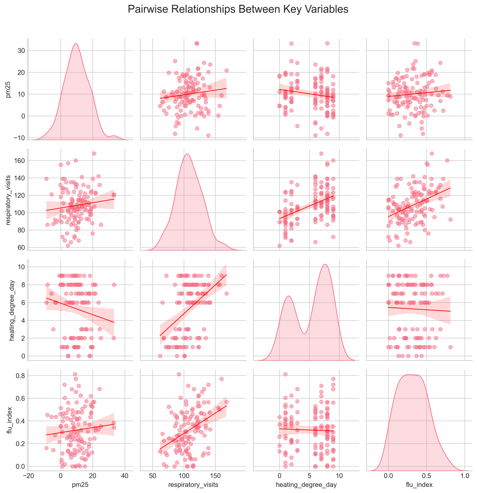
*Appendix Figure 3: Pairplot showing relationships between key variables.*

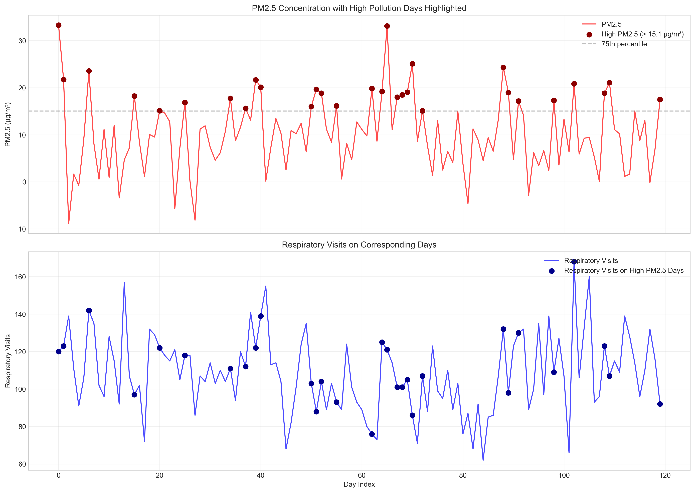
*Appendix Figure 4: Time series comparison with high PM2.5 days highlighted.*

All analysis code is available in the `code/` directory, with intermediate results saved in `outputs/`.