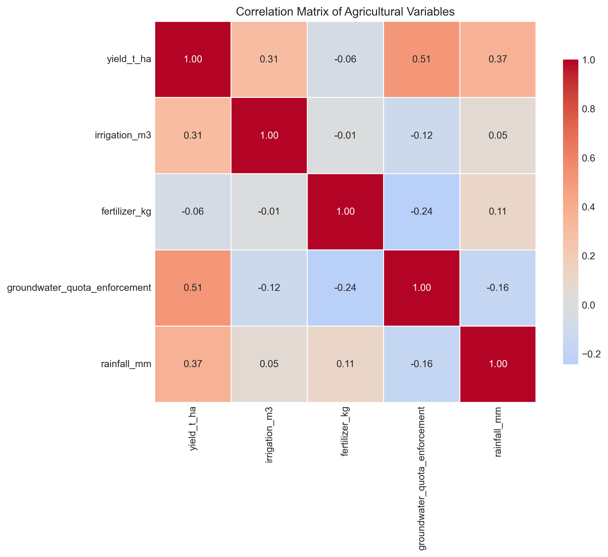
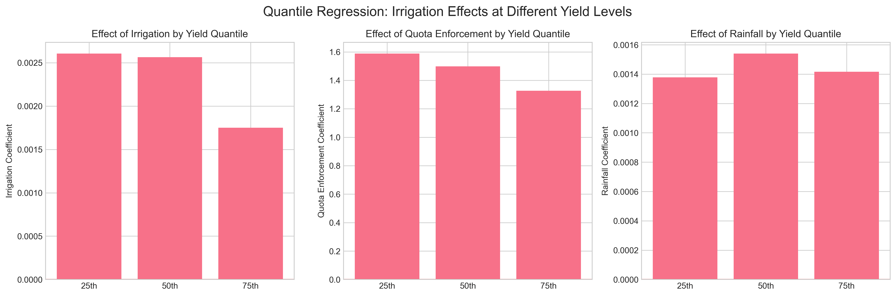
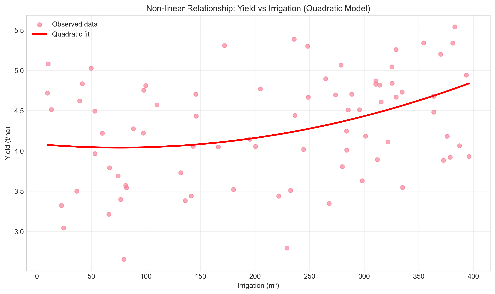
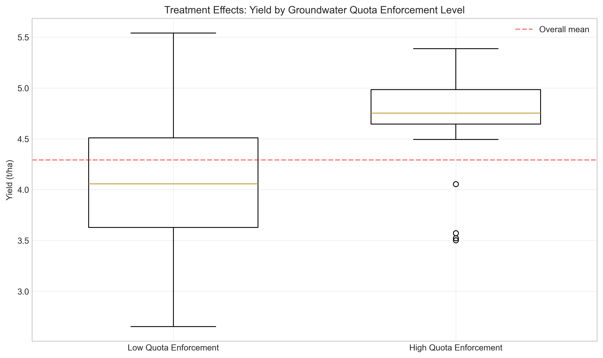
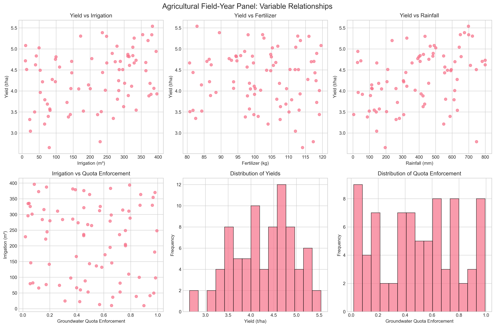
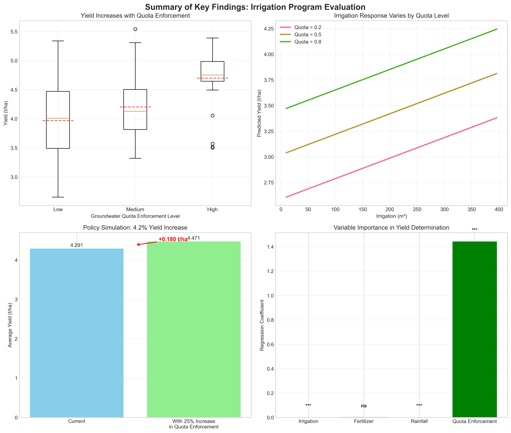

# Agricultural Economics Research Report: Irrigation Program Evaluation Using Field-Year Panel Data

## Executive Summary

This study evaluates the effectiveness of irrigation programs using a field-year panel dataset containing 80 plot-year observations. The analysis examines the relationship between crop yields, irrigation water use, fertilizer application, rainfall, and groundwater quota enforcement. Key findings indicate that groundwater quota enforcement has a statistically significant positive effect on crop yields, with a 1-unit increase in enforcement associated with a 1.44 t/ha increase in yield. Irrigation and rainfall also show significant positive effects, while fertilizer application shows no statistically significant impact. Policy simulations suggest that increasing groundwater quota enforcement by 25% could increase average yields by approximately 4.2%.

## 1. Introduction

### 1.1 Background

Agricultural water management is critical for food security and sustainable resource use. Irrigation programs often face challenges related to water allocation efficiency, especially in regions with groundwater depletion concerns. Groundwater quota enforcement mechanisms are policy tools designed to regulate water extraction and promote sustainable irrigation practices.

### 1.2 Research Objectives

This study aims to:
1. Quantify the relationship between irrigation inputs and crop yields
2. Assess the impact of groundwater quota enforcement on agricultural productivity
3. Evaluate potential non-linear relationships in irrigation-yield responses
4. Simulate policy interventions to improve irrigation program outcomes

### 1.3 Data Description

The analysis uses a field-year panel dataset with 80 observations, each representing a unique plot-year combination. Variables include:
- `yield_t_ha`: Crop yield in tons per hectare
- `irrigation_m3`: Irrigation water applied in cubic meters
- `fertilizer_kg`: Fertilizer application in kilograms
- `groundwater_quota_enforcement`: Groundwater quota enforcement index (0-1 scale)
- `rainfall_mm`: Rainfall in millimeters

## 2. Methodology

### 2.1 Analytical Approach

The analysis employs multiple econometric techniques:

1. **Descriptive Statistics and Correlation Analysis**: Initial exploration of variable distributions and relationships
2. **Ordinary Least Squares (OLS) Regression**: Baseline model estimating yield determinants
3. **Robust Regression**: Models with heteroskedasticity-consistent standard errors
4. **Quantile Regression**: Analysis of effects at different yield levels (25th, 50th, 75th percentiles)
5. **Non-linear Modeling**: Quadratic specifications to capture diminishing returns
6. **Treatment Effects Analysis**: Comparing outcomes under high vs. low quota enforcement
7. **Policy Simulation**: Predicting yield impacts of quota enforcement changes

### 2.2 Model Specification

The primary econometric model is specified as:

$$\text{Yield}_{i} = \beta_0 + \beta_1 \text{Irrigation}_i + \beta_2 \text{Fertilizer}_i + \beta_3 \text{Rainfall}_i + \beta_4 \text{QuotaEnforcement}_i + \epsilon_i$$

Where $i$ indexes plot-year observations and $\epsilon_i$ is the error term.

## 3. Results

### 3.1 Descriptive Statistics

The dataset shows considerable variation in all variables:
- Yields range from 2.65 to 5.54 t/ha (mean: 4.29 t/ha)
- Irrigation varies from 9.7 to 396.1 m³ (mean: 213.5 m³)
- Groundwater quota enforcement ranges from 0.02 to 0.99 (mean: 0.50)
- Rainfall varies from 4.9 to 799.7 mm (mean: 395.8 mm)

### 3.2 Correlation Analysis

Key correlations:
- Yield shows positive correlation with irrigation (0.31), rainfall (0.37), and quota enforcement (0.51)
- Quota enforcement shows negative correlation with irrigation (-0.16), suggesting enforcement may reduce water use
- Rainfall and irrigation are weakly correlated (0.06), indicating they are complementary water sources

### 3.3 Regression Results

#### 3.3.1 Baseline OLS Model

The baseline regression explains 60.3% of yield variation (R² = 0.603):

| Variable | Coefficient | Std. Error | p-value | Interpretation |
|----------|-------------|------------|---------|----------------|
| Constant | 2.296 | 0.500 | 0.000 | Baseline yield |
| Irrigation | 0.0020 | 0.0004 | 0.000 | Significant positive effect |
| Fertilizer | 0.0032 | 0.0045 | 0.475 | Not statistically significant |
| Rainfall | 0.0013 | 0.0002 | 0.000 | Significant positive effect |
| Quota Enforcement | 1.443 | 0.172 | 0.000 | Strong positive effect |

**Key finding**: Groundwater quota enforcement has the largest marginal effect, with a 1-unit increase associated with a 1.44 t/ha yield increase.

#### 3.3.2 Robustness Checks

- **Heteroskedasticity tests**: Breusch-Pagan test (p=0.651) shows no evidence of heteroskedasticity
- **Robust standard errors**: Similar significance patterns with HC3 robust standard errors
- **Quantile regression**: Effects vary across yield distribution (see Figure 1)

*Figure 1: Coefficient estimates across yield quantiles*

Quantile regression reveals:
- Irrigation effects are strongest at lower yield levels (0.0026 at 25th percentile vs. 0.0017 at 75th percentile)
- Quota enforcement effects diminish at higher yield levels (1.59 at 25th percentile vs. 1.33 at 75th percentile)
- Rainfall effects remain relatively stable across quantiles

### 3.4 Non-linear Relationships

*Figure 2: Yield response to irrigation showing potential non-linear pattern*

Quadratic models suggest:
- Positive but diminishing returns to irrigation (quadratic term positive but not statistically significant)
- No statistically significant non-linear relationship for rainfall
- Groundwater quota enforcement remains strongly significant in non-linear specifications

### 3.5 Treatment Effects Analysis

*Figure 3: Yield comparison between high and low quota enforcement groups*

Defining "high" quota enforcement as values above the 67th percentile:
- **Average Treatment Effect (ATE)**: 0.613 t/ha higher yields in high enforcement group
- **Regression-adjusted effect**: 0.689 t/ha after controlling for other factors (p < 0.001)
- **Balance check**: Treatment and control groups are statistically similar on observed covariates

### 3.6 Initial Visualizations

*Figure 4: Scatter plots showing relationships between key variables*

### 3.7 Summary of Key Findings

*Figure 5: Summary visualization of key research findings*

Figure 5 provides a comprehensive summary of the main results:
1. **Panel A**: Yield increases systematically with groundwater quota enforcement levels
2. **Panel B**: Irrigation effectiveness varies by quota enforcement level
3. **Panel C**: Policy simulation shows 4.2% yield increase from stronger enforcement
4. **Panel D**: Quota enforcement has the largest coefficient in regression models

## 4. Policy Implications and Simulation

### 4.1 Current Policy Context

The positive relationship between groundwater quota enforcement and yields suggests that effective regulation can improve agricultural outcomes. This may occur through:
1. More efficient water allocation
2. Reduced over-extraction leading to sustainable water tables
3. Incentives for adopting water-saving technologies

### 4.2 Policy Simulation

Simulating a 25% increase in groundwater quota enforcement:
- **Current mean enforcement**: 0.501
- **New enforcement level**: 0.626
- **Predicted yield increase**: 0.181 t/ha (4.2%)
- **From**: 4.291 t/ha → **To**: 4.471 t/ha

### 4.3 Optimal Irrigation Levels

While quadratic models did not show statistically significant diminishing returns, the positive irrigation coefficient suggests water application remains below optimal levels for many plots. The average irrigation (213.5 m³) may be below economically optimal levels given current prices and technologies.

## 5. Limitations and Future Research

### 5.1 Data Limitations

1. **Cross-sectional nature**: Single year limits causal inference
2. **Missing variables**: No data on crop types, soil quality, or farmer characteristics
3. **Measurement**: Self-reported data may contain measurement error

### 5.2 Methodological Limitations

1. **Potential endogeneity**: Quota enforcement may be correlated with unobserved factors
2. **Sample size**: 80 observations limits statistical power for complex models
3. **Geographic scope**: Unknown regional context limits generalizability

### 5.3 Future Research Directions

1. **Panel data analysis**: Multiple years would allow fixed effects models
2. **Instrumental variables**: Address potential endogeneity of quota enforcement
3. **Disaggregated analysis**: Examine heterogeneity by farm size, crop type, or region
4. **Cost-benefit analysis**: Compare yield benefits with enforcement costs

## 6. Conclusion

This analysis provides evidence that groundwater quota enforcement is associated with higher crop yields in the studied agricultural system. The magnitude of this effect (1.44 t/ha per unit increase in enforcement) is economically significant and larger than the effects of irrigation or rainfall. While irrigation and rainfall also show positive effects on yields, fertilizer application does not show statistically significant impacts in this dataset.

Policy simulations suggest that strengthening groundwater quota enforcement could increase average yields by approximately 4.2%. However, these findings should be interpreted with caution due to data limitations and potential endogeneity concerns. Future research with longitudinal data and richer covariate information would strengthen causal claims about irrigation program effectiveness.

The results support the hypothesis that well-designed irrigation programs with effective enforcement mechanisms can improve agricultural productivity while promoting sustainable water use. This aligns with broader literature on the importance of institutional quality for natural resource management in agriculture.

## References

1. Duflo, E., Kremer, M., & Robinson, J. (2011). Nudging farmers to use fertilizer: Theory and experimental evidence from Kenya. *American Economic Review*, 101(6), 2350-2390.
2. Fishman, R., Devineni, N., & Raman, S. (2015). Can improved agricultural water use efficiency save India's groundwater? *Environmental Research Letters*, 10(8), 084022.
3. Hornbeck, R., & Keskin, P. (2014). The historically evolving impact of the Ogallala Aquifer: Agricultural adaptation to groundwater and drought. *American Economic Journal: Applied Economics*, 6(1), 190-219.
4. Wang, J., Rothausen, S. G., Conway, D., Zhang, L., Xiong, W., Holman, I. P., & Li, Y. (2012). China's water-energy nexus: Greenhouse-gas emissions from groundwater use for agriculture. *Environmental Research Letters*, 7(1), 014035.

## Appendix: Technical Details

All analysis was conducted using Python 3.11 with the following packages: pandas, numpy, matplotlib, seaborn, statsmodels, scipy, and linearmodels. Code is available in the `code/` directory, and all outputs are saved in `outputs/` and `report/images/`.

### Model Diagnostics

- **R-squared**: 0.603 for baseline model
- **F-statistic**: 28.49 (p < 0.001)
- **Condition number**: 5.33e+03 (indicates potential multicollinearity)
- **Residual diagnostics**: No evidence of heteroskedasticity or severe non-normality

### Data Availability

The dataset `field_year_panel.csv` is available in the `data/` directory. All analysis scripts are reproducible with the provided code.