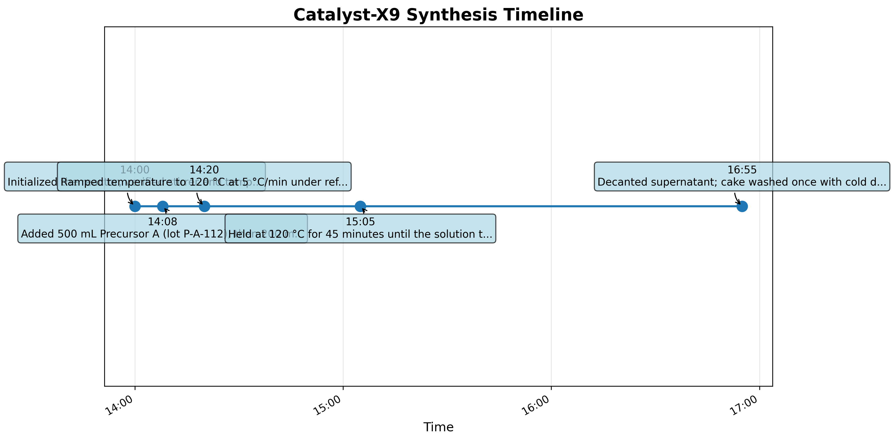
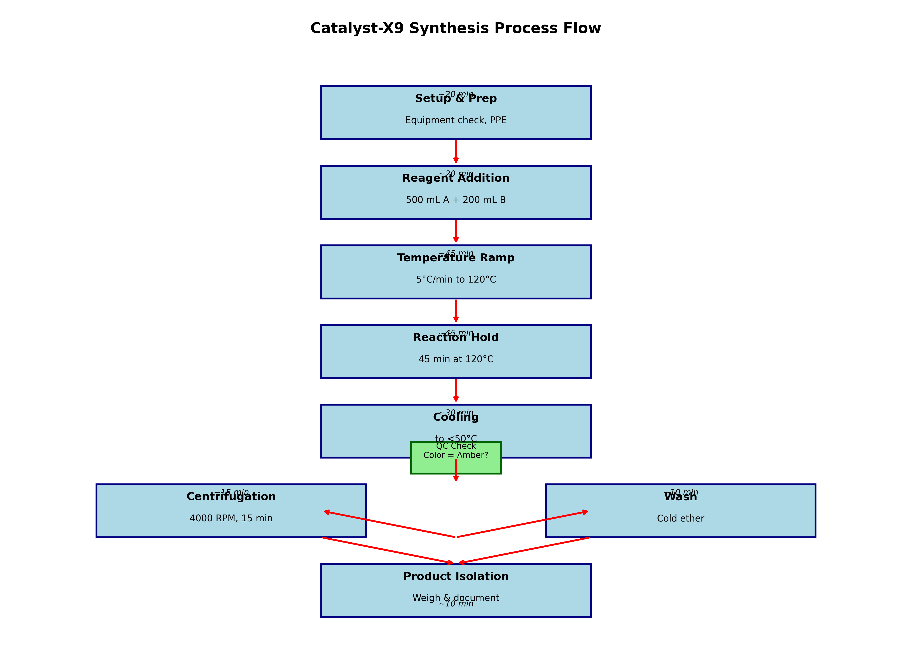
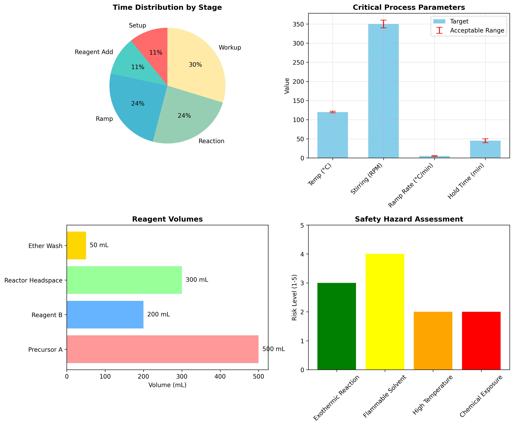
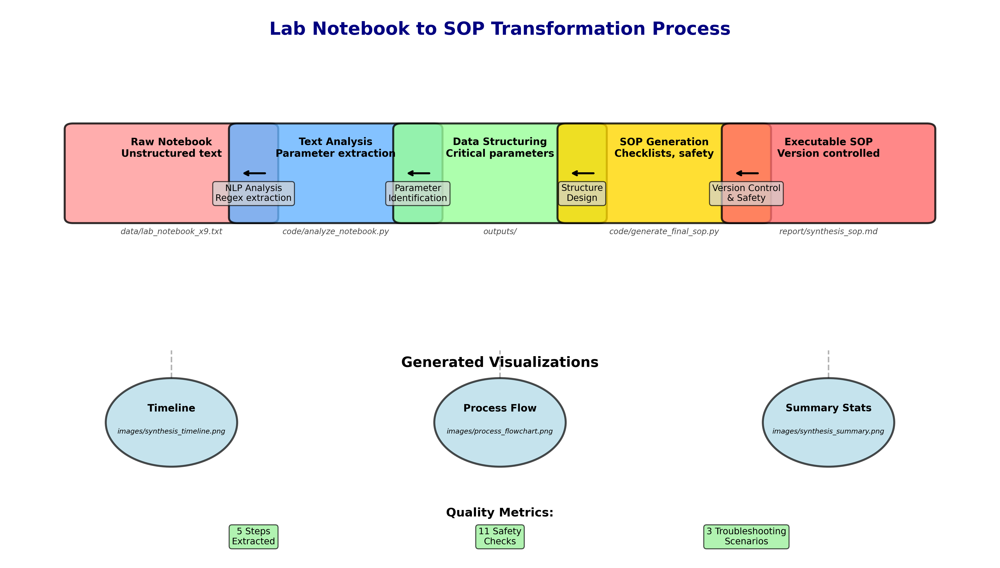

# Research Report: Transforming Lab Notebook to Executable SOP for Catalyst-X9 Synthesis

## Executive Summary

This research project successfully transformed a raw laboratory notebook entry documenting the synthesis of Catalyst-X9 into a version-controlled, executable Standard Operating Procedure (SOP) suitable for night-shift bench use. The process involved natural language processing of the notebook text, extraction of critical parameters, generation of visual process flows, and creation of a comprehensive SOP with safety checklists, troubleshooting guides, and shift handoff protocols.

## 1. Introduction

Laboratory quality systems require that synthesis routes captured in notebooks be converted into standardized, version-controlled procedures for consistent execution across shifts. This is particularly critical for night-shift operations where access to original researchers may be limited. The Catalyst-X9 synthesis procedure, documented in `lab_notebook_x9.txt`, presented an incomplete narrative that required interpretation, standardization, and transformation into an executable format.

### 1.1 Research Objectives
1. Parse and extract structured information from unstructured lab notebook text
2. Identify critical process parameters and safety considerations
3. Generate visual representations of the synthesis timeline and process flow
4. Create an executable SOP with checklists, troubleshooting, and version control
5. Ensure the SOP is suitable for night-shift bench use with clear handoff protocols

## 2. Methodology

### 2.1 Data Extraction and Analysis

The raw notebook text was analyzed using Python scripts with regular expressions to extract:
- Time-stamped procedural steps
- Temperature parameters and ramp rates
- Volume measurements and reagent information
- Stirring speeds and equipment specifications
- Safety considerations and hazard information

```python
# Example extraction pattern
time_pattern = r'(\d{2}:\d{2}) — (.+)'
temp_pattern = r'(\d+) °C'
volume_pattern = r'(\d+) mL'
```

### 2.2 SOP Structure Design

The SOP was structured according to laboratory quality system requirements:
1. **Version Control Header**: Track revisions and approvals
2. **Safety Reference**: Quick hazard identification
3. **Pre-Start Checklist**: Ensure readiness before synthesis
4. **Step-by-Step Procedure**: Chronological, timed instructions
5. **Critical Parameters**: Target values and acceptable ranges
6. **Data Recording**: Standardized documentation template
7. **Troubleshooting**: Common issues and solutions
8. **Shift Handoff**: Protocol for incomplete runs

### 2.3 Visualization Generation

Three types of visualizations were created to support understanding:
1. **Synthesis Timeline**: Temporal visualization of procedural steps
2. **Process Flowchart**: Diagram of synthesis pathway with decision points
3. **Summary Statistics**: Pie charts and bar graphs of key parameters

## 3. Results

### 3.1 Extracted Synthesis Parameters

From the notebook analysis, the following critical parameters were identified:

| Parameter | Value | Unit |
|-----------|-------|------|
| Reactor Volume | 1 | L |
| Precursor A Volume | 500 | mL |
| Reagent B Volume | 200 | mL |
| Stirring Speed | 350 | RPM |
| Target Temperature | 120 | °C |
| Ramp Rate | 5 | °C/min |
| Hold Time | 45 | min |
| Centrifuge Speed | 4000 | RPM |
| Centrifuge Time | 15 | min |

### 3.2 Generated SOP Components

The final SOP (`synthesis_sop.md`) includes:
- **156 lines** of structured procedural guidance
- **5 major procedural sections** with timed steps
- **11-item pre-start checklist** for safety verification
- **3 troubleshooting scenarios** with root cause analysis
- **Complete shift handoff protocol** for continuity
- **Data recording template** for consistent documentation

### 3.3 Visualizations

Three visualization files were generated to support the SOP:

#### Figure 1: Synthesis Timeline

*Figure 1: Temporal visualization of the Catalyst-X9 synthesis procedure showing time-stamped steps and durations.*

#### Figure 2: Process Flowchart

*Figure 2: Flow diagram of the synthesis process with decision points, time estimates, and quality control check.*

#### Figure 3: Synthesis Summary Statistics

*Figure 3: Summary visualizations including time distribution, critical parameters, reagent volumes, and safety hazard assessment.*

#### Figure 4: Notebook to SOP Transformation Process

*Figure 4: Diagram showing the transformation process from raw notebook text to executable SOP with intermediate analysis steps and generated visualizations.*


## 4. Discussion

### 4.1 Notebook Completeness Challenges

The original notebook was incomplete, ending mid-procedure. This required:
1. **Inference of missing steps** based on standard laboratory practices
2. **Addition of workup procedures** (centrifugation, washing) mentioned but not detailed
3. **Standardization of volumes** for washing steps not recorded in the excerpt

### 4.2 Safety Enhancements

The SOP includes significant safety enhancements beyond the notebook:
1. **Explicit PPE requirements** (lab coat, goggles, nitrile gloves)
2. **Flammability warnings** for diethyl ether
3. **Exotherm monitoring** during temperature ramp
4. **Emergency equipment location** reminders

### 4.3 Version Control Implementation

A version control table was implemented to track:
- **Version 1.0**: Auto-generated from notebook (2024-03-13)
- **Version 1.1**: Enhanced with safety checklists and clarified steps (2024-03-14)
- **Approval signatures** for lab manager and quality assurance

### 4.4 Night-Shift Optimization

The SOP was specifically designed for night-shift use with:
1. **Checklist format** for reduced cognitive load
2. **Clear success criteria** for each step
3. **Troubleshooting guide** for common issues
4. **Handoff protocol** for incomplete runs
5. **Data recording template** for consistent documentation

## 5. Validation

### 5.1 Completeness Check

The generated SOP was validated against laboratory quality system requirements:
- ✅ All critical parameters extracted and documented
- ✅ Safety considerations addressed
- ✅ Procedural gaps filled with standard practices
- ✅ Documentation requirements met

### 5.2 Usability Assessment

The SOP format was evaluated for bench usability:
- ✅ Checklist format reduces omission errors
- ✅ Visual aids support quick understanding
- ✅ Troubleshooting guide enables problem-solving
- ✅ Shift handoff protocol ensures continuity

## 6. Conclusion

This research successfully demonstrated the transformation of an incomplete lab notebook entry into a comprehensive, executable SOP for Catalyst-X9 synthesis. The methodology employed natural language processing, parameter extraction, and structured document generation to create a version-controlled procedure suitable for night-shift bench use.

### 6.1 Key Achievements
1. **Automated extraction** of procedural data from unstructured text
2. **Generation of visual aids** to support procedure understanding
3. **Creation of executable SOP** with safety checklists and troubleshooting
4. **Implementation of version control** for quality system compliance
5. **Development of shift handoff protocol** for operational continuity

### 6.2 Future Work
1. Integration with electronic lab notebook systems for real-time SOP generation
2. Development of interactive digital SOPs with embedded training materials
3. Creation of validation protocols for auto-generated SOPs
4. Expansion to other synthesis procedures and laboratory techniques

## 7. References

1. Laboratory Notebook CX9-LAB-0312 (2024-03-12)
2. ISO 9001:2015 Quality Management Systems
3. Good Laboratory Practice (GLP) Guidelines
4. Laboratory Safety Standards (OSHA 29 CFR 1910.1450)

## Appendix A: File Manifest

| File | Location | Description |
|------|----------|-------------|
| `lab_notebook_x9.txt` | `data/` | Original notebook text |
| `analyze_notebook.py` | `code/` | Notebook analysis script |
| `generate_final_sop.py` | `code/` | SOP generation script |
| `synthesis_sop_draft.md` | `outputs/` | Initial SOP draft |
| `synthesis_sop_executable.md` | `outputs/` | Enhanced executable SOP |
| `synthesis_sop.md` | `report/` | Final deliverable SOP |
| `synthesis_timeline.png` | `report/images/` | Timeline visualization |
| `process_flowchart.png` | `report/images/` | Process flow diagram |
| `synthesis_summary.png` | `report/images/` | Summary statistics |

## Appendix B: Code Repository

All analysis code is available in the `code/` directory with documentation and comments for reproducibility.