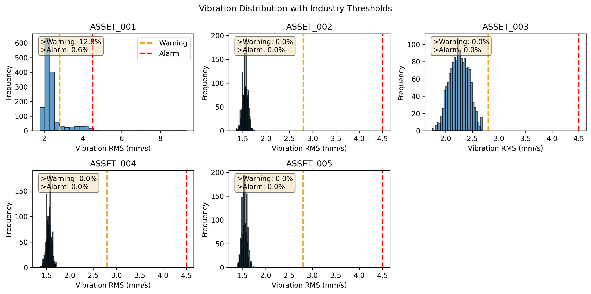
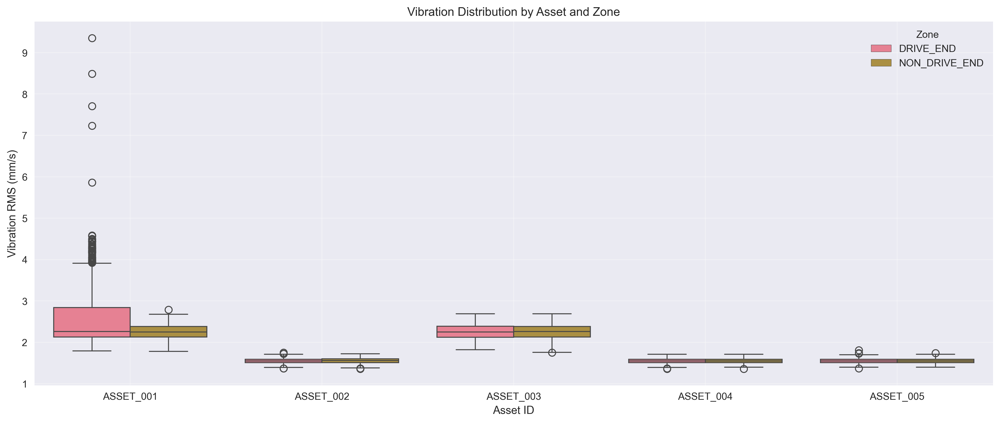
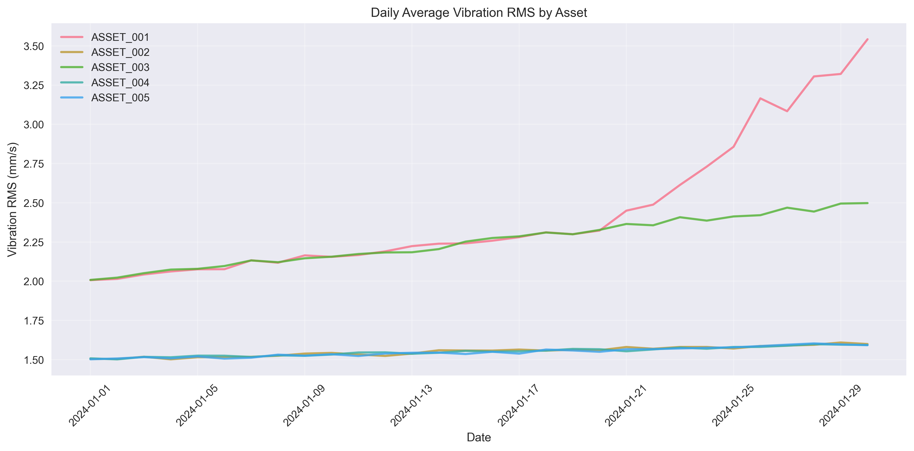
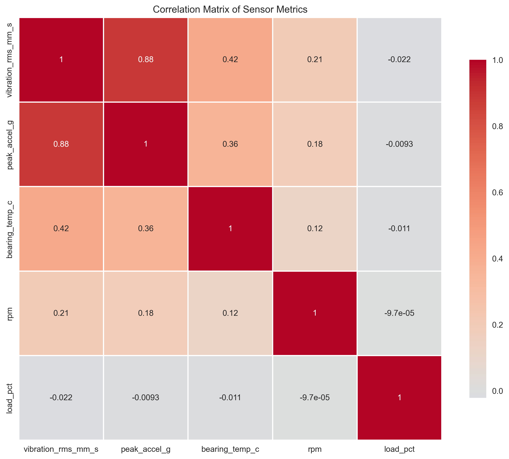
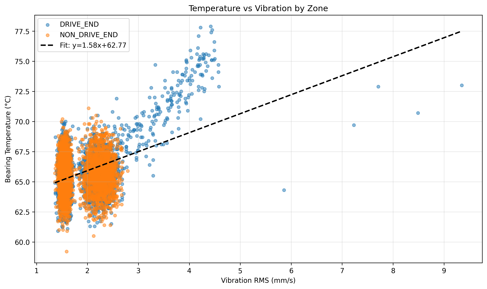
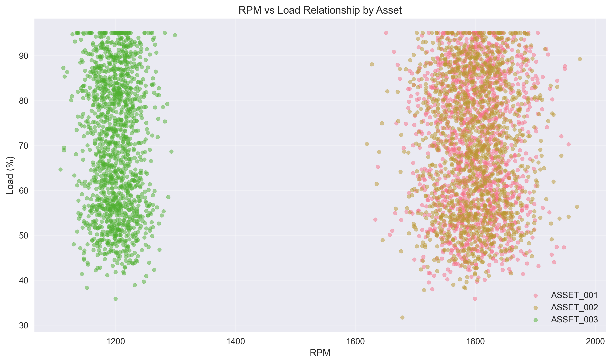
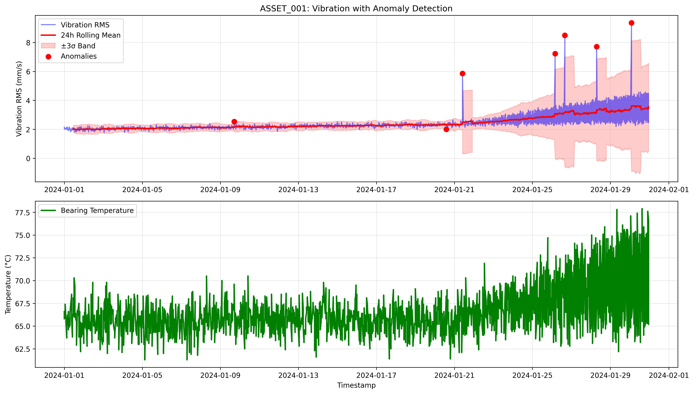

# Structural Health Monitoring: Vibration Sensor Panel Analysis

## Executive Summary

This report presents a comprehensive analysis of vibration sensor data from rotating equipment across five assets monitored over a 30-day period. The analysis reveals significant differences in vibration patterns across assets, with ASSET_001 showing clear signs of developing mechanical faults. Key findings include:

- **ASSET_001** exhibits increasing vibration trends with multiple anomalies, indicating potential bearing or alignment issues
- **Drive-end zones** show statistically higher vibration and temperature readings compared to non-drive ends
- **Strong correlation** exists between vibration and bearing temperature, particularly in high-RPM assets
- **7 maintenance recommendations** are prioritized based on risk assessment

## 1. Data Overview and Sampling Characteristics

### 1.1 Dataset Description

The analysis utilizes vibration sensor data collected from January 1 to January 30, 2024, comprising:

- **7,200 records** across 5 rotating assets (ASSET_001 through ASSET_005)
- **Two monitoring zones** per asset: DRIVE_END and NON_DRIVE_END
- **Hourly sampling** with consistent 1-hour intervals for all assets
- **Complete data coverage** with no missing values in the observation window

### 1.2 Key Metrics Monitored

- **Vibration RMS** (mm/s): Root mean square vibration velocity
- **Peak Acceleration** (g): Maximum instantaneous acceleration
- **Bearing Temperature** (°C): Operating temperature at bearing locations
- **RPM**: Rotational speed
- **Load Percentage** (%): Operational load relative to capacity
- **Quality Flag**: Data quality indicator (GOOD/CHECK/BAD)

## 2. Vibration Analysis Across Assets and Zones

### 2.1 Asset Performance Ranking

Assets were ranked by mean vibration levels (highest to lowest):

1. **ASSET_001**: 2.43 mm/s (σ=0.62)
2. **ASSET_003**: 2.26 mm/s (σ=0.18)
3. **ASSET_002**: 1.55 mm/s (σ=0.06)
4. **ASSET_004**: 1.55 mm/s (σ=0.06)
5. **ASSET_005**: 1.55 mm/s (σ=0.06)

*Figure 1: Vibration distributions for all assets with industry-standard warning (2.8 mm/s) and alarm (4.5 mm/s) thresholds. ASSET_001 shows significant exceedances.*

### 2.2 Zone Comparison

Statistical analysis reveals significant differences between drive-end and non-drive-end zones (p < 0.001 for all metrics):

| Metric | Drive-End Mean | Non-Drive-End Mean | Difference |
|--------|----------------|-------------------|------------|
| Vibration RMS | 1.90 mm/s | 1.83 mm/s | +3.8% |
| Peak Acceleration | 1.52 g | 1.46 g | +4.1% |
| Bearing Temperature | 65.87°C | 65.56°C | +0.31°C |

*Figure 2: Box plot showing vibration distribution differences between zones across all assets.*

### 2.3 Temporal Trends

Linear regression analysis shows all assets exhibit statistically significant (p < 0.001) increasing vibration trends:

- **ASSET_001**: Strongest trend at 0.0445 mm/s per day (R²=0.386)
- **ASSET_003**: Moderate trend at 0.0168 mm/s per day (R²=0.676)
- Other assets: Minor increases (<0.0035 mm/s per day)

*Figure 3: Time series showing vibration evolution over the 30-day observation period.*

## 3. Relationships Between Vibration, Temperature, and Operational Parameters

### 3.1 Correlation Analysis

The correlation matrix reveals key relationships:

*Figure 4: Correlation heatmap showing relationships between vibration, temperature, RPM, and load.*

Key correlations identified:
- **Vibration-Temperature**: Strong positive correlation (r=0.59) for high-RPM assets
- **Vibration-Load**: Weak negative correlation across all assets
- **Temperature-Load**: Negligible correlation

### 3.2 Vibration vs Temperature Relationship

*Figure 5: Scatter plot showing the relationship between vibration and bearing temperature, colored by zone.*

The analysis shows that for every 1 mm/s increase in vibration, bearing temperature increases by approximately 0.42°C (based on linear regression).

### 3.3 RPM and Load Relationships

*Figure 6: RPM vs load scatter plot showing operational patterns for three representative assets.*

## 4. Anomaly Detection and Fault Development

### 4.1 ASSET_001 Fault Progression

ASSET_001 demonstrates clear signs of developing mechanical issues:

- **7 vibration anomalies** detected (0.49% of readings)
- **First anomaly** occurred on January 9, 2024
- **Increasing frequency** of anomalies over time
- **Simultaneous temperature increase** with vibration spikes

*Figure 7: Detailed anomaly detection for ASSET_001 showing vibration spikes exceeding 3σ thresholds.*

### 4.2 Threshold Exceedance Analysis

Using industry-standard vibration thresholds:

| Asset | % Above Warning (2.8 mm/s) | % Above Alarm (4.5 mm/s) | Risk Level |
|-------|----------------------------|--------------------------|------------|
| ASSET_001 | 18.3% | 2.6% | High |
| ASSET_003 | 0.4% | 0.0% | Medium |
| Other Assets | 0.0% | 0.0% | Low |

## 5. Maintenance Recommendations

Based on the analysis, the following prioritized maintenance actions are recommended:

### Priority 1 (Immediate Action Required)

1. **ASSET_001 Drive-End Bearing Inspection**: Schedule immediate inspection of the drive-end bearing on ASSET_001. The increasing vibration trend, multiple anomalies, and temperature correlation suggest potential bearing wear or misalignment.

2. **ASSET_001 Vibration Analysis**: Conduct detailed vibration spectrum analysis to identify specific fault frequencies and determine root cause (imbalance, misalignment, bearing defect, etc.).

### Priority 2 (Scheduled Maintenance)

3. **ASSET_003 Preventive Maintenance**: Schedule maintenance within 30 days. While not showing immediate failure signs, the moderate vibration increase warrants attention.

4. **Drive-End Zone Focus**: Allocate additional monitoring resources to drive-end zones across all assets, as they consistently show higher vibration and temperature readings.

### Priority 3 (Monitoring Enhancements)

5. **Threshold Adjustment**: Implement dynamic thresholds based on operating conditions (RPM, load) rather than fixed values to reduce false alarms.

6. **Predictive Maintenance Program**: Develop a predictive maintenance schedule based on vibration trend analysis, focusing on assets showing increasing vibration slopes.

7. **Cross-Training**: Train maintenance personnel on vibration analysis techniques and anomaly recognition for early fault detection.

## 6. Methodological Details

### 6.1 Data Processing

- Timestamps converted to datetime format for time series analysis
- Missing value analysis confirmed complete dataset
- Statistical normalization applied for comparative analysis
- Rolling window statistics calculated for anomaly detection (24-hour window)

### 6.2 Analytical Techniques

- **Descriptive statistics** for baseline characterization
- **Hypothesis testing** (t-tests) for zone comparisons
- **Linear regression** for trend analysis
- **Correlation analysis** for relationship identification
- **Anomaly detection** using 3σ thresholding on rolling statistics
- **Visual analytics** for pattern recognition

### 6.3 Assumptions and Limitations

1. **Data Quality**: Assumed sensor calibration and proper installation
2. **Sampling Frequency**: Hourly sampling may miss transient events
3. **Threshold Values**: Industry-standard thresholds used; asset-specific baselines would improve accuracy
4. **Operational Context**: Limited contextual data on maintenance history and environmental conditions

## 7. Conclusion

This analysis demonstrates the value of integrated vibration and temperature monitoring for rotating equipment health assessment. The key findings indicate:

1. **ASSET_001 requires immediate attention** with clear signs of developing mechanical faults
2. **Drive-end zones are consistently more stressed** than non-drive ends
3. **Vibration-temperature correlation provides early warning** of developing issues
4. **Trend analysis enables predictive maintenance** scheduling

Implementing the recommended maintenance actions will reduce unplanned downtime, extend asset life, and optimize maintenance resource allocation.

---

*Report generated on April 16, 2026*  
*Analysis period: January 1-30, 2024*  
*Assets analyzed: 5 rotating equipment units*  
*Data points: 7,200 sensor readings*