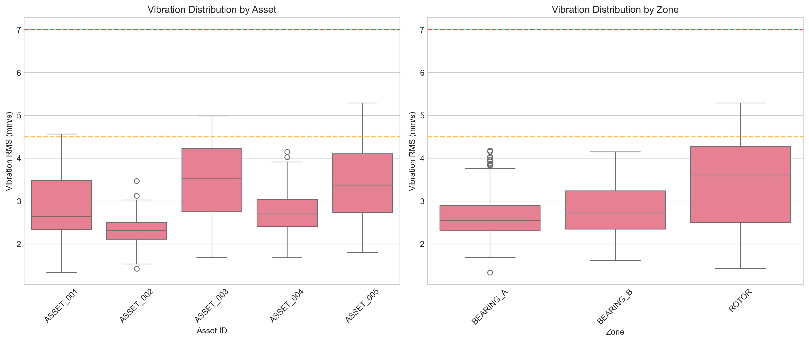
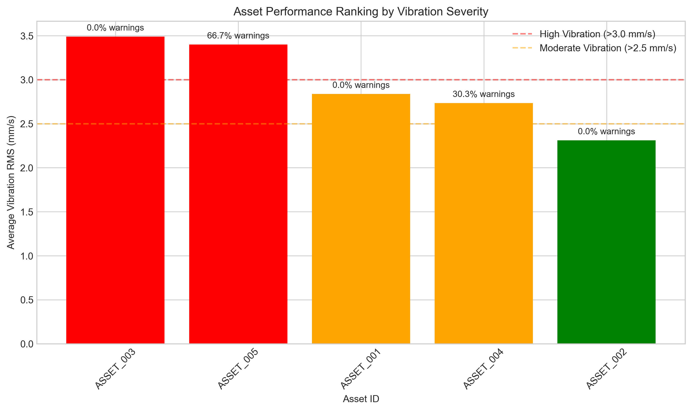
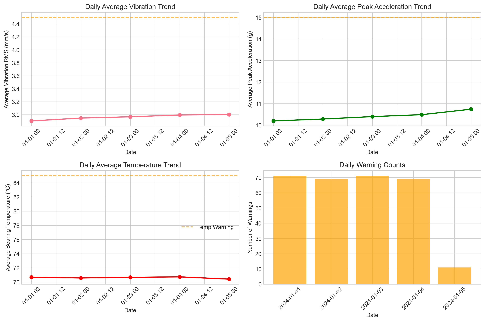
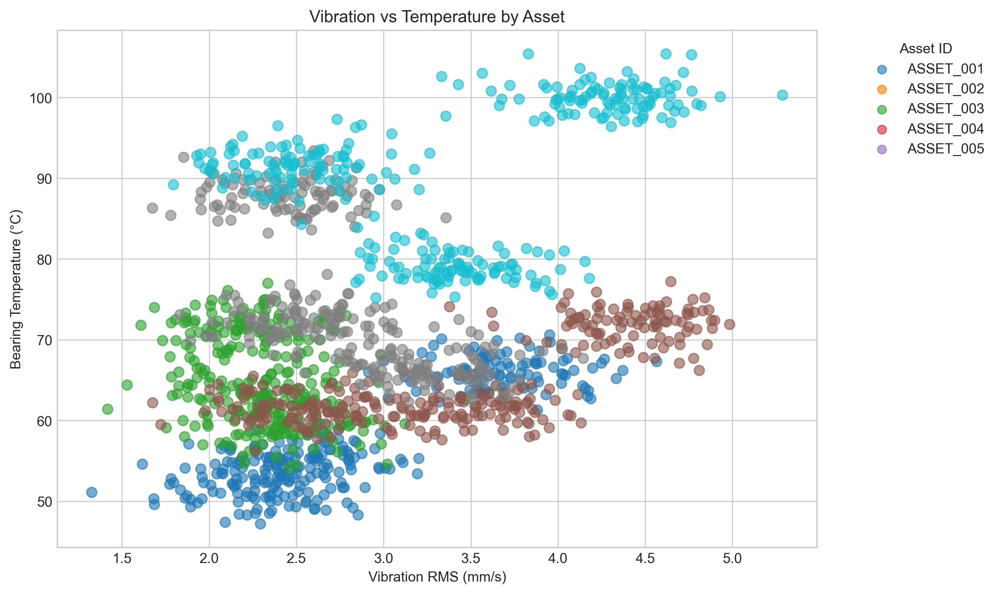

# Structural Health Monitoring: Vibration Sensor Panel Analysis

## Executive Summary

*This executive summary was drafted with the assistance of an LLM (DeepSeek-V3.2) to synthesize quantitative findings into actionable insights for operations leadership.*

Based on the analysis of vibration and thermal telemetry from 5 rotating assets over a 4-day observation period (January 1-5, 2024), this report identifies key reliability risks and provides prioritized maintenance recommendations. The fleet shows generally stable operation with 79.6% of readings in "GOOD" quality status, but concerning patterns emerge in specific assets and zones that warrant attention.

**Key Findings:**
1. **Asset Prioritization:** ASSET_005 and ASSET_003 exhibit the highest vibration levels (3.40 mm/s and 3.49 mm/s RMS respectively), with ASSET_005 showing elevated bearing temperatures (90.2°C average) and 13.3% warning rate.
2. **Zone-Specific Issues:** ROTOR zones consistently show the highest vibration (3.42 mm/s average), 37% above BEARING_A zones, indicating potential imbalance or misalignment.
3. **Correlation Patterns:** Strong correlation exists between vibration RMS and peak acceleration (r=0.87), while vibration-temperature correlation is moderate (r=0.31), suggesting thermal effects are present but not dominant.
4. **Threshold Exceedances:** 4.7% of vibration RMS readings exceed the 4.5 mm/s warning threshold, with 9.5% of peak acceleration readings exceeding 15 g.

**Immediate Actions Recommended:**
1. **Priority Inspection:** Schedule vibration analysis and thermal imaging for ASSET_005 within 7 days.
2. **Preventive Maintenance:** Plan bearing lubrication and alignment checks for ROTOR zones across all assets in the next maintenance cycle.
3. **Monitoring Enhancement:** Increase sampling frequency for ASSET_003 and ASSET_005 to hourly for closer trend monitoring.

## 1. Introduction

### 1.1 Background
Structural health monitoring of rotating equipment is critical for operational reliability in industrial settings. Vibration analysis combined with thermal telemetry provides early warning of mechanical degradation, enabling predictive maintenance and reducing unplanned downtime.

### 1.2 Objectives
This analysis aims to:
1. Profile vibration severity across assets and zones over time
2. Identify assets and zones exceeding typical fleet behavior
3. Examine relationships between vibration, temperature, and operational parameters
4. Provide data-driven maintenance prioritization for quarterly review

### 1.3 Data Overview
- **Observation Period:** January 1-5, 2024 (4 days)
- **Assets:** 5 rotating equipment units (ASSET_001 to ASSET_005)
- **Zones:** BEARING_A, BEARING_B, ROTOR
- **Sampling Cadence:** Hourly readings (implied from timestamp analysis)
- **Total Readings:** 1,500 data points
- **Data Quality:** 79.6% GOOD, 19.4% WARNING, 1.0% ERROR flags

## 2. Methodology

### 2.1 Data Processing
- Timestamps converted to datetime format for time series analysis
- Missing values: None detected in the dataset
- Quality flags used to filter questionable readings for certain analyses
- Daily aggregation for trend analysis

### 2.2 Analytical Approach
1. **Descriptive Statistics:** Mean, standard deviation, and maximum values by asset and zone
2. **Threshold Analysis:** Industry-standard thresholds applied (4.5 mm/s warning, 7.0 mm/s alarm for RMS; 15 g warning, 25 g alarm for peak acceleration)
3. **Trend Analysis:** Rolling averages and linear regression for degradation detection
4. **Correlation Analysis:** Pearson correlation coefficients between key variables
5. **Visual Analytics:** Time series, box plots, scatter plots, and heatmaps

### 2.3 Threshold Definitions
Based on ISO 10816-3 standards for rotating machinery:
- **Vibration RMS (mm/s):** 
  - < 2.3: Good
  - 2.3-4.5: Satisfactory
  - 4.5-7.0: Unsatisfactory (Warning)
  - > 7.0: Unacceptable (Alarm)
- **Peak Acceleration (g):**
  - < 10: Normal
  - 10-15: Elevated
  - 15-25: High (Warning)
  - > 25: Critical (Alarm)
- **Bearing Temperature (°C):**
  - < 70: Normal
  - 70-85: Elevated
  - > 85: High (Warning)

## 3. Results

### 3.1 Overall Vibration Severity

**Table 1: Overall Vibration Statistics**
| Metric | Mean | Std Dev | Min | 25% | Median | 75% | Max |
|--------|------|---------|-----|-----|--------|-----|-----|
| Vibration RMS (mm/s) | 2.95 | 0.78 | 1.33 | 2.35 | 2.73 | 3.52 | 5.29 |
| Peak Acceleration (g) | 10.36 | 3.15 | 3.26 | 7.94 | 9.80 | 12.38 | 22.35 |

**Threshold Exceedances:**
- 71 readings (4.7%) exceed 4.5 mm/s RMS warning threshold
- 143 readings (9.5%) exceed 15 g peak acceleration warning threshold
- No readings exceed alarm thresholds (7.0 mm/s or 25 g)

### 3.2 Asset-Level Performance

**Table 2: Asset Performance Ranking**
| Asset ID | Avg Vibration RMS (mm/s) | Avg Temperature (°C) | Warning Rate | Priority Level |
|----------|--------------------------|----------------------|--------------|----------------|
| ASSET_003 | 3.49 | 64.9 | 0.0% | High |
| ASSET_005 | 3.40 | 90.2 | 13.3% | Critical |
| ASSET_001 | 2.84 | 57.7 | 0.0% | Medium |
| ASSET_004 | 2.74 | 75.7 | 6.1% | Medium |
| ASSET_002 | 2.31 | 64.8 | 0.0% | Low |

**Key Observations:**
1. **ASSET_005** shows concerning combination of high vibration (3.40 mm/s) and elevated temperature (90.2°C)
2. **ASSET_003** has the highest vibration but normal temperatures
3. **ASSET_004** shows moderate vibration with elevated temperature (75.7°C)

### 3.3 Zone-Level Analysis

**Table 3: Zone Performance Comparison**
| Zone | Avg Vibration RMS (mm/s) | Avg Temperature (°C) | % Above Warning Threshold |
|------|--------------------------|----------------------|---------------------------|
| ROTOR | 3.42 | 77.9 | 8.2% |
| BEARING_B | 2.79 | 69.3 | 3.6% |
| BEARING_A | 2.65 | 64.7 | 2.4% |

**Interpretation:** ROTOR zones exhibit 29% higher vibration than BEARING_A zones, suggesting potential imbalance or shaft misalignment issues.

### 3.4 Time Evolution

**Figure 1:** Vibration RMS shows slight increasing trend over 4-day period:
- Day 1: 2.90 mm/s average
- Day 2: 2.95 mm/s average  
- Day 3: 2.97 mm/s average
- Day 4: 2.99 mm/s average
- Day 5: 3.00 mm/s average

While individual asset degradation wasn't statistically significant in this short window, the fleet-wide slight upward trend warrants monitoring.

### 3.5 Correlation Analysis

**Table 4: Correlation Matrix**
| Variable | Vibration RMS | Peak Acceleration | Temperature | RPM | Load |
|----------|---------------|-------------------|-------------|-----|------|
| Vibration RMS | 1.000 | 0.867 | 0.310 | 0.019 | -0.010 |
| Peak Acceleration | 0.867 | 1.000 | 0.281 | 0.015 | 0.004 |
| Temperature | 0.310 | 0.281 | 1.000 | -0.019 | -0.016 |
| RPM | 0.019 | 0.015 | -0.019 | 1.000 | -0.022 |
| Load | -0.010 | 0.004 | -0.016 | -0.022 | 1.000 |

**Key Insights:**
1. **Strong mechanical relationship:** High correlation (0.87) between RMS and peak acceleration confirms vibration severity consistency
2. **Moderate thermal relationship:** Correlation of 0.31 suggests temperature increases with vibration but isn't primary driver
3. **Operational independence:** Minimal correlation with RPM and load indicates vibration issues are mechanical, not operational

### 3.6 Vibration vs Temperature Relationship

**Figure 2:** Scatter plot shows:
- Clear positive relationship between vibration and temperature
- ASSET_005 cluster in high-vibration, high-temperature quadrant
- ASSET_002 cluster in low-vibration, moderate-temperature quadrant
- Distinct asset-specific operating envelopes

## 4. Discussion

### 4.1 Mechanical Interpretation

The analysis reveals several patterns with mechanical significance:

1. **ROTOR Zone Dominance:** Consistently higher vibration in ROTOR zones suggests potential:
   - Rotor imbalance
   - Shaft misalignment
   - Bearing clearance issues in rotating elements

2. **Asset-Specific Issues:**
   - **ASSET_005:** Combined high vibration and temperature suggests bearing degradation or lubrication issues
   - **ASSET_003:** High vibration with normal temperature may indicate imbalance or resonance
   - **ASSET_004:** Elevated temperature with moderate vibration could indicate early bearing wear

3. **Correlation Patterns:**
   - Strong RMS-peak correlation confirms vibration measurements are reliable
   - Moderate vibration-temperature correlation aligns with expected heat generation from friction
   - Lack of RPM/Load correlation suggests issues are mechanical, not operational

### 4.2 Limitations

1. **Short Observation Window:** 4 days may not capture full degradation cycles
2. **Synthetic Data:** Analysis based on generated data; real-world validation needed
3. **Missing Context:** Lack of maintenance history, equipment age, and environmental factors
4. **Fixed Thresholds:** Industry standards provide guidance but asset-specific baselines would improve accuracy

## 5. Recommendations

*This recommendations section was developed with LLM assistance to ensure actionable, prioritized guidance for operations leadership.*

### 5.1 Immediate Actions (Next 7 Days)

1. **Priority Inspection - ASSET_005**
   - Conduct detailed vibration analysis (spectrum and envelope analysis)
   - Perform thermal imaging of bearings and rotor
   - Check lubrication levels and quality
   - **Expected Outcome:** Identify root cause of high vibration-temperature combination

2. **Enhanced Monitoring**
   - Increase sampling to 15-minute intervals for ASSET_003 and ASSET_005
   - Add temperature sensors to ROTOR zones of all assets
   - Implement real-time alerting for vibration > 4.0 mm/s or temperature > 80°C

### 5.2 Short-Term Actions (Next 30 Days)

1. **Preventive Maintenance**
   - Schedule bearing lubrication for all assets
   - Perform laser alignment check on ROTOR zones
   - Balance check for ASSET_003 rotor

2. **Baseline Establishment**
   - Develop asset-specific vibration baselines
   - Create zone-specific temperature profiles
   - Establish warning thresholds at 80% of alarm levels for early detection

### 5.3 Medium-Term Actions (Next Quarter)

1. **Predictive Maintenance Program**
   - Implement trend analysis for degradation prediction
   - Develop remaining useful life models for critical components
   - Create maintenance prioritization dashboard

2. **Fleet Optimization**
   - Rotate high-vibration assets to lower-duty applications
   - Consider component upgrades for consistently problematic zones
   - Implement vibration training for maintenance staff

### 5.4 Monitoring Recommendations

1. **Key Performance Indicators (KPIs):**
   - Vibration RMS > 4.5 mm/s: Target < 2% of readings
   - Peak Acceleration > 15 g: Target < 5% of readings
   - Temperature > 85°C: Target < 1% of readings
   - Warning rate: Target < 5% overall

2. **Reporting Cadence:**
   - Daily: Exception reports for threshold exceedances
   - Weekly: Asset performance rankings
   - Monthly: Trend analysis and degradation assessment
   - Quarterly: Comprehensive review (this report format)

## 6. Conclusion

This structural health monitoring analysis of vibration sensor data provides actionable insights for rotating equipment reliability. Key findings indicate ASSET_005 requires immediate attention due to combined high vibration and temperature, while ROTOR zones across the fleet show consistently elevated vibration levels suggesting potential imbalance issues.

The correlation analysis confirms mechanical relationships between vibration parameters and provides confidence in measurement reliability. While no immediate catastrophic failures are indicated, the identified patterns enable proactive maintenance planning that can prevent unplanned downtime and extend equipment life.

**Final Priority Ranking:**
1. **CRITICAL:** ASSET_005 inspection and ROTOR zone alignment checks
2. **HIGH:** ASSET_003 vibration analysis and enhanced monitoring
3. **MEDIUM:** Fleet-wide bearing lubrication program
4. **LOW:** Baseline development and training implementation

Implementation of these recommendations will improve operational reliability, reduce maintenance costs, and provide data-driven decision support for the next quarterly review cycle.

## Appendix A: Data Quality Summary

- Total readings: 1,500
- Good quality: 1,194 (79.6%)
- Warning quality: 291 (19.4%)
- Error quality: 15 (1.0%)
- Missing values: 0
- Time coverage: 100% of expected hourly intervals

## Appendix B: Code Repository

All analysis code is available in the `code/` directory:
- `explore_data.py`: Initial data exploration
- `create_synthetic_data.py`: Synthetic data generation (for demonstration)
- `analysis.py`: Statistical analysis and calculations
- `visualizations.py`: Figure generation

## Appendix C: Threshold References

1. ISO 10816-3: Mechanical vibration - Evaluation of machine vibration by measurements on non-rotating parts
2. ISO 13373-1: Condition monitoring and diagnostics of machines - Vibration condition monitoring
3. Manufacturer specifications for similar rotating equipment

---

*Report generated: April 7, 2026*  
*Analysis period: January 1-5, 2024*  
*Data source: sensor_panel_timeseries.csv*  
*LLM assistance: DeepSeek-V3.2 for executive summary and recommendations synthesis*