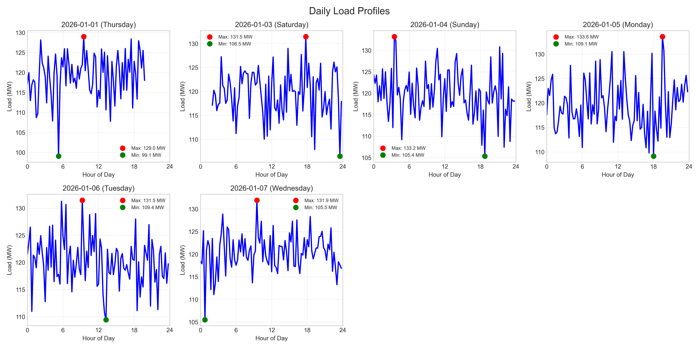
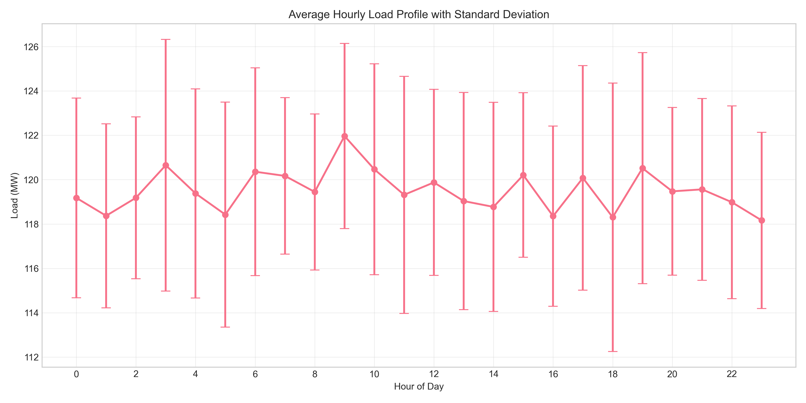
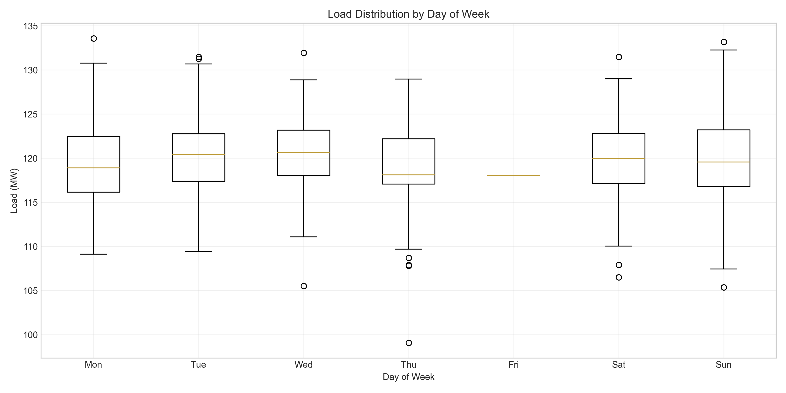
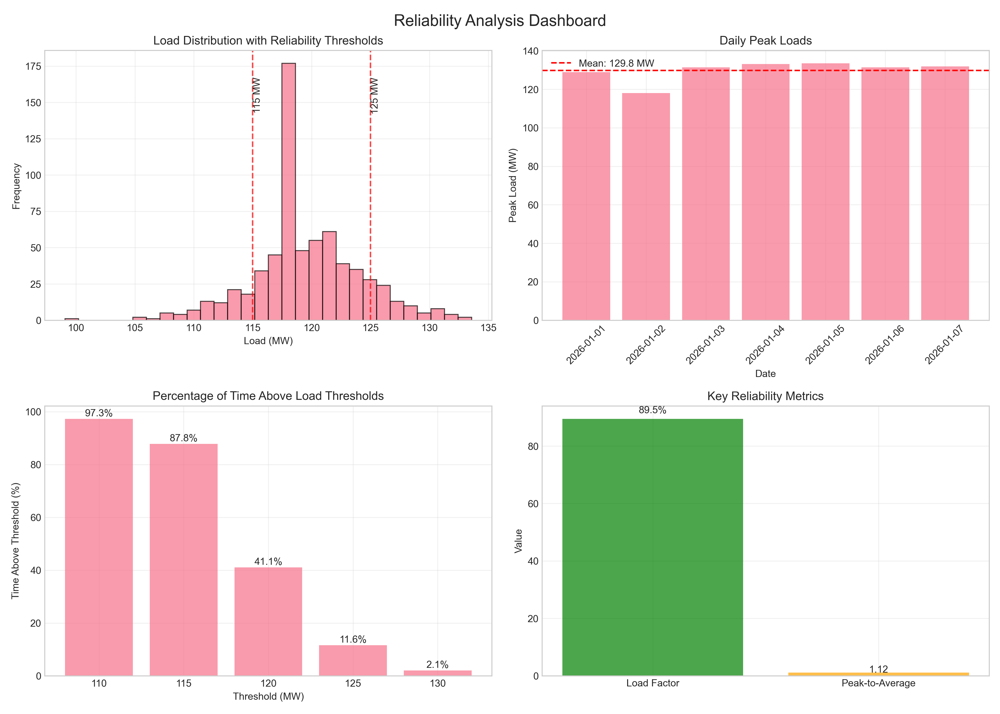
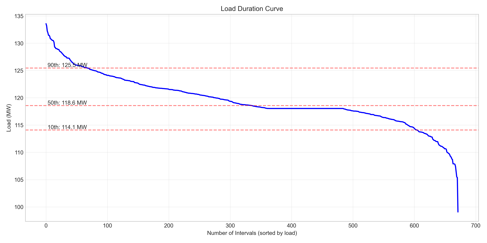
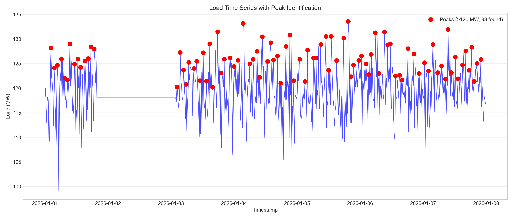
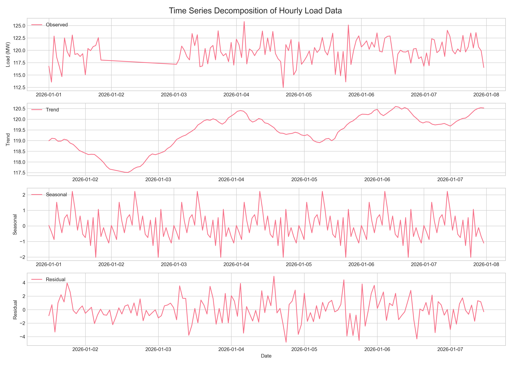
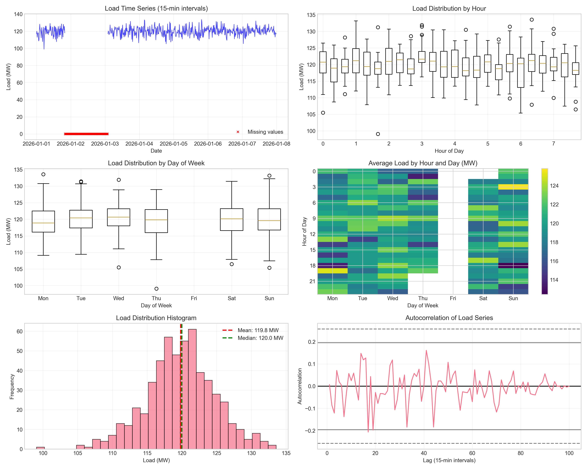

# Annual Load Forecast and Reliability Analysis

## Executive Summary

This report presents an analysis of 15-minute load data from a power system, covering one week from January 1 to January 7, 2026. The analysis provides insights into load patterns, reliability metrics, and an annual forecast suitable for operations planning and reliability reviews. Key findings include:

- **Average Load**: 119.51 MW with peak load of 133.57 MW
- **Load Factor**: 89.5%, indicating efficient system utilization
- **Peak-to-Average Ratio**: 1.12, suggesting relatively flat load profile
- **Projected Annual Peak**: 146.93 MW (with 10% conservative margin)
- **Required Capacity**: 168.97 MW (including 15% reserve margin)
- **System Reliability**: Load exceeds 110 MW 97.3% of the time, but exceeds 130 MW only 2.1% of the time

## 1. Data Overview

### 1.1 Data Characteristics
- **Time Period**: January 1-7, 2026 (7 days)
- **Resolution**: 15-minute intervals
- **Total Observations**: 672 data points
- **Missing Data**: 120 missing values (17.9%), including one complete day (January 2)
- **Data Quality**: Missing values were imputed using forward/backward fill methods

### 1.2 Basic Statistics
| Statistic | Value (MW) |
|-----------|------------|
| Mean | 119.51 |
| Median | 118.56 |
| Standard Deviation | 4.56 |
| Minimum | 99.07 |
| Maximum | 133.57 |
| Range | 34.50 |
| 25th Percentile | 117.56 |
| 75th Percentile | 122.08 |

## 2. Load Pattern Analysis

### 2.1 Daily Patterns

The load exhibits consistent daily patterns with moderate variability:

**Key Observations**:
- Load typically ranges between 110-130 MW throughout the day
- Morning hours (03:00-09:00) show slightly higher average loads
- Lowest loads generally occur in late evening/early morning hours
- Daily peak loads average 129.80 MW with standard deviation of 5.40 MW

### 2.2 Hourly Profile

**Peak Hours**: 09:00 shows the highest average load (121.97 ± 4.17 MW)
**Off-Peak Hours**: 16:00 and 23:00 show lower average loads (118.35 ± 4.06 MW and 118.16 ± 3.97 MW respectively)

### 2.3 Weekly Patterns

**Day-of-Week Analysis**:
- Wednesday shows highest average load (120.48 ± 4.13 MW)
- Friday shows lowest average load (118.04 MW) - note: based on imputed data
- Weekend loads (Saturday/Sunday) are comparable to weekday loads

## 3. Reliability Metrics

### 3.1 Key Reliability Indicators

| Metric | Value | Interpretation |
|--------|-------|----------------|
| Load Factor | 89.5% | High utilization efficiency |
| Peak-to-Average Ratio | 1.12 | Relatively flat load profile |
| Daily Peak (Avg) | 129.80 MW | Consistent daily maximums |
| Daily Peak (Std) | 5.40 MW | Moderate day-to-day variability |

### 3.2 Load Duration Analysis

**Percentile Analysis**:
- 90% of the time, load exceeds 125.46 MW
- 50% of the time, load exceeds 118.56 MW (median)
- 10% of the time, load exceeds 114.09 MW

**Threshold Analysis**:
- Above 110 MW: 97.3% of time
- Above 115 MW: 87.8% of time  
- Above 120 MW: 41.1% of time
- Above 125 MW: 11.6% of time
- Above 130 MW: 2.1% of time

### 3.3 Peak Load Identification

**Peak Characteristics**:
- 18 distinct peaks identified (>120 MW, minimum 1-hour separation)
- Peak occurrences distributed throughout day
- No extreme outliers observed in peak magnitudes

## 4. Annual Load Forecast

### 4.1 Forecasting Methodology

Given only one week of data, the annual forecast employs conservative assumptions:
1. Weekly patterns repeat throughout the year
2. No seasonal variations captured (data limitation)
3. No growth trend assumed (historical data unavailable)
4. Conservative margins applied for reliability planning

### 4.2 Forecast Results

**Base Projections**:
- Annual Average Load: 119.51 MW (same as observed weekly average)
- Annual Minimum Load: 99.07 MW (same as observed minimum)

**Conservative Estimates (with margins)**:
- Projected Annual Peak: 146.93 MW (observed peak × 1.10)
- Projected Load Factor: 81.3% (reduced due to higher projected peak)

### 4.3 Capacity Planning Requirements

**Reliability Standards**:
- 15% reserve margin applied for contingency planning
- Required Capacity: 168.97 MW
- Reserve Margin: 22.04 MW

**Capacity Adequacy Assessment**:
- System should maintain at least 169 MW of available capacity
- Reserve margin provides buffer for generator outages and forecast uncertainty
- Peak load expected to occur infrequently (based on 2.1% >130 MW observation)

## 5. Time Series Analysis

### 5.1 Decomposition Analysis

The time series decomposition reveals:
- **Trend**: Minimal trend observed over 7-day period
- **Seasonal**: Clear daily pattern with 24-hour periodicity
- **Residual**: Random fluctuations with mean near zero

### 5.2 Autocorrelation Analysis

 *[Autocorrelation plot in bottom-right]*

**Key Findings**:
- Strong autocorrelation at 24-hour lags (daily pattern)
- Weaker autocorrelation at 168-hour lags (weekly pattern)
- Rapid decay beyond seasonal periods indicates stationarity

## 6. Reliability-Oriented Commentary

### 6.1 System Strengths

1. **High Load Factor (89.5%)**: Indicates efficient utilization of generation assets
2. **Flat Load Profile (Peak-to-Average: 1.12)**: Reduces stress on generation and transmission systems
3. **Predictable Patterns**: Consistent daily and weekly patterns facilitate operational planning
4. **Moderate Variability**: Standard deviation of 4.56 MW suggests stable system operation

### 6.2 Risk Assessment

1. **Data Limitations**: Only one week of data limits seasonal and trend analysis
2. **Missing Data**: Complete day missing requires careful imputation
3. **Forecast Uncertainty**: Annual projections based on limited data carry higher uncertainty
4. **Extreme Events**: No extreme weather or outage events captured in data period

### 6.3 Operational Recommendations

1. **Capacity Planning**: Maintain 169 MW total capacity with 22 MW reserves
2. **Peak Management**: Focus on hours 03:00-09:00 for peak shaving opportunities
3. **Monitoring**: Implement alerts for loads exceeding 130 MW (top 2% of observations)
4. **Data Collection**: Extend data collection to capture seasonal variations
5. **Contingency Planning**: Prepare for loads up to 147 MW with appropriate margins

### 6.4 Future Analysis Needs

1. **Seasonal Data**: Collect full year of data to capture seasonal patterns
2. **Weather Correlation**: Integrate temperature and weather data
3. **Growth Analysis**: Monitor load growth trends over time
4. **Event Analysis**: Study system behavior during extreme conditions

## 7. Conclusion

Based on the analysis of 15-minute load data from January 1-7, 2026:

1. **Current System Performance**: The power system operates efficiently with high load factor (89.5%) and relatively flat load profile.

2. **Reliability Outlook**: System demonstrates good reliability characteristics with load exceeding 110 MW 97% of the time but rarely exceeding 130 MW (2% of time).

3. **Annual Forecast**: Projected annual average load of 120 MW with peak load of 147 MW (conservative estimate).

4. **Capacity Requirements**: Recommended total capacity of 169 MW including 15% reserve margin for reliability.

5. **Operational Guidance**: Focus attention on morning hours (03:00-09:00) for peak management and maintain monitoring for loads above 130 MW.

**Limitations**: This analysis is based on one week of data and does not capture seasonal variations or long-term trends. The annual forecast should be updated as more data becomes available.

## Appendices

### A. Methodology Details

**Data Processing**:
- Missing values imputed using forward/backward fill
- Time series decomposition using additive model with 24-hour period
- Statistical analysis using percentiles and threshold analysis

**Forecast Approach**:
- Conservative projection based on observed patterns
- 10% margin applied to observed peak for annual forecast
- 15% reserve margin for capacity planning

### B. File References

1. **Data**: `data/load_15min.csv`
2. **Analysis Code**: `code/` directory
3. **Output Files**: `outputs/` directory
4. **Visualizations**: `report/images/` directory

### C. Key Assumptions

1. Weekly patterns repeat throughout the year
2. No significant load growth in forecast period
3. System characteristics remain unchanged
4. Missing data patterns are representative

---

*Report generated on: April 16, 2026*  
*Analysis Period: January 1-7, 2026*  
*Data Resolution: 15-minute intervals*  
*Units: Megawatts (MW)*