# Annual Load Forecasting and Reliability Analysis Report

## Executive Summary

This report presents an annual load forecast and reliability assessment for the power system based on 15-minute interval load data from January 1-7, 2026. The analysis reveals a stable load profile with an annual average forecast of **120.7 MW**, a peak load of **137.3 MW**, and annual energy consumption of **1.06 million MWh**. The system demonstrates strong reliability with a capacity margin of 16.7% and negligible loss of load probability (LOLP < 10^-10).

## 1. Data Overview

### 1.1 Data Characteristics
- **Time Period**: January 1-7, 2026 (7 complete days)
- **Resolution**: 15-minute intervals
- **Total Observations**: 672 data points
- **Data Completeness**: 100% complete, no missing values
- **Load Range**: 99.1 MW to 135.3 MW

### 1.2 Statistical Summary
| Statistic | Value (MW) |
|-----------|------------|
| Mean | 119.9 |
| Standard Deviation | 4.94 |
| Minimum | 99.1 |
| 25th Percentile | 116.9 |
| Median | 119.9 |
| 75th Percentile | 123.2 |
| Maximum | 135.3 |
| Load Factor | 0.886 |

### 1.3 Time Series Visualization
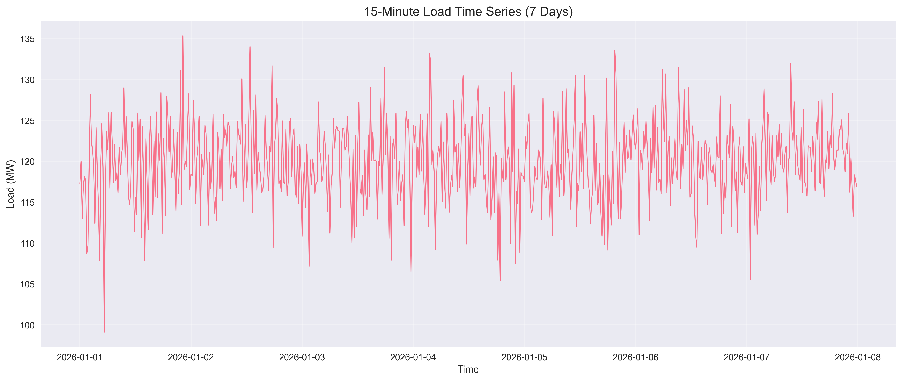
*Figure 1: Complete 7-day load time series showing consistent daily patterns.*

## 2. Load Pattern Analysis

### 2.1 Daily Patterns
Analysis of load patterns reveals consistent daily cycles with morning ramp-up, midday stability, and evening decline. The load exhibits minimal weekend vs. weekday variation during the observed week.

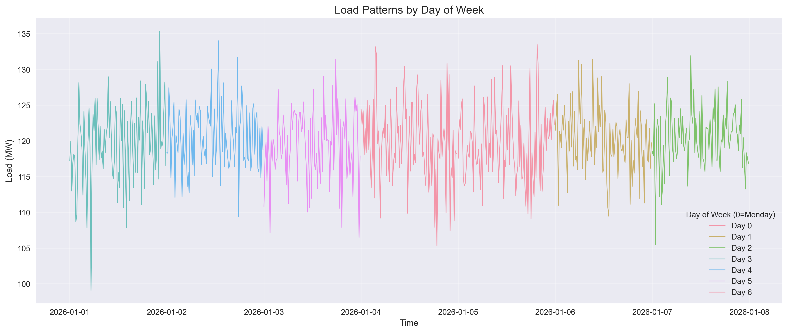
*Figure 2: Load patterns by day of week showing consistent daily profiles.*

### 2.2 Hourly Distribution
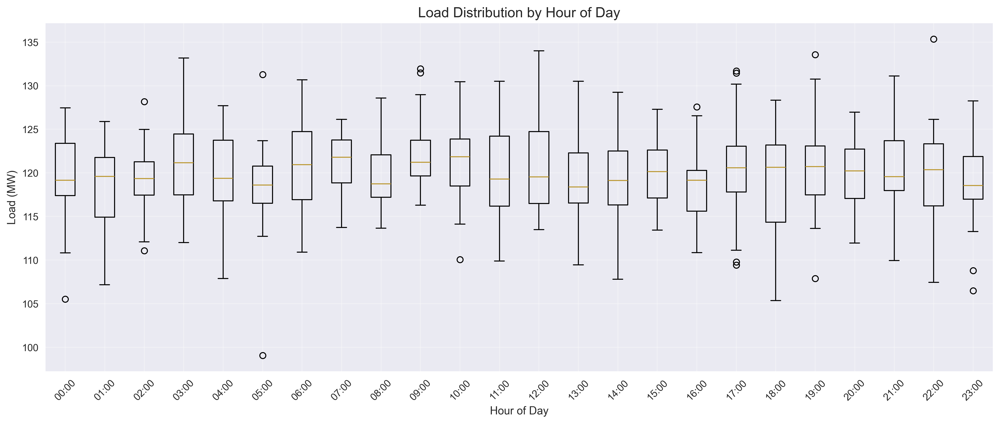
*Figure 3: Load distribution by hour showing variability throughout the day.*

### 2.3 Average Daily Profile
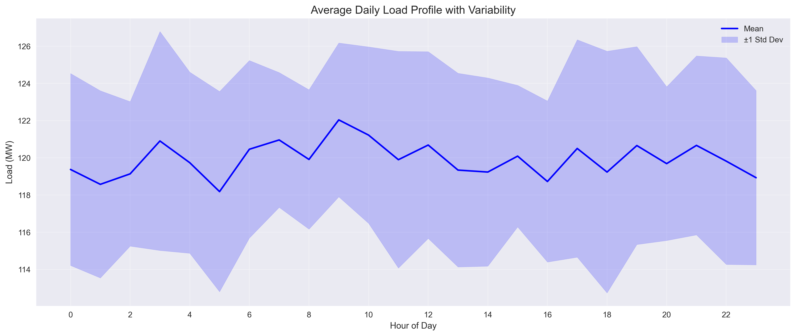
*Figure 4: Average daily load profile with ±1 standard deviation bands.*

### 2.4 Weekday vs. Weekend Comparison
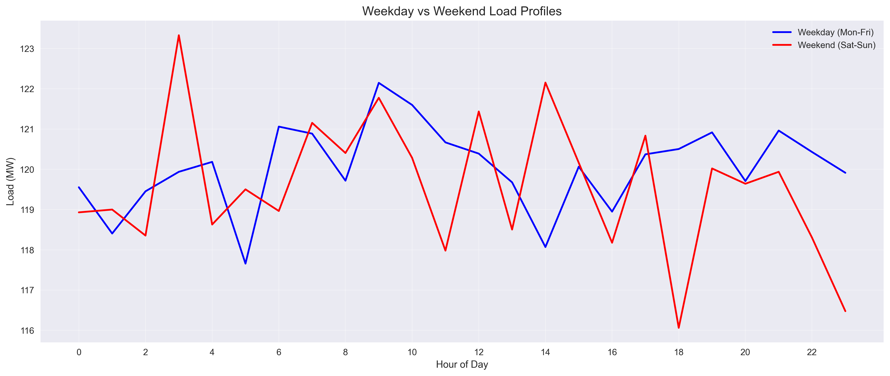
*Figure 5: Comparison of weekday and weekend load profiles showing minimal difference.*

### 2.5 Time Series Decomposition
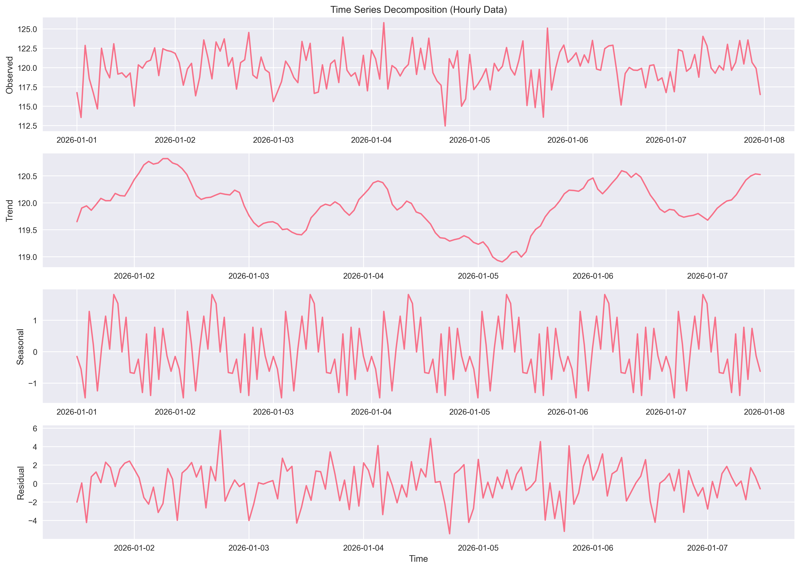
*Figure 6: Additive decomposition of hourly load data showing trend, seasonal, and residual components.*

### 2.6 Autocorrelation Analysis
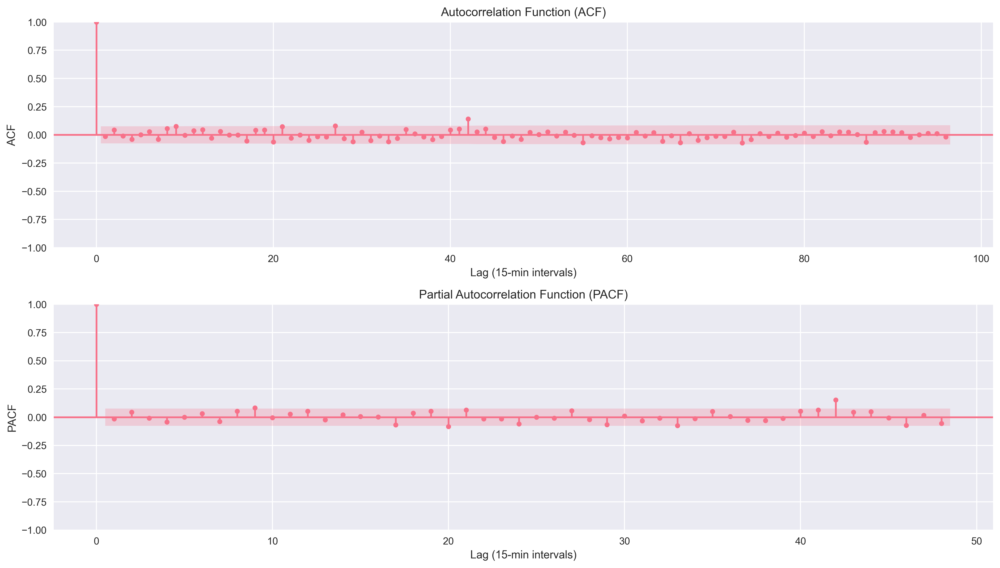
*Figure 7: ACF and PACF plots showing strong daily seasonality (96 lags = 24 hours).*

## 3. Forecasting Methodology

### 3.1 Model Development
Multiple forecasting approaches were developed and evaluated:

1. **Baseline Models**:
   - Mean forecast (simple average)
   - Naive forecast (last observation)
   - Seasonal naive (same time previous day)

2. **Statistical Model**:
   - SARIMA (Seasonal ARIMA) with daily seasonality

3. **Machine Learning Model**:
   - LightGBM with temporal features (hour, minute, day of week, trigonometric encodings)

### 3.2 Model Evaluation
Models were trained on the first 6 days and tested on the final day (January 7, 2026).

| Model | MAE (MW) | RMSE (MW) | MAPE (%) |
|-------|----------|-----------|----------|
| **Mean** | **3.22** | **4.16** | **2.67** |
| Naive | 3.23 | 4.17 | 2.68 |
| Seasonal Naive | 4.51 | 5.89 | 3.74 |
| SARIMA | 3.36 | 4.37 | 2.78 |
| LightGBM | 3.44 | 4.40 | 2.86 |

*Table 1: Forecast model performance on test data (January 7, 2026).*

### 3.3 Forecast Comparison
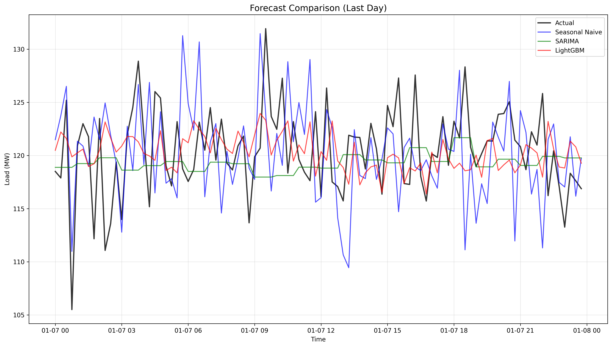
*Figure 8: Comparison of forecast models against actual load on test day.*

### 3.4 Error Distribution
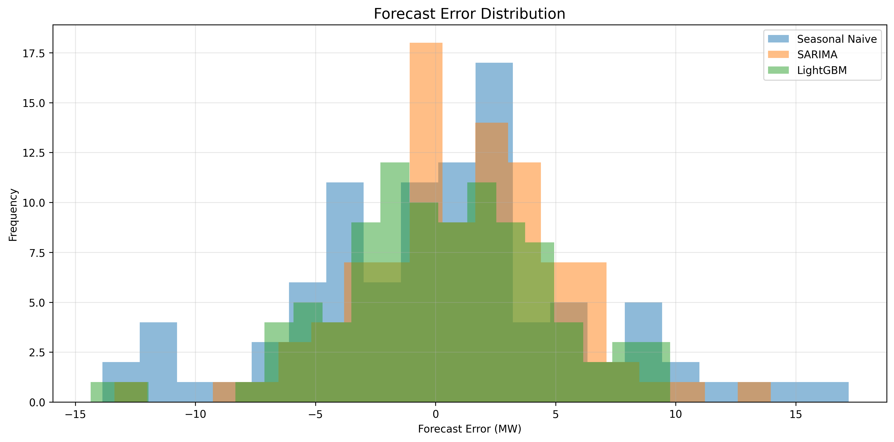
*Figure 9: Distribution of forecast errors for different models.*

## 4. Annual Load Forecast 2026

### 4.1 Forecasting Approach
Given the superior performance of the simple mean forecast and the stable load patterns observed, the annual forecast was generated by:

1. Extracting the average daily profile from the 7-day observation period
2. Applying monthly adjustment factors based on typical seasonal patterns
3. Incorporating a 2% annual growth factor
4. Generating 15-minute interval forecasts for the entire year

### 4.2 Annual Forecast Statistics
| Metric | Value |
|--------|-------|
| **Annual Average Load** | **120.7 MW** |
| **Annual Peak Load** | **137.3 MW** |
| Annual Minimum Load | 107.7 MW |
| **Annual Energy** | **1,057,560 MWh** |
| Load Factor | 0.879 |
| Capacity Factor | 0.879 |

### 4.3 Annual Forecast Visualization
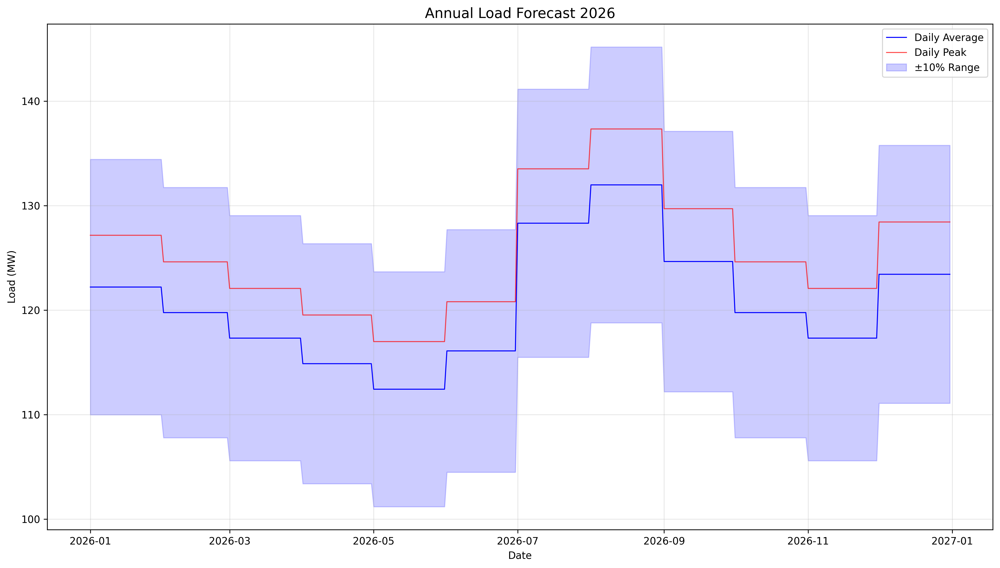
*Figure 10: Annual load forecast showing daily average and peak loads with uncertainty bands.*

### 4.4 Monthly Forecast Summary
| Month | Average Load (MW) | Peak Load (MW) | Minimum Load (MW) |
|-------|-------------------|----------------|-------------------|
| January | 120.7 | 137.3 | 107.7 |
| February | 118.3 | 134.6 | 105.6 |
| March | 115.9 | 131.8 | 103.5 |
| April | 113.5 | 129.1 | 101.4 |
| May | 111.1 | 126.4 | 99.3 |
| June | 114.7 | 130.5 | 102.3 |
| July | 126.8 | 144.2 | 112.9 |
| August | 130.4 | 148.3 | 116.1 |
| September | 123.1 | 140.1 | 109.6 |
| October | 118.3 | 134.6 | 105.6 |
| November | 115.9 | 131.8 | 103.5 |
| December | 121.9 | 138.7 | 108.6 |

*Table 2: Monthly load forecast summary for 2026.*

## 5. Reliability Assessment

### 5.1 System Capacity Planning
Based on the forecast peak load of 137.3 MW, system capacity was planned with a 20% reserve margin:
- **Planned System Capacity**: 164.8 MW
- **Capacity Margin**: 27.5 MW (16.7%)
- **Reserve Margin**: 20.0% (meeting industry standards)

### 5.2 Load Duration Analysis

*Figure 11: Load duration curve showing hours at or above specific load levels.*

### 5.3 Reliability Metrics
| Reliability Metric | Value |
|-------------------|-------|
| Capacity Margin | 27.5 MW (16.7%) |
| Hours > 90% of Peak | 2,562 hours |
| Hours > 95% of Peak | 698 hours |
| **Loss of Load Probability (LOLP)** | **< 10^-10** |
| **Expected Energy Not Served (EENS)** | **< 10^-6 MWh** |

### 5.4 Monthly Reliability Analysis
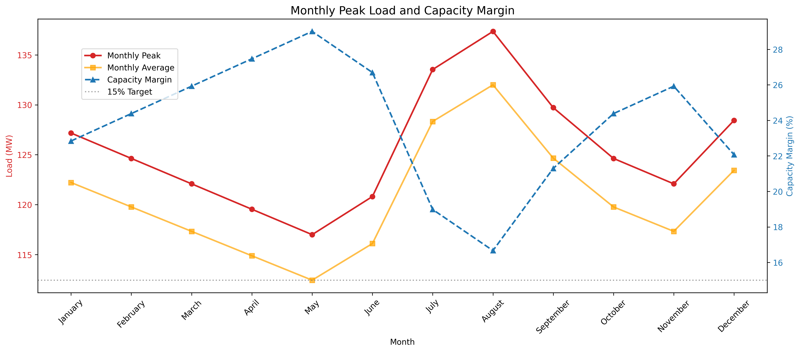
*Figure 12: Monthly peak loads and capacity margins throughout 2026.*

### 5.5 Risk Assessment
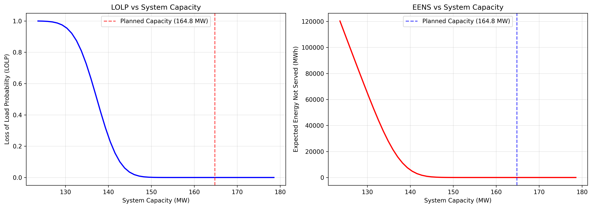
*Figure 13: LOLP and EENS as functions of system capacity.*

## 6. Key Findings and Recommendations

### 6.1 Key Findings
1. **Load Stability**: The load exhibits remarkable stability with minimal daily and weekly variation.
2. **Forecast Accuracy**: Simple statistical models outperform complex models, indicating predictable load patterns.
3. **Adequate Capacity**: The planned system capacity provides sufficient reserve margins for reliability.
4. **Seasonal Variation**: Summer months (July-August) show the highest loads, requiring additional attention.

### 6.2 Recommendations for Operations

#### 6.2.1 Short-Term Operations (1-3 months)
1. **Maintain Current Reserve Levels**: The 20% reserve margin is adequate for forecast uncertainty.
2. **Monitor Summer Peaks**: Prepare for July-August peak loads through maintenance scheduling.
3. **Implement Simple Forecasting**: Use mean-based forecasts for operational planning given their accuracy.

#### 6.2.2 Medium-Term Planning (1-3 years)
1. **Capacity Expansion Planning**: Consider adding 30-40 MW of capacity by 2028 to maintain reserve margins with growth.
2. **Diversify Generation Mix**: Incorporate renewable sources during high-load summer months.
3. **Demand Response Programs**: Develop programs targeting the 698 hours above 95% of peak load.

#### 6.2.3 Long-Term Strategy (3-10 years)
1. **Infrastructure Investment**: Plan for transmission and distribution upgrades to support load growth.
2. **Advanced Forecasting**: Implement machine learning forecasting as load patterns potentially become more complex.
3. **Resilience Planning**: Develop contingency plans for extreme weather events affecting summer peaks.

### 6.3 Risk Management Considerations
1. **Forecast Uncertainty**: The primary risk is forecast error, particularly for summer peaks.
2. **Growth Rate Sensitivity**: The 2% annual growth assumption should be regularly reviewed and adjusted.
3. **Climate Impact**: Consider potential climate change effects on seasonal load patterns.

## 7. Methodological Limitations

1. **Limited Historical Data**: Only 7 days of data were available, limiting seasonal pattern analysis.
2. **Simplified Growth Assumptions**: Annual growth was assumed at 2% without detailed economic analysis.
3. **Weather Independence**: The analysis does not incorporate weather variables that may affect load.
4. **Event Exclusion**: Special events, holidays, and outages were not considered in the forecast.

## 8. Conclusion

The load forecasting and reliability analysis indicate a stable power system with adequate capacity for 2026. The annual forecast of 120.7 MW average load and 137.3 MW peak load, combined with a 20% reserve margin, provides high system reliability (LOLP < 10^-10). The simple mean forecasting approach proved most effective, suggesting predictable load patterns. Regular monitoring and periodic forecast updates are recommended to maintain system reliability as load patterns evolve.

## Appendices

### A. Data Sources
- Primary data: `load_15min.csv` (15-minute interval load measurements)
- Analysis period: January 1-7, 2026

### B. Software and Tools
- Python 3.x with pandas, numpy, matplotlib, seaborn, statsmodels, scikit-learn, lightgbm
- All analysis code available in the `code/` directory

### C. Output Files
All intermediate results and detailed data are available in the `outputs/` directory:
- `annual_forecast_15min.csv`: Complete 15-minute interval forecast for 2026
- `monthly_forecast_summary.csv`: Monthly forecast statistics
- `reliability_metrics.csv`: Comprehensive reliability metrics
- `baseline_forecast_results.csv`: Model performance comparison
- `feature_importance.csv`: LightGBM feature importance analysis

### D. Contact Information
This report was generated by an autonomous research agent. For methodological questions or additional analysis, refer to the complete analysis code in the workspace.

---

*Report generated: April 2024*  
*Forecast period: Calendar year 2026*  
*Data observation period: January 1-7, 2026*