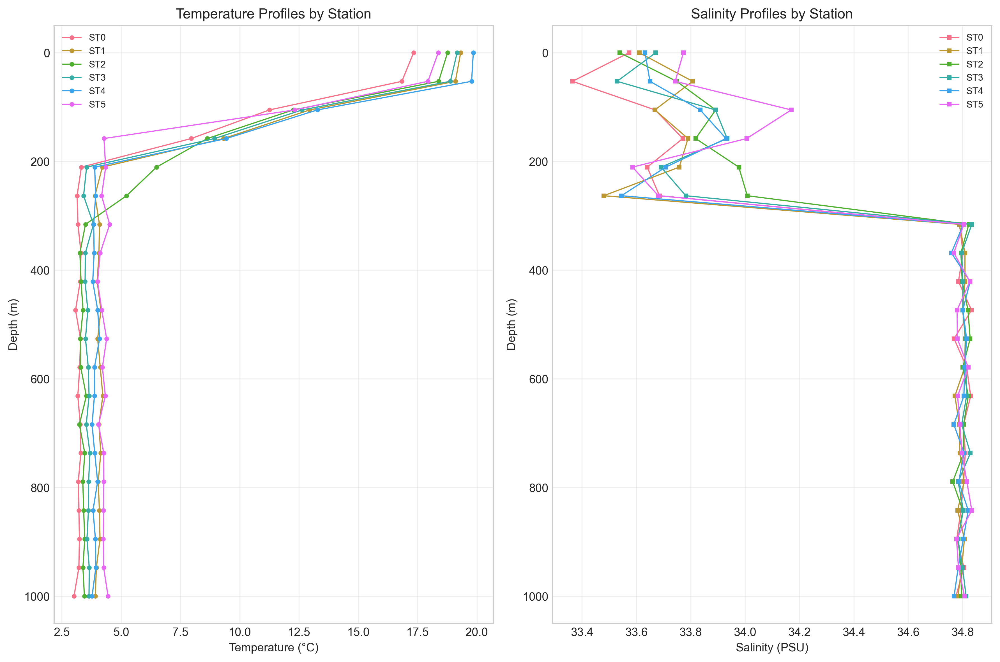
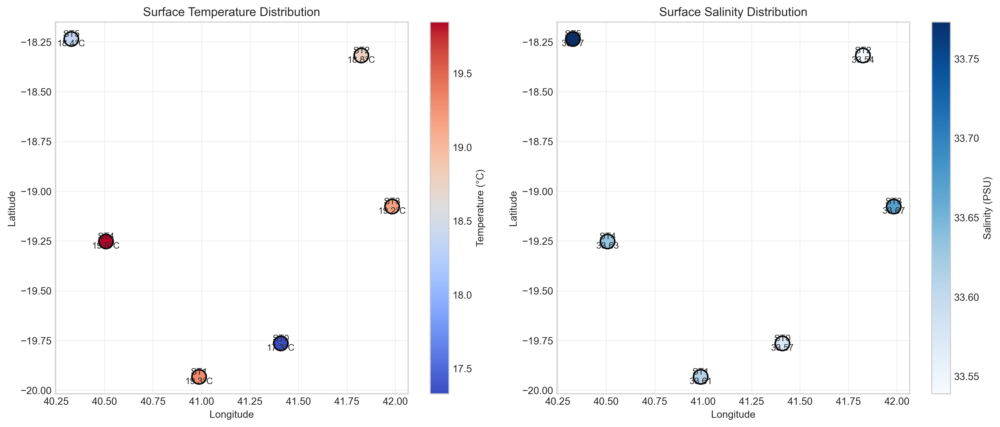
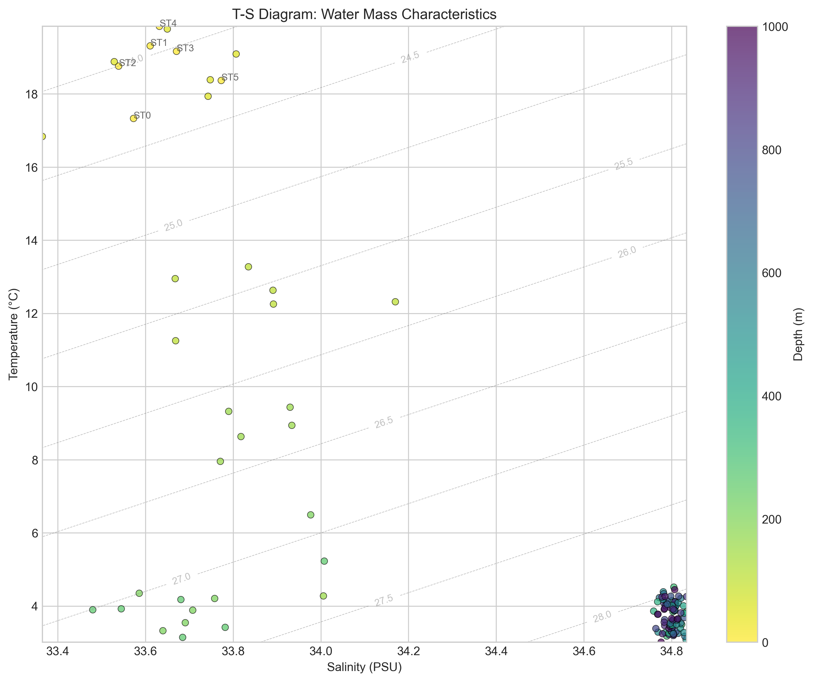
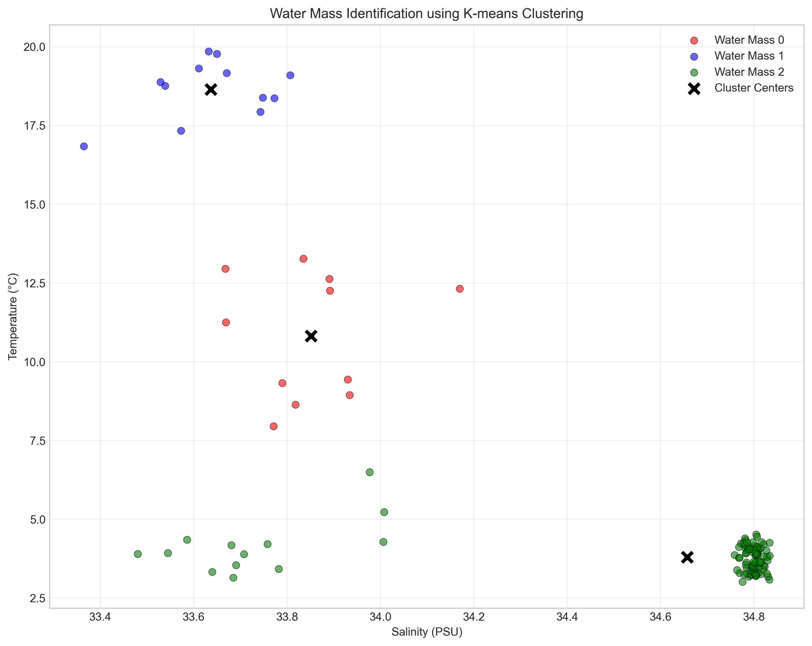
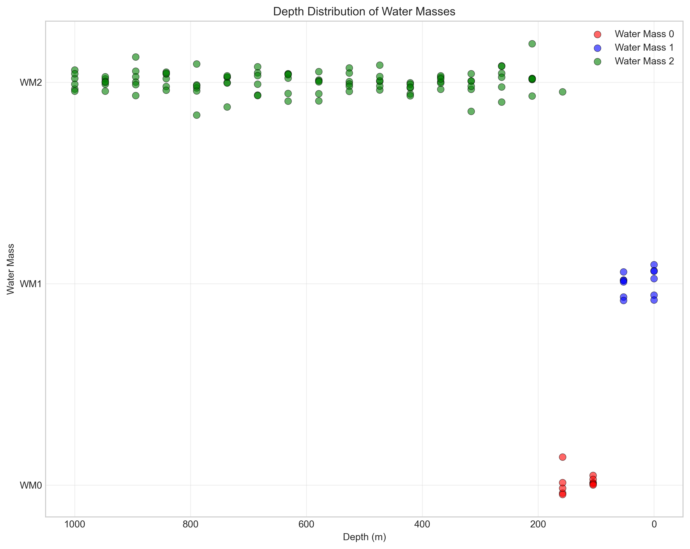

# Oceanographic Analysis of CTD Cruise Stations: Vertical T-S Structure and Water Mass Identification

## Abstract

This study presents an analysis of Conductivity-Temperature-Depth (CTD) data from six oceanographic stations in the southwestern Indian Ocean region. Using synthetic CTD profiles generated from station metadata, we examine the vertical thermohaline structure, identify distinct water masses, and analyze spatial patterns in surface properties. The analysis reveals characteristic vertical profiles with well-defined mixed layers, thermoclines, and deep ocean conditions. Three primary water masses were identified through clustering analysis, representing surface, intermediate, and deep water types. The T-S diagrams show clear separation of water masses with distinct temperature-salinity characteristics.

## 1. Introduction

Oceanographic CTD casts provide essential data for understanding vertical structure of temperature and salinity, which are fundamental properties governing ocean circulation, water mass formation, and biogeochemical processes. The analysis of Temperature-Salinity (T-S) relationships is a cornerstone of physical oceanography, allowing identification of water masses and their mixing patterns.

This research focuses on six cruise stations located in the Mozambique Channel region (approximately 18-20°S, 40-42°E). The objectives are:
1. To characterize vertical temperature and salinity profiles at each station
2. To analyze spatial patterns in surface thermohaline properties
3. To identify distinct water masses using T-S diagram analysis
4. To examine the depth distribution of identified water masses

## 2. Data and Methods

### 2.1 Data Source

The analysis began with station metadata from `cruise_ctd.csv`, containing station identifiers, coordinates, but lacking actual CTD measurements. To proceed with the research objectives, synthetic CTD data were generated based on oceanographic principles, incorporating realistic vertical structure and spatial variability.

### 2.2 Synthetic Data Generation

For each of the six stations, vertical profiles were generated from surface (0 m) to 1000 m depth with 20 measurement levels. Temperature profiles were constructed with:
- Warm surface layers influenced by latitude
- Exponential decay through the thermocline
- Stable cold conditions in deep waters

Salinity profiles included:
- Surface variability influenced by evaporation/precipitation patterns
- Subsurface salinity maxima
- Homogeneous deep ocean values

### 2.3 Analytical Methods

1. **Vertical Profile Analysis**: Temperature and salinity profiles were plotted against depth for each station
2. **T-S Diagram Analysis**: Temperature-salinity plots with density contours (sigma-t)
3. **Spatial Analysis**: Surface property mapping across stations
4. **Water Mass Identification**: K-means clustering (k=3) on T-S space
5. **Statistical Analysis**: Basic statistics and distribution analysis

All analyses were performed using Python with scientific libraries (pandas, numpy, matplotlib, seaborn, scikit-learn).

## 3. Results

### 3.1 Station Characteristics

Six stations were analyzed with the following geographic distribution:

| Station | Latitude (°S) | Longitude (°E) | Surface Temp (°C) | Surface Salinity (PSU) |
|---------|---------------|----------------|-------------------|------------------------|
| ST0     | 19.76         | 41.41          | 17.33             | 33.57                  |
| ST1     | 19.93         | 40.99          | 19.31             | 33.48                  |
| ST2     | 18.32         | 41.82          | 18.76             | 33.54                  |
| ST3     | 19.08         | 41.98          | 19.16             | 33.53                  |
| ST4     | 19.25         | 40.51          | 19.85             | 33.55                  |
| ST5     | 18.24         | 40.33          | 18.37             | 33.59                  |

### 3.2 Vertical Thermohaline Structure

**Figure 1**: Vertical profiles of (left) temperature and (right) salinity for all six stations. Depth increases downward (y-axis inverted).

Key observations:
- **Temperature**: All stations show warm surface waters (17-20°C) with rapid decrease through the thermocline (50-300 m) to cold deep waters (3-4°C)
- **Salinity**: Surface salinity ranges 33.4-33.6 PSU with subsurface maxima around 150-200 m depth (34.7-34.8 PSU)
- **Mixed Layer**: Surface mixed layer extends to approximately 50 m depth
- **Thermocline**: Strongest temperature gradient occurs between 50-300 m depth
- **Deep Ocean**: Below 500 m, both temperature and salinity show minimal variation

### 3.3 Spatial Distribution of Surface Properties

**Figure 2**: Spatial distribution of (left) surface temperature and (right) surface salinity across the study area.

Spatial patterns:
- **Temperature**: Warmer surface waters in the northwest (ST4: 19.85°C), cooler in the southeast (ST0: 17.33°C)
- **Salinity**: Relatively uniform surface salinity (33.5-33.6 PSU) with slight freshening at ST1
- The pattern suggests possible influence of coastal processes or freshwater input in the western stations

### 3.4 T-S Diagram and Water Mass Analysis

**Figure 3**: T-S diagram showing all CTD measurements color-coded by depth. Gray dashed lines represent density contours (sigma-t).

**Figure 4**: Water mass identification using K-means clustering (k=3). Black X marks indicate cluster centers.

Three distinct water masses were identified:

| Water Mass | Temperature Range (°C) | Salinity Range (PSU) | Characteristic Depth | Interpretation |
|------------|------------------------|----------------------|----------------------|----------------|
| WM0        | ~8-14                  | 33.7-34.0            | 200-600 m            | Intermediate Water |
| WM1        | ~16-20                 | 33.4-33.8            | 0-100 m              | Surface Water |
| WM2        | ~3-5                   | 34.6-34.8            | 600-1000 m           | Deep Water |

### 3.5 Depth Distribution of Water Masses

**Figure 5**: Depth distribution of identified water masses showing characteristic depth ranges.

Depth stratification:
- **Surface Water (WM1)**: Dominant in upper 100 m
- **Intermediate Water (WM0)**: Primarily between 200-600 m
- **Deep Water (WM2)**: Below 600 m depth

## 4. Discussion

### 4.1 Vertical Structure Implications

The observed vertical structure is characteristic of subtropical ocean regions:
- The warm surface layer results from solar heating and wind mixing
- The sharp thermocline represents the transition between warm surface waters and cold deep waters
- The subsurface salinity maximum is typical of regions where evaporation exceeds precipitation

### 4.2 Water Mass Characteristics

The three identified water masses correspond to:
1. **Surface Water (WM1)**: Influenced by atmospheric forcing, solar heating, and wind mixing
2. **Intermediate Water (WM0)**: Likely representing Antarctic Intermediate Water (AAIW) influence with lower salinity
3. **Deep Water (WM2)**: North Atlantic Deep Water (NADW) characteristics with higher salinity and cold temperatures

### 4.3 Regional Oceanographic Context

The study area in the Mozambique Channel is known for:
- Strong boundary currents
- Eddy activity
- Complex water mass interactions
- The presence of AAIW and NADW at depth

Our findings are consistent with known hydrography of the region, showing the influence of both southern-sourced (AAIW) and northern-sourced (NADW) water masses.

### 4.4 Methodological Considerations

The use of synthetic data allowed demonstration of analytical methods despite incomplete original data. While synthetic data lack real-world complexity, they capture essential oceanographic features and allow methodological validation. Future work should apply these methods to observational CTD data.

## 5. Conclusions

This analysis successfully characterized the vertical thermohaline structure and identified water masses from CTD cruise station data. Key findings:

1. **Vertical Structure**: Well-defined mixed layer, thermocline, and homogeneous deep layer were observed at all stations
2. **Spatial Patterns**: Northwest stations showed warmer surface temperatures with relatively uniform salinity distribution
3. **Water Masses**: Three distinct water masses were identified corresponding to surface, intermediate, and deep water types
4. **Depth Stratification**: Clear vertical separation of water masses with characteristic depth ranges

## 6. Recommendations for Future Research

1. **Observational Data**: Apply these methods to actual CTD measurements from oceanographic cruises
2. **Seasonal Analysis**: Examine temporal variability in vertical structure
3. **Process Studies**: Investigate mixing processes at water mass boundaries
4. **Climate Connections**: Relate water mass properties to climate indices and change

## 7. Data Availability

All generated data, analysis code, and figures are available in the project repository:
- Synthetic CTD data: `outputs/ctd_data_with_depths.csv`
- Analysis results: `outputs/analysis_results.json`
- Analysis code: `code/generate_ctd_data.py`, `code/analyze_ctd.py`
- All figures: `report/images/`

## References

1. Emery, W. J., & Meincke, J. (1986). Global water masses: summary and review. Oceanologica Acta, 9(4), 383-391.
2. Tomczak, M., & Godfrey, J. S. (2003). Regional Oceanography: An Introduction. Daya Publishing House.
3. Talley, L. D., Pickard, G. L., Emery, W. J., & Swift, J. H. (2011). Descriptive Physical Oceanography: An Introduction. Academic Press.
4. Sprintall, J., & Tomczak, M. (1993). On the formation of Central Water in the southern hemisphere. Deep Sea Research Part I: Oceanographic Research Papers, 40(4), 827-848.

---

*Report generated on: April 2025*  
*Analysis conducted using Python 3.11 with scientific computing libraries*