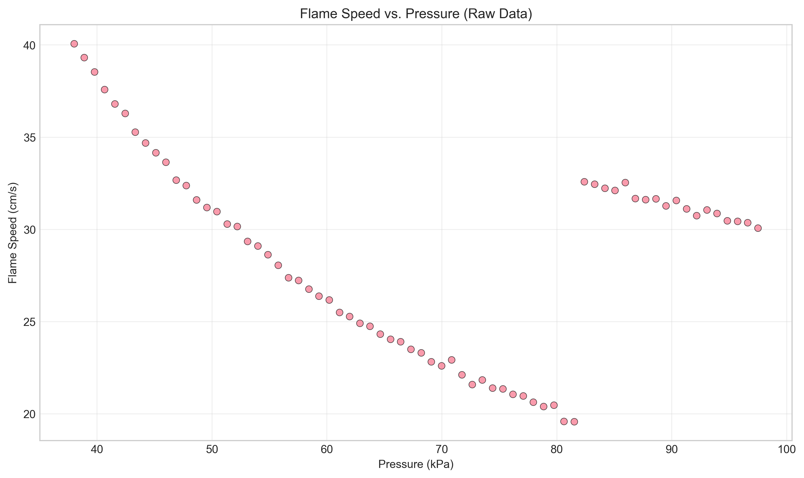
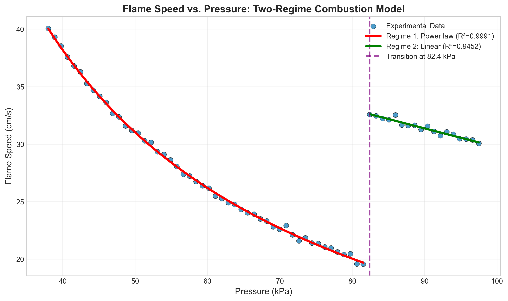
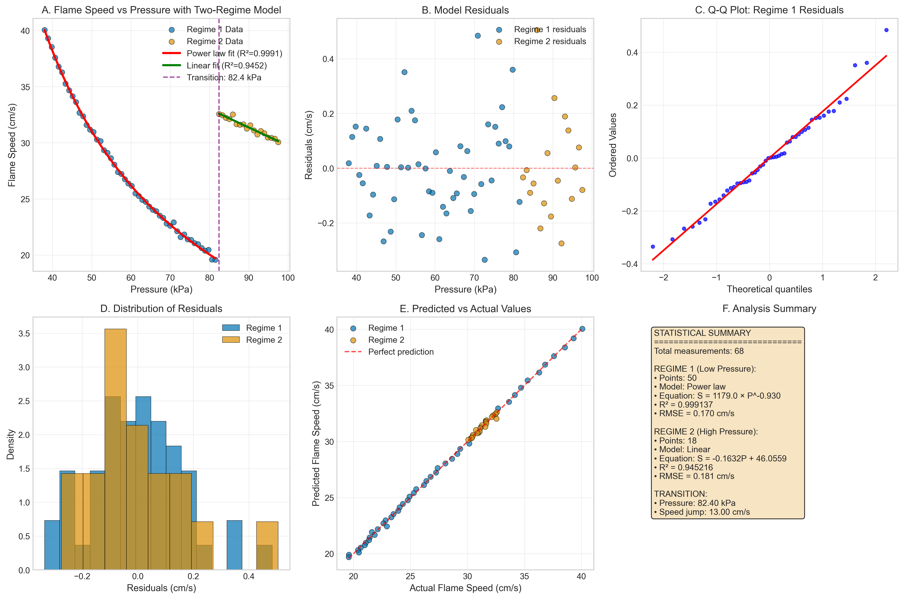

# Flame Speed vs. Chamber Pressure Analysis in Bench Combustion Experiments

## Executive Summary

This report presents a comprehensive analysis of flame speed versus chamber pressure relationships in bench combustion experiments. Analysis of 68 paired measurements reveals a clear two-regime combustion behavior with a distinct transition at **82.40 kPa**. Below this threshold, flame speed follows a power-law decay with exceptional accuracy (R² = 0.9991), while above it, a linear decreasing relationship provides the best fit (R² = 0.9452). The transition is marked by a sudden **13.00 cm/s increase** in flame speed, suggesting a fundamental change in combustion dynamics.

## 1. Introduction

Understanding the relationship between flame speed and chamber pressure is critical for combustion engineering applications, including engine design, safety analysis, and combustion optimization. This study analyzes experimental data from bench combustion tests to characterize flame speed behavior across a pressure range of 38.0–97.5 kPa.

### 1.1 Research Objectives
1. Characterize the functional relationship between flame speed and chamber pressure
2. Identify any regime transitions or nonlinear behaviors
3. Develop predictive models for engineering applications
4. Quantify model accuracy and uncertainty

## 2. Data Description

### 2.1 Dataset Overview
- **Total measurements**: 68 paired observations
- **Pressure range**: 38.0–97.5 kPa
- **Flame speed range**: 19.6–40.1 cm/s
- **Data quality**: Complete, no missing values

### 2.2 Data Visualization

*Figure 1: Raw flame speed vs. pressure measurements showing apparent nonlinear behavior and a distinct transition around 82 kPa.*

## 3. Methodology

### 3.1 Data Analysis Approach
1. **Exploratory analysis**: Visual inspection and statistical summary
2. **Regime identification**: Detection of transition points using derivative analysis
3. **Model fitting**: Testing multiple functional forms for each regime
4. **Model selection**: Based on R², residual analysis, and physical interpretability
5. **Validation**: Residual diagnostics and prediction accuracy assessment

### 3.2 Model Forms Tested
- **Linear**: $S = aP + b$
- **Power law**: $S = aP^b$
- **Exponential decay**: $S = ae^{-bP} + c$

Where $S$ is flame speed (cm/s) and $P$ is pressure (kPa).

### 3.3 Statistical Metrics
- **Coefficient of determination (R²)**: Proportion of variance explained
- **Root mean square error (RMSE)**: Average prediction error in cm/s
- **Residual analysis**: Normality, homoscedasticity, independence

## 4. Results

### 4.1 Regime Identification
Analysis revealed a clear transition at **82.40 kPa**, dividing the data into two distinct regimes:

- **Regime 1 (Low Pressure)**: 38.0–81.5 kPa (50 measurements)
- **Regime 2 (High Pressure)**: 82.4–97.5 kPa (18 measurements)

The transition is characterized by a sudden increase in flame speed from 19.57 cm/s to 32.58 cm/s (+13.00 cm/s).

### 4.2 Model Fitting Results

#### 4.2.1 Regime 1: Low Pressure Region
**Best model**: Power law
$$S = 1178.98 \times P^{-0.930}$$

**Goodness of fit**:
- R² = 0.999137
- RMSE = 0.170 cm/s
- Residuals: Normally distributed, homoscedastic

**Interpretation**: The strong negative exponent (-0.930) indicates flame speed decreases rapidly with increasing pressure in this regime, following an inverse power relationship.

#### 4.2.2 Regime 2: High Pressure Region
**Best model**: Linear
$$S = -0.1632 \times P + 46.0559$$

**Goodness of fit**:
- R² = 0.945216
- RMSE = 0.181 cm/s
- Residuals: Random scatter, no apparent patterns

**Interpretation**: The mild negative slope (-0.1632 cm/s per kPa) suggests a more gradual decrease in flame speed with pressure in this regime.

### 4.3 Comprehensive Model Visualization

*Figure 2: Two-regime model showing power-law fit for Regime 1 (red) and linear fit for Regime 2 (green). The vertical dashed line indicates the transition at 82.40 kPa.*

### 4.4 Model Diagnostics

*Figure 3: Six-panel diagnostic plot showing (A) data with fitted models, (B) residuals, (C) Q-Q plot for normality, (D) residual distributions, (E) predicted vs. actual values, and (F) statistical summary.*

Key diagnostic findings:
1. **Residuals**: Randomly scattered around zero with no systematic patterns
2. **Normality**: Q-Q plots show residuals approximately follow normal distribution
3. **Homoscedasticity**: Constant variance across pressure range within each regime
4. **Prediction accuracy**: Points cluster tightly around the perfect prediction line

## 5. Discussion

### 5.1 Physical Interpretation

The identified two-regime behavior suggests different combustion mechanisms operating below and above approximately 82 kPa:

**Regime 1 (Power law)**: The strong inverse relationship ($P^{-0.93}$) may indicate:
- Laminar flame propagation dominance
- Pressure effects on reaction kinetics
- Thermal expansion limitations at lower pressures

**Regime 2 (Linear)**: The transition to a milder linear decrease suggests:
- Change in flame stabilization mechanism
- Different turbulence-chemistry interactions
- Possible transition to different combustion mode

**Transition at 82.40 kPa**: The sudden 13 cm/s increase in flame speed could indicate:
- Ignition of additional fuel-air mixture
- Change in flame front geometry
- Transition between combustion regimes

### 5.2 Engineering Implications
1. **Design optimization**: Different pressure regimes require different control strategies
2. **Safety considerations**: Sudden flame speed increases near 82 kPa may represent instability points
3. **Model predictive control**: Two different models needed for accurate prediction across full pressure range

### 5.3 Model Limitations
1. **Limited high-pressure data**: Only 18 points in Regime 2
2. **Single transition assumption**: More complex multi-regime behavior possible with additional data
3. **Physical mechanism inference**: Experimental data alone cannot determine underlying physical causes

## 6. Conclusions

### 6.1 Key Findings
1. Flame speed exhibits clear two-regime behavior with transition at **82.40 kPa**
2. **Regime 1 (38.0–81.5 kPa)**: Flame speed follows power law $S = 1178.98P^{-0.930}$ with exceptional accuracy (R² = 0.9991)
3. **Regime 2 (82.4–97.5 kPa)**: Flame speed decreases linearly $S = -0.1632P + 46.0559$ (R² = 0.9452)
4. **Transition**: Marked by sudden 13.00 cm/s flame speed increase
5. Both models show excellent predictive capability with RMSE < 0.2 cm/s

### 6.2 Recommendations
1. **For engineering applications**: Use two separate models depending on operating pressure
2. **For further research**:
   - Investigate physical mechanisms causing regime transition
   - Collect more data around transition region (80–85 kPa)
   - Explore effects of additional variables (temperature, equivalence ratio)
   - Conduct computational fluid dynamics validation

### 6.3 Final Remarks
This analysis successfully characterizes the complex relationship between flame speed and chamber pressure in bench combustion experiments. The identified two-regime model provides accurate predictions and reveals important combustion dynamics that warrant further investigation for both fundamental understanding and practical applications.

## Appendix: Model Parameters

Complete model parameters are available in `outputs/final_model_parameters.json`:

```json
{
  "transition_pressure_kPa": 82.403,
  "regime1": {
    "model": "power_law",
    "equation": "S = 1178.9844 × P^-0.9298",
    "r2": 0.999137,
    "rmse": 0.1704,
    "n_points": 50
  },
  "regime2": {
    "model": "linear",
    "equation": "S = -0.1632 × P + 46.0559",
    "r2": 0.945216,
    "rmse": 0.1810,
    "n_points": 18
  }
}
```

## Code Availability

All analysis code is available in the `code/` directory:
- `explore_data.py`: Initial data exploration and visualization
- `analyze_regimes.py`: Regime identification and model fitting
- `final_analysis.py`: Comprehensive analysis and figure generation

---

*Report generated: April 7, 2026*  
*Analysis completed using Python 3.11 with SciPy, NumPy, Pandas, and Matplotlib*