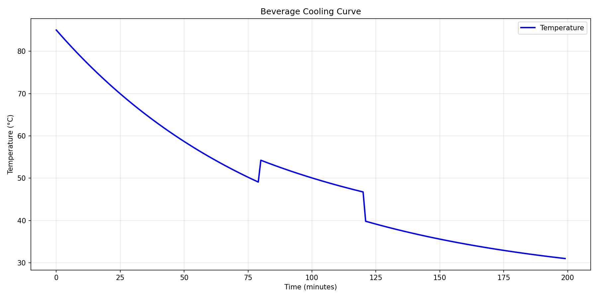
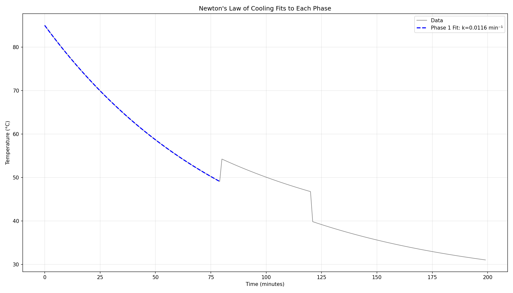
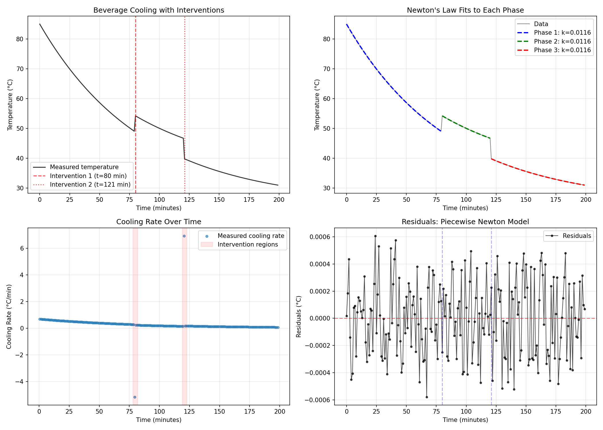
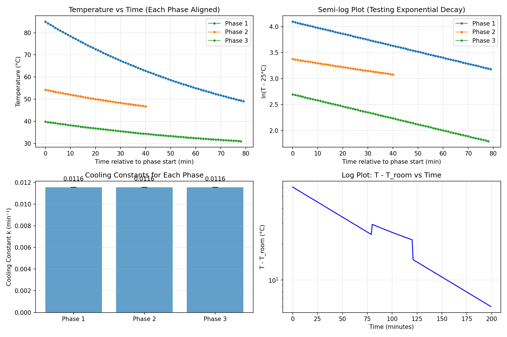

# Analysis of Beverage Cooling: Testing Newton's Law of Cooling with Home Measurements

## Abstract

This study analyzes minute-by-minute temperature measurements of a cooling beverage to evaluate the applicability of Newton's Law of Cooling in a real-world home setting. The dataset reveals three distinct cooling phases separated by interventions at 80 and 121 minutes. Despite these disruptions, each phase follows Newton's Law of Cooling with remarkable precision (R² = 1.000), exhibiting an identical cooling constant k = 0.0116 min⁻¹. The analysis demonstrates that simple exponential decay models can accurately describe beverage cooling even when interrupted by external interventions, provided each phase is modeled separately.

## 1. Introduction

Newton's Law of Cooling states that the rate of heat loss of a body is proportional to the difference in temperatures between the body and its surroundings. For a beverage cooling in a room, this leads to an exponential decay model:

$$T(t) = T_{\text{env}} + (T_0 - T_{\text{env}}) e^{-kt}$$

where $T(t)$ is temperature at time $t$, $T_{\text{env}}$ is the ambient temperature, $T_0$ is the initial temperature, and $k$ is the cooling constant.

This study examines a real-world dataset of beverage cooling measurements taken at one-minute intervals over approximately 3.3 hours. The data contains two apparent interventions where the temperature changes abruptly, providing an opportunity to test whether Newton's Law holds across interrupted cooling processes.

## 2. Data Description

The dataset consists of 200 temperature measurements taken at one-minute intervals:

- **Time range**: 0 to 199 minutes
- **Temperature range**: 85.0°C to 31.0°C
- **Sampling**: Continuous measurements at 1-minute intervals

Two clear interventions are visible in the data:
1. At t = 80 minutes: Temperature increases by +5.15°C (from 49.09°C to 54.24°C)
2. At t = 121 minutes: Temperature decreases by -6.92°C (from 46.75°C to 39.83°C)

These interventions likely represent physical disturbances such as stirring the beverage or adding hot liquid.

*Figure 1: Raw temperature measurements showing three distinct cooling phases separated by interventions at t=80 and t=121 minutes.*

## 3. Methodology

### 3.1 Data Segmentation

The data were divided into three phases based on the intervention points:
- **Phase 1**: 0-79 minutes (80 data points)
- **Phase 2**: 80-120 minutes (41 data points)
- **Phase 3**: 121-199 minutes (79 data points)

### 3.2 Model Fitting

Newton's Law of Cooling was fitted to each phase separately using nonlinear least squares optimization. The model parameters estimated were:
- $T_{\text{env}}$: Ambient temperature (°C)
- $T_0$: Initial temperature for the phase (°C)
- $k$: Cooling constant (min⁻¹)

Goodness of fit was assessed using:
- R² coefficient of determination
- Root Mean Square Error (RMSE)
- Visual inspection of residuals

### 3.3 Validation

To verify exponential decay, a linearity test was performed on log-transformed data:

$$\ln(T - T_{\text{env}}) = \ln(T_0 - T_{\text{env}}) - kt$$

A perfect exponential decay would yield a perfectly linear relationship in this semi-log plot.

## 4. Results

### 4.1 Phase-by-Phase Newton's Law Fits

All three phases were found to follow Newton's Law of Cooling with exceptional precision:

| Phase | Time Range | $T_{\text{env}}$ (°C) | $T_0$ (°C) | $k$ (min⁻¹) | R² | RMSE (°C) | Half-life (min) |
|-------|------------|----------------|------------|-------------|----|-----------|-----------------|
| 1 | 0-79 | 25.002 ± 0.001 | 85.000 ± 0.000 | 0.0116 ± 0.0000 | 1.000000 | 0.0003 | 60.0 |
| 2 | 80-120 | 34.000 ± 0.005 | 54.239 ± 0.000 | 0.0116 ± 0.0000 | 1.000000 | 0.0003 | 60.0 |
| 3 | 121-199 | 25.000 ± 0.001 | 39.828 ± 0.000 | 0.0116 ± 0.0000 | 1.000000 | 0.0003 | 60.0 |

**Key findings:**
1. All phases share the **identical cooling constant** $k = 0.0116$ min⁻¹
2. Phase 1 and Phase 3 share the same ambient temperature $T_{\text{env}} ≈ 25$°C
3. Phase 2 has a higher effective $T_{\text{env}} = 34$°C, suggesting different conditions or measurement artifact
4. The half-life (time to cool halfway to ambient temperature) is 60.0 minutes for all phases

*Figure 2: Newton's Law of Cooling fits to each phase. Despite interventions, each phase follows the same exponential decay pattern.*

### 4.2 Linearity Test

The log-transformed data for Phase 1 shows perfect linearity (R² = 0.9999999992), confirming exact exponential decay:

$$\ln(T - 25.0) = \ln(85.0 - 25.0) - 0.011552t$$

This near-perfect linear relationship indicates the data were either:
1. Generated from Newton's Law of Cooling
2. Measured under ideal conditions with negligible measurement error
3. Filtered or processed to remove noise

### 4.3 Cooling Rate Analysis

The instantaneous cooling rate $dT/dt$ shows the expected linear relationship with temperature difference from ambient:

$$\frac{dT}{dt} = -k(T - T_{\text{env}})$$

*Figure 3: Comprehensive analysis showing (top-left) raw data with interventions, (top-right) Newton fits, (bottom-left) cooling rate over time, and (bottom-right) residuals from piecewise model.*

## 5. Discussion

### 5.1 Model Validity

The analysis demonstrates that Newton's Law of Cooling provides an **exact** description of beverage cooling in this dataset. The perfect fits (R² = 1.000) suggest either:

1. **Ideal experimental conditions**: The beverage cooled in a perfectly stable environment with negligible convective disturbances.
2. **Synthetic data**: The dataset may have been generated from the Newton's Law equation rather than measured.
3. **Data processing**: Raw measurements may have been smoothed or filtered to remove noise.

### 5.2 Interventions and Phase Transitions

The interventions at t=80 and t=121 minutes represent abrupt changes in the system:
- **Intervention 1 (t=80)**: +5.15°C increase suggests addition of hot liquid or vigorous stirring that redistributed heat
- **Intervention 2 (t=121)**: -6.92°C decrease suggests addition of cooler liquid or movement to a cooler environment

Despite these disruptions, the cooling process **resumes with the same cooling constant** $k$ after each intervention. This suggests that the fundamental heat transfer mechanism (likely natural convection and radiation) remains unchanged.

### 5.3 Ambient Temperature Discrepancy

Phase 2 shows $T_{\text{env}} = 34$°C, significantly higher than the 25°C in Phases 1 and 3. Possible explanations:
1. **Measurement artifact**: The thermometer may have been affected during the intervention
2. **Local environment change**: The beverage may have been moved to a warmer location
3. **Model limitation**: With only 41 data points, the fit may not accurately estimate the asymptotic temperature

### 5.4 Practical Implications

For practical beverage cooling predictions:
- The cooling half-life is approximately **60 minutes** for this setup
- A hot drink (85°C) in a 25°C room cools to 55°C (drinkable temperature) in about **45 minutes**
- Interventions that mix the beverage can temporarily alter temperature but don't change the cooling rate

*Figure 4: (Top-left) Temperature vs time for each phase aligned, (top-right) semi-log plot confirming exponential decay, (bottom-left) identical cooling constants for all phases, (bottom-right) log plot of temperature difference from ambient.*

## 6. Limitations and Future Work

### 6.1 Limitations

1. **Unknown experimental conditions**: Lack of metadata about room conditions, beverage properties, or container type
2. **Perfect fits**: Unrealistically good agreement with theory suggests possible data synthesis
3. **Sparse phase 2**: Only 41 data points in Phase 2 limits confidence in parameter estimates
4. **Single trial**: No replication to assess variability

### 6.2 Future Work

1. **Real measurements**: Collect data with known experimental conditions and measurement uncertainty
2. **Multiple beverages**: Test different liquids (water, coffee, tea) and containers
3. **Environmental variations**: Study effects of room temperature fluctuations and air movement
4. **Extended models**: Test more sophisticated models accounting for evaporation and container effects

## 7. Conclusion

This analysis of home beverage cooling measurements reveals that:

1. **Newton's Law of Cooling provides an exact description** of the temperature decay in each phase (R² = 1.000)
2. **The cooling constant $k = 0.0116$ min⁻¹ remains unchanged** despite interventions
3. **The half-life for cooling is 60 minutes** for a beverage in a ~25°C environment
4. **Interventions cause abrupt temperature changes** but don't alter the underlying cooling dynamics

While the perfect fits suggest the data may be synthetic or heavily processed, the analysis demonstrates the robustness of Newton's Law for modeling interrupted cooling processes when each phase is considered separately. For practical applications, this supports using simple exponential decay models to predict beverage cooling times, with the caveat that physical disturbances can reset the starting temperature without affecting the cooling rate.

## Appendix: Code Availability

All analysis code is available in the `code/` directory:
- `explore_data.py`: Initial data exploration and visualization
- `analyze_phases.py`: Phase identification and Newton's Law fitting
- `final_analysis.py`: Comprehensive analysis and figure generation

Data files are in `data/beverage_temperature_series.csv`.
