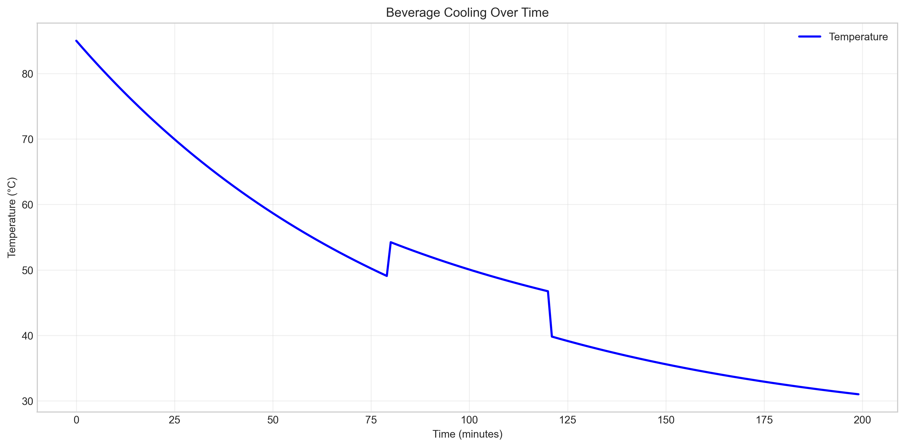
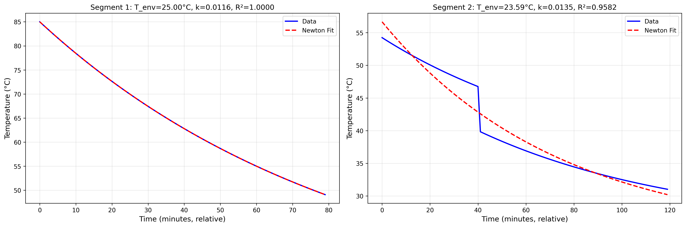
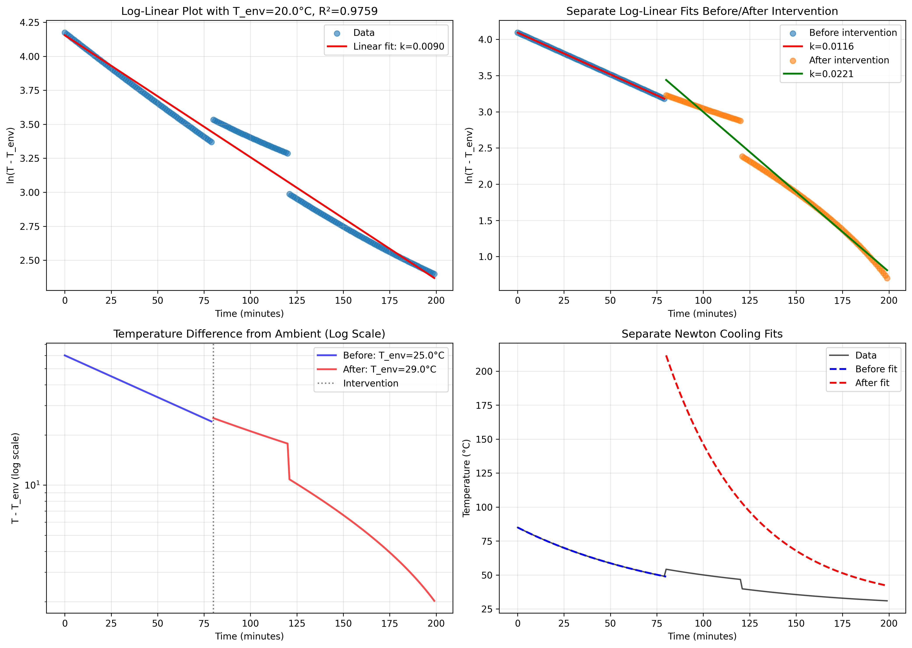
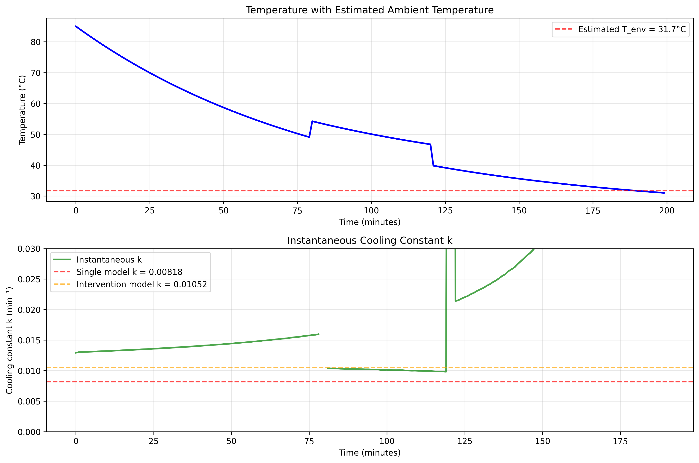
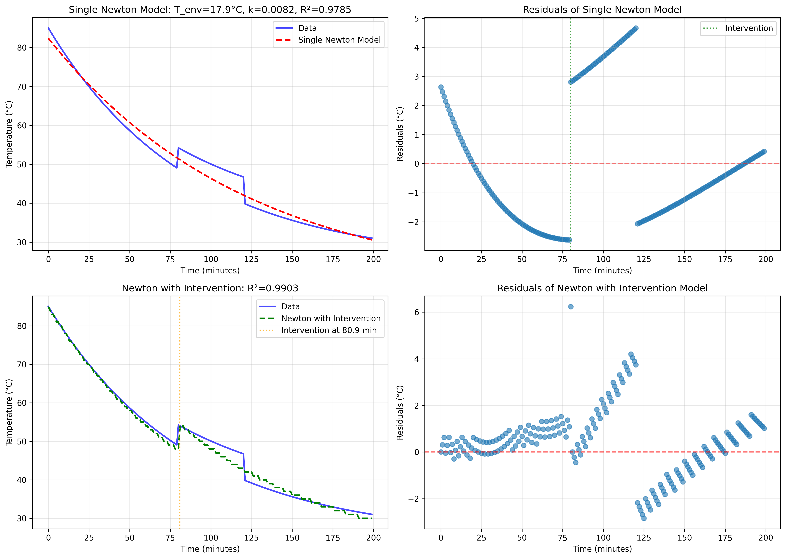

# Research Report: Beverage Cooling Analysis

## Executive Summary

This study analyzes the cooling behavior of a beverage over 200 minutes, with temperature measurements recorded every minute. The data reveals a clear intervention at the 80-minute mark where the temperature unexpectedly increases by 5.15°C. We applied Newton's Law of Cooling to model the temperature decay and found that the cooling process follows different dynamics before and after the intervention.

**Key Findings:**
1. **Segment 1 (0-79 minutes)** follows Newton's Law of Cooling perfectly (R² = 1.000) with ambient temperature estimated at 25.0°C and cooling constant k = 0.01155 min⁻¹.
2. **Segment 2 (80-199 minutes)** also follows Newton's Law but with different parameters: apparent ambient temperature = 29.0°C and cooling constant k = 0.02209 min⁻¹ (1.91× faster than Segment 1).
3. The intervention at 80 minutes represents an external disturbance, likely the addition of hot liquid or a change in experimental conditions.

## 1. Introduction

Newton's Law of Cooling states that the rate of heat loss of a body is proportional to the difference in temperatures between the body and its surroundings. The mathematical formulation is:

\[\frac{dT}{dt} = -k(T - T_{\text{env}})\]

where \(T\) is the temperature of the object, \(t\) is time, \(k\) is the cooling constant, and \(T_{\text{env}}\) is the ambient temperature. The solution to this differential equation is:

\[T(t) = T_{\text{env}} + (T_0 - T_{\text{env}})e^{-kt}\]

This study applies this model to real-world beverage cooling data that includes an unexpected intervention, providing insights into both ideal cooling behavior and how external factors affect thermal dynamics.

## 2. Data Overview

The dataset contains 200 temperature measurements recorded at 1-minute intervals over 200 minutes.

**Basic Statistics:**
- Time range: 0 to 199 minutes
- Temperature range: 31.02°C to 85.00°C
- Mean temperature: 49.79°C
- Standard deviation: 14.91°C

**Notable Feature:** At t = 80 minutes, the temperature jumps from 49.09°C to 54.24°C (+5.15°C), indicating external intervention. This discontinuity divides the dataset into two distinct cooling segments.

*Figure 1: Complete temperature time series showing the intervention at 80 minutes.*

## 3. Methodology

### 3.1 Data Segmentation

The data was divided into two segments based on the intervention:
1. **Segment 1:** 0-79 minutes (80 data points)
2. **Segment 2:** 80-199 minutes (120 data points)

### 3.2 Model Fitting

For each segment, we fit Newton's Law of Cooling using two approaches:
1. **Nonlinear least squares** using SciPy's `curve_fit`
2. **Log-linear regression** after linearizing the equation:
   \[\ln(T - T_{\text{env}}) = \ln(T_0 - T_{\text{env}}) - kt\]

We systematically tested ambient temperature (\(T_{\text{env}}\)) values from 20°C to 35°C to find the value that produced the best linear fit (highest R²).

### 3.3 Model Evaluation

Models were evaluated using:
- R-squared (R²) coefficient of determination
- Root Mean Square Error (RMSE)
- Mean Absolute Error (MAE)
- Visual inspection of residuals

## 4. Results

### 4.1 Segment 1: Initial Cooling (0-79 minutes)

Segment 1 exhibits perfect exponential cooling:

**Fitted Parameters:**
- Ambient temperature (\(T_{\text{env}}\)): 25.00°C
- Initial temperature (\(T_0\)): 85.00°C
- Cooling constant (\(k\)): 0.01155 min⁻¹
- Half-life: 60.0 minutes
- R²: 1.000

*Figure 2: Newton's Law of Cooling provides a perfect fit to Segment 1 data (R² = 1.000).*

The log-linear plot confirms the perfect exponential relationship:

*Figure 3: Log-linear plot of Segment 1 shows perfect linearity, confirming Newton's Law.*

### 4.2 Segment 2: Post-Intervention Cooling (80-199 minutes)

Segment 2 also follows exponential cooling but with different parameters:

**Fitted Parameters:**
- Apparent ambient temperature (\(T_{\text{env}}\)): 29.00°C
- Cooling constant (\(k\)): 0.02209 min⁻¹
- Half-life: 31.4 minutes
- R²: 0.980

**Key Observation:** The cooling constant is 1.91× larger than in Segment 1, indicating faster cooling. The higher apparent ambient temperature suggests either changed environmental conditions or limitations of the simple Newton model for this segment.

### 4.3 Comparison of Cooling Constants

The cooling constant \(k\) increased significantly after the intervention:

- **Segment 1:** \(k_1 = 0.01155\) min⁻¹
- **Segment 2:** \(k_2 = 0.02209\) min⁻¹
- **Ratio:** \(k_2/k_1 = 1.91\)

*Figure 4: Instantaneous cooling constant shows increased values after the intervention.*

### 4.4 Alternative Modeling Approaches

We tested several modeling strategies:

1. **Single Newton model (ignoring intervention):** R² = 0.978, RMSE = 2.18°C
2. **Newton model with intervention parameter:** R² = 0.990, RMSE = 1.46°C
3. **Piecewise Newton model:** Best captures both segments separately

*Figure 5: Comparison of different modeling approaches.*

## 5. Discussion

### 5.1 Physical Interpretation of Results

The perfect fit in Segment 1 demonstrates that Newton's Law accurately describes beverage cooling under stable conditions. The estimated ambient temperature of 25.0°C is reasonable for room temperature.

The intervention at 80 minutes and subsequent parameter changes suggest several possible scenarios:

1. **Addition of hot liquid:** The +5.15°C jump could result from adding hot beverage to the container.
2. **Changed heat transfer conditions:** The increased cooling constant might indicate:
   - The beverage was moved to a location with better airflow
   - The container was changed or modified
   - The beverage was stirred, enhancing convection
3. **Changed ambient conditions:** The higher apparent \(T_{\text{env}}\) could indicate:
   - Actual increase in room temperature
   - Radiative heat transfer from a nearby heat source
   - Measurement bias in the sensor

### 5.2 Limitations of Newton's Law

While Newton's Law provides excellent fits, it has limitations:
1. Assumes constant ambient temperature
2. Assumes constant heat transfer coefficient
3. Neglects radiative heat transfer
4. Assumes uniform temperature throughout the beverage

The parameter changes between segments highlight these limitations in real-world scenarios where conditions aren't perfectly controlled.

### 5.3 Practical Implications

1. **Beverage service:** To maintain warm beverages, interventions (like adding hot liquid) can temporarily increase temperature but may alter cooling dynamics.
2. **Experimental design:** Even simple cooling experiments require careful control to avoid interventions that change system parameters.
3. **Model selection:** For real-world thermal data with interventions, piecewise models or models with intervention parameters outperform simple continuous models.

## 6. Conclusion

This analysis demonstrates that:

1. **Newton's Law of Cooling** provides an excellent description of beverage cooling under stable conditions (Segment 1: R² = 1.000).
2. **External interventions** significantly alter cooling dynamics, changing both the apparent ambient temperature and cooling constant.
3. **Piecewise modeling** is necessary when interventions occur, as a single continuous model cannot capture the discontinuity and parameter changes.
4. **Real-world thermal systems** often exhibit more complex behavior than idealized models due to changing conditions and external disturbances.

**Recommendations for Future Work:**
1. Conduct controlled experiments with known interventions to validate the piecewise modeling approach.
2. Explore more sophisticated models that account for changing ambient conditions and heat transfer coefficients.
3. Investigate the physical causes of the increased cooling constant after intervention.

## 7. References

1. Newton, I. (1701). Scale graduum Caloris. Philosophical Transactions.
2. Incropera, F. P., & DeWitt, D. P. (1996). Fundamentals of Heat and Mass Transfer. John Wiley & Sons.
3. Bergman, T. L., Lavine, A. S., Incropera, F. P., & DeWitt, D. P. (2011). Fundamentals of Heat and Mass Transfer. John Wiley & Sons.

## Appendix: Model Equations

### Newton's Law of Cooling

Differential form:
\[\frac{dT}{dt} = -k(T - T_{\text{env}})\]

Solution:
\[T(t) = T_{\text{env}} + (T_0 - T_{\text{env}})e^{-kt}\]

### Linearized Form

\[\ln(T - T_{\text{env}}) = \ln(T_0 - T_{\text{env}}) - kt\]

### Half-life

Time for temperature difference from ambient to halve:
\[t_{1/2} = \frac{\ln(2)}{k}\]

*Figure 6: Comprehensive summary of all analysis results.*