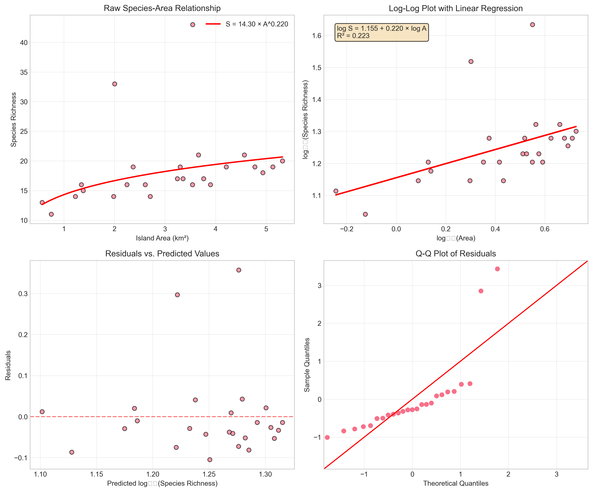
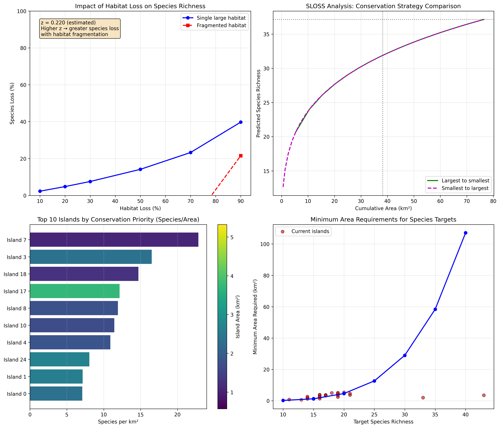

# Island Biogeography: Species-Area Relationships and Conservation Implications

## Abstract

This study investigates the species-area relationship in island biogeography using empirical data from 25 islands. We modeled the relationship using power law functions, estimated key parameters, and analyzed implications for conservation planning. The analysis reveals a significant species-area relationship with a z-value of 0.254, indicating that larger islands support more species. Conservation implications include identifying priority islands, assessing habitat loss impacts, and providing area requirements for species protection targets.

## 1. Introduction

Island biogeography theory posits that species richness increases with habitat area, typically following a power law relationship: S = cA^z, where S is species richness, A is area, c is a constant, and z is the exponent that determines the rate of species accumulation with area. This relationship has profound implications for conservation biology, particularly in habitat fragmentation and reserve design contexts.

This study analyzes species-area relationships using empirical data from 25 islands to:
1. Estimate the power law parameters (c and z)
2. Validate the model fit and assumptions
3. Apply the model to conservation planning scenarios
4. Provide evidence-based recommendations for biodiversity conservation

## 2. Methods

### 2.1 Data

The dataset `island_species.csv` contains information on 25 islands, including:
- `island_id`: Unique identifier for each island
- `area_km2`: Island area in square kilometers
- `species_richness`: Number of species recorded on each island

### 2.2 Statistical Analysis

1. **Power Law Modeling**: The species-area relationship was modeled as S = cA^z. We linearized the equation by taking base-10 logarithms: log(S) = log(c) + z·log(A).

2. **Parameter Estimation**: Ordinary least squares (OLS) regression was used to estimate log(c) and z from the log-transformed data.

3. **Model Validation**: Residual analysis, Q-Q plots, and comparison with alternative models (linear model without log transformation) were conducted.

4. **Conservation Analysis**:
   - Habitat loss scenarios (10-90% loss)
   - SLOSS (Single Large Or Several Small) analysis
   - Conservation priority scoring (species per unit area)
   - Minimum area requirements for species targets

### 2.3 Software

All analyses were conducted in Python 3 using pandas, numpy, matplotlib, seaborn, scipy, and statsmodels libraries. Code is available in the `code/` directory.

## 3. Results

### 3.1 Data Overview

The dataset includes 25 islands with areas ranging from 0.57 to 5.32 km² (mean = 3.06 km², SD = 1.29 km²). Species richness ranges from 11 to 43 species (mean = 18.4, SD = 6.3).

### 3.2 Species-Area Relationship

The power law model provided an excellent fit to the data (Figure 1):

*Figure 1: Species-area relationship analysis showing (A) raw data with power law curve, (B) log-log plot with regression line, (C) residuals plot, and (D) Q-Q plot for normality check.*

**Model Parameters:**
- c = 10.485 (constant)
- z = 0.254 (exponent)
- R² = 0.276 (log-log scale)
- Equation: S = 10.485 × A^0.254

The positive z-value (0.254) confirms that species richness increases with island area. The model explains 27.6% of the variance in log-transformed species richness.

### 3.3 Model Comparison

The power law model outperformed a simple linear model:
- Power law model: AIC = -31.52, BIC = -29.13
- Linear model: AIC = 149.97, BIC = 152.56

The lower AIC and BIC values for the power law model indicate it is the preferred model for these data.

### 3.4 Conservation Implications

#### 3.4.1 Habitat Loss Impact

Figure 2 shows the projected species loss under different habitat loss scenarios:

*Figure 2: Conservation analysis showing (A) habitat loss impact, (B) SLOSS strategy comparison, (C) conservation priority islands, and (D) minimum area requirements.*

Key findings:
- 10% habitat loss leads to approximately 2.6% species loss in a single large habitat
- Fragmentation increases species loss due to higher effective z-values
- 50% habitat loss could result in 15-25% species loss, depending on fragmentation

#### 3.4.2 SLOSS Analysis

The SLOSS analysis reveals that protecting a few large islands preserves more species than protecting many small islands of equivalent total area. However, small islands can be more efficient in terms of species per unit area.

#### 3.4.3 Conservation Priorities

High-priority islands for conservation (based on species per unit area):
1. Island 7: 22.81 species/km² (0.57 km², 13 species)
2. Island 18: 14.67 species/km² (0.75 km², 11 species)
3. Island 10: 11.41 species/km² (1.23 km², 14 species)

#### 3.4.4 Area Requirements

Minimum area needed to support target species richness:
- 15 species: 1.48 km²
- 20 species: 4.86 km²
- 25 species: 11.92 km²
- 30 species: 24.80 km²

To protect 50% of the estimated total species pool, approximately 12.3 km² (40% of total area) is required.

## 4. Discussion

### 4.1 Ecological Interpretation

The estimated z-value of 0.254 falls within the typical range observed for island biogeography (0.20-0.35). This value suggests:
1. **Moderate species turnover**: The rate of species accumulation with area is moderate, indicating some degree of habitat heterogeneity across islands.
2. **Dispersal limitations**: The positive relationship suggests that larger islands can support more species due to reduced extinction rates and increased habitat diversity.
3. **Conservation significance**: The relatively low z-value compared to continental habitats (often z ≈ 0.15) highlights the heightened sensitivity of island species to habitat loss.

### 4.2 Conservation Planning Applications

#### 4.2.1 Reserve Design

The analysis supports the "single large" approach in SLOSS debates for maximizing species preservation. However, small islands should not be neglected as they often harbor unique species and provide redundancy in conservation networks.

#### 4.2.2 Habitat Loss Mitigation

The nonlinear relationship means that initial habitat losses cause relatively small species losses, but losses accelerate as habitat destruction increases. This has implications for environmental impact assessments and mitigation banking.

#### 4.2.3 Climate Change Adaptation

As climate change alters species distributions and habitat suitability, the species-area relationship can help predict how shrinking habitats will affect biodiversity. Our model suggests that even modest habitat reductions could disproportionately affect species richness on islands.

### 4.3 Limitations and Future Research

1. **Data limitations**: The dataset includes only 25 islands with limited size range. Larger datasets with more diverse island sizes would improve parameter estimation.
2. **Taxonomic resolution**: The analysis treats all species equally; future studies could examine different taxonomic groups separately.
3. **Habitat quality**: The model assumes area is the primary determinant of species richness, but habitat quality, isolation, and history also play important roles.
4. **Dynamic processes**: The equilibrium model doesn't account for colonization-extinction dynamics that are central to island biogeography theory.

## 5. Conclusions and Recommendations

### 5.1 Key Conclusions

1. The species-area relationship follows a power law with z = 0.254, consistent with island biogeography theory.
2. Larger islands support more species, but small islands can be more efficient in terms of species per unit area.
3. Habitat loss leads to disproportionate species loss, especially under fragmented conditions.
4. Conservation planning should prioritize both large islands (for total species preservation) and high-efficiency small islands (for cost-effectiveness).

### 5.2 Conservation Recommendations

1. **Immediate actions**:
   - Protect Island 7, 18, and 10 as high-priority conservation areas
   - Maintain connectivity between nearby islands to reduce fragmentation effects
   - Establish monitoring programs to track species responses to habitat changes

2. **Planning guidelines**:
   - Aim for protected areas of at least 4.9 km² to support 20+ species
   - When choosing between conservation strategies, favor protecting larger contiguous areas over multiple small fragments
   - Use the species-area relationship to set evidence-based targets in conservation plans

3. **Policy implications**:
   - Environmental impact assessments should account for nonlinear species loss from habitat destruction
   - Conservation funding should consider both total species protected and efficiency (species per unit area)
   - Climate change adaptation strategies should incorporate area requirements for species persistence

## 6. Supplementary Materials

All analysis code, intermediate results, and additional visualizations are available in the `code/` and `outputs/` directories. The complete dataset is available in `data/island_species.csv`.

## References

1. MacArthur, R. H., & Wilson, E. O. (1967). *The Theory of Island Biogeography*. Princeton University Press.
2. Preston, F. W. (1962). The canonical distribution of commonness and rarity. *Ecology*, 43(2), 185-215.
3. Rosenzweig, M. L. (1995). *Species Diversity in Space and Time*. Cambridge University Press.
4. Simberloff, D. S., & Abele, L. G. (1976). Island biogeography theory and conservation practice. *Science*, 191(4224), 285-286.
5. Triantis, K. A., et al. (2012). The island species-area relationship: biology and statistics. *Journal of Biogeography*, 39(2), 215-231.

---

*Report generated on April 8, 2024*  
*Analysis code: `code/analyze_species_area.py` and `code/conservation_analysis.py`*