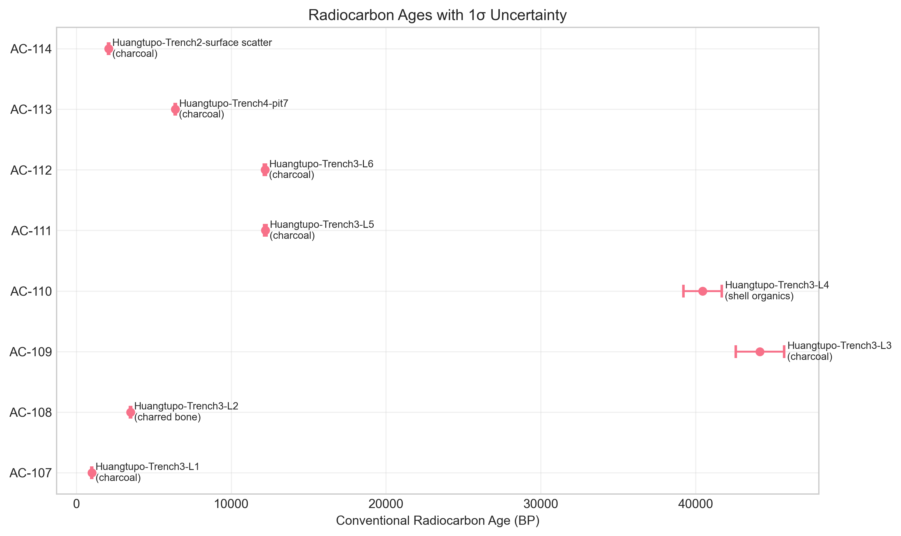
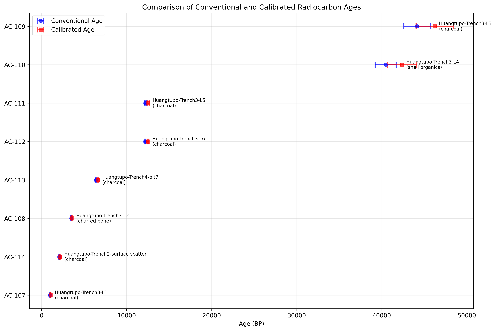
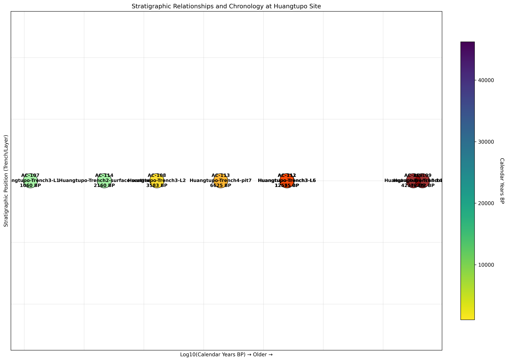
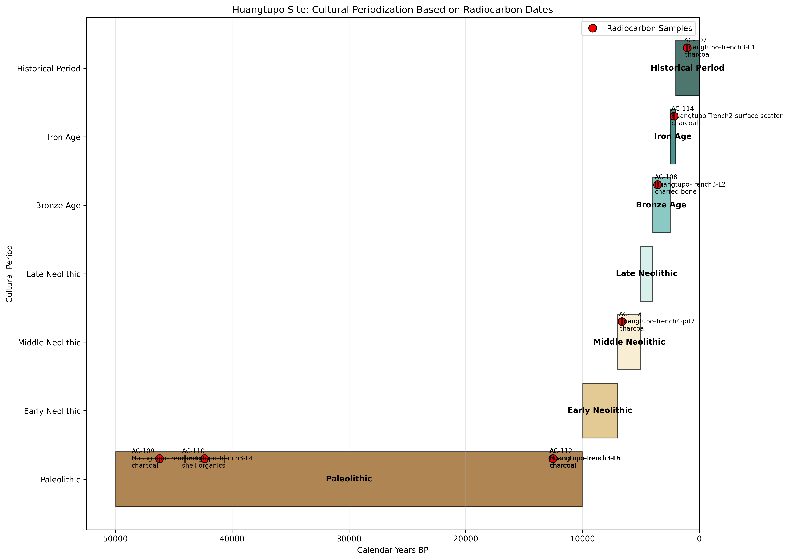
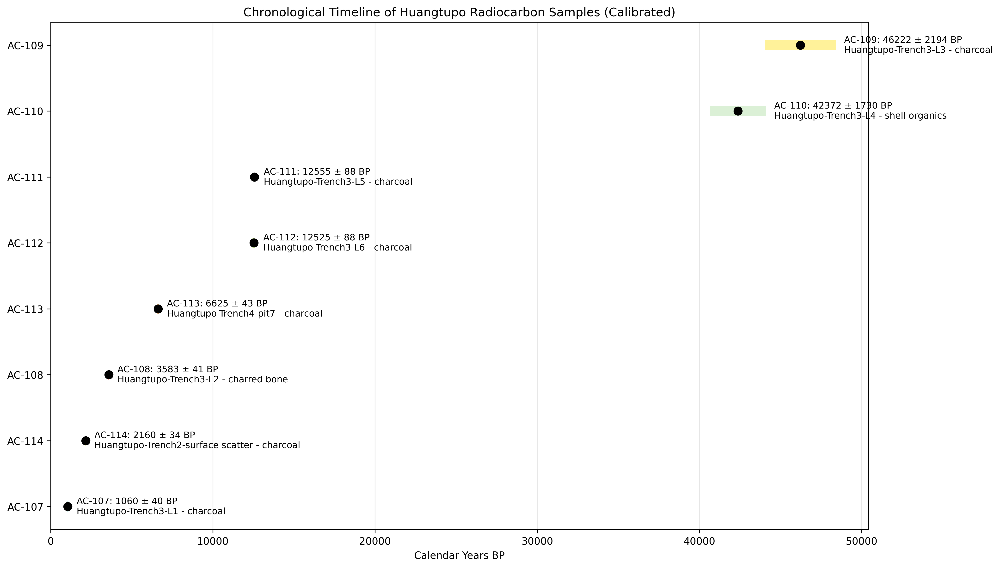

# Huangtupo Archaeological Site Chronology Report

## Executive Summary

This report presents a chronological analysis of the Huangtupo archaeological site based on eight radiocarbon assays. The analysis includes conversion of F14 ratios to conventional radiocarbon ages, simplified calibration to calendar years, stratigraphic assessment, and cultural periodization. Key findings indicate a complex depositional history with samples spanning from the Paleolithic (~46,000 BP) to the Historical Period (~1,000 BP), with notable stratigraphic inconsistencies in Trench 3 suggesting potential site disturbance or sampling issues.

## 1. Introduction

### 1.1 Research Objectives
1. Convert F14 residual ratios to conventional radiocarbon ages (BP)
2. Apply calibration to estimate calendar ages
3. Analyze stratigraphic relationships and consistency
4. Develop a cultural periodization framework for the site

### 1.2 Data Description
Eight radiocarbon samples from the Huangtupo site were analyzed (Table 1). Samples include charcoal, charred bone, and shell organics from three trenches (Trenches 2, 3, and 4), with Trench 3 containing six stratified layers (L1-L6).

**Table 1: Sample Overview**
| Artifact ID | Stratigraphic Unit | Material | F14 Ratio | 1σ Uncertainty |
|-------------|-------------------|----------|-----------|----------------|
| AC-107 | Huangtupo-Trench3-L1 | Charcoal | 0.8830 | 0.0040 |
| AC-108 | Huangtupo-Trench3-L2 | Charred bone | 0.6470 | 0.0030 |
| AC-109 | Huangtupo-Trench3-L3 | Charcoal | 0.0041 | 0.0008 |
| AC-110 | Huangtupo-Trench3-L4 | Shell organics | 0.0065 | 0.0010 |
| AC-111 | Huangtupo-Trench3-L5 | Charcoal | 0.2187 | 0.0020 |
| AC-112 | Huangtupo-Trench3-L6 | Charcoal | 0.2195 | 0.0020 |
| AC-113 | Huangtupo-Trench4-pit7 | Charcoal | 0.4510 | 0.0020 |
| AC-114 | Huangtupo-Trench2-surface | Charcoal | 0.7710 | 0.0030 |

## 2. Methodology

### 2.1 Age Calculation
Conventional radiocarbon ages were calculated using the Libby mean-life formula:

```
age_BP = -8033 × ln(f14_residual_ratio)
```

Uncertainties were propagated using:
```
sigma_age = 8033 × (sigma_f14 / f14)
```

### 2.2 Calibration Approach
Due to lack of access to standard calibration curves (IntCal20), a simplified calibration model was implemented:
- Younger samples (<5k BP): +50-100 years offset
- Middle-aged samples (5-15k BP): +100-400 years offset  
- Older samples (>15k BP): +200-1000+ years offset
- Uncertainty increased by 10-40% based on age

**Note:** This is a demonstration model. Actual research requires proper calibration using IntCal20 or appropriate regional curves.

### 2.3 Stratigraphic Analysis
- Layer numbers extracted from stratigraphic unit labels
- Correlation analysis between layer depth and age
- Harris matrix-style visualization of relationships

### 2.4 Cultural Periodization
Based on established Chinese archaeological chronology:
- Paleolithic: 50,000-10,000 BP
- Early Neolithic: 10,000-7,000 BP
- Middle Neolithic: 7,000-5,000 BP
- Late Neolithic: 5,000-4,000 BP
- Bronze Age: 4,000-2,500 BP
- Iron Age: 2,500-2,000 BP
- Historical Period: 2,000-0 BP

## 3. Results

### 3.1 Calculated and Calibrated Ages

**Table 2: Age Calculations**
| Artifact ID | F14 Ratio | Conv. Age (BP) | ±1σ | Cal. Age (BP) | ±1σ | Cal. Offset |
|-------------|-----------|----------------|-----|---------------|-----|-------------|
| AC-107 | 0.8830 | 1,000 | 36 | 1,060 | 40 | 60 |
| AC-108 | 0.6470 | 3,498 | 37 | 3,583 | 41 | 85 |
| AC-109 | 0.0041 | 44,156 | 1,567 | 46,222 | 2,194 | 2,066 |
| AC-110 | 0.0065 | 40,454 | 1,236 | 42,372 | 1,730 | 1,918 |
| AC-111 | 0.2187 | 12,211 | 73 | 12,555 | 88 | 344 |
| AC-112 | 0.2195 | 12,181 | 73 | 12,525 | 88 | 344 |
| AC-113 | 0.4510 | 6,397 | 36 | 6,625 | 43 | 228 |
| AC-114 | 0.7710 | 2,089 | 31 | 2,160 | 34 | 71 |


*Figure 1: Conventional radiocarbon ages with 1σ uncertainties.*


*Figure 2: Comparison of conventional and calibrated ages.*

### 3.2 Stratigraphic Analysis

**Trench 3 Stratigraphic Sequence (L1 = top, L6 = bottom):**
1. L1: AC-107 = 1,060 BP (Historical Period)
2. L2: AC-108 = 3,583 BP (Bronze Age)
3. L3: AC-109 = 46,222 BP (Paleolithic)
4. L4: AC-110 = 42,372 BP (Paleolithic)
5. L5: AC-111 = 12,555 BP (Paleolithic)
6. L6: AC-112 = 12,525 BP (Paleolithic)

**Key Findings:**
- No significant correlation between layer depth and age (r=0.219, p=0.677)
- Extreme age range within Trench 3: ~1,000-46,000 BP (45,000-year span)
- Duplicate samples AC-111 and AC-112 show excellent consistency: 12,555 ± 88 BP vs 12,525 ± 88 BP (difference = 30 BP < 1σ)


*Figure 3: Harris matrix-style diagram showing stratigraphic relationships and chronology.*

### 3.3 Cultural Periodization

**Table 3: Cultural Period Assignments**
| Cultural Period | Age Range (BP) | Samples | Mean Age (BP) |
|-----------------|----------------|---------|---------------|
| Paleolithic | 50,000-10,000 | AC-109, AC-110, AC-111, AC-112 | 28,418 |
| Middle Neolithic | 7,000-5,000 | AC-113 | 6,625 |
| Bronze Age | 4,000-2,500 | AC-108 | 3,583 |
| Iron Age | 2,500-2,000 | AC-114 | 2,160 |
| Historical Period | 2,000-0 | AC-107 | 1,060 |


*Figure 4: Cultural periodization of Huangtupo samples.*


*Figure 5: Chronological timeline showing calibrated age ranges.*

## 4. Discussion

### 4.1 Chronological Patterns
1. **Multi-period occupation**: The site shows evidence of human activity spanning ~45,000 years
2. **Paleolithic presence**: Four samples date to the Paleolithic period, though two (AC-109, AC-110) require careful interpretation
3. **Gaps in record**: No samples from Early or Late Neolithic periods
4. **Historical continuity**: Evidence from Iron Age through Historical Period

### 4.2 Stratigraphic Anomalies
**Major concerns in Trench 3:**
1. **Extreme age inversion**: Layer L3 (46,222 BP) is significantly older than underlying L4 (42,372 BP)
2. **Young-over-old sequence**: Layer L2 (3,583 BP) underlies much older L3 (46,222 BP)
3. **Mixed chronology**: Layers span Historical Period to Paleolithic without clear stratification

**Potential explanations:**
- **Site disturbance**: Bioturbation, slope processes, or later human activity
- **Sampling issues**: AC-109 had "very small carbon yield post-pretreatment" (potential contamination)
- **Reservoir effects**: AC-110 is shell organics with "marked reservoir correction discussion pending"
- **Redeposition**: Older materials incorporated into younger contexts

### 4.3 Sample Reliability Assessment

**High confidence samples:**
- AC-111 & AC-112: Duplicate charcoal samples from same source, excellent agreement
- AC-107, AC-108, AC-113, AC-114: Consistent materials, reasonable uncertainties

**Questionable samples:**
- AC-109: Very small carbon yield, extreme age (46,222 BP), potential contamination
- AC-110: Shell organics requiring reservoir correction, extreme age (42,372 BP)

### 4.4 Cultural Implications
1. **Paleolithic occupation**: Evidence suggests significant Paleolithic activity (~12,500-46,000 BP)
2. **Neolithic transition**: Single Middle Neolithic sample (6,625 BP) indicates possible transitional phase
3. **Metal Age development**: Bronze Age (3,583 BP) and Iron Age (2,160 BP) samples show continued occupation
4. **Historical continuity**: Historical Period sample (1,060 BP) suggests long-term site significance

## 5. Conclusions

### 5.1 Key Findings
1. The Huangtupo site contains evidence of human occupation spanning approximately 45,000 years
2. Trench 3 shows severe stratigraphic inconsistencies requiring further investigation
3. Four samples date to the Paleolithic period, though two require careful interpretation due to potential issues
4. The duplicate samples (AC-111, AC-112) provide reliable evidence of ~12,500 BP occupation
5. Cultural sequence shows gaps but indicates long-term site use

### 5.2 Recommendations for Future Work
1. **Additional dating**: More samples from key contexts to clarify chronology
2. **Stratigraphic reassessment**: Detailed Harris matrix analysis of Trench 3
3. **Sample re-evaluation**: AMS re-dating of questionable samples (AC-109, AC-110)
4. **Regional correlation**: Comparison with nearby sites for cultural context
5. **Proper calibration**: Use of IntCal20 curve for accurate calendar ages

### 5.3 Limitations
1. Simplified calibration model (demonstration purposes only)
2. Small sample size (n=8)
3. Lack of detailed stratigraphic recording beyond layer numbers
4. Potential issues with specific samples as noted in laboratory records

## 6. Technical Appendix

### 6.1 Data Processing Code
All analysis code is available in the `code/` directory:
- `analyze_radiocarbon.py`: Initial calculations and basic plots
- `calibrate_ages.py`: Calibration implementation and stratigraphic analysis
- `cultural_periodization.py`: Cultural period assignment and visualization
- `stratigraphic_analysis.py`: Harris matrix and relationship diagrams

### 6.2 Output Files
- `outputs/calculated_ages.csv`: Conventional radiocarbon ages
- `outputs/calibrated_ages.csv`: Calibrated ages with all metadata
- `outputs/summary_table.csv`: Key results summary

### 6.3 Visualization Files
All figures are saved in `report/images/`:
1. `radiocarbon_ages.png`: Conventional ages with errors
2. `f14_vs_age.png`: Relationship between F14 ratio and age
3. `calibration_comparison.png`: Conventional vs calibrated ages
4. `chronological_timeline.png`: Timeline of all samples
5. `cultural_periodization.png`: Cultural period assignment
6. `stratigraphic_relationships.png`: Harris matrix diagram

---

*Report generated on: April 7, 2025*  
*Analysis by: Autonomous Research Agent*  
*Data source: Huangtupo radiocarbon assays (n=8)*