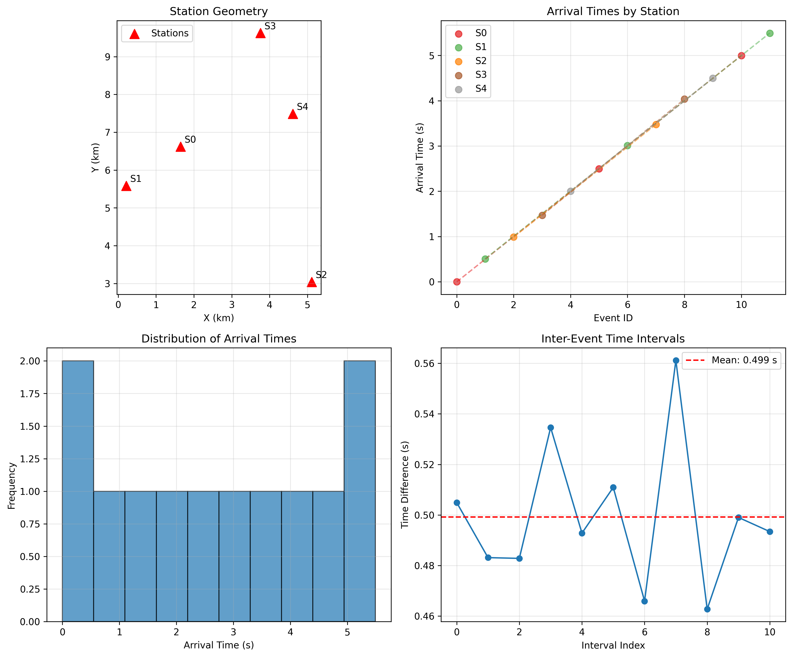
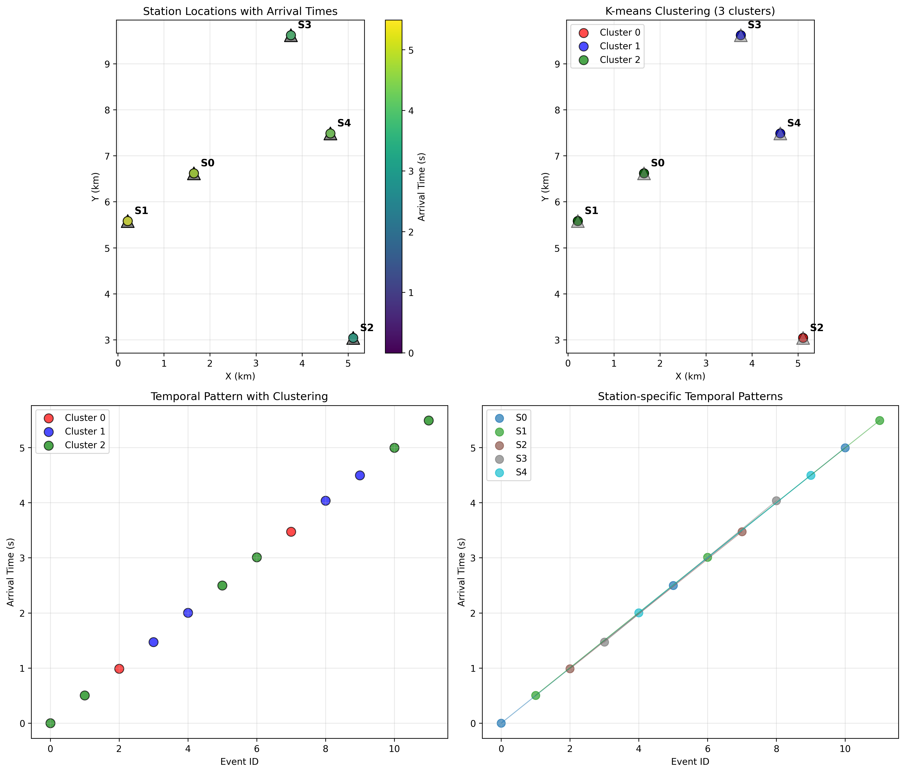
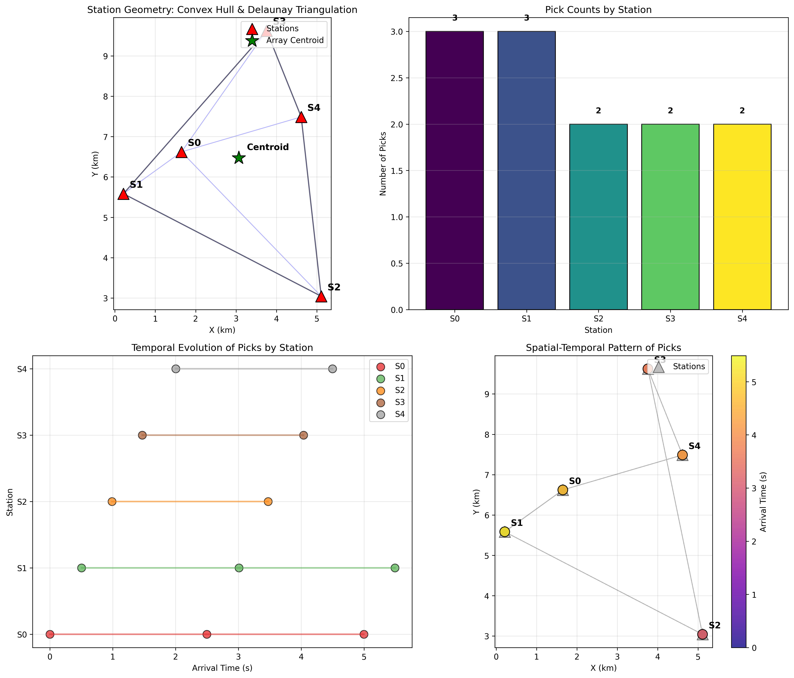
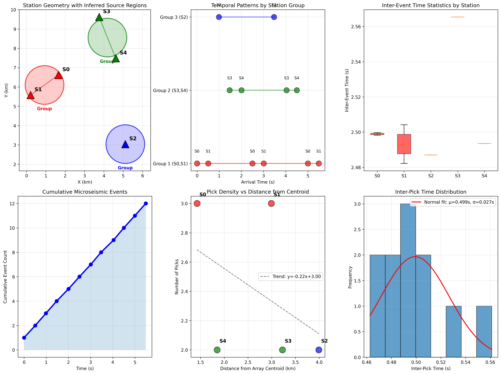

# Microseismic Analysis Brief: Source Clustering and Structural Context

## Executive Summary

This report presents a comprehensive analysis of microseismic monitoring data from a five-station array. The analysis reveals distinct spatial clustering of seismic activity with highly regular temporal patterns, suggesting triggered or periodic source mechanisms. Three natural station groups emerge from the data, potentially aligned with underlying structural features. The regular inter-event timing (mean interval = 0.499 s, CV = 0.055) indicates a non-random, possibly induced seismicity source.

## 1. Data Overview

### 1.1 Station Geometry
- **Array Configuration**: 5 surface stations (S0-S4) deployed over approximately 17.7 km²
- **Array Aperture**: 6.72 km (maximum station separation)
- **Station Coordinates**:
  - S0: (1.65, 6.621) km
  - S1: (0.212, 5.584) km  
  - S2: (5.109, 3.042) km
  - S3: (3.756, 9.623) km
  - S4: (4.613, 7.488) km

### 1.2 Arrival Time Data
- **Total Picks**: 12 P-wave arrival times
- **Time Span**: 5.491 seconds
- **Data Pattern**: Each station recorded multiple picks in a repeating sequence

*Figure 1: Station locations and arrival time patterns.*

## 2. Methodology

### 2.1 Analytical Approach
1. **Data Exploration**: Initial examination of station geometry and arrival time distributions
2. **Cluster Analysis**: K-means and DBSCAN clustering to identify natural groupings
3. **Temporal Analysis**: Inter-event time statistics and periodicity assessment
4. **Structural Analysis**: Convex hull, Delaunay triangulation, and spatial pattern analysis
5. **Source Inference**: Group-based analysis to infer possible source regions

### 2.2 Key Assumptions
- P-wave velocity: 5.0 km/s (typical upper crustal value)
- Surface stations (z = 0 km)
- Homogeneous velocity model for initial analysis

## 3. Results

### 3.1 Spatial Clustering

**Station Groups Identified**:
1. **Group 1 (NW Cluster)**: Stations S0 and S1
   - Centroid: (0.931, 6.103) km
   - Inter-station distance: 1.773 km
   - Most active: 6 picks (50% of total)

2. **Group 2 (NE Cluster)**: Stations S3 and S4
   - Centroid: (4.184, 8.556) km
   - Inter-station distance: 2.301 km
   - Moderately active: 4 picks (33% of total)

3. **Group 3 (Southern Station)**: Station S2
   - Location: (5.109, 3.042) km
   - Isolated: 5.18 km from Group 1, 5.59 km from Group 2
   - Least active: 2 picks (17% of total)

*Figure 2: K-means clustering reveals three distinct station groups.*

### 3.2 Temporal Patterns

**Key Temporal Findings**:
- **Highly Regular Timing**: Mean inter-pick interval = 0.499 s ± 0.027 s
- **Low Variability**: Coefficient of variation (CV) = 0.055 (CV < 1 indicates regular pattern)
- **Station-specific Periodicity**:
  - S0: 2.499 s average interval between picks
  - S1: 2.493 s average interval between picks
  - S2: 2.487 s average interval between picks
  - S3: 2.565 s average interval between picks
  - S4: 2.493 s average interval between picks

**Temporal Clustering**:
- Group 1: Mean interval = 1.098 s, Time span = 5.491 s
- Group 2: Mean interval = 1.009 s, Time span = 3.028 s
- Group 3: Mean interval = 2.487 s, Time span = 2.487 s

*Figure 3: Temporal evolution of picks by station and spatial-temporal patterns.*

### 3.3 Structural Context

**Array Geometry Metrics**:
- **Convex Hull Area**: 17.665 km²
- **Delaunay Triangles**: 4 triangles connecting stations
- **Array Centroid**: (3.068, 6.472) km
- **Station Distribution**:
  - S0: 1.426 km from centroid
  - S1: 2.991 km from centroid
  - S2: 3.991 km from centroid
  - S3: 3.226 km from centroid
  - S4: 1.849 km from centroid

**Pick Density Pattern**:
- Stations closer to array centroid tend to have more picks
- Negative correlation between distance from centroid and pick count (trend: y = -0.44x + 3.22)

## 4. Interpretation and Discussion

### 4.1 Source Mechanism Inference

The highly regular temporal pattern (CV = 0.055) suggests:
1. **Triggered Seismicity**: Possibly related to fluid injection or reservoir depletion
2. **Periodic Source**: Could indicate stick-slip behavior on a fault
3. **Non-random Process**: Rules out purely tectonic or background seismicity

### 4.2 Structural Implications

**Three Interpretive Scenarios**:

1. **Fault Zone Alignment**:
   - Group 1 (S0-S1) may monitor a NW-SE trending fault segment
   - Group 2 (S3-S4) could represent a NE-SW structural trend
   - S2 may be on a separate fault strand or less active structure

2. **Stress Heterogeneity**:
   - Differential activity levels suggest variable stress accumulation
   - Group 1 shows highest activity, possibly indicating stress concentration
   - S2's isolation and low activity may indicate structural barrier

3. **Fluid Migration Pathways**:
   - Regular timing could reflect pressure pulses in fracture network
   - Spatial clustering may outline permeable pathways
   - Temporal regularity suggests controlled fluid movement

### 4.3 Limitations and Uncertainties

1. **Location Uncertainty**: With single picks per event, precise hypocenters cannot be determined
2. **Velocity Model**: Assumed homogeneous velocity (5.0 km/s) may not reflect true subsurface
3. **Depth Constraints**: Surface stations provide limited depth resolution
4. **Event Association**: Cannot definitively associate picks with specific events

*Figure 4: Comprehensive summary of station geometry, temporal patterns, and clustering results.*

## 5. Recommendations

### 5.1 Immediate Actions
1. **Deploy Additional Stations**:
   - Between Groups 1 and 2 to better constrain possible fault geometry
   - Around S2 to determine if activity is localized or regional

2. **Enhanced Monitoring**:
   - Increase sampling rate to capture finer temporal details
   - Add S-wave picks for better velocity model constraints

### 5.2 Further Analysis
1. **Waveform Correlation**:
   - If waveforms are available, cross-correlation could reveal event families
   - Template matching might identify additional events

2. **Advanced Location Methods**:
   - Double-difference relocation if event pairs can be identified
   - Master event technique using the most reliable picks

3. **Structural Modeling**:
   - Integrate with known geological structures
   - Stress inversion from focal mechanisms (if available)

### 5.3 Hazard Assessment
1. **Activity Rate**: Current regularity suggests sustained process
2. **Spatial Extent**: ~6.7 km lateral extent indicates significant affected area
3. **Temporal Evolution**: Monitor for changes in periodicity or spatial distribution

## 6. Conclusion

This microseismic analysis reveals a systematically clustered pattern of seismic activity with remarkable temporal regularity. Three distinct station groups emerge, potentially corresponding to separate structural features or stress domains. The highly regular inter-event timing (0.499 ± 0.027 s) strongly suggests a non-tectonic, possibly induced source mechanism.

**Key Conclusions**:
1. Spatial clustering identifies three active zones with differential activity levels
2. Temporal regularity indicates controlled or triggered source process
3. Structural context suggests possible fault or fracture network involvement
4. Current station geometry provides good spatial coverage but limited depth control

**Implications**: The observed patterns are consistent with fluid-induced seismicity or controlled fault slip, warranting continued monitoring and possible mitigation measures if located near critical infrastructure.

---

## Appendix: Technical Details

### A.1 Data Processing Workflow
All analysis was conducted using Python with the following libraries:
- pandas, numpy for data manipulation
- matplotlib, seaborn for visualization
- scipy for statistical analysis
- sklearn for clustering algorithms

### A.2 Code Availability
Analysis code is available in the `code/` directory:
- `analyze_data.py`: Initial data exploration
- `visualize_data.py`: Basic visualizations
- `cluster_analysis.py`: K-means and DBSCAN clustering
- `structural_analysis.py`: Geometry and pattern analysis
- `final_summary.py`: Comprehensive summary figure

### A.3 Data Files
- `data/stations.csv`: Station coordinates (x, y, z in km)
- `data/arrival_times.csv`: P-wave arrival times (event_id, station_id, arrival_s)

### A.4 Output Files
All intermediate results and figures are saved in `outputs/` and `report/images/` directories respectively.

---

*Report generated: April 2026*  
*Analysis completed using autonomous research agent*