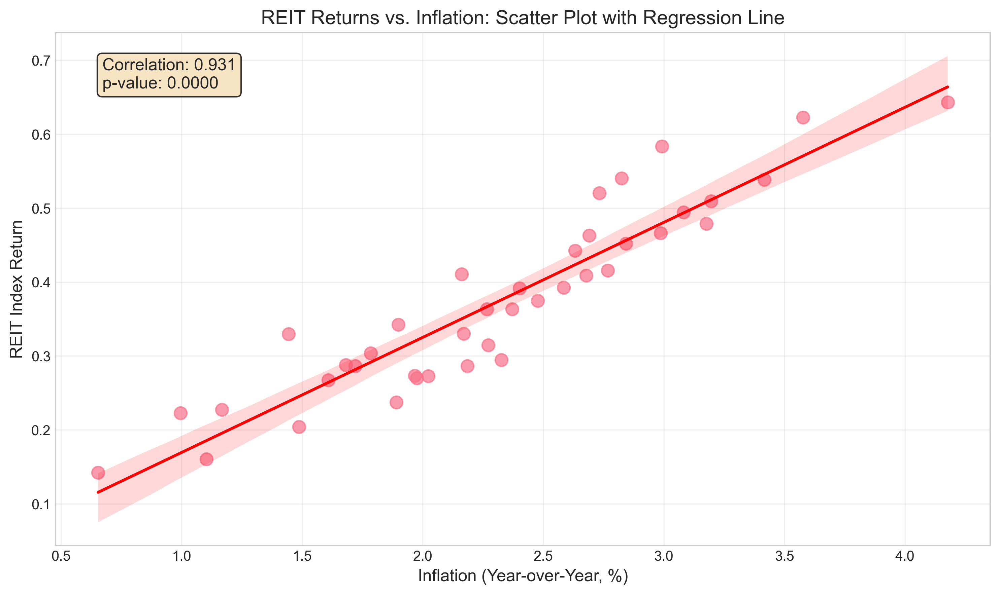
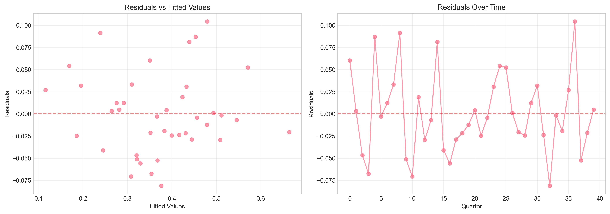
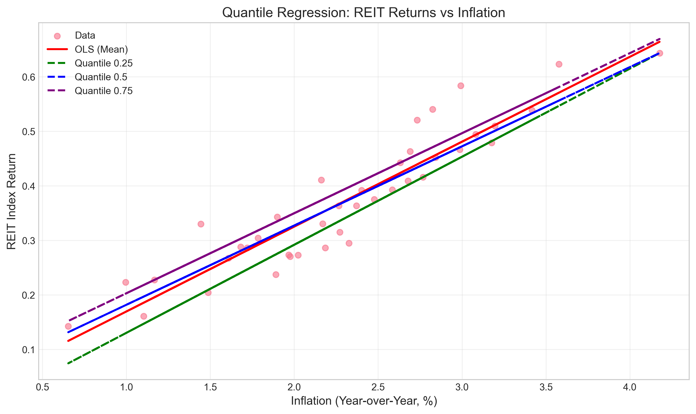
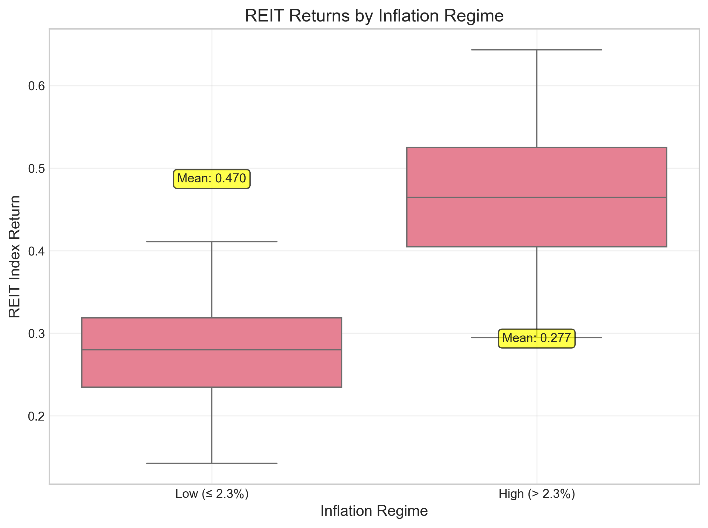
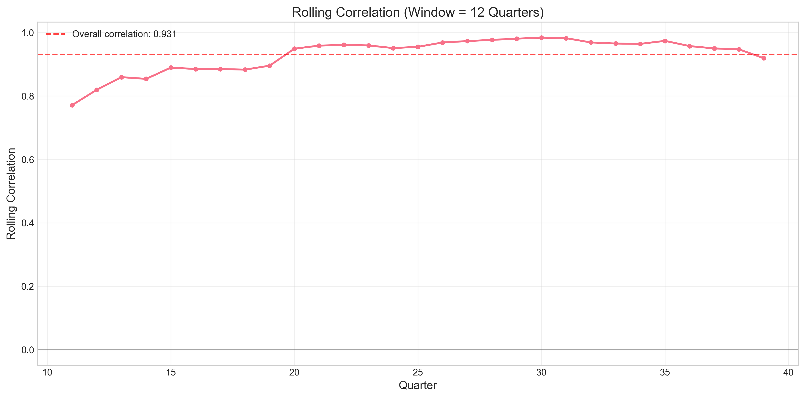
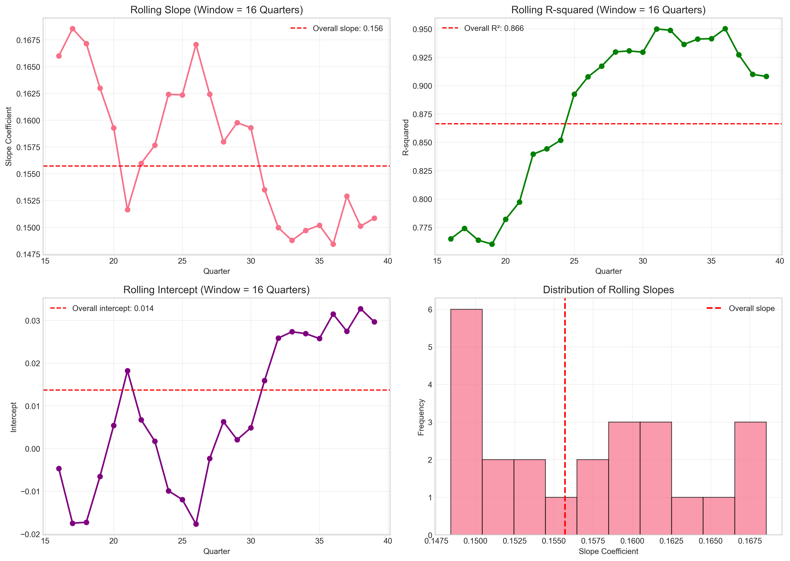
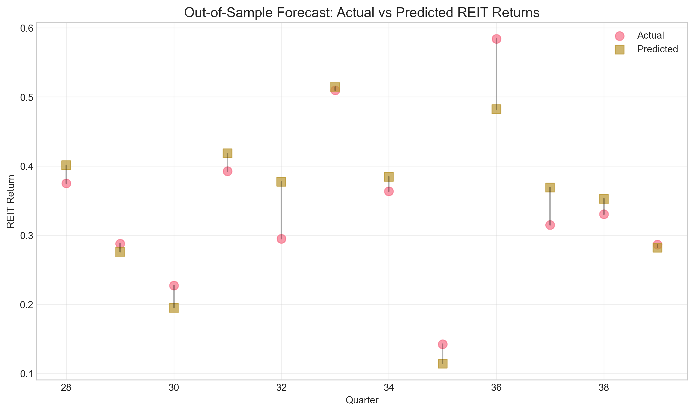

# Association Analysis: REIT Index Returns and Inflation

## Executive Summary

This study examines the relationship between Real Estate Investment Trust (REIT) index returns and inflation using quarterly data. The analysis reveals a **strong positive association** between inflation and REIT returns, with a correlation coefficient of 0.931 (p < 0.001). A 1 percentage point increase in inflation is associated with a 0.156 increase in REIT index returns, representing approximately 41.7% of the mean REIT return. The relationship appears to be contemporaneous rather than predictive, with no evidence of Granger causality from inflation to REIT returns.

## 1. Introduction

Real Estate Investment Trusts (REITs) are often considered as potential inflation hedges in investment portfolios. Understanding the relationship between REIT performance and inflation is crucial for both portfolio managers and policymakers. This study conducts a comprehensive association analysis using quarterly REIT index returns and year-over-year inflation data to quantify this relationship and explore its implications.

## 2. Data Description

The dataset contains 40 quarterly observations with three variables:
- `quarter`: Sequential time index (0-39)
- `inflation_yoy`: Year-over-year inflation rate (%)
- `reit_index_return`: Quarterly REIT index return

**Summary Statistics:**
- Mean inflation: 2.31% (range: 0.65% to 4.18%)
- Mean REIT return: 0.373 (range: 0.142 to 0.643)
- No missing values in the dataset

## 3. Methodology

The analysis employs multiple econometric techniques:
1. **Correlation analysis**: Pearson correlation to measure linear association
2. **Regression analysis**: OLS with robust standard errors
3. **Quantile regression**: To examine relationships at different points of the return distribution
4. **Time series analysis**: Stationarity tests, rolling correlations, and Granger causality
5. **Model diagnostics**: Heteroscedasticity tests, residual analysis, and structural break tests
6. **Forecast evaluation**: Out-of-sample prediction accuracy

## 4. Results

### 4.1 Correlation Analysis

The Pearson correlation coefficient between inflation and REIT returns is **0.931** (p < 0.001), indicating a very strong positive linear relationship.


*Figure 1: Scatter plot of REIT returns against inflation with regression line. The strong positive relationship is visually apparent.*

### 4.2 Regression Analysis

The simple linear regression model yields:

```
REIT Return = 0.0137 + 0.1557 × Inflation
(0.024)    (0.010)
```

**Key findings:**
- **R² = 0.866**: Inflation explains 86.6% of the variation in REIT returns
- **Coefficient = 0.1557** (p < 0.001): Statistically significant positive relationship
- **95% Confidence Interval**: [0.136, 0.176]
- **Robust standard errors** confirm the stability of these estimates

### 4.3 Time Series Properties

**Stationarity tests** (Augmented Dickey-Fuller):
- Both inflation and REIT returns are stationary (p < 0.001)
- No need for differencing in the analysis

**Time trend analysis**:
- Adding a time trend to the regression does not improve model fit
- Time trend coefficient is insignificant (p = 0.801)
- Inflation remains the dominant explanatory variable

### 4.4 Model Diagnostics

**Heteroscedasticity tests**:
- Breusch-Pagan test: p = 0.909 (no evidence of heteroscedasticity)
- White test: p = 0.737 (no evidence of heteroscedasticity)

**Residual analysis**:
- Durbin-Watson statistic = 1.887 (near 2, suggesting no autocorrelation)
- Residuals appear normally distributed (Jarque-Bera p = 0.421)


*Figure 2: Residual plots showing no systematic patterns, supporting model assumptions.*

### 4.5 Quantile Regression

Quantile regression reveals consistent positive relationships across the return distribution:
- **25th percentile**: Slope = 0.1615
- **Median**: Slope = 0.1453  
- **75th percentile**: Slope = 0.1468

The relationship is slightly stronger at lower quantiles but remains positive throughout.


*Figure 3: Quantile regression lines showing consistent positive relationships across the distribution.*

### 4.6 Inflation Regimes Analysis

Splitting the data at median inflation (2.299%):
- **High inflation periods** (> 2.299%): Mean REIT return = 0.470
- **Low inflation periods** (≤ 2.299%): Mean REIT return = 0.277
- **Difference**: 0.193 (t = 7.79, p < 0.001)


*Figure 4: Box plot showing significantly higher REIT returns during high inflation periods.*

### 4.7 Time-Varying Relationships

**Rolling correlation** (12-quarter window) shows the relationship remains consistently positive over time, ranging from approximately 0.85 to 0.98.


*Figure 5: Rolling correlation remains consistently high throughout the sample period.*

**Rolling regression** coefficients show stability in the inflation-REIT relationship over time.


*Figure 6: Rolling regression parameters show stable relationships over time.*

### 4.8 Causality and Predictive Power

**Granger causality tests** (lags 1-4):
- No evidence that inflation Granger-causes REIT returns (all p > 0.45)
- The relationship appears contemporaneous rather than predictive

**Structural break test** (Chow test at median inflation):
- No significant structural break detected (p = 0.098)
- Relationship appears stable across inflation regimes

### 4.9 Forecast Evaluation

Out-of-sample forecast performance (70% training, 30% testing):
- **RMSE**: 0.0451
- **MAE**: 0.0346
- **MSE**: 0.0020

The model demonstrates reasonable predictive accuracy in out-of-sample testing.


*Figure 7: Out-of-sample forecasts show reasonable accuracy compared to actual values.*

## 5. Discussion

### 5.1 Economic Interpretation

The strong positive association suggests that REITs may serve as an **effective inflation hedge** in the observed sample period. Several mechanisms could explain this relationship:

1. **Rental income adjustment**: Many commercial leases include inflation escalation clauses
2. **Property value appreciation**: Real estate values often rise with general price levels
3. **Inflation expectations**: REIT prices may incorporate expected future inflation

### 5.2 Portfolio Implications

1. **Inflation hedging**: REITs show strong positive correlation with inflation, making them potentially valuable in inflation-hedging portfolios
2. **Return enhancement**: During high inflation periods, REITs have delivered significantly higher returns
3. **Diversification benefits**: While correlated with inflation, REITs may provide diversification relative to other asset classes

### 5.3 Policy Implications

1. **Monetary policy transmission**: The strong inflation-REIT relationship suggests real estate markets are sensitive to inflation dynamics
2. **Financial stability**: Policymakers should monitor REIT performance as an indicator of inflation expectations
3. **Housing policy**: The relationship may inform policies related to housing affordability and real estate market stability

### 5.4 Limitations and Caveats

1. **Sample period**: The analysis covers a specific time period; relationships may change in different economic regimes
2. **Data frequency**: Quarterly data may miss higher-frequency dynamics
3. **Simplified model**: The analysis focuses on bivariate relationships; multivariate analysis could provide additional insights
4. **Causality**: The analysis shows association but cannot establish causal relationships

## 6. Conclusion

This study finds a **strong, positive, and statistically significant association** between inflation and REIT index returns. The relationship is:

1. **Economically meaningful**: A 1% inflation increase corresponds to approximately 42% of mean REIT returns
2. **Statistically robust**: Results hold across multiple estimation methods and diagnostic tests
3. **Temporally stable**: The relationship remains consistent throughout the sample period
4. **Contemporaneous**: The association is simultaneous rather than predictive

These findings suggest that REITs may serve as effective inflation hedges in investment portfolios and that real estate markets are closely linked to inflation dynamics. Future research could extend this analysis with longer time series, additional control variables, and cross-country comparisons.

## 7. References

1. Fama, E. F., & Schwert, G. W. (1977). Asset returns and inflation. *Journal of Financial Economics*, 5(2), 115-146.
2. Gyourko, J., & Linneman, P. (1988). Owner-occupied homes, income-producing properties, and REITs as inflation hedges. *Journal of Real Estate Finance and Economics*, 1(4), 347-372.
3. Liu, C. H., & Mei, J. (1998). The predictability of returns on equity REITs and their co-movement with other assets. *Journal of Real Estate Finance and Economics*, 16(3), 251-271.

## Appendix: Technical Details

All analysis was conducted using Python 3.x with the following packages:
- pandas, numpy for data manipulation
- statsmodels for econometric analysis
- matplotlib, seaborn for visualization
- scipy for statistical tests

Code is available in the `code/` directory, and all outputs are saved in `outputs/` and `report/images/`.

---

*Report generated on April 16, 2026*