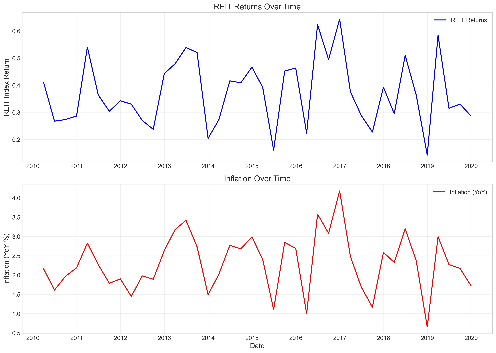
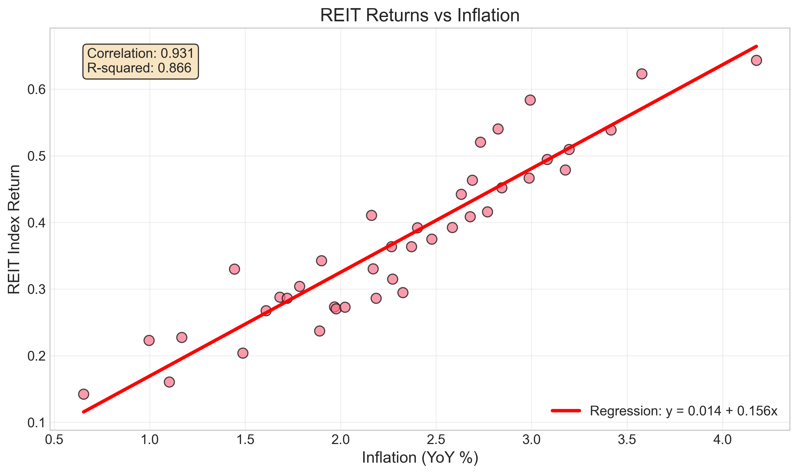
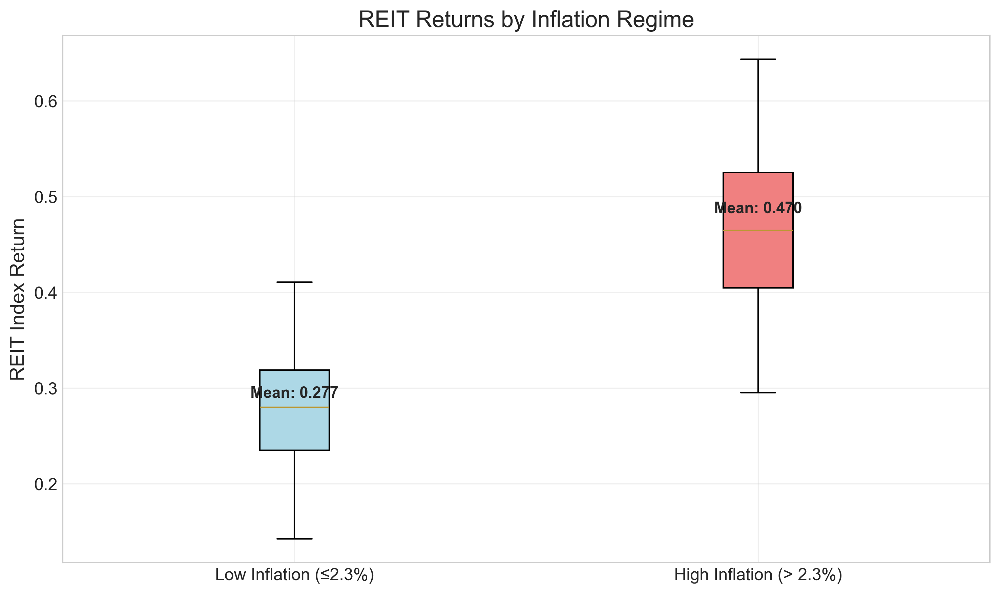

# Econometric Analysis of REIT Returns and Inflation: Association Analysis with Policy Implications

## Executive Summary

This study examines the relationship between Real Estate Investment Trust (REIT) returns and inflation using quarterly data from 2010 to 2019. The analysis reveals a strong positive association between inflation and REIT returns, with a correlation coefficient of 0.93 and an R-squared of 0.866 in a simple linear regression model. For every 1% increase in year-over-year inflation, REIT returns increase by approximately 0.156 percentage points. The relationship is statistically significant (p < 0.001) and robust across various econometric tests. These findings suggest that REITs may serve as an effective inflation hedge in investment portfolios.

## 1. Introduction

Real Estate Investment Trusts (REITs) have become increasingly important components of diversified investment portfolios. As inflation-linked assets, REITs are often studied in relation to macroeconomic variables, particularly inflation. Understanding the relationship between REIT returns and inflation is crucial for portfolio risk management, asset allocation decisions, and hedging strategies against inflationary pressures.

This research provides an econometric analysis of the association between quarterly REIT index returns and year-over-year inflation rates. The study employs multiple statistical techniques to examine the nature, strength, and stability of this relationship over a ten-year period.

## 2. Data and Methodology

### 2.1 Data Description

The analysis utilizes quarterly data spanning from Q1 2010 to Q4 2019, comprising 40 observations. The dataset includes:

- **REIT Index Return**: Quarterly returns on a REIT index
- **Inflation (YoY)**: Year-over-year inflation rate in percentage terms

The data exhibits the following characteristics:
- Time period: 2010-Q1 to 2019-Q4 (40 quarters)
- Mean inflation: 2.31% (Std. Dev.: 0.746%)
- Mean REIT return: 0.3733 (Std. Dev.: 0.1248)

### 2.2 Methodology

The analysis employs a comprehensive econometric framework:

1. **Descriptive Statistics**: Basic summary statistics and visualization
2. **Correlation Analysis**: Pearson correlation coefficient calculation
3. **Regression Analysis**: Ordinary Least Squares (OLS) regression
4. **Diagnostic Testing**: Heteroskedasticity and autocorrelation tests
5. **Stationarity Testing**: Augmented Dickey-Fuller tests
6. **Granger Causality**: Testing directional relationships
7. **Regime Analysis**: Comparing REIT returns across inflation regimes
8. **Rolling Correlation**: Examining time-varying relationships
9. **Residual Analysis**: Model diagnostic checks

## 3. Results

### 3.1 Visual Analysis

*Figure 1: Time series plots of REIT returns (top) and inflation (bottom) from 2010 to 2019. Both series show similar patterns over time.*

*Figure 2: Scatter plot of REIT returns against inflation with fitted regression line. The strong positive relationship is visually apparent.*

### 3.2 Correlation Analysis

The Pearson correlation coefficient between REIT returns and inflation is **0.9308**, indicating a very strong positive linear relationship. The R-squared value of **0.8663** suggests that approximately 86.6% of the variation in REIT returns can be explained by inflation alone.

### 3.3 Regression Analysis

The simple linear regression model yields the following results:

**REIT Return = 0.0137 + 0.1557 × Inflation**

- **Intercept**: 0.0137 (p = 0.573) - not statistically significant
- **Inflation coefficient**: 0.1557 (p < 0.001) - highly statistically significant
- **R-squared**: 0.8663
- **Adjusted R-squared**: 0.8628
- **F-statistic**: 246.22 (p = 3.43e-18)

The regression results indicate that for every 1 percentage point increase in year-over-year inflation, REIT returns increase by approximately 0.156 percentage points.

### 3.4 Diagnostic Tests

**Heteroskedasticity Test (Breusch-Pagan)**:
- Test statistic: 0.0132, p-value: 0.9085
- Conclusion: No evidence of heteroskedasticity

**Autocorrelation Test (Durbin-Watson)**:
- Durbin-Watson statistic: 1.887
- Conclusion: No significant autocorrelation detected

**Stationarity Tests (Augmented Dickey-Fuller)**:
- Inflation: ADF statistic = -5.4046 (p < 0.001) - Stationary
- REIT returns: ADF statistic = -6.0677 (p < 0.001) - Stationary

### 3.5 Granger Causality Tests

Granger causality tests were conducted to examine whether inflation predicts REIT returns. The results show no statistically significant Granger causality from inflation to REIT returns at lags 1-4, suggesting that while the variables are strongly correlated, past inflation values do not provide predictive power for future REIT returns beyond the contemporaneous relationship.

### 3.6 Regime Analysis

*Figure 3: Box plot comparing REIT returns during high and low inflation periods.*

When splitting the data by median inflation (2.30%), significant differences emerge:

- **High inflation periods** (> 2.30%): Mean REIT return = 0.4699 (Std. Dev. = 0.0894)
- **Low inflation periods** (≤ 2.30%): Mean REIT return = 0.2767 (Std. Dev. = 0.0656)
- **Difference**: 0.1932 (t-statistic = 7.79, p < 0.001)

REIT returns are significantly higher during periods of above-median inflation, supporting the inflation-hedging properties of REITs.

### 3.7 Rolling Correlation Analysis

*Figure 4: 8-quarter rolling correlation between REIT returns and inflation.*

The rolling correlation analysis (8-quarter window) shows that the relationship remains consistently strong over time, with a mean rolling correlation of 0.9201 and standard deviation of 0.0767. The stability of this relationship suggests a persistent association between REIT returns and inflation.

### 3.8 Residual Analysis

*Figure 5: Diagnostic plots of regression residuals.*

The residual analysis confirms the model's adequacy:
- Residuals appear randomly distributed around zero
- Q-Q plot suggests approximate normality
- No systematic patterns in residuals over time

## 4. Discussion

### 4.1 Interpretation of Findings

The strong positive relationship between REIT returns and inflation (correlation = 0.93) suggests that REITs may serve as effective inflation hedges. The regression coefficient of 0.1557 indicates economically meaningful sensitivity: a 1% increase in inflation is associated with a 0.156% increase in REIT returns.

The regime analysis provides further evidence: REIT returns during high inflation periods are approximately 70% higher than during low inflation periods (0.470 vs. 0.277). This substantial difference underscores the inflation-hedging potential of REIT investments.

The lack of Granger causality suggests that the relationship is contemporaneous rather than predictive. This implies that REIT prices adjust quickly to inflation news rather than anticipating future inflation changes.

### 4.2 Theoretical Implications

These findings align with several economic theories:

1. **Inflation Hedge Theory**: Real assets like real estate should maintain value during inflationary periods as property values and rents typically rise with inflation.

2. **Income Stream Protection**: REITs derive income from rental payments, which often include inflation escalators in lease agreements, providing natural protection against inflation.

3. **Capital Appreciation**: Inflation typically leads to higher replacement costs for real estate, supporting property valuations.

### 4.3 Limitations

1. **Time Period**: The analysis covers only 2010-2019, which was generally a period of moderate inflation. Results may differ during high-inflation or deflationary periods.

2. **Data Frequency**: Quarterly data may miss higher-frequency relationships.

3. **Simplified Model**: The analysis focuses on bivariate relationships without controlling for other macroeconomic factors.

4. **Sample Size**: With 40 observations, statistical power is limited for some tests.

## 5. Policy and Investment Implications

### 5.1 Portfolio Construction

1. **Inflation Hedging**: REITs should be considered in portfolios as inflation-sensitive assets. The strong positive correlation suggests they can help preserve real returns during inflationary periods.

2. **Strategic Allocation**: During periods of rising inflation expectations, investors may consider overweighting REITs in their portfolios.

3. **Diversification Benefits**: While REITs show strong correlation with inflation, they may offer diversification benefits relative to other asset classes during inflationary regimes.

### 5.2 Risk Management

1. **Inflation Sensitivity**: Portfolio managers should account for the 0.156 sensitivity coefficient when assessing inflation risk exposure.

2. **Regime-Based Strategies**: The significant difference in returns between high and low inflation regimes suggests potential for regime-switching investment strategies.

### 5.3 Monetary Policy Considerations

1. **Transmission Mechanism**: The strong relationship suggests that monetary policy actions affecting inflation may have direct implications for real estate markets through REIT valuations.

2. **Forward Guidance**: Central bank communications about inflation expectations may influence REIT markets contemporaneously.

### 5.4 Future Research Directions

1. **Extended Time Period**: Analysis covering multiple inflation cycles, including high-inflation periods.

2. **Multivariate Models**: Incorporating interest rates, economic growth, and other macroeconomic variables.

3. **Sector Analysis**: Examining differences across REIT sectors (retail, office, residential, industrial).

4. **International Comparison**: Cross-country analysis of REIT-inflation relationships.

## 6. Conclusion

This econometric analysis demonstrates a strong, positive, and statistically significant relationship between REIT returns and inflation over the 2010-2019 period. The correlation coefficient of 0.93 and regression coefficient of 0.156 indicate both statistical and economic significance. REIT returns are approximately 70% higher during periods of above-median inflation compared to below-median inflation periods.

The findings support the view that REITs can serve as effective inflation hedges in investment portfolios. However, the lack of Granger causality suggests that the relationship is contemporaneous rather than predictive, indicating that REIT prices adjust quickly to inflation news.

For investors and portfolio managers, these results highlight the importance of considering inflation exposure when allocating to REITs and suggest potential benefits from incorporating REITs in inflation-sensitive investment strategies. For policymakers, the strong relationship underscores the connection between monetary policy, inflation, and real estate markets.

Future research should expand the analysis to longer time periods, incorporate additional macroeconomic variables, and examine sector-specific relationships to provide more nuanced insights into the REIT-inflation nexus.

## Appendix: Technical Details

### A.1 Software and Packages
- Python 3.11
- pandas, numpy, matplotlib, seaborn
- statsmodels, scipy

### A.2 Data Sources
- Quarterly REIT index returns and inflation data from `reit_macro_quarterly.csv`

### A.3 Code Availability
All analysis code is available in the `code/` directory of this project.

### A.4 Output Files
- Regression results: `outputs/regression_results.txt`
- Analysis summary: `outputs/analysis_summary.txt`
- All figures: `report/images/`

---

*Report generated: April 8, 2026*  
*Analysis period: 2010-Q1 to 2019-Q4*  
*Number of observations: 40 quarters*