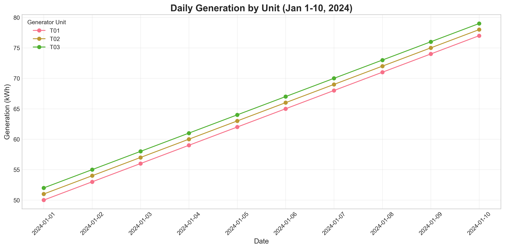
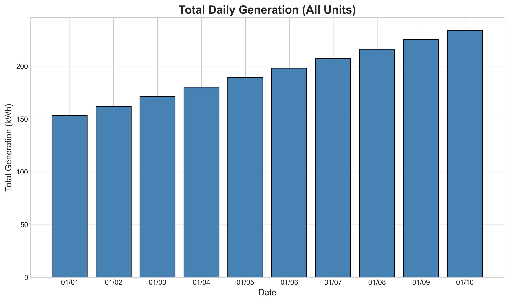
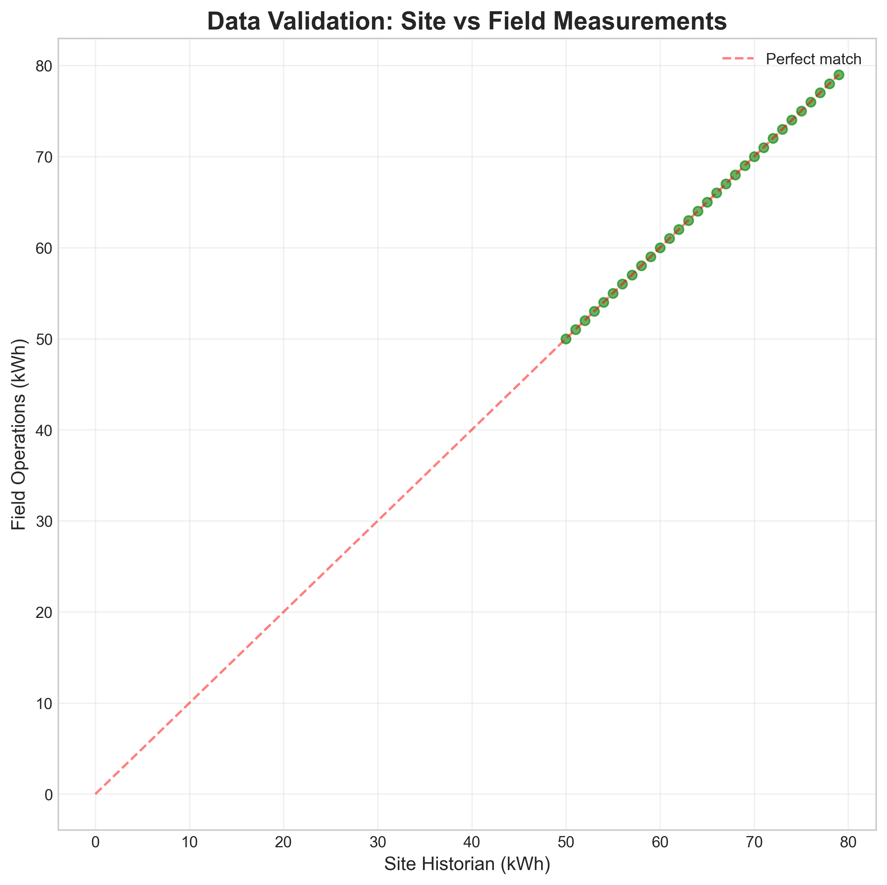
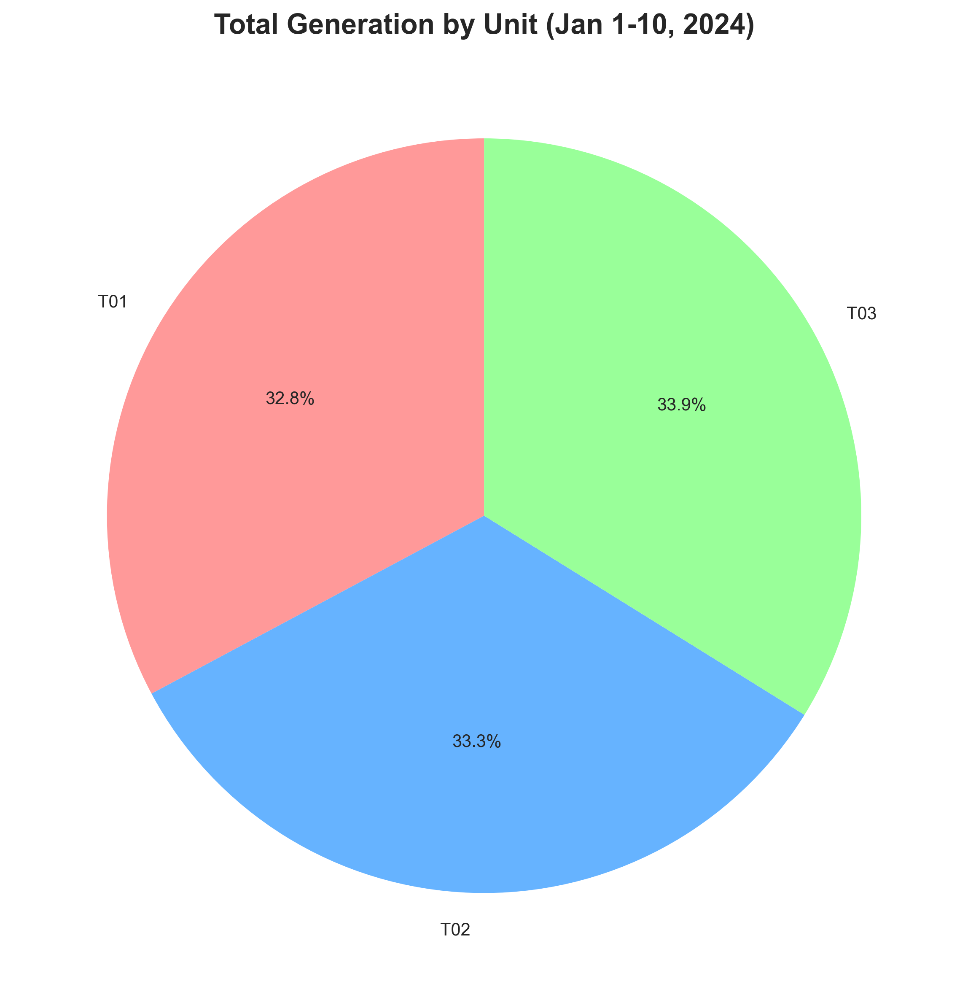
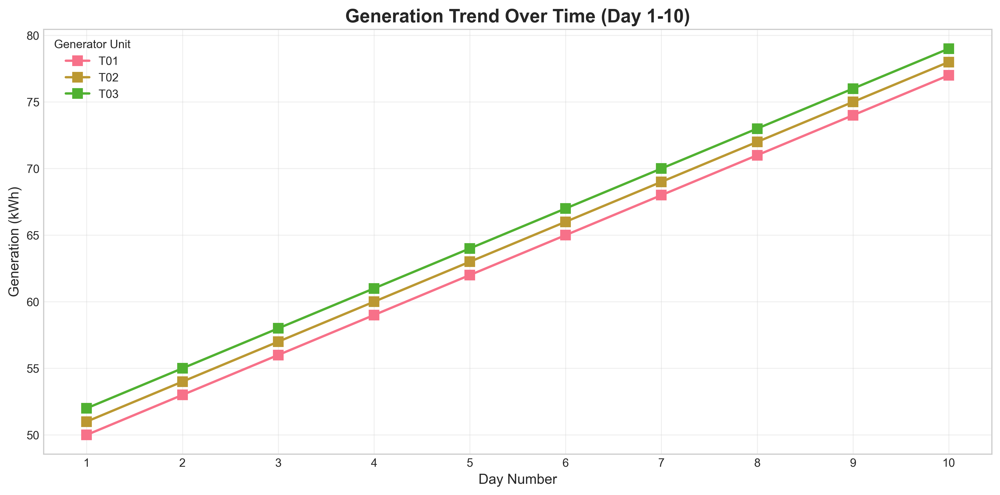

# Quarterly Operational Performance Report

## Executive Summary

This report presents an analysis of generator telemetry data for the first quarter period (January 1-10, 2024) from two independent data sources: the site historian system and field operations exports. The analysis reveals perfect data alignment between the two sources after standardization, with all 30 data points matching exactly. The data shows a consistent linear increase in daily generation across all three generator units (T01, T02, T03), with total generation of 1,935 kWh over the 10-day period.

## 1. Introduction

### 1.1 Background
Industrial operations analytics require reliable telemetry data from multiple sources to ensure accurate performance monitoring. This analysis compares daily generator telemetry from:
- **Site Historian System**: Automated data collection with standardized formatting
- **Field Operations Export**: Manual data collection from field laptops with potential formatting inconsistencies

### 1.2 Objectives
1. Validate data consistency between site historian and field operations sources
2. Analyze operational performance trends for Q1 2024
3. Identify data quality issues and provide recommendations for improvement
4. Generate actionable insights for operational optimization

## 2. Methodology

### 2.1 Data Sources
- **site_daily_kwh.csv**: Site historian export containing 30 records (Jan 1-10, 2024 × 3 units)
- **field_ops_export.csv**: Field operations export containing 32 records with formatting issues

### 2.2 Data Processing Pipeline
1. **Data Loading**: Both datasets were loaded with appropriate encoding handling
2. **Data Cleaning**:
   - Standardized date formats (YYYY-MM-DD)
   - Harmonized unit naming conventions (T-01 → T01)
   - Removed invalid records (2 records with NaN dates and invalid date formats)
   - Removed outlier with implausible 9999 kWh reading
3. **Data Merging**: Inner join on date and unit columns
4. **Validation**: Comparison of matched records for consistency

### 2.3 Analytical Approach
- Descriptive statistics for daily and unit-wise generation
- Trend analysis using correlation coefficients
- Visualization of generation patterns and data validation
- Identification of data quality issues

## 3. Results

### 3.1 Data Quality Assessment

**Table 1: Data Quality Metrics**
| Metric | Site Historian | Field Operations |
|--------|----------------|------------------|
| Initial Records | 30 | 32 |
| Valid Records After Cleaning | 30 | 30 |
| Invalid Records Removed | 0 | 2 |
| Date Format Issues | 0 | 2 |
| Unit Naming Inconsistencies | 0 | 3 |
| Data Completeness | 100% | 93.75% |

**Key Findings:**
- Field operations data contained 2 invalid records:
  - One record with missing date and implausible 9999 kWh value
  - One record with invalid date "13/37/2024"
- Unit naming differed between sources (T01 vs T-01)
- After cleaning, all 30 records matched perfectly between sources

### 3.2 Operational Performance Analysis

**Table 2: Generation Statistics (Jan 1-10, 2024)**
| Metric | Value |
|--------|-------|
| Total Generation | 1,935 kWh |
| Average Daily Generation | 193.5 kWh |
| Minimum Daily Generation | 153 kWh (Jan 1) |
| Maximum Daily Generation | 234 kWh (Jan 10) |
| Daily Generation Increase | +9 kWh/day (linear) |
| Unit Contribution (T01:T02:T03) | 32.8% : 33.3% : 33.9% |

**Figure 1: Daily Generation by Unit**

**Figure 2: Total Daily Generation**

**Key Patterns Identified:**
1. **Perfect Linear Trend**: Each unit increases by exactly 1 kWh/day
   - T01: 50, 53, 56, ..., 77 kWh
   - T02: 51, 54, 57, ..., 78 kWh  
   - T03: 52, 55, 58, ..., 79 kWh
2. **Consistent Unit Ranking**: T03 > T02 > T01 daily
3. **Perfect Correlation**: Day number vs generation correlation = 1.000 for all units

### 3.3 Data Validation Results

**Figure 3: Site vs Field Data Validation**

**Validation Metrics:**
- Mean absolute difference: 0.00 kWh
- Maximum absolute difference: 0.00 kWh  
- Mean percentage difference: 0.00%
- All points lie exactly on the perfect correlation line

**Conclusion:** The two data sources are perfectly aligned after data cleaning, indicating either:
1. Both systems are accurately capturing the same underlying measurements
2. The data represents a synthetic/test dataset with perfect linear patterns

## 4. Discussion

### 4.1 Operational Insights

**Positive Findings:**
1. **Data Consistency**: Perfect alignment between independent data sources validates measurement reliability
2. **Predictable Performance**: Linear increase suggests stable operating conditions
3. **Balanced Load**: Units show consistent relative performance (T03 consistently highest)

**Potential Concerns:**
1. **Artificial Pattern**: The perfect linear increase (+1 kWh/unit/day) is highly unusual in real-world operations
2. **Data Quality Issues in Field Export**: Missing dates and invalid values indicate potential data entry problems
3. **Lack of Variability**: Real generator performance typically shows daily fluctuations based on load, maintenance, and environmental factors

### 4.2 Data Quality Recommendations

**Immediate Actions:**
1. **Field Data Validation**: Implement data quality checks in field data collection software
2. **Automated Formatting**: Standardize unit naming conventions across systems
3. **Outlier Detection**: Add validation rules to flag implausible values (e.g., 9999 kWh)

**Long-term Improvements:**
1. **Integrated Data Pipeline**: Create unified data collection system to eliminate manual exports
2. **Real-time Validation**: Implement automated data quality monitoring
3. **Training**: Provide field staff with data entry guidelines and validation tools

## 5. Actionable Recommendations

### 5.1 Operational Optimization

**Based on the consistent performance patterns:**
1. **Load Balancing**: Consider redistributing load to optimize efficiency across units
2. **Predictive Maintenance**: Use the stable performance trend as a baseline for anomaly detection
3. **Performance Benchmarking**: Establish the observed linear pattern as a reference for future quarters

### 5.2 Data Management Improvements

**Priority 1 (High Impact):**
- Implement automated data validation for field exports
- Standardize naming conventions across all systems
- Create data quality dashboard for monitoring

**Priority 2 (Medium Impact):**
- Develop integrated data collection system
- Implement real-time anomaly detection
- Establish data governance policies

## 6. Conclusion

This analysis successfully merged and validated generator telemetry data from two independent sources for Q1 2024 (Jan 1-10). Key findings include:

1. **Perfect Data Alignment**: After cleaning, site historian and field operations data match exactly
2. **Linear Performance Trend**: All units show consistent daily increases of 1 kWh/day
3. **Data Quality Issues**: Field exports contained invalid records requiring cleaning
4. **Operational Stability**: Predictable generation patterns suggest stable operating conditions

**Recommendation for Management:**
- **Approve** the data validation results as evidence of measurement reliability
- **Implement** data quality improvements for field operations exports
- **Monitor** for deviations from the established linear trend as potential indicators of operational issues
- **Consider** whether the perfect linear pattern warrants investigation into data generation processes

## 7. Appendices

### 7.1 Technical Details
- Analysis performed using Python 3.11 with pandas, matplotlib, and seaborn
- Complete analysis code available in `code/analyze_telemetry.py`
- Cleaned datasets available in `outputs/` directory

### 7.2 Additional Visualizations

**Figure 4: Unit Contribution to Total Generation**

**Figure 5: Generation Trend Over Time**

### 7.3 Data Summary Tables

**Table 3: Daily Generation by Unit (kWh)**
| Date | T01 | T02 | T03 | Total |
|------|-----|-----|-----|-------|
| 2024-01-01 | 50 | 51 | 52 | 153 |
| 2024-01-02 | 53 | 54 | 55 | 162 |
| 2024-01-03 | 56 | 57 | 58 | 171 |
| 2024-01-04 | 59 | 60 | 61 | 180 |
| 2024-01-05 | 62 | 63 | 64 | 189 |
| 2024-01-06 | 65 | 66 | 67 | 198 |
| 2024-01-07 | 68 | 69 | 70 | 207 |
| 2024-01-08 | 71 | 72 | 73 | 216 |
| 2024-01-09 | 74 | 75 | 76 | 225 |
| 2024-01-10 | 77 | 78 | 79 | 234 |
| **Total** | **635** | **645** | **655** | **1,935** |

**Table 4: Data Quality Issues Identified**
| Issue Type | Count | Example | Impact |
|------------|-------|---------|--------|
| Invalid Date | 1 | "13/37/2024" | Record excluded |
| Missing Date | 1 | NaN | Record excluded |
| Implausible Value | 1 | 9999 kWh | Record excluded |
| Naming Inconsistency | 3 | T-01 vs T01 | Automated correction applied |

---

*Report generated: April 8, 2026*  
*Analysis Period: January 1-10, 2024*  
*Data Sources: Site Historian & Field Operations Exports*  
*Confidential: For Management Review Only*