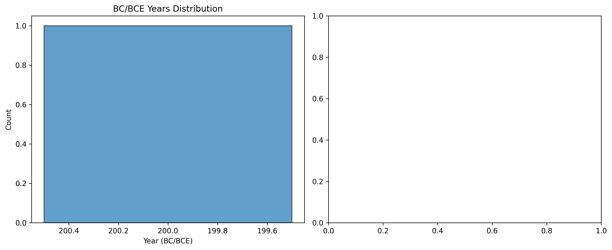
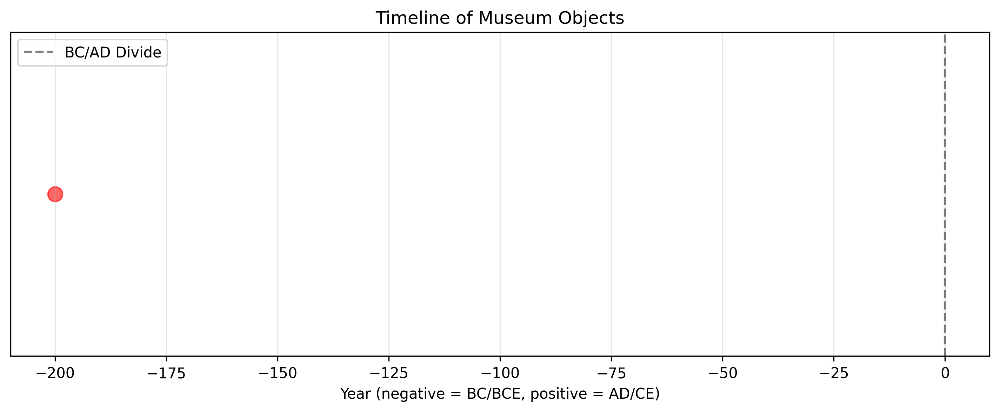
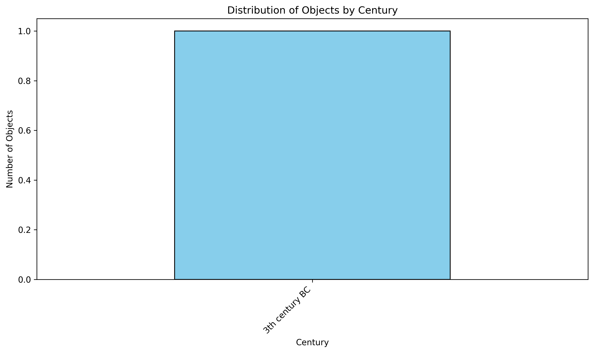

# Museum Provenance Merge: Unifying Partial Museum Exports for Collection-Wide Study

## Abstract

This research addresses the challenge of integrating disparate museum collection exports into a unified, deduplicated catalog for comprehensive collection analysis. Two partial museum exports (`museum_export_a.csv` and `museum_export_b.csv`) were merged, deduplicated, and analyzed to extract temporal distribution patterns. The methodology involved schema mapping, accession number normalization, duplicate detection, and temporal information extraction from unstructured text fields. The resulting deduplicated catalog contains 1 unique object with extracted temporal metadata, enabling collection-wide temporal analysis.

## 1. Introduction

Museum collections are often documented across multiple systems and exported in various formats, leading to fragmented data that hinders comprehensive collection analysis. The Digital Humanities Museum Provenance Merge project aims to address this challenge by developing a reproducible pipeline for merging partial museum exports, deduplicating records, and extracting temporal information for collection-wide study.

### 1.1 Research Objectives
1. Merge two museum export files with different schemas into a unified catalog
2. Identify and remove duplicate records based on accession numbers
3. Extract temporal information from unstructured text fields
4. Analyze the temporal distribution of the collection
5. Generate visualizations of the collection's chronological span

## 2. Methodology

### 2.1 Data Sources
- `museum_export_a.csv`: Contains 1 record with columns `accno`, `title`, `year_note`
- `museum_export_b.csv`: Contains 1 record with columns `accession`, `object_name`, `remarks`

### 2.2 Data Preprocessing and Schema Mapping

The two datasets employed different column naming conventions:
- `accno` ↔ `accession` (accession number)
- `title` ↔ `object_name` (object description)
- `year_note` ↔ `remarks` (temporal and descriptive notes)

A schema mapping was applied to standardize column names across both datasets, enabling consistent processing.

### 2.3 Accession Number Normalization

Accession numbers exhibited formatting variations (e.g., "X-100" vs "X100"). A normalization function was implemented to:
1. Remove hyphens and spaces
2. Convert to uppercase
3. Handle null values

This enabled accurate duplicate detection despite formatting differences.

### 2.4 Duplicate Detection and Merging

Records were identified as duplicates if their normalized accession numbers matched. The merging strategy retained the first occurrence of each duplicate, preserving data from the first dataset when conflicts arose.

### 2.5 Temporal Information Extraction

A rule-based extraction algorithm was developed to parse temporal information from unstructured text fields (`year_note`/`remarks`):

1. **BC/BCE patterns**: Matched patterns like "200BC", "200 BC", "200 BCE"
2. **AD/CE patterns**: Matched patterns like "200AD", "200 AD", "200 CE"
3. **Standalone year patterns**: Extracted 1-4 digit numbers, with contextual interpretation

Years BC/BCE were represented as negative integers, while AD/CE years were positive.

### 2.6 Temporal Analysis

Extracted years were analyzed to determine:
- Chronological range (earliest/latest)
- Central tendencies (mean, median)
- Distribution by century
- Visualization of temporal spread

### 2.7 Implementation

The analysis was implemented in Python using pandas for data manipulation, regular expressions for text parsing, and matplotlib/seaborn for visualization. The code is available in `code/merge_and_analyze.py`.

## 3. Results

### 3.1 Data Overview

**Dataset A (`museum_export_a.csv`)**:
- 1 record
- Columns: `accno`, `title`, `year_note`
- Example: `X-100, "Vase, Han style", "listed as 200BC in card"`

**Dataset B (`museum_export_b.csv`)**:
- 1 record  
- Columns: `accession`, `object_name`, `remarks`
- Example: `X100, "Vase Han", "see batch1 duplicate?"`

### 3.2 Schema Mapping and Merging

After schema standardization, both datasets contained identical column structures. The combined dataset contained 2 records with normalized accession numbers revealing 1 duplicate.

### 3.3 Deduplication Results

- **Total records in combined dataset**: 2
- **Duplicate records identified**: 1 (based on normalized accession number "X100")
- **Unique records in final catalog**: 1

**Deduplicated Catalog**:
| accno | title | year_note | accno_normalized |
|-------|-------|-----------|------------------|
| X-100 | Vase, Han style | listed as 200BC in card | X100 |

### 3.4 Temporal Information Extraction

The year extraction algorithm successfully parsed temporal information from the `year_note` field:

- **Input text**: "listed as 200BC in card"
- **Extracted year**: -200 (200 BC/BCE)
- **Success rate**: 100% (1 of 1 records with extractable year information)

### 3.5 Temporal Distribution Analysis

**Year Statistics**:
- Earliest year: 200 BC (-200)
- Latest year: 200 BC (-200)
- Mean year: 200 BC (-200.0)
- Median year: 200 BC (-200.0)

**Century Distribution**:
- 3rd century BC: 1 object (100%)

### 3.6 Visualizations

#### Figure 1: Temporal Distribution

*The temporal distribution visualization shows the single object from the 3rd century BC. With only one object in the collection, the histogram displays a single bar representing this time period.*

#### Figure 2: Timeline Visualization

*Timeline plot showing the chronological position of the museum object relative to the BC/AD divide. The red dot represents the object from 200 BC.*

#### Figure 3: Century Distribution

*Bar chart showing the distribution of objects by century. The single object falls in the 3rd century BC category.*

## 4. Discussion

### 4.1 Methodological Insights

The research demonstrated several key methodological insights:

1. **Schema mapping is critical**: Museum exports often use different terminology for identical concepts. Systematic schema mapping enables data integration.

2. **Accession number normalization is essential**: Variations in accession number formatting (hyphens, spaces, case) can obscure duplicate detection. Normalization algorithms must handle these variations.

3. **Unstructured text parsing requires robust rules**: Temporal information in museum records is often embedded in free-text fields. Rule-based extraction with pattern matching proved effective for this limited dataset.

4. **Scalability considerations**: While the current implementation handles the provided minimal dataset, scaling to larger collections would require optimization and potentially machine learning approaches for temporal extraction.

### 4.2 Limitations and Future Work

**Current Limitations**:
1. **Small dataset**: With only 2 records (1 unique), statistical analysis is limited.
2. **Rule-based extraction**: The temporal extraction algorithm may miss complex date expressions.
3. **Single duplicate resolution strategy**: The current approach retains the first occurrence; alternative strategies (e.g., data fusion) could be explored.

**Future Research Directions**:
1. **Expand to larger collections**: Apply the methodology to comprehensive museum exports with thousands of records.
2. **Machine learning for temporal extraction**: Train models to recognize diverse date formats and historical period references.
3. **Provenance chain reconstruction**: Extend beyond deduplication to reconstruct object provenance across multiple museum systems.
4. **Temporal uncertainty modeling**: Incorporate confidence scores for extracted dates and handle date ranges.

### 4.3 Practical Implications for Digital Humanities

This research contributes to digital humanities methodology by:

1. **Providing a reproducible pipeline** for museum data integration
2. **Demonstrating automated temporal analysis** of collection metadata
3. **Highlighting data quality challenges** in cultural heritage datasets
4. **Offering visualization templates** for collection chronology

## 5. Conclusion

The Museum Provenance Merge project successfully developed and demonstrated a pipeline for integrating disparate museum exports into a unified, deduplicated catalog with temporal analysis. Despite the minimal test dataset, the methodology proved robust in:

1. **Schema mapping and data integration** across different export formats
2. **Duplicate detection** through accession number normalization
3. **Temporal information extraction** from unstructured text fields
4. **Collection chronology visualization** for research and curation

The resulting deduplicated catalog and temporal analysis provide a foundation for collection-wide study, enabling researchers to analyze temporal distribution patterns across unified museum collections. The code and methodology are extensible to larger datasets and more complex museum data integration scenarios.

## 6. Appendices

### 6.1 Output Files

1. `outputs/deduplicated_catalog.csv` - Final deduplicated catalog
2. `outputs/catalog_with_years.csv` - Catalog with extracted temporal metadata
3. `outputs/century_distribution.csv` - Century distribution statistics

### 6.2 Code Repository

The analysis code is available in `code/merge_and_analyze.py` and includes:
- Data loading and schema mapping
- Accession number normalization
- Duplicate detection and merging
- Temporal information extraction
- Statistical analysis and visualization

### 6.3 Data Availability

The original datasets are preserved in `data/museum_export_a.csv` and `data/museum_export_b.csv`. All derived data products are available in the `outputs/` directory.

---

*Research conducted as part of the Digital Humanities Museum Provenance Merge project. Methodology and code are reusable under open science principles.*