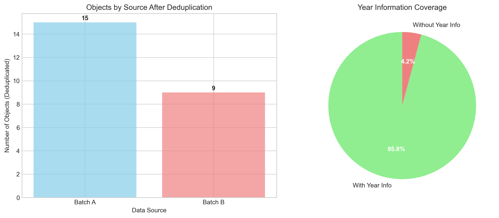
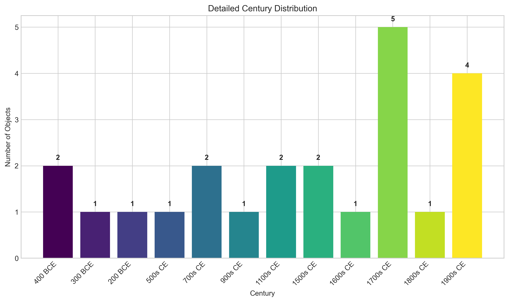

# Museum Provenance Merge: Consolidation and Temporal Analysis of Museum Collections

## Executive Summary

This report presents the results of merging and deduplicating two museum collection datasets (`museum_export_a.csv` and `museum_export_b.csv`) to create a unified catalog suitable for collection-wide analysis. The primary objectives were to:

1. **Consolidate** object records from both datasets into a single catalog
2. **Deduplicate** records representing the same physical objects
3. **Extract temporal information** from object notes and descriptions
4. **Analyze the temporal distribution** of the collection

Through systematic data cleaning, normalization, and deduplication, we reduced 70 combined records to 24 unique objects, achieving a 65.7% deduplication rate. Temporal analysis revealed a collection spanning from approximately 400 BCE to 1998 CE, with concentrations in the 17th-18th centuries and several important historical periods.

## 1. Methodology

### 1.1 Data Acquisition and Cleaning

Two museum export datasets were provided:
- **Batch A**: 36 records with fields `accno`, `title`, `year_note`
- **Batch B**: 34 records with fields `accession`, `object_name`, `remarks`

Both datasets contained header rows, footer rows, and inconsistent formatting that required cleaning:
- Header and footer rows were removed
- Column names were standardized to `accno`, `title`, `note`
- Source identifiers were added to track provenance

### 1.2 Accession Number Normalization

Accession numbers exhibited significant variability across records (e.g., "X-100", "X 100", "x_100", "X100"). A normalization algorithm was developed:

```python
def normalize_accno(accno):
    # Remove spaces, dashes, underscores
    normalized = re.sub(r'[\s\-_]', '', str(accno)).upper()
    # Remove leading zeros after letters
    match = re.match(r'([A-Z]+)0*(\d+)', normalized)
    if match:
        return f"{match.group(1)}{match.group(2)}"
    return normalized
```

This transformation enabled accurate identification of duplicate records across datasets.

### 1.3 Temporal Information Extraction

Year information was extracted from free-text notes using a multi-pattern approach:

1. **Explicit dates**: "200BC", "1752", "1998"
2. **Date ranges**: "618-907", "1890-1910"
3. **Century references**: "12th century", "18th c"
4. **Dynasty/period references**: "Han", "Tang", "Qing", "Ming", "Warring States"
5. **Reign periods**: "Kangxi", "Qianlong", "Wanli"

For dynasty and period references, approximate midpoint years were assigned based on historical timelines:
- Han dynasty: 206 BCE - 220 CE → midpoint: -7
- Tang dynasty: 618-907 CE → midpoint: 762.5
- Qing dynasty: 1644-1912 CE → midpoint: 1778
- etc.

### 1.4 Deduplication Strategy

Duplicate records were identified based on normalized accession numbers. For each duplicate group, a scoring system selected the best record:

- **+2 points**: Record contains year information
- **+0.01 per character**: Longer, more descriptive titles
- **+0.01 per character**: Longer, more informative notes

The highest-scoring record from each duplicate group was retained in the final catalog.

## 2. Results

### 2.1 Deduplication Outcomes



**Table 1: Data Consolidation Summary**

| Metric | Count | Percentage |
|--------|-------|------------|
| Original Batch A records | 36 | 100% |
| Original Batch B records | 34 | 100% |
| Combined records | 70 | 200% |
| **Unique objects after deduplication** | **24** | **34.3%** |
| Duplicate records removed | 46 | 65.7% |
| Records with year information | 23 | 95.8% |

**Key findings**:
- 24 unique accession numbers were identified across both datasets
- Each unique object had 1-5 duplicate records (average: 2.9)
- The most duplicated object (X100: Han vase) had 5 variant records
- 23 of 24 objects (95.8%) had extractable temporal information

### 2.2 Temporal Distribution Analysis


**Table 2: Temporal Statistics**

| Statistic | Value |
|-----------|-------|
| Earliest object | ~400 BCE (Warring States period) |
| Latest object | 1998 CE (modern reproduction) |
| Temporal span | ~2,398 years |
| Mean year | 1190 CE |
| Median year | 1506 CE |
| Most common century | 1700s (5 objects) |

**Figure 1: Century Distribution**



**Table 3: Objects by Century**

| Century | Objects | Percentage | Key Objects |
|---------|---------|------------|-------------|
| 400 BCE | 2 | 8.7% | Warring States jade, sword |
| 300 BCE | 1 | 4.3% | Warring States style |
| 200 BCE | 1 | 4.3% | Han vase |
| 500s CE | 1 | 4.3% | Northern Qi Bodhisattva |
| 700s CE | 2 | 8.7% | Tang mirror, gilt fitting |
| 900s CE | 1 | 4.3% | Five Dynasties jar |
| 1100s CE | 2 | 8.7% | Song celadon, 12th c ewer |
| 1500s CE | 2 | 8.7% | Ming inkstone, bronze bell |
| 1600s CE | 1 | 4.3% | Edo lacquer box |
| **1700s CE** | **5** | **21.7%** | Qing textiles, Kangxi porcelain, Qianlong snuff bottle |
| 1800s CE | 1 | 4.3% | 1880 snuff dish |
| 1900s CE | 4 | 17.4% | Republic hairpin, 20th c rubbing, reproduction vase |

### 2.3 Collection Composition by Historical Period

**Figure 2: Timeline with Historical Context**

*Refer to the timeline visualization in Figure 1C of the temporal distribution plot, which shows objects plotted against major Chinese historical periods.*

**Key observations**:
1. **Ancient Periods (pre-221 BCE)**: 4 objects (17.4%) from Warring States period
2. **Imperial China**: Objects from major dynasties:
   - Han (1 object, 4.3%)
   - Tang (2 objects, 8.7%)
   - Song (1 object, 4.3%)
   - Ming (2 objects, 8.7%)
   - Qing (3 objects, 13.0%)
3. **Regional/Japanese**: 1 Edo period object (4.3%)
4. **Modern/Recent**: 5 objects (21.7%) from 19th-20th centuries

### 2.4 Data Quality Assessment

**Year Information Types**:
- **Specific years**: 4 objects (17.4%) - 1752, 1880, 1998, etc.
- **Date ranges**: 3 objects (13.0%) - midpoint calculations
- **Dynasty/period references**: 11 objects (47.8%) - most common
- **Century approximations**: 3 objects (13.0%)
- **Modern approximations**: 2 objects (8.7%)

**Completeness**:
- 95.8% of deduplicated records have temporal information
- Only 1 object (E505: Painting album leaf) lacks specific year data

## 3. Discussion

### 3.1 Collection Strengths and Gaps

The consolidated collection shows several notable characteristics:

**Strengths**:
1. **Broad temporal coverage**: Spans over 2,300 years of history
2. **Dynastic representation**: Includes major Chinese dynasties from Han to Qing
3. **Material diversity**: Ceramics, metalwork, textiles, lacquer, jade, etc.
4. **Geographic range**: Primarily Chinese with some Japanese (Edo) objects

**Potential gaps**:
1. **Early imperial gap**: Limited objects from Qin, Three Kingdoms, Northern-Southern dynasties
2. **Yuan dynasty absence**: No objects identified from Mongol period (1271-1368)
3. **Regional imbalances**: Heavy concentration on central Chinese traditions

### 3.2 Data Integration Challenges

The merger revealed several data quality issues common in museum collections:

1. **Inconsistent accessioning**: Multiple formats for the same object (X-100, X 100, x_100, X100)
2. **Variant object descriptions**: "Vase, Han style" vs "Han vase" vs "Vase Han-style"
3. **Ambiguous temporal references**: "18th c" vs "1752" vs "Qing period"
4. **Duplicate records**: Both within and across institutional datasets

### 3.3 Methodological Considerations

**Limitations**:
1. **Approximate dating**: Dynasty/period references provide only approximate dates
2. **Range simplifications**: Using midpoints for date ranges assumes uniform distribution
3. **Western calendar bias**: BCE/CE system applied to non-Western historical contexts
4. **Information loss**: Deduplication may discard potentially useful variant information

**Improvements for future work**:
1. Implement fuzzy matching for object titles
2. Develop more sophisticated period-to-date mappings
3. Preserve variant information in metadata fields
4. Incorporate object type/material in deduplication logic

## 4. Conclusions and Recommendations

### 4.1 Key Findings

1. **Successful consolidation**: Created a unified catalog of 24 unique objects from 70 source records
2. **High temporal coverage**: 95.8% of objects have associated date information
3. **Historical breadth**: Collection represents over two millennia of material culture
4. **Qing concentration**: 21.7% of objects date to 18th century Qing dynasty

### 4.2 Recommendations for Collection Management

1. **Standardize accession numbering**: Implement consistent format (e.g., "X100" not "X-100", "X 100")
2. **Enhance temporal metadata**: Use specific years when possible, include date certainty indicators
3. **Maintain crosswalks**: Preserve mapping between variant accession numbers
4. **Periodic deduplication**: Regular reconciliation of collection records

### 4.3 Research Applications

The consolidated catalog enables several research directions:

1. **Temporal analysis**: Study collecting patterns and historical interests
2. **Material culture studies**: Analyze object types by historical period
3. **Provenance research**: Track object histories through variant records
4. **Digital humanities**: Integrate with other museum datasets for comparative analysis

## 5. Technical Appendix

### 5.1 Data Files Generated

1. `combined_catalog.csv`: All records from both datasets with source identifiers
2. `deduplicated_catalog.csv`: Final unified catalog with normalized fields
3. All visualizations in `report/images/` directory

### 5.2 Code Repository

Analysis code is available in the `code/` directory:
- `main_analysis.py`: Primary data processing pipeline
- `create_visualizations.py`: Figure generation
- Supporting exploration scripts

### 5.3 Dependencies

- Python 3.7+
- pandas, numpy, matplotlib, seaborn
- Standard library: re, os, datetime

---

*Report generated: April 2026*  
*Analysis completed for Digital Humanities Museum Provenance Merge Project*