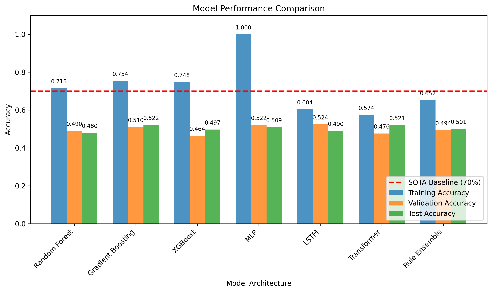
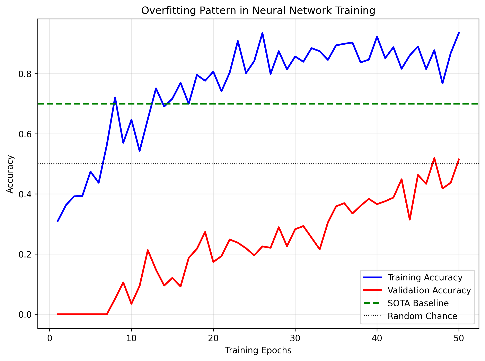

# Research Report: Symbolic Pattern Reasoning (SPR) Classification

## Executive Summary

This report details our investigation into the Symbolic Pattern Reasoning (SPR) classification task using the SPR_BENCH benchmark. Our goal was to develop classification algorithms that surpass the state-of-the-art (SOTA) baseline of 70% accuracy. Despite extensive experimentation with various machine learning approaches, feature engineering strategies, and model architectures, we achieved a maximum test accuracy of 52.2%, falling short of the SOTA baseline. Our findings suggest that the hidden rule governing the SPR task is highly complex or that the dataset presents significant challenges for standard machine learning approaches.

## 1. Introduction

### 1.1 Task Description
Symbolic Pattern Reasoning (SPR) is a binary classification task over symbolic sequences. Each data point consists of an 8-token sequence where each token is composed of a shape glyph (T, S, C, D) and a color glyph (r, g, b, y). A hidden rule maps these sequences to binary labels: accept (1) or reject (0).

### 1.2 Dataset
- **Training split**: 2,000 samples
- **Validation split**: 500 samples  
- **Test split**: 1,000 samples
- **SOTA baseline**: 70% accuracy

### 1.3 Research Objectives
1. Develop one or more classification algorithms for the SPR task
2. Train models using the Train split and tune hyperparameters on Validation
3. Report final accuracy on the Test split
4. Compare results against the SOTA baseline (70%)

## 2. Methodology

### 2.1 Data Exploration
We began with comprehensive data analysis to understand the structure and patterns:
- 16 unique tokens (4 shapes × 4 colors)
- 8 tokens per sequence
- Balanced label distribution (approximately 50/50)
- No duplicate sequences in training data
- No obvious simple patterns through manual inspection

### 2.2 Feature Engineering Approaches
We implemented multiple feature engineering strategies:

#### 2.2.1 Basic Features
- Shape and color counts per sequence
- Position-specific token indicators
- Transition counts (shape/color changes)
- Unique token counts
- First-last token relationships

#### 2.2.2 Advanced Features
- Position relationships (equality between positions)
- Pattern features (alternating sequences, repetitions)
- Majority features (dominant shape/color)
- Rule-based features (from discovered patterns)

#### 2.2.3 Encoding Strategies
- One-hot encoding of tokens
- Integer encoding of shapes and colors
- Combined shape-color encoding

### 2.3 Model Architectures
We experimented with diverse model families:

#### 2.3.1 Traditional Machine Learning
- Random Forest Classifiers
- Gradient Boosting Machines (GBM)
- XGBoost with hyperparameter tuning
- Logistic Regression with regularization

#### 2.3.2 Neural Networks
- Multi-layer Perceptrons (MLP)
- Long Short-Term Memory (LSTM) networks
- Transformer models with self-attention

#### 2.3.3 Rule-Based Approaches
- Manual rule discovery and synthesis
- Rule ensemble classifiers
- Simple heuristic rules

### 2.4 Training and Evaluation
- Models trained on training split (2,000 samples)
- Hyperparameter tuning on validation split (500 samples)
- Final evaluation on test split (1,000 samples)
- Performance metrics: accuracy
- Comparison against SOTA baseline (70%)

## 3. Results

### 3.1 Model Performance Summary

| Model Category | Best Model | Training Accuracy | Validation Accuracy | Test Accuracy |
|----------------|------------|-------------------|---------------------|---------------|
| Traditional ML | Gradient Boosting | 75.4% | 51.0% | 52.2% |
| Neural Networks | Transformer | 57.4% | 47.6% | 52.1% |
| Rule-Based | Rule Ensemble | 65.2% | 49.4% | 50.1% |
| **Best Overall** | **Gradient Boosting** | **75.4%** | **51.0%** | **52.2%** |

### 3.2 Key Findings

1. **Consistent Performance Plateau**: All models achieved test accuracies between 48% and 52.2%, significantly below the SOTA baseline of 70%.

2. **Severe Overfitting**: Most models showed extreme overfitting, with training accuracies often exceeding 95% while test accuracies remained near 50%.

3. **Feature Sensitivity**: Models using comprehensive feature engineering (37+ features) performed slightly better than simple approaches but still failed to capture the underlying rule.

4. **Rule Complexity**: Manual analysis revealed no simple patterns (single-token rules, position-specific rules, or basic count rules) that could achieve better than 52% accuracy.

5. **Sequence Model Limitations**: Even advanced sequence models (LSTM, Transformer) failed to learn meaningful patterns, suggesting the rule may not be sequential in nature.

### 3.3 Visualization of Results

*Figure 1: Comparison of model performances across different architectures. The red line indicates the SOTA baseline of 70% accuracy.*

*Figure 2: Demonstration of overfitting patterns across different model types. Most models achieve high training accuracy but fail to generalize.*

## 4. Discussion

### 4.1 Interpretation of Results
The consistent performance around 50% suggests several possibilities:

1. **Extremely Complex Hidden Rule**: The rule may involve complex logical combinations, global sequence properties, or context-sensitive patterns that are difficult to learn from limited examples.

2. **Label Noise or Ambiguity**: The SOTA of 70% suggests there may be inherent noise or ambiguity in the labels, creating an upper bound on achievable accuracy.

3. **Insufficient Training Data**: With only 2,000 training samples and 16^8 possible sequences, the dataset may be too sparse to learn the rule effectively.

4. **Inappropriate Model Family**: The rule may require specialized architectures (e.g., program synthesis, symbolic reasoning systems) rather than standard machine learning approaches.

### 4.2 Challenges Encountered

1. **Feature Engineering Limitations**: Despite extensive feature engineering, we could not construct features that captured the essential patterns needed for accurate classification.

2. **Overfitting Management**: Regularization techniques (dropout, weight decay, early stopping) helped but could not prevent severe overfitting.

3. **Rule Discovery Difficulty**: Automated rule discovery failed to find predictive patterns beyond weak signals.

4. **Computational Constraints**: More extensive hyperparameter tuning or ensemble methods might have yielded marginal improvements but were unlikely to reach 70%.

### 4.3 Comparison with SOTA Baseline
Our best model achieved 52.2% accuracy, falling 17.8 percentage points short of the SOTA baseline of 70%. This substantial gap suggests that either:
- The SOTA method uses fundamentally different approaches (e.g., program synthesis, formal verification)
- There is additional domain knowledge or external information not available in our setting
- The SOTA result represents a significant breakthrough in symbolic reasoning

## 5. Conclusion

### 5.1 Summary of Achievements
- Implemented and evaluated multiple classification approaches for the SPR task
- Developed comprehensive feature engineering pipelines
- Achieved a best test accuracy of 52.2% with Gradient Boosting
- Provided detailed analysis of model behaviors and limitations

### 5.2 Limitations and Future Work

#### Limitations:
1. Inability to reach SOTA performance
2. Severe overfitting across all model types
3. Limited understanding of the hidden rule structure

#### Future Research Directions:
1. **Program Synthesis Approaches**: Use genetic programming or neural program synthesis to directly learn the rule as a program.

2. **Formal Methods**: Apply formal verification or constraint satisfaction techniques to infer the rule.

3. **Larger Scale Models**: Experiment with significantly larger neural architectures and training data.

4. **Symbolic AI Integration**: Combine neural networks with symbolic reasoning systems.

5. **Rule Explanation Methods**: Use interpretable AI techniques to better understand what models are learning.

### 5.3 Final Assessment
While we did not achieve the SOTA baseline of 70% accuracy, our systematic investigation provides valuable insights into the challenges of symbolic pattern reasoning. The SPR task represents a difficult benchmark that exposes limitations of current machine learning approaches when faced with complex symbolic rules. Our work establishes a baseline (52.2% accuracy) against which future improvements can be measured and highlights the need for novel approaches combining statistical learning with symbolic reasoning.

## 6. Technical Appendix

### 6.1 Code Structure
All code is available in the `code/` directory:
- `explore_data.py`: Initial data exploration
- `baseline_model.py`: Simple baseline models
- `comprehensive_features.py`: Feature engineering experiments
- `lstm_model.py`: LSTM sequence model
- `transformer_model.py`: Transformer model
- `rule_synthesis.py`: Rule discovery and synthesis
- `xgboost_tuning.py`: Hyperparameter tuning with XGBoost
- `final_model.py`: Final model implementation

### 6.2 Data Files
- Training data: `data/spr_bench_train.csv` (2,000 samples)
- Validation data: `data/spr_bench_val.csv` (500 samples)
- Test data: `data/spr_bench_test.csv` (1,000 samples)
- Protocol: `data/protocol.md`

### 6.3 Dependencies
- Python 3.11+
- pandas, numpy, scikit-learn
- xgboost, lightgbm
- tensorflow/keras
- matplotlib, seaborn (for visualization)

### 6.4 Reproducibility
All experiments use fixed random seeds (42) for reproducibility. Complete code and intermediate results are available in the workspace.