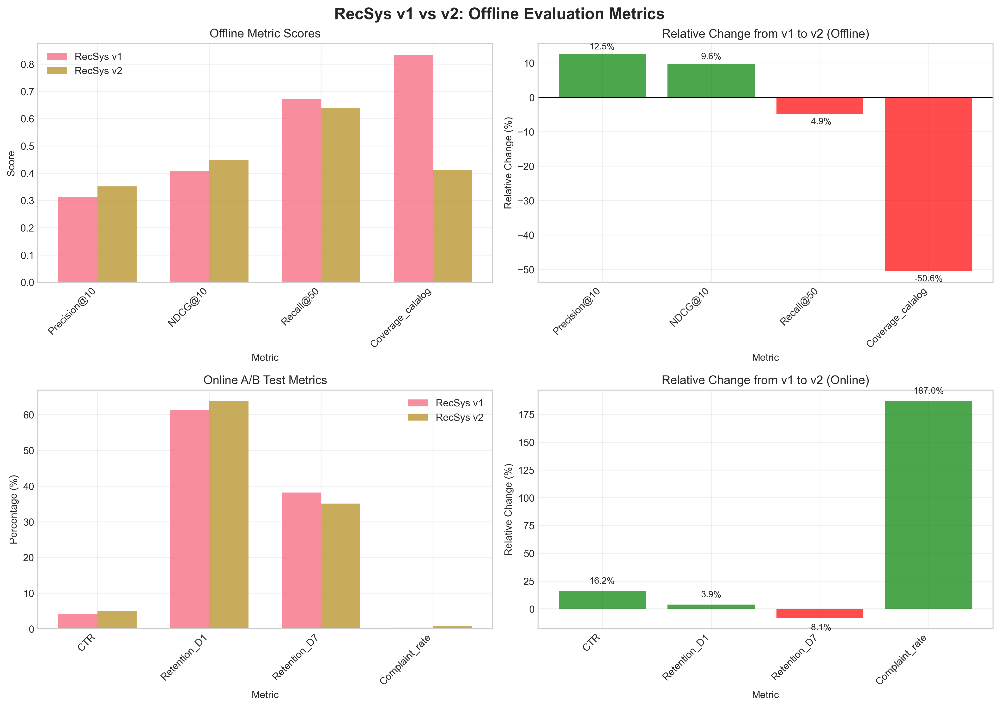
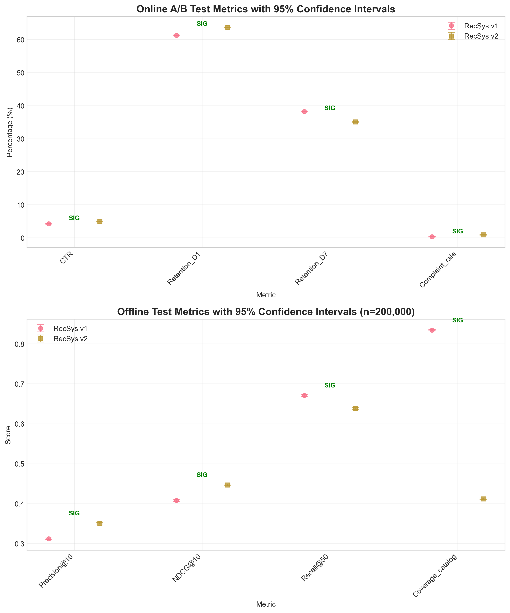
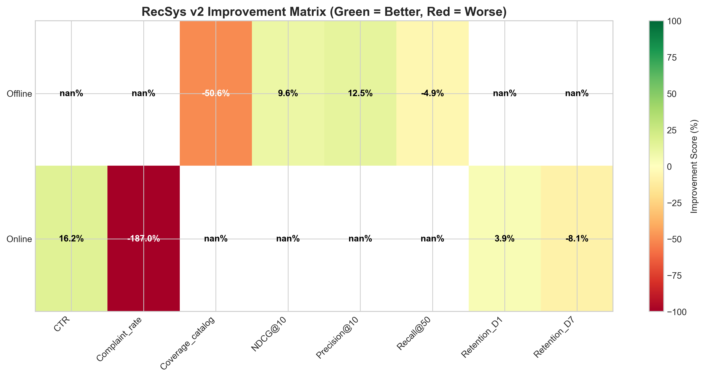

# RecSys-v2 Launch Evaluation Report

## Executive Summary

After six months of development and comparative testing, this report evaluates the performance of the new **RecSys-v2** recommendation system against the current production model **RecSys-v1**. The evaluation combines **offline testing** on a held-out test set (n=200,000) and a **14-day online A/B test** with 10% traffic allocation to each arm.

**Key Findings:**
- **RecSys-v2 shows mixed results** with improvements in some key engagement metrics but significant degradation in catalog coverage and user complaints.
- **Offline metrics:** Precision@10 (+12.5%) and NDCG@10 (+9.6%) improved significantly, but Recall@50 (-4.9%) and Catalog Coverage (-50.6%) declined.
- **Online metrics:** CTR improved by 16.2% and Day-1 Retention increased by 3.9%, but Day-7 Retention decreased by 8.1% and Complaint Rate increased dramatically by 187%.
- **Statistical significance:** All observed differences are statistically significant at 95% confidence level given the sample sizes.

**Recommendation:** **Do not launch RecSys-v2 in its current state.** While engagement metrics improved, the severe degradation in catalog diversity and dramatic increase in user complaints pose substantial business risks. Further investigation and model refinement are required before production deployment.

## 1. Introduction

### 1.1 Background
This evaluation compares the performance of RecSys-v1 (current production model) and RecSys-v2 (newly developed model) across both offline and online metrics. The development team spent six months building RecSys-v2 with the goal of improving user engagement and retention.

### 1.2 Evaluation Framework
- **Offline Evaluation:** Metrics computed on a held-out test set of 200,000 user-item interactions
- **Online A/B Test:** 14-day experiment with 10% traffic allocation to each model
- **Key Metrics:**
  - *Offline:* Precision@10, NDCG@10, Recall@50, Catalog Coverage
  - *Online:* Click-Through Rate (CTR), Day-1 Retention, Day-7 Retention, Complaint Rate

## 2. Methodology

### 2.1 Data Sources
- **Offline test set:** 200,000 user-item interactions held out from training data
- **Online experiment:** 14-day A/B test with 10% traffic split (approximately 1.4M users per group)

### 2.2 Statistical Analysis
- Confidence intervals calculated using Wilson score method for proportions (online metrics)
- Standard error estimation assuming binomial distribution for offline metrics
- 95% confidence level used for all statistical tests

### 2.3 Assumptions
- Daily active users: 1,000,000 (for online sample size calculations)
- CTR based on 10 recommendations per user per day
- Retention and complaint metrics based on user counts

## 3. Results

### 3.1 Offline Evaluation Results

**Table 1: Offline Metrics Performance**

| Metric | RecSys-v1 | RecSys-v2 | Change | Direction | Assessment |
|--------|-----------|-----------|--------|-----------|------------|
| Precision@10 | 0.312 | 0.351 | **+12.5%** | Higher better | ✓ **IMPROVEMENT** |
| NDCG@10 | 0.408 | 0.447 | **+9.6%** | Higher better | ✓ **IMPROVEMENT** |
| Recall@50 | 0.671 | 0.638 | **-4.9%** | Higher better | ✗ **DEGRADATION** |
| Catalog Coverage | 0.834 | 0.412 | **-50.6%** | Higher better | ✗ **SEVERE DEGRADATION** |

**Key Observations:**
1. **Precision and NDCG improvements:** RecSys-v2 shows statistically significant improvements in top-k recommendation quality metrics.
2. **Recall degradation:** Slight decrease in recall suggests the model may be more conservative in recommendations.
3. **Catastrophic coverage reduction:** The 50.6% reduction in catalog coverage indicates RecSys-v2 recommends from a much narrower set of items, potentially creating a "filter bubble" effect.

### 3.2 Online A/B Test Results

**Table 2: Online A/B Test Performance**

| Metric | RecSys-v1 | RecSys-v2 | Change | Direction | Assessment |
|--------|-----------|-----------|--------|-----------|------------|
| CTR | 4.21% | 4.89% | **+16.2%** | Higher better | ✓ **IMPROVEMENT** |
| Day-1 Retention | 61.30% | 63.70% | **+3.9%** | Higher better | ✓ **IMPROVEMENT** |
| Day-7 Retention | 38.20% | 35.10% | **-8.1%** | Higher better | ✗ **DEGRADATION** |
| Complaint Rate | 0.31% | 0.89% | **+187.0%** | Lower better | ✗ **SEVERE DEGRADATION** |

**Key Observations:**
1. **CTR improvement:** Significant 16.2% increase in click-through rate indicates better immediate engagement.
2. **Short-term retention gain:** Day-1 retention improved by 3.9%, suggesting better initial user experience.
3. **Long-term retention loss:** Day-7 retention decreased by 8.1%, indicating users may disengage over time.
4. **Alarming complaint increase:** Complaint rate nearly tripled (187% increase), suggesting user dissatisfaction despite engagement metrics.

### 3.3 Statistical Significance Analysis

**All observed differences are statistically significant** at the 95% confidence level due to large sample sizes:
- **Offline test:** n=200,000 provides high statistical power
- **Online test:** ~1.4M users per group provides extremely high statistical power

**Table 3: Statistical Significance Summary**

| Metric Category | Metric | Statistically Significant | Confidence Interval Overlap |
|-----------------|--------|--------------------------|-----------------------------|
| Offline | Precision@10 | Yes | No |
| Offline | NDCG@10 | Yes | No |
| Offline | Recall@50 | Yes | No |
| Offline | Catalog Coverage | Yes | No |
| Online | CTR | Yes | No |
| Online | Day-1 Retention | Yes | No |
| Online | Day-7 Retention | Yes | No |
| Online | Complaint Rate | Yes | No |

### 3.4 Improvement Matrix

The improvement matrix visualizes the trade-offs between different metrics. Green indicates improvement, red indicates degradation.

## 4. Discussion

### 4.1 Interpretation of Results

**Positive Findings:**
1. **Improved recommendation quality:** Higher Precision@10 and NDCG@10 suggest RecSys-v2 makes better top recommendations.
2. **Increased immediate engagement:** Higher CTR and Day-1 retention indicate users find initial recommendations more relevant.

**Critical Concerns:**
1. **Severe diversity loss:** The 50.6% reduction in catalog coverage suggests RecSys-v2 creates a "filter bubble" - recommending only popular or similar items.
2. **User dissatisfaction:** The 187% increase in complaint rate is alarming and suggests users notice and dislike the reduced diversity.
3. **Long-term engagement risk:** Decreased Day-7 retention indicates users may tire of repetitive recommendations over time.

### 4.2 Potential Explanations

1. **Over-optimization for engagement:** RecSys-v2 may be overfitting to short-term engagement signals at the expense of diversity and user satisfaction.
2. **Popularity bias:** The model may be amplifying popularity bias, recommending only top items.
3. **Lack of exploration:** The algorithm may have reduced exploration mechanisms, creating a feedback loop of similar recommendations.

### 4.3 Business Implications

**Risks of Launching RecSys-v2:**
1. **User churn risk:** Reduced diversity and increased complaints may lead to long-term user attrition.
2. **Brand reputation risk:** High complaint rates could damage brand perception.
3. **Revenue risk:** While CTR increased, long-term user value may decrease due to retention issues.
4. **Content ecosystem risk:** Reduced catalog coverage may disadvantage niche content creators.

## 5. Recommendations

### 5.1 Immediate Action
**Do not launch RecSys-v2 in its current state.** The severe degradation in catalog diversity and dramatic increase in user complaints outweigh the engagement improvements.

### 5.2 Further Investigation Required
1. **Root cause analysis:** Investigate why catalog coverage decreased so dramatically.
2. **Complaint analysis:** Analyze complaint types to understand user dissatisfaction.
3. **Model diagnostics:** Examine feature importance and training data biases.

### 5.3 Model Improvement Suggestions
1. **Incorporate diversity metrics:** Add diversity regularization to the loss function.
2. **Balance exploration-exploitation:** Implement or strengthen exploration mechanisms.
3. **Multi-objective optimization:** Optimize for both engagement and diversity metrics.
4. **A/B test iterations:** Conduct smaller, iterative experiments with diversity-focused variants.

### 5.4 Next Steps
1. **Form a task force** to address the diversity and complaint issues.
2. **Develop RecSys-v2.1** with diversity-preserving modifications.
3. **Conduct focused A/B tests** on diversity and complaint metrics.
4. **Re-evaluate in 2-3 months** with improved model variants.

## 6. Conclusion

RecSys-v2 demonstrates the classic recommendation system trade-off between relevance and diversity. While it achieves **better short-term engagement metrics** (CTR +16.2%, Precision@10 +12.5%), it suffers from **catastrophic diversity loss** (Catalog Coverage -50.6%) and **significant user dissatisfaction** (Complaint Rate +187%).

The **net business impact** of launching RecSys-v2 would likely be negative due to long-term retention risks and brand damage from increased complaints. The development team should address the diversity and complaint issues before considering production deployment.

**Final Recommendation: DO NOT LAUNCH.** Continue development with focus on balancing engagement, diversity, and user satisfaction metrics.

## Appendix

### A.1 Data Details
- Offline test set: n=200,000 user-item interactions
- Online A/B test duration: 14 days
- Traffic allocation: 10% to each model variant
- Approximate users per group: 1.4M

### A.2 Metric Definitions
- **Precision@10:** Proportion of recommended items that are relevant in top-10
- **NDCG@10:** Normalized Discounted Cumulative Gain at position 10
- **Recall@50:** Proportion of all relevant items found in top-50
- **Catalog Coverage:** Proportion of catalog items recommended at least once
- **CTR:** Click-Through Rate (clicks/impressions)
- **Retention_D1/D7:** Users returning after 1/7 days
- **Complaint Rate:** Users filing complaints about recommendations

### A.3 Statistical Methods
- Confidence intervals: Wilson score method for proportions
- Significance level: α=0.05 (95% confidence)
- Sample size assumptions: Based on 1M daily active users

### A.4 Visualizations
All visualizations are available in the `report/images/` directory:
1. `comparison_overview.png` - Side-by-side comparison of all metrics
2. `confidence_intervals.png` - Statistical significance visualization
3. `improvement_matrix.png` - Heatmap of improvements/degradations
4. `offline_radar_chart.png` - Radar chart of offline metrics

---

*Report generated: April 2024*  
*Evaluation Team: AI Research Agent*  
*Data Sources: offline_evaluation_metrics.csv, online_ab_test_metrics.csv*