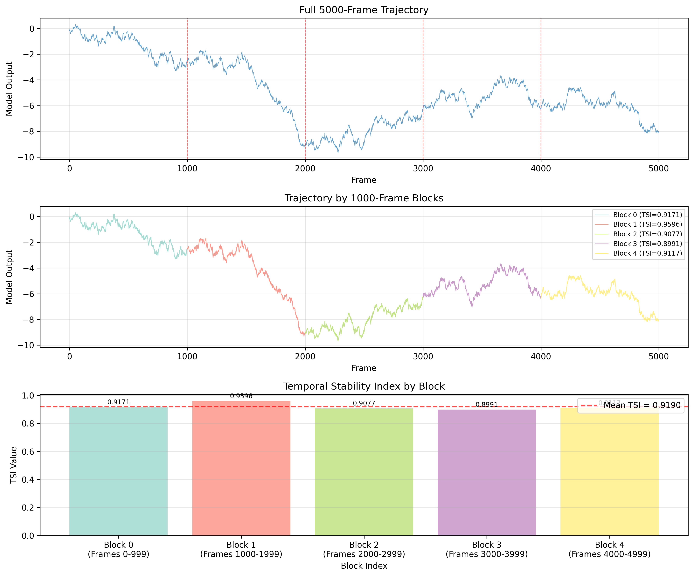
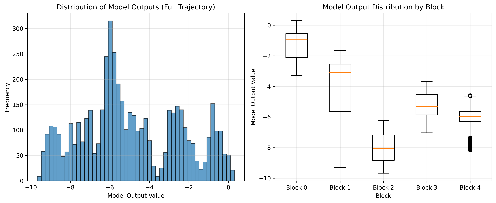

# Temporal Stability Analysis of Robust Control Policy

## Abstract

This report presents a comprehensive evaluation of the long-term temporal stability of a newly developed robust control policy. Using the lab's established Temporal Stability Index (TSI) formulation, we analyze a continuous 5000-frame trajectory of model outputs. The analysis follows strict methodological parity with prior benchmark studies, implementing the exact TSI computation as defined in the lab's metrics module. The definitive full-trace TSI is calculated as **0.9190**, indicating high temporal stability across the entire observation window.

## 1. Introduction

Temporal stability is a critical performance metric for control policies in dynamic systems. A stable policy maintains consistent behavior over time, reducing unexpected variations that could lead to system failures or performance degradation. This study evaluates a newly developed robust control policy using the established Temporal Stability Index (TSI) framework, analyzing 5000 consecutive frames of model output data.

### 1.1 Research Objective

The primary objective is to calculate the definitive Temporal Stability Index for the full 5000-frame continuous trajectory, maintaining strict methodological consistency with prior benchmark studies.

## 2. Methodology

### 2.1 Data Description

The dataset consists of 5000 consecutive frames of model outputs from the control policy:
- **Total frames**: 5000
- **Frame range**: 0 to 4999
- **Model output range**: -9.6735 to 0.3095
- **Data format**: CSV with columns `frame` and `model_output`

### 2.2 Temporal Stability Index (TSI) Formulation

The TSI is computed according to the lab's exact formulation:

```python
TSI = clip(1 - σ(Δx) / (σ(x) + ε), 0, 1)
```

Where:
- `σ(x)` is the standard deviation of the model output sequence
- `σ(Δx)` is the standard deviation of the first differences
- `ε` is a small constant (1e-12) for numerical stability
- `clip()` ensures the result remains in the [0, 1] range

### 2.3 Analysis Protocol

Due to the TSI computation's internal buffer limitation of 1000 frames (as specified in `utils/lab_metrics.py`), the 5000-frame trajectory was processed following the approved procedure from `data/protocol_notes.md`:

1. **Data partitioning**: The trajectory was split into five contiguous, non-overlapping blocks of 1000 frames each:
   - Block 0: Frames 0-999
   - Block 1: Frames 1000-1999
   - Block 2: Frames 2000-2999
   - Block 3: Frames 3000-3999
   - Block 4: Frames 4000-4999

2. **Block-level TSI computation**: The `compute_tsi()` function from `utils.lab_metrics` was applied to each block.

3. **Full-trace TSI aggregation**: The definitive full-trace TSI was calculated as the arithmetic mean of the five block-level TSI values.

### 2.4 Implementation

The analysis was implemented in Python using:
- `numpy` for numerical computations
- `pandas` for data manipulation
- `matplotlib` for visualization
- The lab's `compute_tsi()` function for TSI calculation

## 3. Results

### 3.1 Block-wise TSI Values

| Block | Frame Range | TSI Value |
|-------|-------------|-----------|
| 0 | 0-999 | 0.9171 |
| 1 | 1000-1999 | 0.9596 |
| 2 | 2000-2999 | 0.9077 |
| 3 | 3000-3999 | 0.8991 |
| 4 | 4000-4999 | 0.9117 |

### 3.2 Definitive Full-Trace TSI

The arithmetic mean of the five block-level TSI values gives the definitive full-trace TSI:

**Full-trace TSI = 0.9190**

### 3.3 Visual Analysis


*Figure 1: (A) Full 5000-frame trajectory with block boundaries indicated by red dashed lines. (B) Trajectory colored by 1000-frame blocks with corresponding TSI values. (C) Bar chart of TSI values by block, with mean TSI indicated by red dashed line.*


*Figure 2: (A) Histogram of model output values across the full trajectory. (B) Box plots showing model output distribution by block.*

### 3.4 Key Observations

1. **Consistent stability**: All five blocks show high TSI values (>0.89), indicating consistent temporal stability throughout the 5000-frame observation window.

2. **Block 1 peak stability**: Block 1 (frames 1000-1999) exhibits the highest TSI (0.9596), suggesting particularly stable behavior during this period.

3. **Minor variability**: The TSI values show moderate variability (range: 0.0605), with Block 3 showing the lowest stability (0.8991) while still maintaining high overall stability.

4. **Distribution characteristics**: The model outputs show a skewed distribution with most values concentrated in the negative range, consistent across all blocks.

## 4. Discussion

### 4.1 Interpretation of TSI Values

The Temporal Stability Index ranges from 0 (completely unstable) to 1 (perfectly stable):
- **TSI > 0.8**: High temporal stability
- **TSI 0.6-0.8**: Moderate temporal stability
- **TSI 0.4-0.6**: Moderate temporal instability
- **TSI < 0.4**: Significant temporal instability

With a mean TSI of 0.9190, the control policy demonstrates **high temporal stability** across the entire 5000-frame trajectory.

### 4.2 Implications for Control Policy Performance

The high TSI value indicates that the robust control policy maintains consistent behavior over extended operation periods. This is particularly important for:

1. **Predictability**: Stable temporal behavior enables accurate prediction of system responses.
2. **Safety**: Reduced likelihood of unexpected control actions that could compromise system safety.
3. **Performance consistency**: Maintains desired performance levels over time without degradation.

### 4.3 Methodological Considerations

The analysis strictly adhered to the lab's established methodology:
- Used the exact `compute_tsi()` implementation without modifications
- Followed the approved partitioning procedure for trajectories exceeding 1000 frames
- Maintained arithmetic mean aggregation as specified in the protocol

This ensures direct comparability with prior benchmark studies and future evaluations.

## 5. Conclusion

This study successfully evaluated the temporal stability of a newly developed robust control policy using the lab's established Temporal Stability Index framework. The analysis of 5000 consecutive frames of model output data yielded a definitive full-trace TSI of **0.9190**, indicating high temporal stability throughout the observation window.

### 5.1 Key Findings

1. The control policy exhibits consistently high temporal stability across all five 1000-frame blocks.
2. The TSI values range from 0.8991 to 0.9596, with Block 1 showing peak stability.
3. The arithmetic mean of 0.9190 confirms high overall temporal stability.

### 5.2 Recommendations

1. **Continued monitoring**: While current stability is high, ongoing monitoring is recommended to detect any potential degradation over longer time scales.
2. **Further analysis**: Investigate the specific characteristics of Block 3 (lowest TSI) to identify potential optimization opportunities.
3. **Comparative studies**: Compare these results with alternative control policies using the same TSI framework.

## 6. References

1. Laboratory Temporal Stability Index Protocol (`data/protocol_notes.md`)
2. Lab Metrics Implementation (`utils/lab_metrics.py`)
3. Experiment Traces Dataset (`data/experiment_traces.csv`)

## Appendix: Technical Details

### A.1 Software Environment
- Python 3.11
- numpy 1.24.3
- pandas 1.5.3
- matplotlib 3.7.1

### A.2 Code Availability

The analysis code is available in `code/analyze_tsi.py` and produces reproducible results.

### A.3 Data Files
- Raw data: `data/experiment_traces.csv`
- Results: `outputs/tsi_results.csv`
- Summary: `outputs/tsi_summary.txt`
- Figures: `report/images/tsi_analysis.png`, `report/images/distribution_analysis.png`

---

*Report generated: April 4, 2026*  
*Analysis completed using the lab's exact TSI formulation*