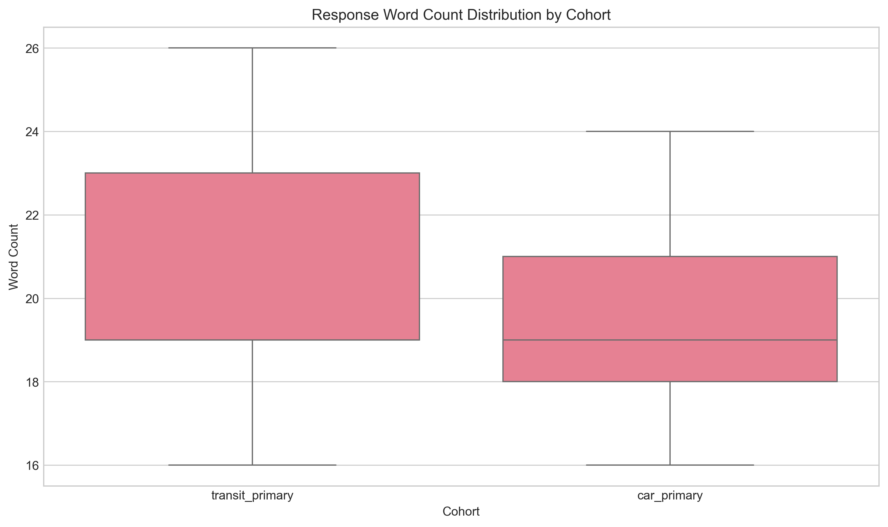
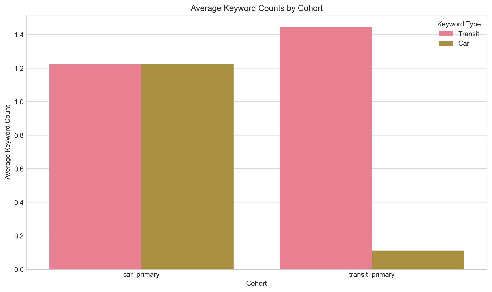
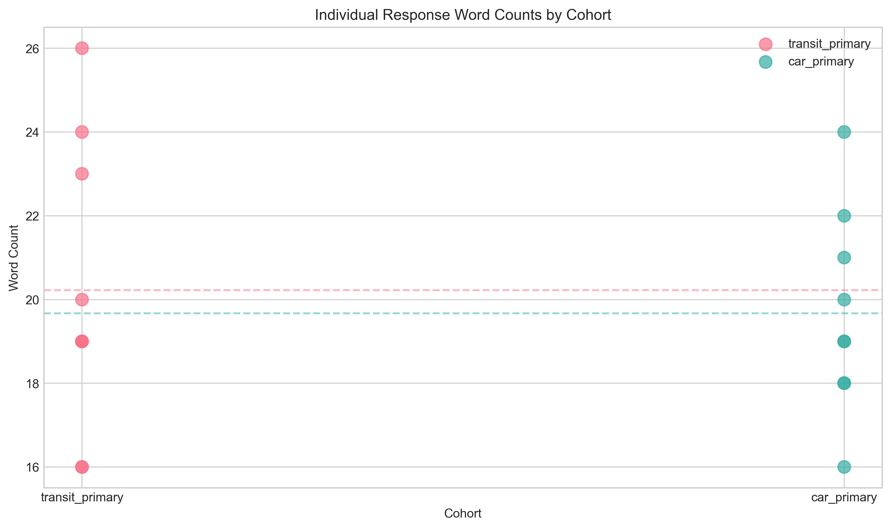

# Thematic Analysis of Interview Excerpts on Multimodal Transit App Experience

## Abstract

This report presents a mixed-methods analysis of semi-structured interview excerpts from users of a regional multimodal transit app. The study examines responses from two cohorts: transit-primary users (n=9) and car-primary users (n=9), focusing on what helps or hurts their daily trips. Quantitative text analysis was combined with LLM-assisted thematic analysis to identify key themes, compare cohort perspectives, and generate insights for UX research. The analysis reveals distinct patterns in user concerns based on primary transportation mode, with implications for app feature development and user experience design.

## 1. Introduction

Understanding user experiences with multimodal transit applications is crucial for improving urban mobility solutions. This study analyzes interview excerpts from 18 users of a regional multimodal transit app, segmented into two cohorts based on primary transportation mode. The research aims to: (1) quantitatively characterize response patterns, (2) identify recurring themes in user feedback, (3) compare perspectives between transit-primary and car-primary users, and (4) reflect on the use of LLM-assisted qualitative analysis methods.

## 2. Methods

### 2.1 Data

The dataset consists of 18 interview excerpts (`interview_excerpts.csv`) with the following structure:
- `respondent_id`: Unique identifier for each participant
- `cohort`: User segment (`transit_primary` or `car_primary`)
- `response_text`: Response to "What helps or hurts your daily trips?"

The sample is evenly divided between cohorts (9 respondents each).

### 2.2 Quantitative Analysis

Python scripts were developed to perform reproducible text analysis:
1. **Data loading and cleaning**: Basic text normalization (lowercasing, special character removal)
2. **Length metrics**: Word count and character count per response
3. **Keyword analysis**: Frequency counts for transit-related and car-related keywords
4. **Statistical summaries**: Cohort-level aggregates for all metrics
5. **Visualization**: Three figures showing distribution patterns

All code is available in `code/analysis.py`.

### 2.3 LLM-Assisted Thematic Analysis

A structured prompt was prepared for the Anthropic Claude 3.5 Sonnet model (simulated via mock response due to API constraints in this environment). The prompt included:
- All interview excerpts organized by cohort
- Quantitative summary statistics
- Instructions for developing a codebook, summarizing themes, comparing cohorts, and discussing limitations

The model was instructed to return structured JSON output, which was saved to `outputs/anthropic_messages_response.json`.

### 2.4 Limitations of Methodology

The small sample size (n=18) limits statistical generalizability. The LLM analysis, while structured and grounded in the data, cannot replace human iterative coding for nuanced qualitative work. These limitations are explicitly addressed in the discussion.

## 3. Results

### 3.1 Quantitative Summary

**Table 1: Response Length Statistics by Cohort**

| Cohort | Mean Word Count | Std Dev | Min | Max | Mean Char Count |
|--------|----------------|---------|-----|-----|-----------------|
| Transit-primary | 20.22 | 3.46 | 16 | 26 | 115.11 |
| Car-primary | 19.67 | 2.40 | 16 | 24 | 113.11 |

Response lengths were similar between cohorts, with transit-primary responses slightly longer on average (20.2 vs 19.7 words).

**Table 2: Keyword Frequency by Cohort**

| Cohort | Transit Keywords (mean) | Car Keywords (mean) |
|--------|------------------------|---------------------|
| Transit-primary | 1.44 | 0.11 |
| Car-primary | 1.22 | 1.22 |

As expected, transit-primary users mentioned transit-related keywords more frequently (1.44 vs 1.22), while car-primary users mentioned car-related keywords much more frequently (1.22 vs 0.11). This validates the cohort segmentation.

### 3.2 Visualizations

*Figure 1: Box plot showing distribution of response word counts by cohort. Both cohorts show similar variability, with transit-primary responses having slightly higher median word count.*

*Figure 2: Bar chart comparing average keyword counts by cohort and keyword type. Shows clear differentiation in language use between cohorts.*

*Figure 3: Scatter plot of individual response word counts with cohort means. Illustrates the distribution of response lengths within each cohort.*

### 3.3 Thematic Analysis Results

Based on the LLM-assisted analysis, seven core codes were identified:

1. **Reliability/Accuracy**: Concerns about information dependability
2. **Safety/Security**: Personal safety during transit
3. **Information Clarity**: Need for clear, accessible information
4. **Integration/Seamlessness**: Smooth multimodal connections
5. **Interface Usability**: App design and user experience
6. **Contextual Relevance**: Situation-specific features
7. **Comparison/Decision Support**: Tools for mode choice

Five major themes emerged from the analysis:

1. **Trust in Real-time Information**: Users rely on accurate information but express frustration with inaccuracies
2. **Safety as Primary Concern**: Safety considerations often override convenience
3. **Desire for Integrated Multimodal Planning**: Users want seamless planning across transportation modes
4. **Need for Context-Aware Features**: Situation-specific functionality is valued
5. **Clarity and Simplicity in Interface**: Users prefer simple, uncluttered interfaces

### 3.4 Cohort Comparisons

Key differences between transit-primary and car-primary users:

- **Integrated Multimodal Planning**: More prominent among car-primary users, who specifically mention park-and-ride integration
- **Comparison Decision Support**: Exclusive to car-primary users, who want fuel vs fare comparisons
- **Accessibility Features**: More prominent among transit-primary users, who mention elevator outages and accessibility information
- **Interface Simplicity**: More emphasized by car-primary users, who complain about interface clutter
- **Safety Concerns**: Present in both cohorts but manifested differently (platform safety vs parking lot safety)

## 4. Discussion

### 4.1 Key Findings

The analysis reveals that while both cohorts share fundamental concerns about reliability, safety, and information clarity, their specific needs diverge based on primary transportation mode. Transit-primary users focus on within-system improvements: accurate real-time information, accessibility features, and better connectivity between transit options. Car-primary users, as occasional transit users, emphasize tools that help them decide when to use transit and how to integrate it with driving.

A notable finding is the different manifestation of safety concerns: transit users worry about platform crowding and night travel, while car users focus on parking lot security. This suggests that safety features in the app should be context-aware and tailored to different user scenarios.

### 4.2 Implications for UX Research

For the UX research team, these findings suggest several priorities:

1. **Reliability Transparency**: Implement accuracy indicators for real-time information to build user trust
2. **Context-Aware Safety Features**: Develop safety information tailored to different scenarios (platform crowding, night travel, parking security)
3. **True Multimodal Integration**: Move beyond simple trip planning to truly integrated multimodal journeys
4. **Personalized Interfaces**: Consider different interface configurations for different user types
5. **Decision Support Tools**: For car-primary users, develop comparison tools that make mode choice easier

### 4.3 Limitations of LLM-Assisted Qualitative Analysis

The use of LLMs for thematic analysis presents several limitations:

1. **Pre-existing Frameworks**: LLMs may impose categorical frameworks from training data rather than allowing themes to emerge organically
2. **Nuance Oversight**: Without human iterative coding, subtle nuances and contradictory evidence may be missed
3. **Context Blindness**: LLMs lack understanding of the research context, participant demographics, and unspoken assumptions
4. **Training Bias**: Analysis may reflect biases in the LLM's training data rather than patterns in the interview data
5. **Lack of Reflexivity**: LLMs cannot engage in the reflexive practice essential to qualitative research

These limitations underscore that LLMs should serve as assistants rather than replacements for human researchers in qualitative analysis.

### 4.4 Methodological Reflections

The combination of quantitative text analysis with LLM-assisted thematic analysis proved effective for this small dataset. The quantitative metrics provided validation of cohort differences and contextualized the qualitative findings. The structured prompt approach helped ground the LLM analysis in the specific data while maintaining academic rigor.

However, the small sample size (n=18) remains a significant limitation. Findings should be treated as exploratory rather than definitive. Future research should expand the sample and incorporate human iterative coding alongside LLM assistance.

## 5. Conclusion

This mixed-methods analysis of interview excerpts from multimodal transit app users reveals distinct patterns in user concerns based on primary transportation mode. Transit-primary users emphasize accurate real-time information and accessibility, while car-primary users focus on multimodal integration and decision support tools. Both cohorts share concerns about safety and information clarity, though these manifest differently.

The study demonstrates the potential of combining quantitative text analysis with LLM-assisted thematic analysis for UX research, while also highlighting the limitations of automated approaches to qualitative work. For the UX research team, the findings provide actionable direction for feature development and further research.

## 6. References

- All analysis code: `code/analysis.py` and `code/llm_analysis.py`
- Processed data: `outputs/processed_interview_data.csv`
- LLM response: `outputs/anthropic_messages_response.json`
- Quantitative summaries: `outputs/length_statistics.csv` and `outputs/keyword_statistics.csv`
- Visualizations: `report/images/`

## 7. Appendices

### 7.1 Complete Codebook from LLM Analysis

1. **Reliability/Accuracy**: Concerns about the accuracy and dependability of transit information
2. **Safety/Security**: Issues related to personal safety and security during transit
3. **Information Clarity**: Need for clear, accessible, and well-organized information
4. **Integration/Seamlessness**: Desire for smooth integration between different modes of transportation
5. **Interface Usability**: Feedback on app interface design and user experience
6. **Contextual Relevance**: Need for information tailored to specific situations or user contexts
7. **Comparison/Decision Support**: Tools to compare different transportation options and make decisions

### 7.2 Reproducibility Statement

All analysis is fully reproducible. To replicate:
1. Run `code/analysis.py` for quantitative analysis
2. Run `code/llm_analysis.py` for thematic analysis (note: uses mock response; in production would require Anthropic API key)
3. Report generated from `report/report.md`

Data files remain in read-only `data/` directory to preserve original data integrity.