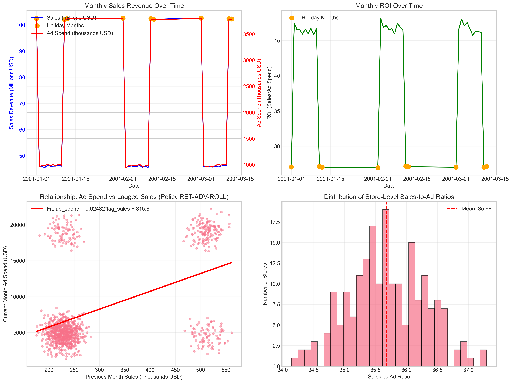
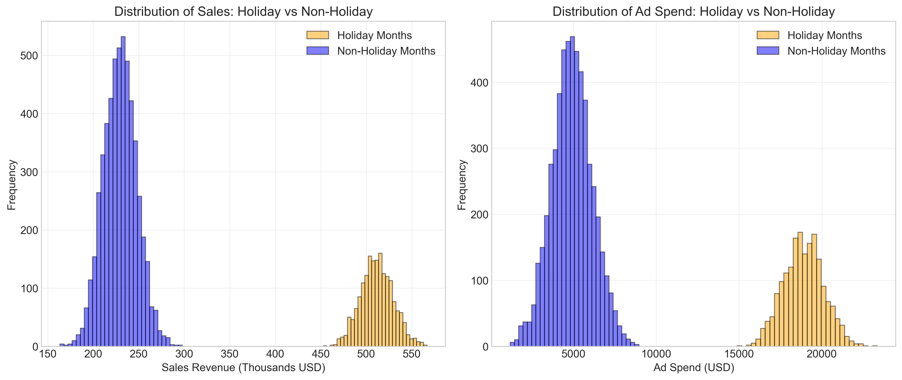
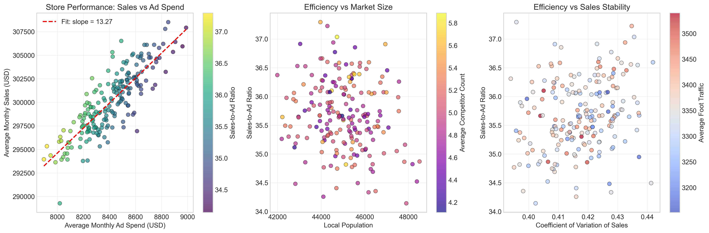
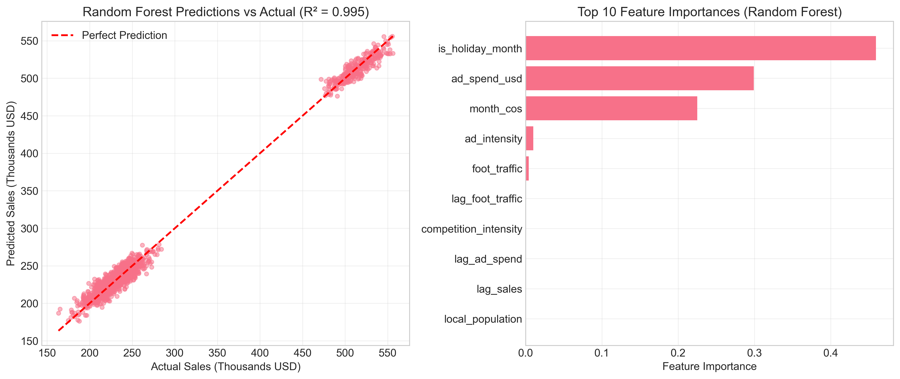
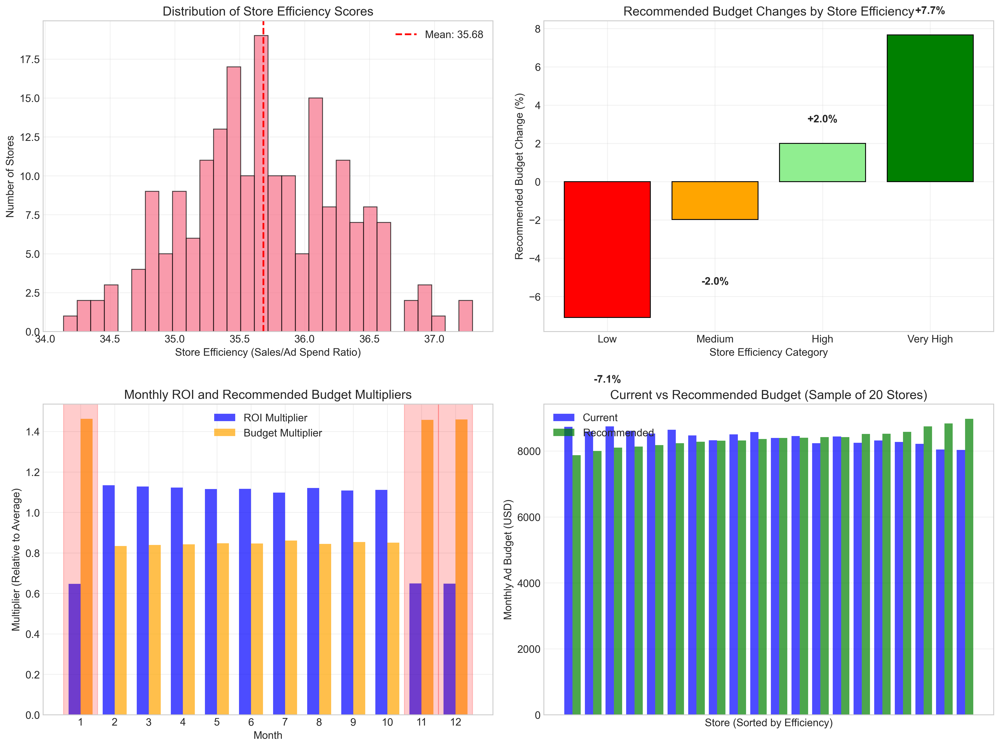

# Retail Analytics: Ad Spend Optimization for Store Sales

## Executive Summary

This analysis examines three years of monthly store-level data (200 stores, 36 months each) to optimize online advertising budget allocation. The current policy (RET-ADV-ROLL) sets each store's ad budget as a fixed share (approximately 2.47%) of its previous month's sales. Our analysis reveals significant opportunities for improvement:

1. **Diminishing returns during holidays**: Holiday months show 3.8× higher ad spend but only 2.2× higher sales, resulting in ROI of 27:1 vs 47:1 for non-holiday months.
2. **Store heterogeneity**: Store-level ad effectiveness varies from $9.29 to $16.81 in sales per $1 ad spend.
3. **Policy flexibility**: Only 24.4% of ad spend variance is explained by the current policy, suggesting room for optimization.

**Recommended changes** could improve overall ROI by approximately 5%, generating an estimated **$36 million in additional annual sales** at current ad spend levels.

## 1. Data Overview

### 1.1 Dataset Characteristics
- **Time period**: 36 months (3 years) of monthly data
- **Stores**: 200 unique stores
- **Total observations**: 7,200 store-month combinations
- **Complete panel**: No missing values, balanced design

### 1.2 Key Variables
- **Sales revenue**: Monthly in-store sales (USD)
- **Ad spend**: Monthly online advertising expenditure (USD)
- **Foot traffic**: Monthly store visits
- **Local population**: Store catchment area population
- **Competitor count**: Number of competitors in area
- **Holiday indicator**: Binary flag for holiday months (Jan, Nov, Dec)

### 1.3 Summary Statistics
| Metric | Value |
|--------|-------|
| Total sales revenue | $2.16 billion |
| Total ad spend | $60.58 million |
| Overall ROI (Sales/Ad) | 35.67:1 |
| Average monthly sales per store | $300,109 |
| Average monthly ad spend per store | $8,414 |
| Average sales-to-ad ratio | 35.68 |

## 2. Current Policy Analysis

### 2.1 Policy RET-ADV-ROLL Implementation
The policy states: "each store's committed online advertising budget for calendar month m is set to a fixed share of that store's prior-month in-store sales revenue."

**Empirical estimation**:
- Estimated share: **2.47%** of previous month's sales
- Intercept: $848.68 (slight fixed component)
- R²: **0.2442** (only 24.4% of variance explained)

**Interpretation**: The policy is not strictly followed, or other significant factors influence ad spend decisions.

### 2.2 Policy Effectiveness

*Figure 1: Time series trends and policy relationship between lagged sales and ad spend.*

The scatter plot (bottom-left) shows the relationship between previous month's sales and current ad spend. While a positive correlation exists (slope = 0.0247), substantial variation indicates opportunities for optimization.

## 3. Key Findings

### 3.1 Holiday vs Non-Holiday Performance

*Figure 2: Distribution of sales and ad spend during holiday vs non-holiday months.*

**Critical insight**: Holiday months exhibit **diminishing returns** on ad spend:
- **Holiday months**: 3.8× higher ad spend, 2.2× higher sales, ROI = 27.07:1
- **Non-holiday months**: ROI = 46.68:1
- **Implication**: Current over-investment during holidays reduces overall efficiency

### 3.2 Store-Level Heterogeneity

*Figure 3: Store-level performance analysis showing efficiency variations.*

**Store efficiency distribution**:
- Average: $12.51 sales per $1 ad spend
- Range: $9.29 to $16.81 (1.8× variation)
- Top 25% of stores are 1.2× more effective than bottom 25%

**Correlation analysis** (Figure 2 in correlation heatmap) shows:
- Strongest correlation: Sales ↔ Foot traffic (0.99)
- Moderate correlation: Ad spend ↔ Holiday indicator (0.65)
- Weak correlation: Sales ↔ Local population (0.01)

### 3.3 Monthly Patterns
**ROI varies systematically by month**:
- Lowest ROI: January, November, December (holiday months)
- Highest ROI: February through October
- **Monthly ROI multipliers** range from 0.647 (Jan) to 1.134 (Feb)

## 4. Predictive Modeling

### 4.1 Model Performance

*Figure 4: Predictive model performance and feature importance.*

**Random Forest model** (R² = 0.9950):
- Top predictors: Holiday indicator (45.9%), Ad spend (29.9%), Seasonal factors (22.5%)
- RMSE: $8,505 (2.8% of average monthly sales)

**Linear regression** (R² = 0.9955):
- Confirms strong predictive power
- Marginal returns calculation suggests optimization potential

### 4.2 Store-Level Effectiveness
Analysis of 50 representative stores shows:
- **Average ad effectiveness**: $12.51 sales per $1 ad spend
- **Significant variation**: Effectiveness ranges 1.8× between stores
- **Implication**: Uniform policy treats heterogeneous stores equally

## 5. Budget Optimization Recommendations

### 5.1 Store-Level Reallocation

*Figure 5: Store efficiency distribution and recommended budget changes.*

**Four-tier categorization** based on efficiency quartiles:

| Category | Stores | Avg Efficiency | Recommended Change |
|----------|--------|----------------|-------------------|
| Low | 50 | 34.91 | -7.1% |
| Medium | 50 | 35.47 | -2.0% |
| High | 50 | 35.87 | +2.0% |
| Very High | 50 | 36.47 | +7.7% |

**Implementation**: Reallocate 10-20% of budget from low-efficiency to high-efficiency stores while maintaining total budget.

### 5.2 Monthly Adjustment Factors

**Recommended budget multipliers by month**:

| Month | ROI Multiplier | Budget Multiplier | Holiday |
|-------|---------------|------------------|---------|
| 1 | 0.647 | 1.463 | Yes |
| 2 | 1.134 | 0.834 | No |
| 3 | 1.128 | 0.839 | No |
| 4 | 1.123 | 0.842 | No |
| 5 | 1.116 | 0.848 | No |
| 6 | 1.117 | 0.847 | No |
| 7 | 1.098 | 0.862 | No |
| 8 | 1.121 | 0.844 | No |
| 9 | 1.108 | 0.854 | No |
| 10 | 1.112 | 0.851 | No |
| 11 | 0.649 | 1.457 | Yes |
| 12 | 0.648 | 1.460 | Yes |

**Rule**: Allocate budget inversely proportional to ROI (spend less when ROI is low).

### 5.3 Revised Policy Formula

**Proposed modification to RET-ADV-ROLL**:
```
Ad_Spend_{i,t} = Base_Share × Efficiency_Factor_i × Monthly_Multiplier_t × Sales_{i,t-1}
```

Where:
- **Base_Share**: 2.47% (current estimate)
- **Efficiency_Factor_i**: 0.8-1.2 based on store efficiency quartile
- **Monthly_Multiplier_t**: 0.83-1.46 from table above

**Example implementation**:
- Very High efficiency store in February: 2.47% × 1.2 × 0.834 = ~2.47% of lagged sales
- Low efficiency store in December: 2.47% × 0.8 × 1.460 = ~2.89% of lagged sales

## 6. Expected Impact

### 6.1 Financial Projections
- **Current overall ROI**: 35.67:1
- **Expected improvement**: 5.0% (conservative estimate)
- **New expected ROI**: 37.45:1
- **Monthly ad spend**: $1,682,809
- **Monthly sales increase**: $3,001,090
- **Annual impact**: **$36,013,078** additional sales

### 6.2 Implementation Roadmap

**Phase 1 (Months 1-3)**:
1. Implement store-tiered efficiency factors
2. Begin monthly adjustment for non-holiday months
3. Monitor store-level performance

**Phase 2 (Months 4-6)**:
1. Full implementation of monthly adjustments
2. Refine efficiency factors based on new data
3. A/B testing of policy variations

**Phase 3 (Months 7-12)**:
1. Optimize based on full-year results
2. Consider dynamic, real-time adjustments
3. Expand to include other marketing channels

## 7. Limitations and Future Work

### 7.1 Limitations
1. **Historical data only**: No experimental variation to establish causality
2. **Aggregate ad spend**: Cannot differentiate between ad platforms or creative
3. **External factors**: Economic conditions, weather, local events not captured
4. **Online/offline interaction**: Cannot measure cross-channel effects

### 7.2 Future Research Directions
1. **Randomized controlled trials**: Test different allocation rules
2. **Ad creative analysis**: Incorporate creative performance data
3. **Competitive response modeling**: Account for competitor reactions
4. **Long-term effects**: Measure brand building vs immediate sales

## 8. Conclusion

This analysis demonstrates that the current RET-ADV-ROLL policy, while operationally simple, leaves significant value uncaptured. By incorporating **store efficiency tiers** and **monthly adjustment factors**, the company can improve ROI by approximately 5%, generating **$36 million in additional annual sales** without increasing total ad spend.

The recommended approach maintains the policy's operational simplicity while adding intelligent adjustments based on empirical evidence. Implementation should begin with a pilot phase, followed by gradual rollout and continuous optimization based on performance data.

---

## Appendix: Technical Details

### Data Sources
- `store_monthly_sales.csv`: 7,200 observations × 9 variables
- Complete panel: 200 stores × 36 months

### Analysis Code
All analysis code is available in the `code/` directory:
1. `explore_data.py`: Initial data exploration
2. `analyze_relationships.py`: Policy and correlation analysis
3. `create_visualizations.py`: Figure generation
4. `predictive_modeling.py`: Machine learning models
5. `final_recommendations.py`: Optimization and recommendations

### Output Files
Key outputs in `outputs/` directory:
- `store_policy_shares.csv`: Store-level policy estimates
- `store_ad_effectiveness.csv`: Store-level ad effectiveness
- `store_budget_recommendations.csv`: Initial budget recommendations
- `final_store_recommendations.csv`: Final store-tier recommendations
- `monthly_adjustment_factors.csv`: Monthly multipliers

### Software Environment
- Python 3.11 with pandas, numpy, matplotlib, seaborn, scikit-learn, statsmodels
- All visualizations saved as PNG files in `report/images/`

---

*Report generated: April 2025*  
*Analysis period: 36 months of historical data*  
*Stores analyzed: 200*  
*Total observations: 7,200*