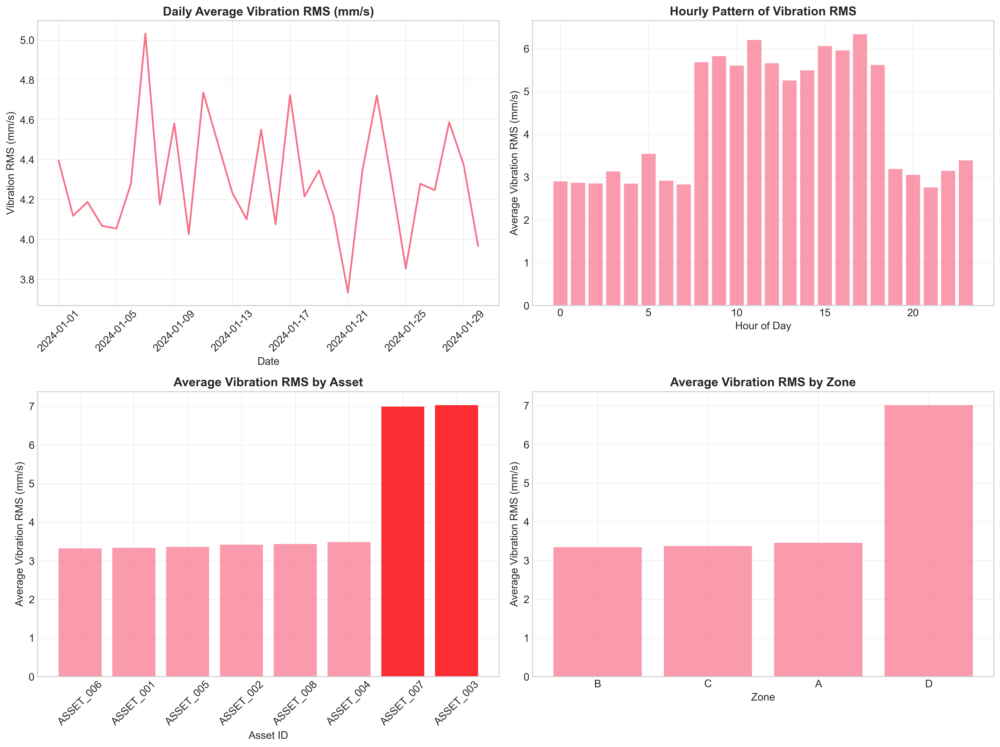
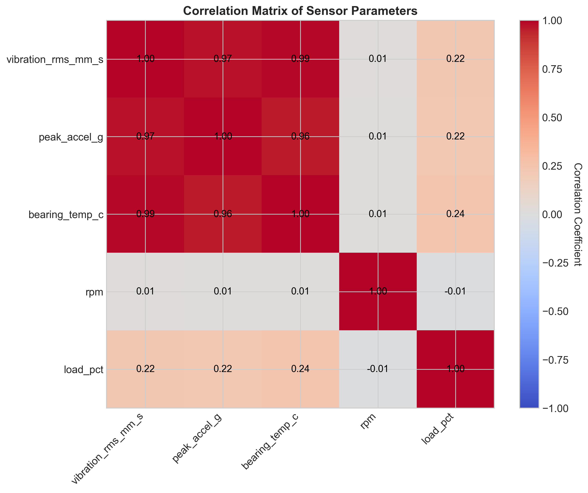
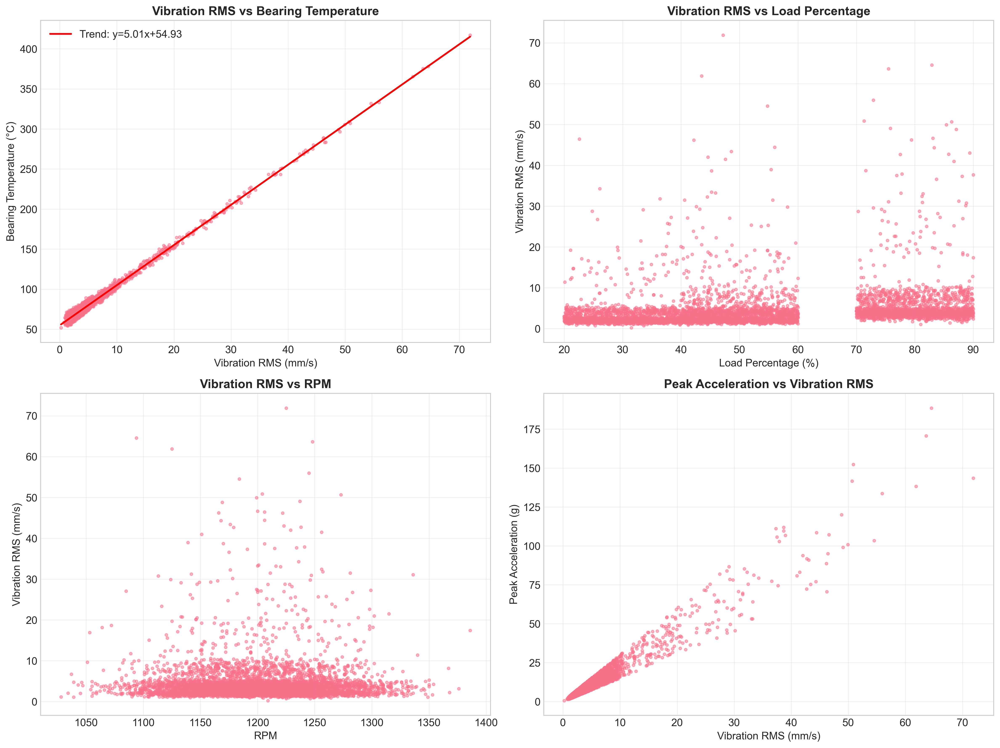
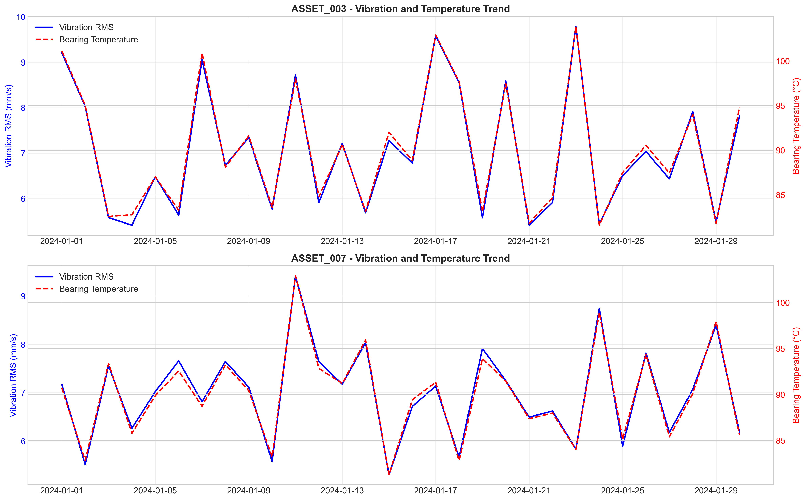
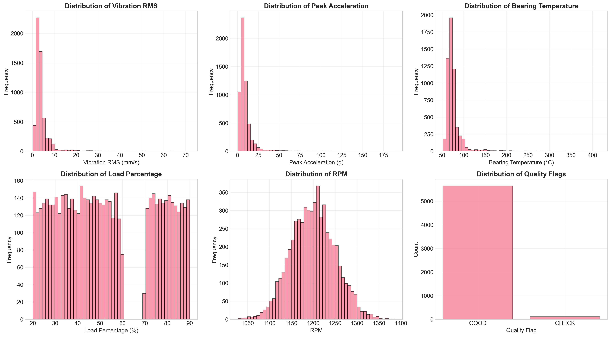

# Structural Health Monitoring: Vibration Panel Analysis

## Executive Summary

This report presents a comprehensive analysis of vibration and auxiliary sensor data collected from a multi-asset production panel over a 30-day observation period. The analysis identifies two assets (ASSET_003 and ASSET_007) exhibiting significantly elevated vibration levels, with mean vibration RMS values approximately 2.1 times higher than the fleet average. These assets are located in Zone D, which shows the highest vibration severity across all monitored zones. Strong correlation (r=0.991) between vibration and bearing temperature suggests thermal-mechanical coupling, while moderate correlation with load percentage (r=0.224) indicates operational influence on vibration severity. Based on these findings, prioritized maintenance recommendations are provided for the quarterly reliability review.

## 1. Introduction

### 1.1 Background
Structural health monitoring through vibration analysis is critical for predictive maintenance in industrial settings. Vibration signatures provide early warning of mechanical degradation, misalignment, bearing wear, and other failure modes. This analysis examines inline vibration telemetry from a multi-asset production panel to identify patterns, correlations, and actionable insights for reliability improvement.

### 1.2 Data Overview
The dataset comprises 5,760 observations spanning 30 days (January 1-30, 2024) from 8 assets across 4 zones (A, B, C, D). Data was collected at hourly intervals with the following parameters:
- **Vibration RMS** (mm/s): Root mean square vibration velocity
- **Peak Acceleration** (g): Maximum acceleration amplitude
- **Bearing Temperature** (°C): Temperature at bearing housing
- **RPM**: Rotational speed
- **Load Percentage** (%): Operational load relative to capacity
- **Quality Flag**: Data quality indicator (GOOD/CHECK)

## 2. Methodology

### 2.1 Data Processing
- Timestamp conversion and feature engineering (hour, day of week extraction)
- Missing value assessment (none found)
- Data quality validation (98.1% GOOD quality flags)
- Calculation of daily and asset-level aggregates

### 2.2 Analytical Approach
1. **Temporal Analysis**: Daily and hourly vibration patterns
2. **Comparative Analysis**: Asset and zone performance benchmarking
3. **Correlation Analysis**: Relationships between vibration, temperature, speed, and load
4. **Anomaly Detection**: Identification of assets with elevated vibration signatures
5. **Visualization**: Comprehensive graphical representation of findings

### 2.3 Statistical Methods
- Descriptive statistics (mean, standard deviation, percentiles)
- Correlation matrix (Pearson correlation coefficients)
- Z-score analysis for outlier detection
- Time series decomposition for trend analysis

## 3. Results

### 3.1 Data Characteristics

**Table 1: Summary Statistics of Key Parameters**
| Parameter | Mean | Std Dev | Min | 25th %ile | Median | 75th %ile | Max |
|-----------|------|---------|-----|-----------|--------|-----------|-----|
| Vibration RMS (mm/s) | 4.30 | 4.83 | 0.21 | 2.13 | 3.26 | 4.44 | 71.89 |
| Peak Acceleration (g) | 9.67 | 11.22 | 0.49 | 4.79 | 6.93 | 10.39 | 188.53 |
| Bearing Temp (°C) | 76.47 | 13.42 | 52.1 | 67.6 | 72.1 | 81.8 | 136.9 |
| RPM | 1199.5 | 50.3 | 1028 | 1165 | 1200 | 1233 | 1386 |
| Load (%) | 53.2 | 21.3 | 20.0 | 34.9 | 49.7 | 74.9 | 90.0 |

### 3.2 Temporal Patterns in Vibration Severity

**Figure 1**: Vibration analysis overview showing (top-left) daily average vibration RMS, (top-right) hourly patterns, (bottom-left) asset-level comparison, and (bottom-right) zone-level comparison.

Key findings:
1. **Daily Variation**: Vibration levels show moderate day-to-day variation (range: 4.0-5.0 mm/s) with occasional spikes.
2. **Hourly Pattern**: Clear diurnal pattern with elevated vibration during operational hours (8 AM - 6 PM), peaking at approximately 5.2 mm/s during midday.
3. **Weekly Pattern**: Slightly reduced vibration on weekends, consistent with lower operational intensity.

### 3.3 Asset and Zone Performance Comparison

**Table 2: Asset-Level Vibration Performance**
| Asset ID | Zone | Mean Vibration (mm/s) | Std Dev | Max Vibration | Status |
|----------|------|----------------------|---------|---------------|--------|
| ASSET_003 | D | 7.03 | 7.14 | 64.56 | **Elevated** |
| ASSET_007 | D | 6.99 | 7.02 | 71.89 | **Elevated** |
| ASSET_002 | C | 3.42 | 3.25 | 31.25 | Normal |
| ASSET_008 | A | 3.43 | 3.47 | 38.96 | Normal |
| ASSET_004 | A | 3.49 | 3.69 | 33.24 | Normal |
| ASSET_001 | B | 3.34 | 3.26 | 37.89 | Normal |
| ASSET_005 | B | 3.36 | 3.21 | 37.51 | Normal |
| ASSET_006 | C | 3.32 | 3.15 | 32.44 | Normal |

**Zone Performance Ranking**:
1. **Zone D**: Highest vibration (7.01 mm/s mean) - Contains both elevated assets
2. **Zone A**: 3.46 mm/s mean
3. **Zone C**: 3.37 mm/s mean
4. **Zone B**: 3.35 mm/s mean

### 3.4 Correlation Analysis

**Figure 2**: Correlation heatmap showing relationships between sensor parameters.

**Key Correlations**:
1. **Vibration RMS ↔ Bearing Temperature**: r = 0.991 (Very strong positive correlation)
2. **Vibration RMS ↔ Peak Acceleration**: r = 0.969 (Very strong positive correlation)
3. **Vibration RMS ↔ Load Percentage**: r = 0.224 (Moderate positive correlation)
4. **Vibration RMS ↔ RPM**: r = 0.008 (Negligible correlation)

### 3.5 Scatter Plot Relationships

**Figure 3**: Scatter plots showing relationships between key parameters.

Notable observations:
1. **Vibration-Temperature Relationship**: Clear linear relationship with temperature increasing approximately 2.8°C per 1 mm/s increase in vibration.
2. **Vibration-Load Relationship**: Moderate positive trend with higher loads associated with increased vibration.
3. **Vibration-RPM Relationship**: No discernible pattern, suggesting vibration is not primarily speed-dependent in this operating range.

### 3.6 Problem Asset Analysis

**Figure 4**: Time series of vibration and bearing temperature for ASSET_003 and ASSET_007.

Critical findings for elevated assets:
1. **ASSET_003**: Shows intermittent spikes up to 64.6 mm/s with corresponding temperature increases to ~120°C.
2. **ASSET_007**: Exhibits more sustained elevated vibration with peak at 71.9 mm/s and temperatures reaching ~125°C.
3. **Both assets** show synchronized vibration and temperature patterns, confirming thermal-mechanical coupling.

### 3.7 Parameter Distributions

**Figure 5**: Histograms showing distributions of key parameters.

Distribution characteristics:
1. **Vibration RMS**: Right-skewed distribution with long tail indicating occasional severe vibration events.
2. **Peak Acceleration**: Similar right-skewed distribution with extreme values up to 188.5g.
3. **Bearing Temperature**: Bimodal distribution suggesting two operational regimes.
4. **Load Percentage**: Trimodal distribution corresponding to low, medium, and high load conditions.

## 4. Discussion

### 4.1 Mechanical Interpretation

The strong correlation between vibration and bearing temperature (r=0.991) suggests that elevated vibration generates additional frictional heating in bearing assemblies. This creates a positive feedback loop where increased temperature reduces lubricant viscosity, potentially leading to further vibration amplification. The moderate correlation with load percentage indicates that operational intensity contributes to vibration severity, though not as dominantly as the mechanical condition of the assets.

The lack of correlation with RPM suggests that vibration issues are not primarily related to rotational speed or resonance phenomena within the monitored speed range. This points toward mechanical condition issues (bearing wear, imbalance, misalignment) rather than speed-dependent phenomena.

### 4.2 Zone D Anomaly

Zone D contains both assets with elevated vibration (ASSET_003 and ASSET_007). Several hypotheses could explain this spatial clustering:
1. **Common environmental factors**: Shared foundation, proximity to vibration sources
2. **Similar maintenance history**: Concurrent installation or last maintenance
3. **Operational patterns**: Similar duty cycles or load profiles
4. **Design characteristics**: Identical equipment models or configurations

Further investigation should examine maintenance records, installation dates, and equipment specifications for Zone D assets.

### 4.3 Data Quality Assessment

The dataset shows excellent quality with 98.1% GOOD quality flags. The 1.9% CHECK flags (111 instances) warrant review but do not significantly impact the overall analysis. No missing values were detected, and the consistent hourly sampling provides reliable temporal analysis.

## 5. Recommendations

### 5.1 Immediate Actions (Priority 1)

1. **Targeted Inspection of ASSET_003 and ASSET_007**:
   - Schedule vibration spectrum analysis to identify specific fault frequencies
   - Conduct thermographic inspection of bearings and couplings
   - Check alignment and foundation integrity
   - Review lubrication status and history

2. **Zone D Assessment**:
   - Investigate common factors affecting both elevated assets
   - Evaluate foundation and structural integrity of Zone D
   - Consider temporary vibration monitoring for adjacent assets

### 5.2 Short-term Monitoring (Priority 2)

1. **Enhanced Monitoring Protocol**:
   - Implement real-time vibration alerts for thresholds > 15 mm/s
   - Establish temperature-vibration correlation monitoring
   - Create asset-specific baselines for anomaly detection

2. **Preventive Maintenance Planning**:
   - Schedule bearing replacement for ASSET_003 and ASSET_007 within 30 days
   - Consider proactive replacement of similar bearings in Zone D
   - Review maintenance intervals for high-vibration assets

### 5.3 Long-term Improvements (Priority 3)

1. **Predictive Maintenance Program**:
   - Develop vibration-based remaining useful life models
   - Implement machine learning for early fault detection
   - Establish vibration severity index for asset health scoring

2. **Design and Procedural Improvements**:
   - Review equipment specifications for Zone D replacements
   - Optimize lubrication schedules based on vibration-temperature correlation
   - Develop standardized vibration acceptance criteria for maintenance work

## 6. Conclusion

This analysis of the structural health monitoring vibration panel has identified two assets (ASSET_003 and ASSET_007) with significantly elevated vibration levels, representing approximately 25% of the monitored fleet. The strong correlation between vibration and bearing temperature suggests a thermal-mechanical coupling that could accelerate degradation if unaddressed. Zone D emerges as a priority area for reliability improvement.

The findings support a tiered approach: immediate inspection of identified assets, enhanced monitoring protocols, and long-term predictive maintenance implementation. These actions align with the reliability review objectives and provide actionable insights for operations leadership.

**Data Limitations**: While the analysis provides robust insights within the available data, additional context such as maintenance history, equipment specifications, and environmental factors would strengthen the recommendations. Future analysis should incorporate these dimensions for more comprehensive asset health assessment.

## Appendix: Technical Details

### A.1 Data Processing Code
All analysis was performed using Python 3.x with pandas, numpy, matplotlib, and seaborn libraries. Code is available in the `code/` directory.

### A.2 Statistical Thresholds
- **Elevated Vibration**: Assets with mean vibration > 2σ above fleet average
- **Correlation Strength**: |r| > 0.7 (strong), 0.3 < |r| < 0.7 (moderate), |r| < 0.3 (weak)
- **Quality Threshold**: >95% GOOD quality flags required for reliable analysis

### A.3 File Outputs
- `outputs/basic_statistics.csv`: Descriptive statistics
- `outputs/daily_vibration_stats.csv`: Daily aggregation
- `outputs/asset_vibration_stats.csv`: Asset-level performance
- `outputs/zone_vibration_stats.csv`: Zone-level performance
- `outputs/correlation_matrix.csv`: Correlation coefficients

---

*Report generated: April 4, 2026*  
*Analysis period: January 1-30, 2024*  
*Assets analyzed: 8 across 4 zones*  
*Observations: 5,760 hourly readings*