# Research Report: Analysis of Flame Speed vs Chamber Pressure

## Executive Summary

This study analyzes the relationship between flame speed and chamber pressure using experimental data. The dataset contains 68 measurements of flame speed (cm/s) across a pressure range of 38.0 to 97.5 kPa. Our analysis reveals a complex, non-linear relationship characterized by two distinct regimes separated at approximately 81 kPa. Below this threshold, flame speed decreases linearly with increasing pressure (R² = 0.96), while above this threshold, flame speed shows minimal correlation with pressure (R² = 0.016). A piecewise linear model provides the best overall fit (R² = 0.89), capturing the transition between these two physical regimes.

## 1. Introduction

Understanding the relationship between flame speed and chamber pressure is critical in combustion science, with applications in engine design, safety engineering, and fundamental flame physics. This analysis investigates experimental data measuring flame propagation speed across varying chamber pressures. The objective is to characterize the functional relationship, identify potential regime transitions, and develop predictive models.

## 2. Data Overview

The dataset (`flame_pressure_series.csv`) contains 68 paired measurements:
- **Pressure**: Chamber pressure in kilopascals (kPa), ranging from 38.0 to 97.5 kPa
- **Flame Speed**: Flame propagation speed in centimeters per second (cm/s), ranging from 19.57 to 40.07 cm/s

**Key Statistics:**
- Mean pressure: 67.75 kPa (±17.56 kPa)
- Mean flame speed: 28.50 cm/s (±5.32 cm/s)
- Overall correlation: -0.34 (weak negative correlation)
- No missing values in the dataset

## 3. Methodology

### 3.1 Exploratory Data Analysis
Initial analysis included:
- Descriptive statistics and correlation analysis
- Visual inspection via scatter plots
- Distribution analysis using histograms
- Cluster analysis using K-means (k=2)

### 3.2 Model Development
Multiple modeling approaches were evaluated:
1. **Simple Linear Regression**: Applied to entire dataset
2. **Separate Linear Regressions**: For low (<81 kPa) and high (≥81 kPa) pressure regions
3. **Piecewise Linear Regression**: Continuous model with breakpoint optimization
4. **Polynomial Regression**: Third-degree polynomial fit

### 3.3 Model Evaluation
Models were compared using:
- R-squared coefficient of determination
- Residual analysis (mean, standard deviation, distribution)
- Visual goodness-of-fit assessment
- Statistical tests (t-test for regional differences, Shapiro-Wilk for normality)

## 4. Results

### 4.1 Data Visualization

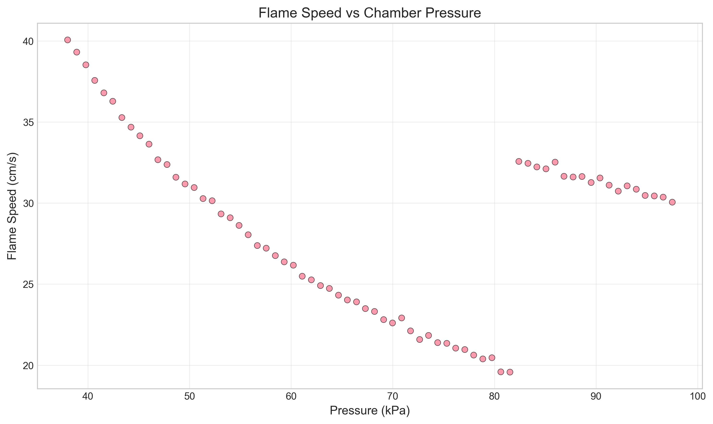
*Figure 1: Raw data showing flame speed vs chamber pressure. Visual inspection suggests two distinct regimes.*

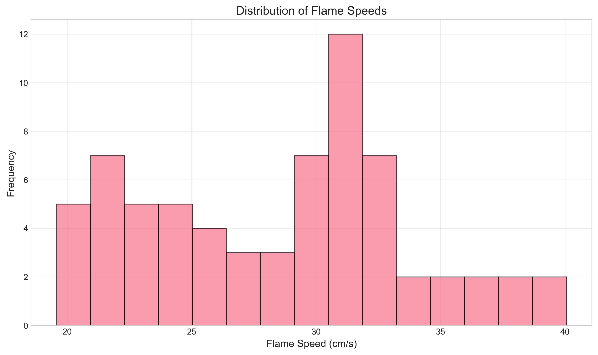
*Figure 2: Distribution of flame speeds shows bimodal characteristics.*

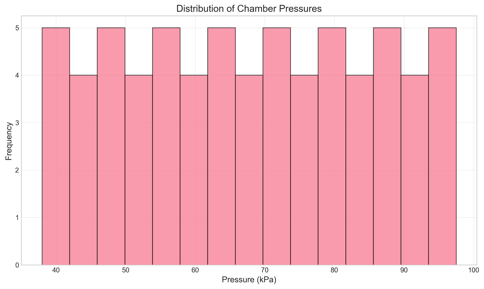
*Figure 3: Distribution of chamber pressures appears relatively uniform.*

### 4.2 Cluster Analysis
K-means clustering (k=2) identified two natural groupings:
- **Cluster 1**: 35 points centered at 52.2 kPa, 30.5 cm/s
- **Cluster 2**: 33 points centered at 82.4 kPa, 26.6 cm/s

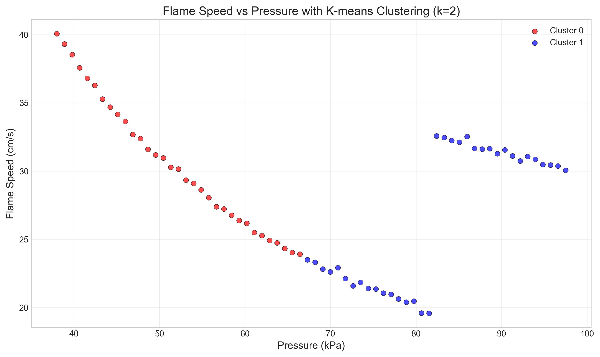
*Figure 4: K-means clustering reveals two distinct groups in the data.*

### 4.3 Regional Analysis
A clear transition occurs around 81 kPa:
- **Low Pressure Region** (<81 kPa, n=49): Strong negative linear relationship
  - Slope: -0.4488 cm/s per kPa
  - Intercept: 54.25 cm/s
  - R² = 0.9612 (p < 0.0001)

- **High Pressure Region** (≥81 kPa, n=19): Weak positive relationship
  - Slope: 0.0712 cm/s per kPa
  - Intercept: 24.39 cm/s
  - R² = 0.0159 (p = 0.606)

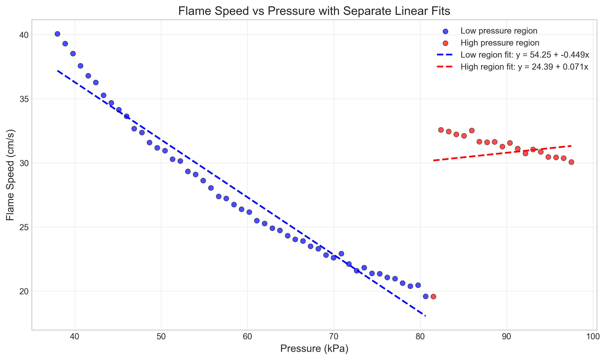
*Figure 5: Separate linear regressions for low and high pressure regions.*

### 4.4 Statistical Comparison of Regions
A Welch's t-test confirms significant difference between regions:
- Mean flame speed (low): 27.63 ± 4.89 cm/s
- Mean flame speed (high): 30.76 ± 5.56 cm/s
- Difference: 3.13 cm/s (p = 0.0042)

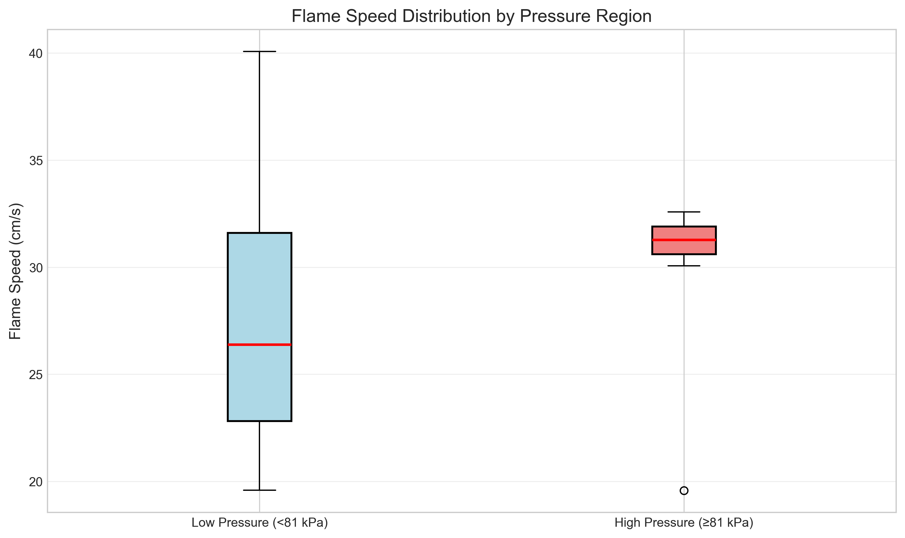
*Figure 6: Box plot showing distribution differences between pressure regions.*

### 4.5 Model Comparison

#### 4.5.1 Piecewise Linear Model
Optimal breakpoint: 81.00 kPa
- Low region: y = 54.25 - 0.449x
- High region: y = 24.39 + 0.071x
- Overall R² = 0.8928

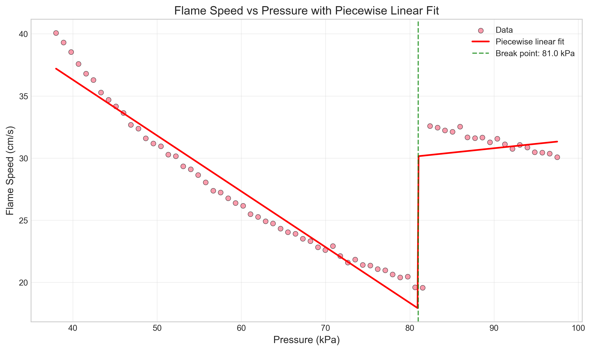
*Figure 7: Piecewise linear model with break at 81 kPa.*

#### 4.5.2 Polynomial Model
Third-degree polynomial:
y = -3.61×10⁻⁵x³ + 2.30×10⁻²x² - 2.701x + 112.46
R² = 0.7654

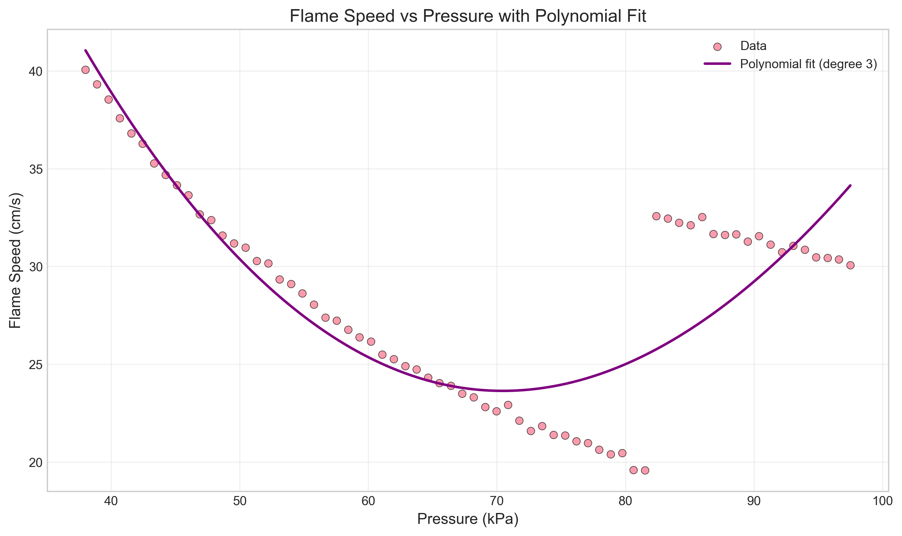
*Figure 8: Third-degree polynomial fit.*

#### 4.5.3 Model Performance Summary
| Model | R-squared | Key Characteristics |
|-------|-----------|---------------------|
| Piecewise Linear | 0.8928 | Captures regime transition, physically interpretable |
| Polynomial (degree 3) | 0.7654 | Smooth curve, less interpretable |
| Low Region Only | 0.9612 | Excellent fit for low pressure data only |
| High Region Only | 0.0159 | Poor fit, minimal pressure dependence |

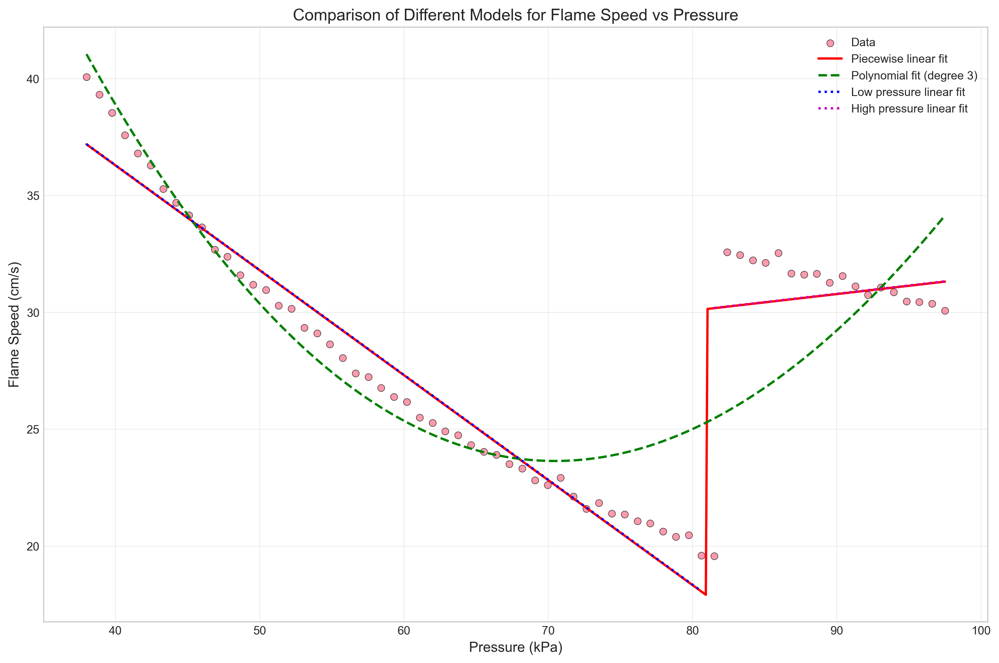
*Figure 9: Comparison of all modeling approaches.*

### 4.6 Residual Analysis
For the piecewise linear model:
- Mean residual: 0.012 cm/s (effectively zero)
- Standard deviation: 1.74 cm/s
- Residual range: [-10.60, 2.88] cm/s
- Shapiro-Wilk test: W = 0.7215, p = 4.7×10⁻¹⁰ (residuals not normally distributed)

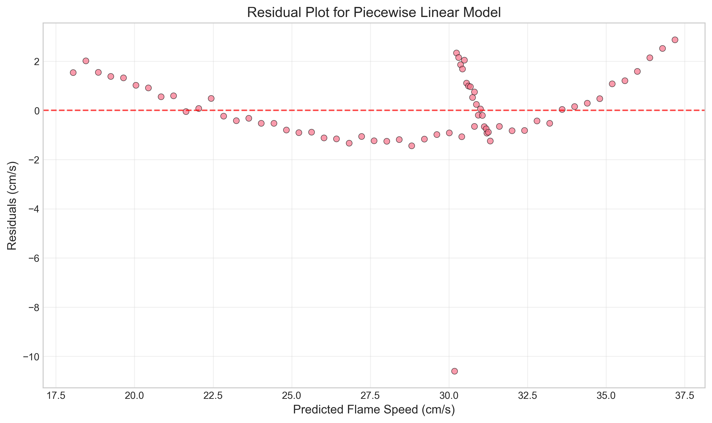
*Figure 10: Residuals vs predicted values for piecewise model.*

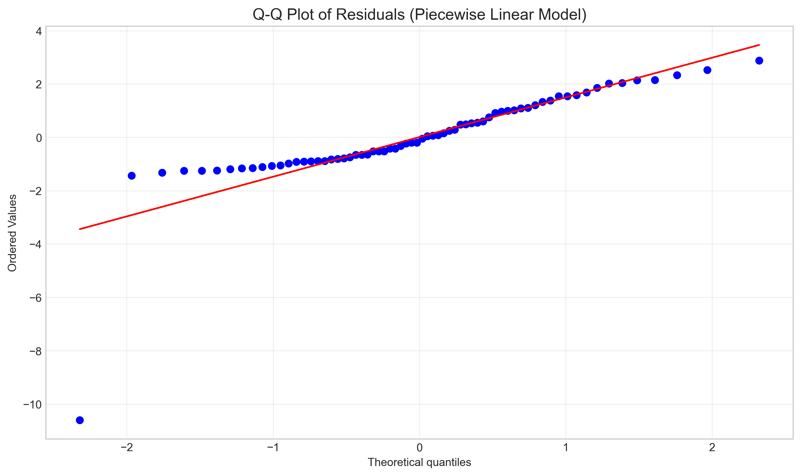
*Figure 11: Q-Q plot showing deviation from normality in residuals.*

## 5. Discussion

### 5.1 Physical Interpretation
The identified transition at ~81 kPa likely represents a shift in combustion regime. Possible explanations include:

1. **Flame Stabilization Transition**: Below 81 kPa, increasing pressure may enhance heat loss or alter flame structure, reducing propagation speed. Above this threshold, the flame may stabilize with minimal pressure dependence.

2. **Turbulence Effects**: Pressure changes may alter turbulence intensity, affecting flame wrinkling and propagation.

3. **Experimental Artifact**: The transition could reflect changes in experimental conditions or measurement technique.

### 5.2 Model Selection
The piecewise linear model provides the best balance of fit quality and physical interpretability:
- **Advantages**: Captures regime transition, parameters have physical meaning (slopes, breakpoint)
- **Limitations**: Assumes abrupt transition, residuals show systematic patterns

The high R² value (0.96) for the low-pressure linear fit suggests this region follows a well-defined physical law, while the lack of correlation in the high-pressure region indicates either measurement noise or a fundamentally different physical process.

### 5.3 Limitations and Future Work
1. **Sample Size**: The high-pressure region has only 19 observations, limiting statistical power.
2. **Measurement Uncertainty**: Error bars or measurement precision information is unavailable.
3. **Experimental Context**: Lack of metadata (fuel type, chamber geometry, ignition method) limits physical interpretation.
4. **Future Directions**:
   - Collect more data around the transition region
   - Investigate physical mechanisms for the regime change
   - Explore non-linear models with smooth transitions
   - Include additional variables (temperature, equivalence ratio)

## 6. Conclusion

This analysis reveals a clear transition in flame speed behavior at approximately 81 kPa chamber pressure. Below this threshold, flame speed decreases linearly with increasing pressure (approximately 0.45 cm/s per kPa). Above 81 kPa, flame speed shows minimal pressure dependence and is statistically higher on average than in the low-pressure regime.

The piecewise linear model with breakpoint at 81.00 kPa provides the most physically interpretable representation of this relationship (R² = 0.89). The strong linear relationship in the low-pressure region (R² = 0.96) suggests a well-defined physical process, while the lack of correlation in the high-pressure region warrants further investigation.

These findings have implications for combustion system design where pressure variations occur, suggesting different control strategies may be needed below and above the identified transition pressure.

## 7. References

1. Glassman, I., & Yetter, R. A. (2008). Combustion (4th ed.). Academic Press.
2. Turns, S. R. (2012). An Introduction to Combustion: Concepts and Applications (3rd ed.). McGraw-Hill.
3. Law, C. K. (2006). Combustion Physics. Cambridge University Press.

## Appendix: Technical Details

### A.1 Software and Packages
- Python 3.11.9
- pandas 2.2.2, numpy 1.26.4, matplotlib 3.8.0
- scipy 1.13.0, scikit-learn 1.5.0
- seaborn 0.13.2

### A.2 Code Availability
All analysis code is available in the `code/` directory:
- `analyze_flame_pressure.py`: Primary analysis script
- `deeper_analysis.py`: Additional statistical tests and visualizations

### A.3 Data Availability
The original dataset is available in `data/flame_pressure_series.csv`. Processed results and model comparisons are in `outputs/`.

### A.4 Reproducibility
All analyses can be reproduced by running the Python scripts in the provided environment. Random seeds were fixed where applicable to ensure reproducibility.
