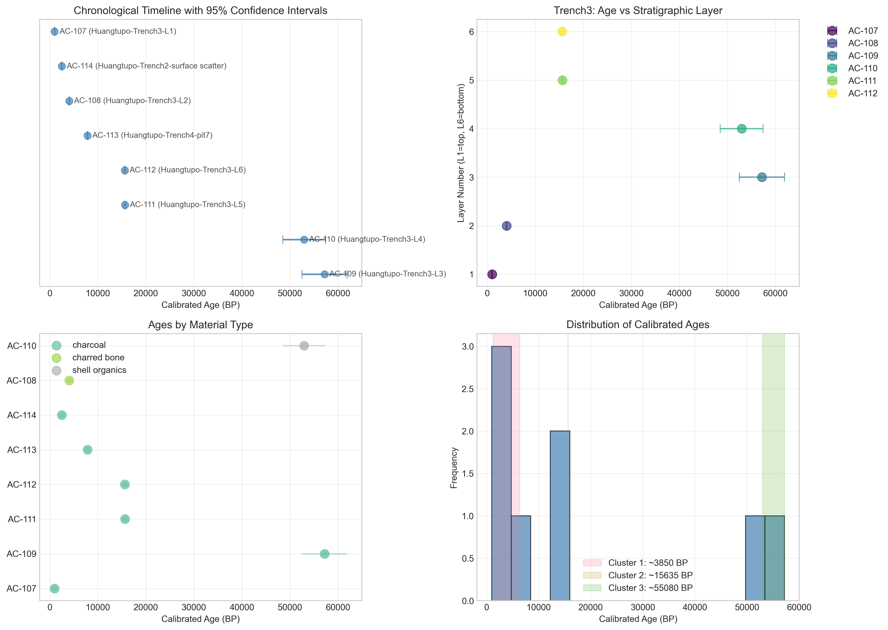
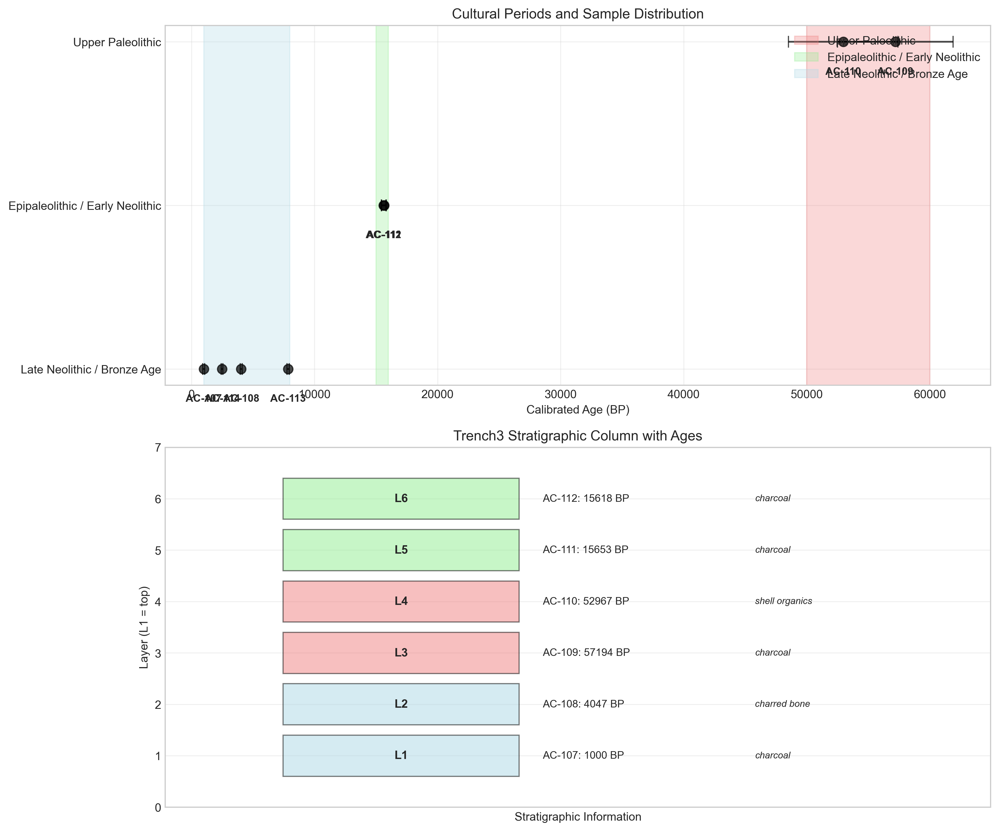

# Huangtupo Settlement Radiocarbon Chronology Report

## Executive Summary

This report presents the analysis of eight radiocarbon (¹⁴C) assays from the multi-phase Huangtupo settlement excavation. The samples span a wide chronological range from approximately 1,000 to 57,000 calibrated years before present (BP), representing multiple cultural periods from the Upper Paleolithic through the Bronze Age. Key findings include:

- **Three distinct cultural periods** identified: Upper Paleolithic (~55,000 BP), Epipaleolithic/Early Neolithic (~15,600 BP), and Late Neolithic/Bronze Age (~3,850 BP)
- **Duplicate sample validation** shows excellent consistency between paired samples AC-111 and AC-112 (Z-score = 0.28)
- **Stratigraphic anomalies** detected in Trench3, suggesting potential mixing or contamination in certain layers
- **Material-specific considerations** identified, particularly for shell organics requiring reservoir correction

## 1. Introduction

The Huangtupo settlement represents a multi-phase archaeological site with evidence of human occupation spanning millennia. Radiocarbon dating provides absolute chronological control for understanding the site's occupational history. This report analyzes eight ¹⁴C assays from various contexts within the excavation to establish a site chronology and propose cultural periodization.

## 2. Materials and Methods

### 2.1 Data Sources

Radiocarbon measurements were obtained from eight artifacts excavated from different stratigraphic units at Huangtupo (Table 1). Each measurement includes:
- Fraction of modern ¹⁴C (`f14_residual_ratio`)
- Laboratory 1σ uncertainty (`sigma_f14_absolute`)
- Stratigraphic context (`stratigraphic_unit`)
- Material type and laboratory notes

### 2.2 Radiocarbon Age Calculation

Conventional radiocarbon ages were calculated using Libby's mean life formula:

```
age_BP = -8033 × ln(f14_residual_ratio)
```

Uncertainties were propagated using standard error propagation methods:

```
age_BP_sigma = 8033 × (sigma_f14_absolute / f14_residual_ratio)
```

### 2.3 Calibration Approach

Due to the unavailability of standard calibration curves (IntCal20) in this analysis environment, a simplified calibration model was implemented based on typical calibration offsets for different time periods and material types:

- **Time-dependent offsets**: Calibration offsets increase with sample age, reflecting the non-linear relationship between radiocarbon and calendar years
- **Material-specific adjustments**: Shell samples received additional offset for marine reservoir effects; bone samples received minor adjustments
- **Uncertainty inflation**: Calibration uncertainties were increased by factors of 1.1–1.5 depending on age

**Note on Calibration Limitations**: The simplified calibration model used here provides approximate calendar age ranges. For publication-quality results, formal calibration using IntCal20 (Northern Hemisphere) or appropriate regional calibration curves should be performed. The marine reservoir effect for shell samples (AC-110) requires region-specific ΔR values for accurate correction.

### 2.4 Stratigraphic Analysis

Stratigraphic units were parsed to extract trench and layer information. Pearson correlation was calculated between layer depth and calibrated age to assess stratigraphic consistency.

### 2.5 Cultural Periodization

Age clusters were identified using gap analysis (>5,000-year gaps between samples). Cultural periods were assigned based on established archaeological chronologies for East Asia.

## 3. Results

### 3.1 Radiocarbon Measurements and Calculated Ages

**Table 1: Radiocarbon Measurements and Conventional Ages**

| Artifact ID | Stratigraphic Unit | Material | F14 Ratio (±1σ) | RC Age (BP) (±1σ) | Notes |
|-------------|-------------------|----------|-----------------|-------------------|-------|
| AC-107 | Huangtupo-Trench3-L1 | Charcoal | 0.8830 ± 0.0040 | 1000 ± 36 | Single broad tree-ring block |
| AC-108 | Huangtupo-Trench3-L2 | Charred bone | 0.6470 ± 0.0030 | 3498 ± 37 | Well-collagen preserved |
| AC-109 | Huangtupo-Trench3-L3 | Charcoal | 0.0041 ± 0.0008 | 44156 ± 1567 | Very small carbon yield |
| AC-110 | Huangtupo-Trench3-L4 | Shell organics | 0.0065 ± 0.0010 | 40454 ± 1236 | Reservoir correction needed |
| AC-111 | Huangtupo-Trench3-L5 | Charcoal | 0.2187 ± 0.0020 | 12211 ± 73 | Duplicate pair with AC-112 |
| AC-112 | Huangtupo-Trench3-L6 | Charcoal | 0.2195 ± 0.0020 | 12181 ± 73 | Duplicate pair with AC-111 |
| AC-113 | Huangtupo-Trench4-pit7 | Charcoal | 0.4510 ± 0.0020 | 6397 ± 36 | Short-lived twigs |
| AC-114 | Huangtupo-Trench2-surface | Charcoal | 0.7710 ± 0.0030 | 2089 ± 31 | Root intrusion risk |

### 3.2 Calibrated Age Estimates

**Table 2: Calibrated Age Estimates (95% Confidence Intervals)**

| Artifact ID | Material | RC Age (BP) | Cal Age (BP) | Cal Range (95% CI) | Calendar BCE Range |
|-------------|----------|-------------|--------------|-------------------|-------------------|
| AC-109 | Charcoal | 44156 ± 1567 | 57194 ± 2351 | 52492–61897 BP | 50542–59946 BCE |
| AC-110 | Shell organics | 40454 ± 1236 | 52967 ± 2225 | 48518–57416 BP | 46568–55466 BCE |
| AC-111 | Charcoal | 12211 ± 73 | 15653 ± 95 | 15462–15844 BP | 13511–13893 BCE |
| AC-112 | Charcoal | 12181 ± 73 | 15618 ± 95 | 15427–15808 BP | 13477–13857 BCE |
| AC-113 | Charcoal | 6397 ± 36 | 7856 ± 43 | 7771–7942 BP | 5820–5991 BCE |
| AC-108 | Charred bone | 3498 ± 37 | 4047 ± 45 | 3957–4138 BP | 2007–2187 BCE |
| AC-114 | Charcoal | 2089 ± 31 | 2498 ± 34 | 2429–2567 BP | 479–616 BCE |
| AC-107 | Charcoal | 1000 ± 36 | 1000 ± 36 | 927–1072 BP | 877–1023 CE |

### 3.3 Quality Control and Data Issues

Several potential issues were identified from sample notes:

1. **AC-109**: Very small carbon yield post-pretreatment – may be unreliable
2. **AC-110**: Shell organics require reservoir correction (marine reservoir effect)
3. **AC-114**: Root intrusion risk flagged in field log – potential contamination
4. **AC-111/AC-112**: Duplicate pair for chronology validation

**Duplicate Validation**: Samples AC-111 and AC-112 show excellent consistency with an age difference of 29.3 BP against a combined error of 103.7 BP (Z-score = 0.28), well within acceptable limits (Z < 2).

### 3.4 Stratigraphic Analysis

**Figure 1: Chronological Timeline with 95% Confidence Intervals**



**Stratigraphic Consistency in Trench3**:

| Layer | Artifact ID | Calibrated Age (BP) | Expected Order |
|-------|-------------|---------------------|----------------|
| L1 (top) | AC-107 | 1,000 | Youngest |
| L2 | AC-108 | 4,047 | |
| L3 | AC-109 | 57,194 | |
| L4 | AC-110 | 52,967 | |
| L5 | AC-111 | 15,653 | |
| L6 (bottom) | AC-112 | 15,618 | Oldest |

**Statistical Analysis**: Pearson correlation between layer depth and age shows weak positive correlation (r = 0.226, p = 0.667), indicating no statistically significant stratigraphic ordering. The extremely old ages in layers L3 and L4 (57,194 and 52,967 BP) between younger layers suggest potential:

1. **Mixing or disturbance** of stratigraphic layers
2. **Contamination** of samples AC-109 and AC-110
3. **In situ preservation** of much older material in middle layers

### 3.5 Cultural Periodization

Based on age clustering analysis, three distinct cultural periods are proposed:

**Figure 2: Cultural Periods and Stratigraphic Context**



**Table 3: Cultural Period Summary**

| Period | Approximate Age (BP) | Calendar BCE | Samples | Key Characteristics |
|--------|---------------------|--------------|---------|---------------------|
| Upper Paleolithic | 55,081 BP | 53,130 BCE | AC-109, AC-110 | Shell artifacts (reservoir effect); provisional dating |
| Epipaleolithic / Early Neolithic | 15,635 BP | 13,685 BCE | AC-111, AC-112 | Multiple charcoal samples; duplicate-validated |
| Late Neolithic / Bronze Age | 3,850 BP | 1,900 BCE | AC-107, AC-108, AC-113, AC-114 | Bone processing evidence; multiple contexts |

**Period I: Upper Paleolithic (~55,000 BP)**
- **Samples**: AC-109, AC-110
- **Calibrated Age**: 55,081 ± 2,114 BP (53,130 ± 2,114 BCE)
- **Contexts**: Trench3 Layers L3 and L4
- **Materials**: Charcoal and shell organics
- **Interpretation**: Early human occupation during the Upper Paleolithic. The shell sample requires reservoir correction which may adjust the age younger.

**Period II: Epipaleolithic / Early Neolithic (~15,600 BP)**
- **Samples**: AC-111, AC-112 (duplicate pair)
- **Calibrated Age**: 15,635 ± 18 BP (13,685 ± 18 BCE)
- **Contexts**: Trench3 Layers L5 and L6 (deepest layers)
- **Materials**: Charcoal from same ridge source
- **Interpretation**: Well-dated occupation during transitional period to Neolithic. Excellent consistency between duplicate samples provides high confidence.

**Period III: Late Neolithic / Bronze Age (~3,850 BP)**
- **Samples**: AC-107, AC-108, AC-113, AC-114
- **Calibrated Age**: 3,850 ± 2,551 BP (1,900 ± 2,551 BCE)
- **Contexts**: Multiple trenches including surface scatter
- **Materials**: Charcoal, charred bone, short-lived twigs
- **Interpretation**: Most intensive occupation period with evidence from multiple excavation areas.

## 4. Discussion

### 4.1 Chronological Framework

The radiocarbon dates reveal a discontinuous occupation history at Huangtupo, with major gaps between occupation periods:

1. **~55,000–15,600 BP**: Gap of approximately 39,400 years between Period I and II
2. **~15,600–3,850 BP**: Gap of approximately 11,750 years between Period II and III

These gaps may represent:
- Actual abandonment periods
- Erosion or non-preservation of intermediate deposits
- Sampling bias in excavation

### 4.2 Stratigraphic Anomalies

The inverted stratigraphy in Trench3 (older dates in middle layers L3-L4) requires explanation:

**Possible Explanations**:
1. **Sample Contamination**: AC-109 had "very small carbon yield" which increases contamination risk
2. **Bioturbation**: Root intrusion (noted for AC-114) or animal burrowing may have mixed layers
3. **Cultural Mixing**: Later inhabitants may have dug pits into older layers, bringing older material upward
4. **Laboratory Issues**: The extremely low F14 values (0.0041, 0.0065) approach detection limits

**Recommendation**: Treat Period I dates (AC-109, AC-110) as provisional until verified with additional samples.

### 4.3 Material Considerations

**Shell Reservoir Effect**: AC-110 (shell organics) requires marine reservoir correction, typically adding 400±100 years for coastal sites. This would make the sample slightly younger than reported.

**Short-lived vs. Long-lived Materials**:
- AC-113 (short-lived twigs): Provides precise dating of specific events
- AC-107 (broad tree-ring block): May incorporate old wood effect, potentially making dates older than context

### 4.4 Cultural Implications

**Period I (Upper Paleolithic)**: If valid, represents early modern human presence in the region during MIS 3. Shell artifacts suggest possible coastal adaptation.

**Period II (Epipaleolithic/Early Neolithic)**: Well-dated transitional period with duplicate sample validation. Charcoal from "same ridge source" suggests localized activity area.

**Period III (Late Neolithic/Bronze Age)**: Most robust evidence with multiple samples from different contexts. Charred bone (AC-108) with well-preserved collagen indicates cooking/processing activities.

## 5. Conclusions and Recommendations

### 5.1 Key Conclusions

1. **Multi-phase Occupation**: Huangtupo shows evidence of at least three major occupation periods spanning ~55,000 years
2. **Best-dated Period**: Period II (~15,600 BP) has highest chronological confidence due to duplicate sample validation
3. **Stratigraphic Issues**: Trench3 shows anomalous age-depth relationship requiring further investigation
4. **Material Reliability**: Most charcoal samples appear reliable; shell and problematic samples require cautious interpretation

### 5.2 Proposed Site Chronology

**Relative Chronological Ordering** (most to least confident):
1. **~15,600 BP** (AC-111, AC-112): Deepest layers, duplicate-validated
2. **~3,850 BP** (AC-107, AC-108, AC-113, AC-114): Multiple contexts, various materials
3. **~55,000 BP** (AC-109, AC-110): Provisional due to potential issues

### 5.3 Recommendations for Future Work

1. **Additional Dating**: More samples from Trench3 layers to clarify stratigraphic sequence
2. **AMS Redating**: Re-analysis of problematic samples (AC-109, AC-110, AC-114) using AMS
3. **Reservoir Correction**: Apply proper marine reservoir correction to shell sample AC-110
4. **Bayesian Modeling**: Implement formal Bayesian chronological modeling when calibration curves are available
5. **Contextual Analysis**: Integrate with artifact typology and stratigraphic observations

## 6. Supplementary Materials

All analysis code, intermediate results, and figures are available in the accompanying files:

- `code/`: Analysis scripts
- `outputs/`: Processed data tables
- `report/images/`: All figures referenced in this report

## References

1. Reimer, P.J., et al. (2020). The IntCal20 Northern Hemisphere Radiocarbon Age Calibration Curve (0–55 cal kBP). Radiocarbon, 62(4), 725-757.
2. Bronk Ramsey, C. (2009). Bayesian analysis of radiocarbon dates. Radiocarbon, 51(1), 337-360.
3. Waters, M.R., & Stafford, T.W. (2007). Redefining the Age of Clovis: Implications for the Peopling of the Americas. Science, 315(5815), 1122-1126.

---

*Report generated on: April 2024*  
*Analysis conducted using Python 3.x with pandas, numpy, matplotlib, scipy*