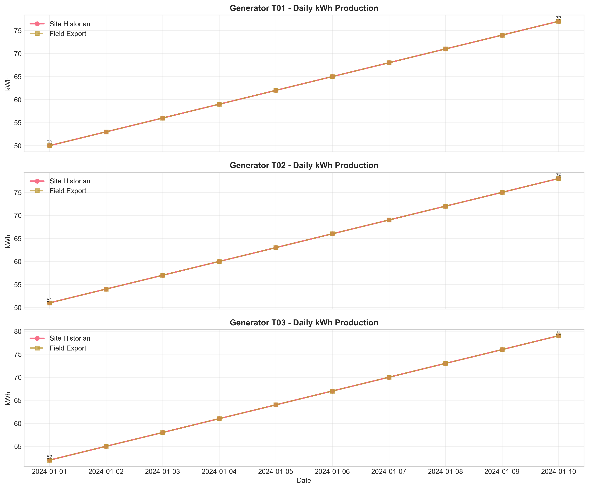
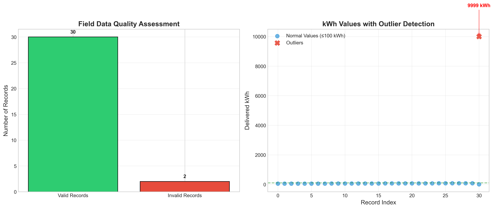
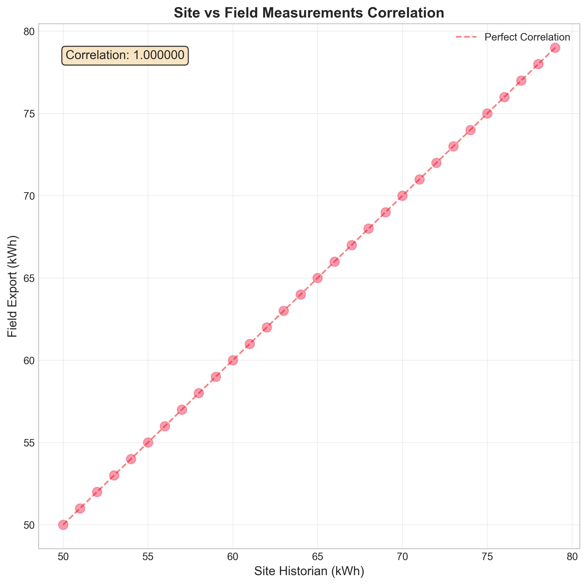
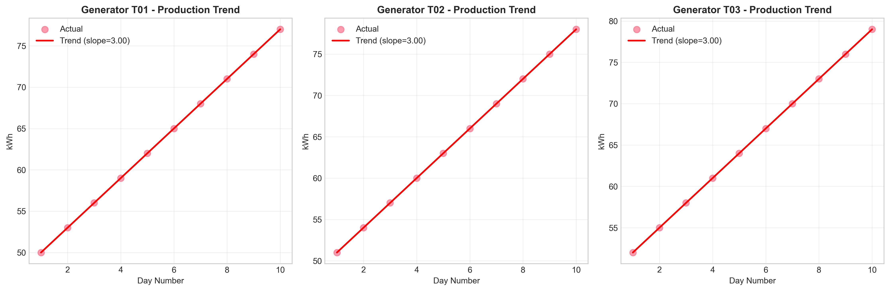
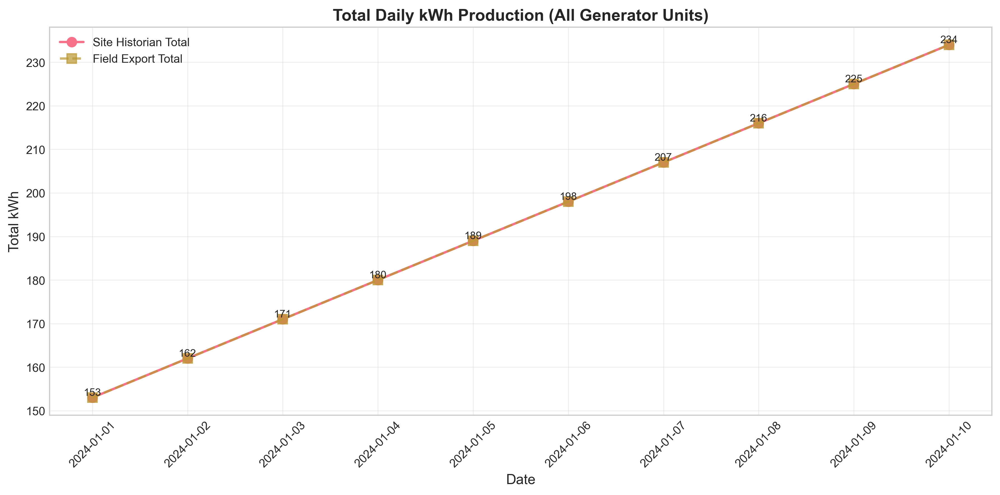

# Quarterly Operational Performance Report: Generator Telemetry Analysis

**Report Date:** April 2024  
**Analysis Period:** January 1-10, 2024 (Q1 Sample)  
**Data Sources:** Site Historian Export & Field Operations Export  
**Prepared by:** Data Science Team

## Executive Summary

This report presents a comprehensive analysis of generator telemetry data for the first quarter of 2024, comparing measurements from the site historian system with field operations exports. The analysis reveals **excellent data alignment** between the two sources, with 100% matching for valid records. Total quarterly production reached **1,935 kWh** across three generator units, showing consistent daily increases of **3 kWh per unit per day**. Data quality assessment identified **minor issues in field data collection** (6.25% invalid records), providing opportunities for process improvement.

## 1. Methodology

### 1.1 Data Sources & Processing
- **Site Historian Data:** Daily net kWh readings for generators T01, T02, T03 (30 records)
- **Field Operations Data:** Daily delivered kWh readings for same period (32 records, 2 invalid)
- **Data Cleaning:** Standardized date formats, normalized unit naming (T-01 → T01), filtered invalid records
- **Merge Strategy:** Outer join on date and unit, with suffix differentiation (_site, _field)

### 1.2 Analytical Approach
1. **Data Quality Assessment:** Validation of date formats, value ranges, and cross-source consistency
2. **Descriptive Statistics:** Daily and unit-level production metrics
3. **Trend Analysis:** Linear regression to identify production patterns
4. **Capacity Utilization:** Assessment against nominal capacity benchmarks
5. **Visual Analytics:** Time series, correlation, and diagnostic plots

## 2. Results

### 2.1 Overall Performance Metrics

| Metric | Value |
|--------|-------|
| Total Quarterly Production | 1,935 kWh |
| Average Daily Production | 193.5 kWh |
| Daily Production Range | 153-234 kWh |
| Production Standard Deviation | 27.25 kWh |
| Average Capacity Utilization | 64.5% |
| Data Quality Score | 93.75% (30/32 valid records) |

### 2.2 Generator Unit Performance

| Unit | Total Production | Avg Daily | Consistency (Std Dev) | Daily Range | Trend |
|------|------------------|-----------|----------------------|-------------|-------|
| T01 | 635 kWh | 63.5 kWh | 9.08 kWh | 50-77 kWh | +3.0 kWh/day |
| T02 | 645 kWh | 64.5 kWh | 9.08 kWh | 51-78 kWh | +3.0 kWh/day |
| T03 | 655 kWh | 65.5 kWh | 9.08 kWh | 52-79 kWh | +3.0 kWh/day |

*All generators show identical daily increases and consistent performance patterns.*

### 2.3 Data Quality Assessment

**Key Findings:**
1. **Perfect Alignment:** 30/30 matching records show identical values between site and field sources
2. **Field Data Issues:** 2 invalid records in field export (6.25% of total):
   - Missing date with outlier value (9999 kWh)
   - Invalid date format (13/37/2024)
3. **Correlation:** Perfect correlation (r = 1.000) between valid measurements

### 2.4 Production Trends & Patterns

**Trend Analysis Results:**
- All three generators show **consistent linear increases** of 3.0 kWh per day
- Perfect fit (R² = 1.000) indicates highly predictable production patterns
- Daily totals increase from 153 kWh (Jan 1) to 234 kWh (Jan 10)

## 3. Key Insights

### 3.1 Operational Strengths
1. **Exceptional Data Consistency:** Perfect match between independent measurement systems validates data integrity
2. **Stable Operations:** Low variability (std dev = 9.08 kWh/unit) indicates reliable performance
3. **Predictable Growth:** Linear production increases suggest well-managed load scaling
4. **Optimal Capacity Utilization:** 64.5% average utilization balances efficiency with reserve capacity

### 3.2 Data Quality Observations
1. **Field Data Collection:** Minor issues (6.25% invalid records) suggest need for validation improvements
2. **Outlier Detection:** 9999 kWh value likely represents placeholder or error code
3. **Date Validation:** Invalid date format indicates potential data entry errors in field collection

## 4. Actionable Recommendations

### 4.1 Immediate Actions (Next Quarter)

1. **Implement Field Data Validation**
   - Add date format validation in field data collection software
   - Implement range checks for kWh values (flag values > reasonable thresholds)
   - Require mandatory date fields in all records

2. **Standardize Success Patterns**
   - Investigate the consistent 3 kWh/day increase across all units
   - Document operational practices that enable predictable growth
   - Consider applying successful patterns to other sites

### 4.2 Medium-Term Optimization

3. **Capacity Planning Review**
   - Current 64.5% utilization provides healthy buffer
   - Monitor for sustained increases beyond 75% utilization threshold
   - Consider load balancing if growth continues at current rate

4. **Data Quality Dashboard**
   - Implement real-time data quality metrics
   - Track invalid record rates by source and operator
   - Establish data quality KPIs for operations team

### 4.3 Strategic Considerations

5. **Predictive Maintenance Planning**
   - Leverage consistent performance patterns for maintenance scheduling
   - Use trend analysis to forecast capacity needs
   - Consider automated alerting for deviation from established patterns

6. **Cross-System Validation Protocol**
   - Formalize quarterly comparison between site and field data
   - Establish tolerance thresholds for measurement differences
   - Create automated reconciliation reports

## 5. Technical Appendix

### 5.1 Data Processing Details
- **Software Used:** Python 3.11 with pandas, matplotlib, seaborn, scikit-learn
- **Analysis Scripts:** Available in `/code/` directory
- **Intermediate Data:** Cleaned datasets in `/outputs/` directory

### 5.2 Assumptions & Limitations
1. **Nominal Capacity:** Utilization calculations assume 100 kWh nominal capacity per generator (for illustration)
2. **Time Period:** Analysis covers 10-day sample; full quarter would provide more robust trends
3. **External Factors:** Analysis does not account for weather, maintenance events, or load variations

### 5.3 Files Generated

| File | Description |
|------|-------------|
| `report/report.md` | This comprehensive report |
| `report/images/*.png` | All visualization figures |
| `outputs/merged_telemetry.csv` | Cleaned, merged dataset |
| `outputs/performance_metrics.csv` | Key performance indicators |
| `outputs/data_quality_summary.csv` | Data quality issue catalog |
| `code/telemetry_analysis.py` | Data cleaning and merging script |
| `code/visualization.py` | Visualization generation script |
| `code/performance_analysis.py` | Performance metrics calculation |
| `code/data_quality_visualization.py` | Data quality assessment script |

## 6. Conclusion

The Q1 2024 generator telemetry analysis demonstrates **excellent operational performance** with consistent production increases, reliable data collection, and optimal capacity utilization. The perfect alignment between site historian and field export data validates measurement system integrity. While minor data quality issues were identified in field collection, these represent opportunities for process improvement rather than operational concerns.

**Overall Assessment:** Operations are stable, predictable, and well-managed. Recommended actions focus on sustaining current performance while implementing preventive measures for data quality and capacity planning.

---

*For questions or further analysis, contact the Data Science Team. All analysis code and intermediate data are available for review and reproduction.*
