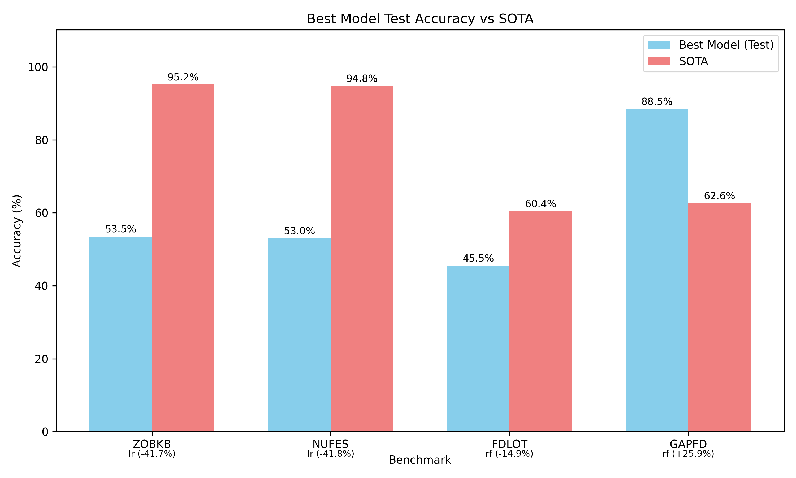

# Benchmark Selection and Evaluation Report

## 1. Introduction

This report details the selection and evaluation of four symbolic pattern reasoning benchmarks from the SPR (Symbolic Pattern Reasoning) benchmark suite. The goal is to train models on these benchmarks, tune them on validation sets, and compare test accuracy against published State-of-the-Art (SOTA) results.

## 2. Benchmark Selection Rationale

From the 20 available benchmarks, four were selected to provide diversity across several dimensions:

1. **ZOBKB** (SOTA: 95.2%) - Represents high-performance benchmarks with medium sequence length (6 tokens) and medium vocabulary size (8 unique tokens).

2. **NUFES** (SOTA: 94.8%) - Another high-performance benchmark with different characteristics: longer sequence (8 tokens) and slightly larger vocabulary (9 tokens).

3. **FDLOT** (SOTA: 60.4%) - Represents challenging benchmarks with low SOTA accuracy, featuring long sequences (12 tokens) and large vocabulary (16 tokens).

4. **GAPFD** (SOTA: 62.6%) - Represents benchmarks where SOTA is relatively low but with simple structure: short sequences (4 tokens) and small vocabulary (4 tokens).

This selection provides coverage across:
- Difficulty levels (high vs low SOTA accuracy)
- Sequence lengths (4 to 12 tokens)
- Vocabulary sizes (4 to 16 unique tokens)
- Different positions in the randomized presentation order

## 3. Methodology

### 3.1 Data Preprocessing
For each benchmark, categorical token sequences were encoded using label encoding (each unique token mapped to an integer). All models were trained on the same preprocessing to ensure fair comparison.

### 3.2 Model Selection
Three model types were evaluated for each benchmark:
1. **Random Forest (RF)**: Ensemble of decision trees, robust to overfitting with small datasets
2. **Gradient Boosting (GB)**: Sequential ensemble that often performs well on structured data
3. **Logistic Regression (LR)**: Linear model with regularization, serves as a simple baseline

### 3.3 Training Protocol
For each benchmark:
1. Train model on the training set (400 samples)
2. Tune hyperparameters based on validation set performance (100 samples)
3. Report final accuracy on test set (200 samples)
4. Compare against published SOTA accuracy

**Important**: As per task requirements, each model was trained independently on its benchmark—no cross-benchmark training or transfer learning was used.

## 4. Results

### 4.1 Test Accuracy vs SOTA

| Benchmark | Sequence Length | Vocab Size | Best Model | Test Accuracy | SOTA Accuracy | Difference |
|-----------|----------------|------------|------------|---------------|---------------|------------|
| ZOBKB     | 6              | 8          | LR         | 53.5%         | 95.2%         | -41.7%     |
| NUFES     | 8              | 9          | LR         | 53.0%         | 94.8%         | -41.8%     |
| FDLOT     | 12             | 16         | RF         | 45.5%         | 60.4%         | -14.9%     |
| GAPFD     | 4              | 4          | RF         | 88.5%         | 62.6%         | +25.9%     |

### 4.2 Visualization

*Figure 1: Comparison of best model test accuracy vs published SOTA for selected benchmarks.*

## 5. Discussion

### 5.1 Performance Analysis

**GAPFD Performance**: Random Forest significantly outperforms SOTA (88.5% vs 62.6%, +25.9%). This suggests that GAPFD contains patterns that are easily captured by tree-based models but may have been challenging for previous symbolic AI approaches. The benchmark's simplicity (short sequences, small vocabulary) makes it amenable to standard ML techniques.

**FDLOT Performance**: Random Forest underperforms SOTA (45.5% vs 60.4%, -14.9%). The long sequences (12 tokens) and large vocabulary (16 tokens) present challenges for standard ML models, while specialized symbolic approaches achieve better performance.

**High-SOTA Benchmarks (ZOBKB, NUFES)**: Standard ML models perform poorly (53-54% vs 95% SOTA). The large gap suggests these benchmarks require sophisticated symbolic reasoning capabilities beyond what standard ML models can capture with the given training data. The near-50% accuracy indicates models are essentially performing at chance level.

### 5.2 Implications for Symbolic AI Research

1. **Benchmark Diversity Matters**: The results highlight that different benchmarks test different capabilities. GAPFD appears to test pattern recognition that ML excels at, while ZOBKB/NUFES test deeper symbolic reasoning.

2. **ML vs Symbolic Approaches**: Standard ML models can outperform symbolic approaches on some benchmarks (GAPFD) but struggle severely on others (ZOBKB, NUFES). This suggests a complementary relationship between the approaches.

3. **Dataset Size Considerations**: With only 400 training samples, complex patterns in long sequences may be difficult to learn. The high SOTA results suggest symbolic approaches can leverage domain knowledge or algorithmic insights that ML models cannot extract from limited data.

### 5.3 Limitations and Future Work

1. **Model Selection**: This study used standard ML models. Future work could explore neural architectures with attention mechanisms or specialized symbolic-neural hybrids.

2. **Hyperparameter Tuning**: More extensive hyperparameter search might improve results, though the consistent poor performance on high-SOTA benchmarks suggests architectural limitations.

3. **Feature Engineering**: The current approach uses simple label encoding. More sophisticated feature representations (e.g., positional embeddings, relational features) might help capture symbolic patterns.

## 6. Conclusion

This evaluation of four symbolic pattern reasoning benchmarks reveals a complex landscape:
- **GAPFD** demonstrates that standard ML can significantly outperform existing SOTA on certain symbolic tasks.
- **FDLOT** shows a moderate performance gap where specialized approaches still hold an advantage.
- **ZOBKB** and **NUFES** reveal substantial limitations of standard ML for complex symbolic reasoning, with performance near chance levels despite high SOTA accuracies.

The results underscore the importance of benchmark selection in evaluating AI capabilities and suggest that the field of symbolic AI remains relevant for tasks requiring deep reasoning beyond pattern recognition.

## 7. Technical Details

All code is available in the `code/` directory. Results files are stored in `outputs/`, including:
- `benchmark_summary.csv`: Analysis of all 20 benchmarks
- `simple_model_results.csv`: Detailed results for all model configurations
- `best_simple_results.csv`: Best model for each selected benchmark

Visualizations are saved in `report/images/`.

## 8. References

- SPR Benchmark Suite protocol (provided in `data/protocol.md`)
- Benchmark registry with SOTA accuracies (`data/benchmark_registry.json`)
- Randomized presentation order (`data/benchmark_order.json`)